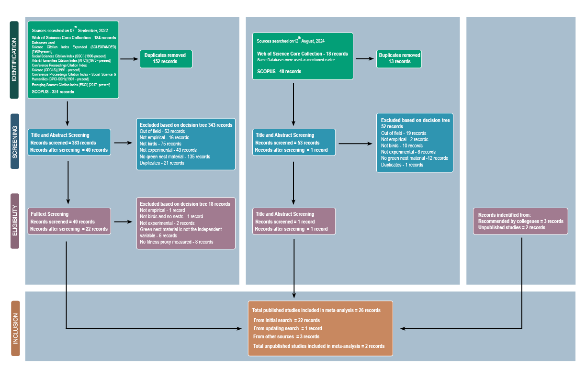
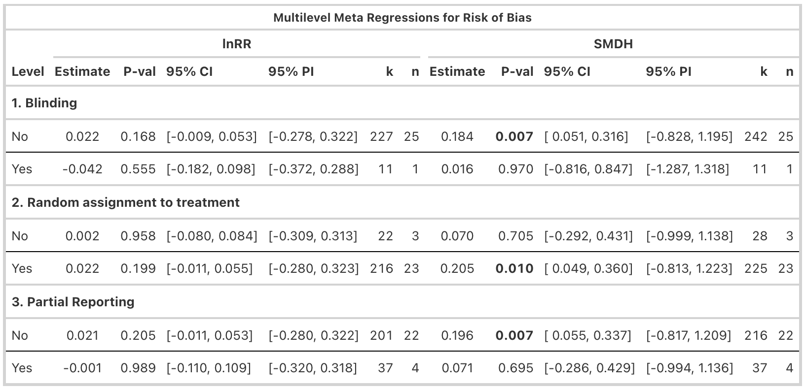

---
execute:
  echo: false
  warning: false
  message: false
  output: false
---

# Introduction

Nest-building is fundamental across a diverse range of animals, including arthropods (e.g., ants, spiders), mammals (e.g., platypuses, rodents), and perhaps more famously, birds. Nests provide structural support for eggs, parents, and offspring, and protect them against predators and other environmental pressures, and are thus key to reproductive success and survival [@hansell2000; @mainwaring2014; @deeming2023]. Most birds use organic plant materials such as twigs, branches, grass, and moss to build their nests. Some even incorporate inorganic (e.g., mud, stones), animal-derived (e.g., feathers, snake skins), and anthropogenic materials (e.g., plastic, cigarette butts) [@sergio2011; @suárez-rodríguez2013; @jagiello2023; @sheard2024]. These additions are considered non-structural. Beyond their role as physical shelters, nests are complex tools shaped by both natural and sexual selection for multiple functions. Indeed, nests can play a key role in sexual display, and features such as nest size have been shown to act as sexually selected signals of parental quality (e.g., [@moreno1994; @hoi1996]). Nest characteristics may even convey information interspecifically, for example, when brood parasites use host nest traits as cues to host quality [@soler1995]. Nest-building behaviour is increasingly recognised as an expression of the extended phenotype (reviewed by @moreno2012), and phylogeny has been shown to be an important factor explaining nest morphology [@perez2023]. Yet, despite hundreds of scientific articles on bird nests and nesting behaviour being published each year, much remains unknown [@jezierski2025].

An intriguing nesting behaviour observed in some bird species is the addition of fresh, often aromatic, plant material to the nest. This green nest material (*hereafter GNM; also called green plant material or greenery*) often includes leaves, sprigs, and herbs. It is typically added from the start of nest building until egg-laying, although some species like the blue tit (*Cyanistes caeruleus*) keep adding it afterwards. Unlike the structural nest materials such as twigs and mud, GNM is selected from a small, non-random subset of local flora [@clark1985; @petit2002; @garrido-bautista2023]. The selected plants often contain high levels of aromatic volatile compounds (commonly used by songbirds, @mennerat2009b) or secondary metabolites such as oils and resins (commonly used by raptors, @ontiveros2008). This suggests that GNM is unlikely to be gathered opportunistically, and collecting and replenishing these uncommon plants, sometimes over weeks, requires extra time and, in some cases, flying outside the territory [@mennerat2009]. Thus, the general costs associated with nest-building [@mainwaring2013], and the additional effort, time, and energy devoted to adding these non-structural materials suggest an adaptive function of GNM.

Multiple hypotheses have been proposed to explain the adaptive function of GNM (reviewed in [@dubiec2013; @scott-baumann2015]). First, the courtship hypothesis suggests that males use GNM as a visual or olfactory signal to attract females, maintain established pairs [@veiga2006], or advertise nest-site occupancy to other males (e.g., [@eens1993; @gwinner1997; @brouwer2004]), with olfactory signalling being particularly relevant in cavity-nesting species [@beasley2024]. For instance, a seminal study by [@kessel1957] showed that male European starlings (*Sturnus vulgaris*) carry fresh plant material to their nests while singing and displaying to females. Subsequent studies in European and spotless starlings (*Sturnus unicolor*) supported this view by showing that females often prefer nests with fresh GNM. Unpaired males conspicuously bring GNM to nests during courtship [@brouwer2004] and add more GNM when potential mates are nearby [@eens1993]. Altogether, these studies offered support for the courtship hypothesis, which was later extended to account for the observed GNM addition solely by females in blue tits [@tomás2013].

Second, the most widely tested hypothesis is the nest protection hypothesis, which proposes that the volatile compounds in GNM reduce parasitic and pathogenic loads in nests, enhancing offspring survival. This hypothesis was first suggested by @wimberger1984 in a comparative study in raptors (Falconiformes). Soon after, experimental studies of European starlings showed a preference for GNM containing insect-repellent and antimicrobial volatiles, and @clark1985 proposed three key criteria for evaluating the nest protection hypothesis: selective plant use, bioactive chemical properties, and demonstrable adaptive benefits. Observational and experimental studies in raptors [@ontiveros2008; @dykstra2009] and passerines [@lafuma2001; @dawson2004; @mennerat2009b; @quiroga2012] have shown mixed (i.e., contradictory) results. The drug hypothesis was later proposed because GNM had been shown, in some cases, to improve offspring condition without reducing parasite abundance [@gwinner2000; @gwinner2005]. This alternative hypothesis suggests that GNM volatiles directly enhance offspring immune function and/or health independently of parasite or pathogen control [@mennerat2009a]. While both the nest protection and drug hypotheses suggest that GNM enhances offspring survival, the drug hypothesis attributes this effect to a pharmacological mechanism, whereas the nest protection hypothesis emphasises parasite and pathogen repellency. Importantly, these two hypotheses are not mutually exclusive, and their potential effects on offspring survival are difficult to disentangle because improved nestling condition may result either directly from pharmacological action or indirectly through reduced parasite or pathogen load. Therefore, in our meta-analysis, we combined them under the "parental care hypothesis".

Other less explored hypotheses include a closely related female protection hypothesis proposed in blue tits [@cowie1988; @banbura1995], suggesting that plant volatiles may primarily benefit the incubating female by reducing her parasite exposure and infection risk [@garcía-campa2024]. Several hypotheses have also been proposed that do not invoke the aromatic properties of GNM, including enhancement of nest crypticity [@skutch1957], thermal insulation or sun protection for eggs and offspring [@mertens1977], and a structural function for the added material [@lyons1987]. However, these alternative hypotheses have received comparatively little empirical attention and therefore fall outside the scope of the present meta-analysis.

Despite decades of research, abundant observational and experimental studies, and two narrative reviews [@dubiec2013; @scott-baumann2015], the overall adaptive significance of GNM, its generality across species, and the relative importance of each of the suggested mechanisms are still unknown. To address this gap, we conducted a pre-registered systematic review and meta-analysis of experiments testing the effect of GNM on various fitness proxies across birds. Our meta-analysis explicitly evaluates the overall evidence for the adaptive significance of GNM, and assesses the relative importance of the main suggested hypotheses: the courtship hypothesis and parental care hypothesis. In addition, we tested potential moderators predicted to explain the observed context-dependency (i.e., high heterogeneity among effect sizes). Specifically, we tested whether the effect of GNM varied depending on the experimental design used, the timing of GNM addition, the focal species tested, the category of fitness proxy investigated (e.g., morphological, reproductive, etc.), and the type of parasite studied. Our meta-analysis of experimental studies is the first quantitative synthesis testing the causal relationship between GNM and fitness across birds that show this behaviour.

```{r}
#| echo: false

devtools::install_github("daniel1noble/orchaRd", ref = "main", force = TRUE)
pacman::p_load(readr,tidyverse,metafor,orchaRd,patchwork,english)
source(here::here("functions/extractor_metareg.R"))
```


# Methods

## Registration and reporting

We pre-registered our study protocol on the Open Science Framework [@dimri2024] before exploring or analysing the data. The pre-registration details our objectives, hypotheses, predictions, methods, and planned analyses. Unless stated otherwise, we adhered to the registered protocol. We followed the PRISMA-EcoEvo guidelines [@odea2021] for reporting this study (@tabsupp-checklist; @figsupp-prisma-flowchart).

## Information source and search

```{r}
#| echo: false

# Own reference list
own_library <- read_csv("data/01_systematic_search/01_search_strategy/own_library_references.csv")

# Systematic search and abstract screening
unique_reference_list <- read_csv("data/01_systematic_search/02_reference_data/unique_reference_list.csv")
full_reference_before_deduplication<-read_csv("data/01_systematic_search/02_reference_data/full_reference_before_deduplication.csv")
selected_abstract_screening<-read_csv("data/01_systematic_search/03_title_and_abstract_screening/selected_abstract_screening.csv")

# For updated search
unique_reference_list_repeat <- read_csv("data/01_systematic_search/04_search_repeat_12082024/unique_reference_repeat_12082024.csv")
full_reference_before_deduplication_repeat<-read_csv("data/01_systematic_search/04_search_repeat_12082024/full_reference_repeat_12082024.csv")
selected_abstract_screening_repeat<-read_csv("data/01_systematic_search/04_search_repeat_12082024/selected_abstract_screening_repeat.csv")

# For fulltext screening
excluded_fulltext <- read_csv("data/01_systematic_search/03_title_and_abstract_screening/excluded_fulltext.csv")
```


We conducted a systematic search on Web of Science Core Collection and Scopus on the 7^th^ of September, 2022, and updated it on the 12^th^ of August, 2024. The keyword search query was designed as a three-block query including terms related to our treatment of interest (("green\*" OR "herb\*" OR "aromatic\*") AND "nest\*"), population of interest ("bird\*" OR "aves" OR "avian" OR "ornithol\*" OR "passerine\*" OR "passeriform\*" OR "songbird\*" OR list of all bird genera) and to limit the search results to experimental studies only ("experiment\*" OR "manipulat\*") (see complete search string in @figsupp-string). Although our search terms were in English, we did not restrict eligibility by language. We planned to include studies in English, Spanish, Portuguese or Hindi if they were retrieved, but all studies identified were in English. We searched through titles, abstracts and keywords without restrictions on publication date or study type. We validated our search using an initial library of 15 relevant articles identified before conducting the searches (@figsupp-own-library), ensuring all were retrieved. Additionally, we used the R package 'litsearchr' v1.0.0 [@grames2019], which confirmed our search queries. After removing `{r} (nrow(full_reference_before_deduplication)-nrow(unique_reference_list))+ (nrow(full_reference_before_deduplication_repeat)-nrow(unique_reference_list_repeat))` duplicates using the R package 'revtools' v0.4.1 [@westgate2019], we identified `{r} nrow(unique_reference_list)+ nrow(unique_reference_list_repeat)` unique records.

## Eligibility criteria

All titles and abstracts were equally allocated and screened independently by at least two of the three screeners (SD, TR, JMGS) using 'revtools' following a pre-designed decision tree with all inclusion/exclusion criteria (@figsupp-decision-tree). We included all studies on birds that experimentally manipulated the GNM (both aromatics and non-aromatic). `{r} tools::toTitleCase(as.character(english::english(nrow(selected_abstract_screening))))` articles passed the title-and-abstract screening and were further evaluated during the full-text screening, where each article was independently screened by a single screener, with another screener verifying the procedure. We used the same criteria as above (@figsupp-decision-tree) with an additional evaluation of whether the variable of interest studied in the article was in our list of fitness proxies of interest (@tabsupp-fitness-proxies). All conflicts in screening decisions (1% for title-and-abstract screening, and none for full-text screening) were discussed and resolved. `r { total_n <- (nrow(selected_abstract_screening) - nrow(excluded_fulltext)) + sum(selected_abstract_screening_repeat$screened_abstracts == "selected", na.rm = TRUE); x <- as.character(english::english(total_n)); paste0(toupper(substr(x, 1, 1)), substr(x, 2, nchar(x))) }` articles passed the full-text screening, and we identified `{r} as.character(english::english(nrow(selected_abstract_screening_repeat)-(sum(selected_abstract_screening_repeat$screened_abstracts=="selected", na.rm=T)), 1, 1))` additional eligible articles recommended by two colleagues, likely missed because their experimental nature was not indexed in the searchable metadata. In all, `{r} nrow(selected_abstract_screening)-nrow(excluded_fulltext)+nrow(selected_abstract_screening_repeat)` published articles were eligible for our meta-analysis. We also obtained two additional unpublished studies, resulting in a total of 28 studies included in our meta-analysis (more details below; see also @figsupp-prisma-flowchart and @figsupp-included-studies).

## Data extraction

```{r}
#| echo: false

merged_data_extraction <- read_csv("data/03_data_cleaning/merged_data_extraction.csv", show_col_types = F)

dataset_after_cleaning <- read_csv("data/03_data_cleaning/dataset_after_cleaning.csv", show_col_types = F)
included_papers_no<-length(unique(dataset_after_cleaning$paper_ID))

# Numbers for extraction ID
data_extractors <- merged_data_extraction %>%
     distinct(paper_ID, .keep_all = TRUE) %>%
     select(paper_ID, extractor_ID) %>%
     mutate(extractor_ID = case_when(
    extractor_ID == "JS/SD/TR" ~ "TR/JMGS/SD",
    TRUE ~ extractor_ID)) %>%
     group_by(extractor_ID) %>%
     summarise(total_papers = n(), .groups = "drop")

excluded_proxies<- merged_data_extraction %>%
  filter(fulltext_screening == "included" |
         is.na(fulltext_screening) |
         fulltext_screening == "NA") %>%
  filter(proxy_decision== "exclude")

dataset_analysis <- read_csv("data/04_data_analysis/dataset_analysis.csv", show_col_types = F)

SAonly_proxies<- dataset_analysis %>% filter(proxy_decision=="sensitivity-analysis")

inferential_only<- dataset_analysis%>%filter(statistics_type=="t-test"|statistics_type=="ANCOVA")

contingency_table<-dataset_analysis%>%filter(proxy_decision=="contingency table")

raw_data<-c("GNM_001_rep_table3","GNM_010","GNM_069","GNM_237") 
#GNM_018 also provides open data but we ended up not needing it

published_studies <- dataset_analysis %>%
  filter(!str_detect(paper_ID, "Unpublished"))

unpublished_studies <- dataset_analysis %>%
  filter(str_detect(paper_ID, "Unpublished"))

dataset_lnRR <- read_csv("data/04_data_analysis/dataset_lnRR.csv", show_col_types = F)

dataset_SMDH <- read_csv("data/04_data_analysis/dataset_SMDH.csv", show_col_types = F)

lnRR_comp3<-dataset_lnRR%>%filter(comparision_type==3)

SMDH_comp3<-dataset_SMDH%>%filter(comparision_type==3)

multiple_comparision <- dataset_analysis %>%
group_by(paper_ID) %>%
  summarise(n_types = n_distinct(comparision_type),             
    types   = paste(sort(unique(comparision_type)), collapse = ", "),
    .groups = "drop") %>%
  filter(n_types > 1)
```


Data from each article were extracted by one of three authors (SD, TR, JMGS), with another screener verifying the procedure, and four authors (SD, TR, JMGS, AST) collectively discussing and revising unclear cases. We prioritised extracting primary data (i.e., means, variances and sample size for each control-treatment comparison) from text and tables, and if that was not possible, from figures (e.g., boxplots) using the R package 'metaDigitise' v1.0.1 [@pick2018]. If primary data were not available, we extracted inferential statistics (e.g., t and F values, contingency tables) to transform them into effect sizes (details below). Last, if these steps failed but the article had openly archived data, we calculated the means, standard deviations and sample sizes from each group ourselves (n = `{r} length(raw_data)` studies). We extracted the number of nests in each group as the sample size rather than the number of individuals wherever possible (discussed below).

To capture differences in the type of experimental setup used in the studies, we coded each control-treatment comparison into an 'experimental design' moderator, with the following three levels: (i) non-aromatic GNM vs. aromatic GNM, (ii) no material vs. aromatic GNM, and (iii) no material vs. non-aromatic GNM. Where "non-aromatic GNM" refers to nests containing non-aromatic material (e.g., grass, moss, etc.), "aromatic GNM" refers to nests containing aromatic material added by birds (e.g.,*Lavandula stoechas*,*Marrubium vulgare*, etc.), researchers, or both; and "no material" refers to nests that had no material added by researchers or where any plant material added by birds was removed. Importantly, our conclusions remained robust to the exclusion of the no material vs. non-aromatic GNM category (n = `{r} length(unique(SMDH_comp3$paper_ID))` studies; @tabsupp-SA-intercept), so we kept this category in our dataset following our pre-registered plan. A fourth experimental design compared enhanced supplementation of GNM by the researchers (i.e., researchers + birds) to GNM added by birds alone (n = 2 studies). This experimental design represents a fundamentally different comparison focusing on potential additive effects of GNM, comparing different amounts of aromatic GNM. Therefore, we did not include this fourth category in the meta-regression testing the 'experimental design' moderator. In studies where three groups were compared (n = `{r} nrow(multiple_comparision)`), we extracted all possible pairwise comparisons, and accounted for (shared group) non-independence in our analyses (more below).

For each study, we also extracted information related to the study subjects (bird species, geographical location of the study population) and the source from which we extracted data (e.g., figures, raw data files). We categorised the reported fitness proxies into 6 broad categories: physiology, morphology, reproduction, behaviour, parasite and pathogenic load, and phenology. For studies testing whether GNM affects the number of parasites or pathogens found in offspring and/or nests, we categorised them into arthropods (e.g., fleas) or microorganisms (e.g., bacteria). For a complete list of variables extracted, see @figsupp-variables. During data extraction, we encountered some traits (e.g., Leukocyte measures, parent mass; k = `{r} nrow(excluded_proxies)` effect sizes, n = `{r} length(unique(excluded_proxies$paper_ID))` studies) that we did not include in any of our analyses because it was unclear from the study and our own judgement how these traits related to fitness (see @tabsupp-fitness-proxies for the reasons of exclusion).

We contacted four corresponding authors to obtain missing data (e.g., non-reported results, missing sample sizes). All four authors responded to our email, but only two provided the data as requested; one did not have the data anymore, and one did not give a conclusive response. Additionally, to locate grey literature (e.g., unpublished data), we used a standardised email template (@figsupp-email) to write to the corresponding author(s) of all the `{r} (nrow(selected_abstract_screening) - nrow(excluded_fulltext))+ sum(selected_abstract_screening_repeat$screened_abstracts == "selected", na.rm = TRUE)` articles that passed full-text screening asking for any potential unpublished data that could be included in our meta-analysis. We obtained unpublished data for a study on blue tits and a study on common buzzards (*Buteo buteo*; see description in @figsupp-unpublished-study).

## Effect size calculation

```{r}
#| echo: false

no_ES<-dataset_analysis%>%filter(proxy_comment == "use 0 as ES")

negative_lnRR<-dataset_analysis%>%
  filter(measure_central_tendency_experiment<=0 | measure_central_tendency_control<=0)

low_sample<-read_csv("data/03_data_cleaning/low_sample.csv", show_col_types = F)
```


Using the means, standard deviations, and sample sizes for each control-treatment comparison, we calculated two effect sizes: a log response ratio (lnRR) and a standardised mean difference with heteroskedasticity correction (SMDH), using the 'escalc' function (measure = 'ROM' and 'SMDH', respectively, vtype = 'LS') in the R package 'metafor' v4.8-0 [@metafor]. We specified the treatment group as the numerator and the control group as the denominator for lnRR, and treatment minus control for SMDH, such that positive values indicate a positive effect of GNM on fitness. In cases such as measures of parasite load or prevalence, laying or hatching dates, courtship time, or scab scores, the effect size sign was inverted before analysis to ensure that a positive value consistently meant an increase in fitness across all fitness proxies (i.e., to ensure comparability across effect sizes). Since SMDH can only be calculated when the degrees of freedom (i.e., n1+n2−2) are greater than 1, we had to exclude `{r} as.character(english::english(nrow(low_sample), 1, 1))` effect sizes from `{r} as.character(english::english(length(unique(low_sample$paper_ID)), 1, 1))` study that did not fulfil that requirement.

When we could not extract means and variances but inferential statistics such as t and F values (k = `{r} nrow(inferential_only)`, n = `{r} length(unique(inferential_only$paper_ID))`), we transformed them into SMD values [@thehand2019]. For dichotomous variables (e.g., nest success, recorded as successful vs unsuccessful and analysed as counts per group, k = `{r} nrow(contingency_table)`, n = `{r} length(unique(contingency_table$paper_ID))`), we calculated log odds ratios (lnOR) using the 'escalc' function (measure = OR) from 'metafor' and subsequently converted them to SMD [@thehand2019]. Since lnRR cannot be calculated from inferential statistics, dichotomous variables, or traits including zero or negative values (k = `{r} nrow(negative_lnRR)`), the number of effect sizes included in the lnRR subset (k = `{r} nrow(dataset_lnRR)`, n = `{r} length(unique(dataset_lnRR$paper_ID))`) is smaller than that of SMDH (k = `{r} nrow(dataset_SMDH)`, n = `{r} length(unique(dataset_SMDH$paper_ID))`).

When calculating each effect size's sampling variance, we used the number of nests per group, rather than the number of individuals, whenever possible, to account for within-nest non-independence due to shared genetic background and early-life environment. In cases where the same control or treatment group was used in multiple comparisons, sample sizes were adjusted before calculating effect sizes by dividing them by the number of times each group was used in a comparison to account for shared group non-independence. For cases where the authors of an original article reported a statistically non-significant difference between two groups but without providing numerical values (k = `{r} nrow(no_ES)`, n = `{r} length(unique(no_ES$paper_ID))`), we assigned zero as the effect size for that comparison and imputed its sampling variance using the missing-case approach described in @nakagawa2022 for lnRR, and using $\frac{n_1+n_2}{n_1×n_2}$ for SMDH [@lajeunesse2013].

## Data analysis

We performed all analyses in R v4.5.1 [@R-version]. All multilevel meta-analytical models and meta-regressions were fitted using 'metafor' v4.8-0 [@metafor]. Sampling variances were modelled as variance-covariance matrices assuming a 0.5 correlation ($\rho$) between sampling variances from the same study [@noble2017] using the 'vcalc' function from 'metafor' (see Supplementary Appendix @figsupp-correlation for sensitivity analyses showing that conclusions remained the same when using different values of $\rho$).

We originally considered the following levels of non-independence for our analyses: multiple effect sizes collected from (a) same study (Paper ID), (b) bird species (Species ID), (c) geographical locations (Population ID), (d) sub-populations within the same location (Experiment ID; e.g., birds studied at the same location for multiple years), (e) groups of individuals within a population (Group ID; e.g., males and females in a population, first clutch and second clutch), and (f) repeated measurement of the same trait for the same individuals (Repeated trait ID; e.g., chick mass on day 7, 14 and 21). In the end, our random effect structure deviated from our pre-registration because Experiment ID and Group ID represented nearly the same grouping structure, so we left out the one with lesser resolution (i.e., Experiment ID). Additionally, few effect sizes were measured repeatedly, making Repeated trait ID almost identical to Observation ID (@figsupp-random-effect), so we excluded Repeated trait ID. Last, we added Population ID since we noticed after extracting the data, but before any analyses, that several studies were performed in the same geographical locations. Unless stated otherwise, we fitted the following random effects in all our models to account for non-independence: Paper ID, Group ID, Species ID, Population ID, and an observation-level random effect (Observation ID).

**Meta-analytic mean and hypotheses**: To estimate the effect of GNM on fitness estimates across species, we fitted two separate sets of models for each effect size: lnRR and SMD(H). First, we fitted multilevel intercept-only meta-analytical models to test the overall effect of GNM on fitness estimates, its uncertainty and heterogeneity. We used the 'rma.mv' function from the 'metafor' package (method = 'REML' and test = 't' for calculating the test statistics and confidence intervals for the moderators). Although we excluded traits for which their link with fitness is debated in the literature from our main analysis (e.g., sex ratio @krackow2002; yolk hormones levels, @mentesana2025; more in @tabsupp-fitness-proxies), we conducted a sensitivity analysis including these traits that confirmed the robustness of our results (@tabsupp-SA-intercept; k = `{r} nrow(SAonly_proxies)`, n = `{r} length(unique(SAonly_proxies$paper_ID))`). For all intercept-only models, we estimated the total amount of absolute heterogeneity ($\sigma^2$; i.e., the total variation not explained by sampling error), its sources or relative heterogeneity ($I^2$), mean-standardised metric (CVH2) and variance-mean-standardised metric of heterogeneity (M2) following the pluralistic approach suggested by [@yang2025].

We ran several additional sensitivity analyses to test the robustness of the overall results to the: (i) use of pre-registered bivariate multilevel meta-analytic model including both effect sizes as response variables; (ii) inclusion of traits for which their relationship with fitness was debated in the literature (non-pre-registered); (iii) removal of effect sizes that were originally reported as simply statistically non-significant and we assumed them to be zero (non-pre-registered); (iv) both (ii) and (iii) (non-pre-registered); (v) removal of effect sizes from non-aromatic vs. aromatic experimental design (non-pre-registered); (vi) removal of effect sizes from no material vs. non-aromatic experimental design (non-pre-registered); (vii) removal of effect sizes that were calculated by transforming inferential statistics (pre-registered); (viii) removal of effect sizes that failed the Geary’s Test for lnRR (non-pre-registered); (ix) removal of unpublished data (non-pre-registered); and (x) use of different values of correlation ($\rho$) between sampling variance for variance-covariance matrix (pre-registered). The number of effect sizes (k) included in those sensitivity analyses ranged from 131 to 274 (@tabsupp-SA-intercept). In all cases, the results were qualitatively unchanged, indicating that our main conclusions were robust to these alternative criteria.

To test the relative importance of the two main functional hypotheses suggested for GNM, that is, the courtship and the parental care hypothesis (which combines the nest protection and drug hypotheses), we ran a multilevel meta-regression including the moderator 'hypothesis' (levels: courtship, parental care, both, where 'both' refers to fitness proxies not uniquely assigned to either mechanism because they may reflect both courtship and parental care, e.g., offspring morphology or survival). For all meta-regressions, we estimated $R_{marginal}^2$, which corresponds to the percentage of heterogeneity explained by the moderators [@nakagawa2012].

```{r}
#| echo: false

parasite_pathogen<-dataset_after_cleaning%>%filter(trait_type=="Parasitic_and_pathogenic")
```


**Exploratory meta-regressions:** We performed additional pre-registered multilevel meta-regressions for which we did not have clear directional predictions. To understand the effect of the type of experimental design (i.e., whether the authors compared non-aromatic vs. aromatic, no material vs. aromatic, no material vs. non-aromatic), we ran a meta-regression with the type of 'experimental design' as the moderator. To test the effect of time of addition of GNM on fitness (levels: before egg hatching, after egg hatching, continuously throughout the nesting phase), we ran a meta-regression with 'time of addition of GNM' as the moderator. We also ran a meta-regression using 'bird species' as the moderator (levels: *Buteo buteo*, *Cyanistes caeruleus*, *Passer cinnamomeus*, *Parus major*, *Sturnus unicolor*, *Sturnus vulgaris*, *Tachycineta bicolor*) to understand if and how the effect of GNM on fitness might differ among species. Furthermore, we explored whether the effect of GNM on fitness varied across the different 'category of fitness proxy' studied (levels: behaviour, morphology, parasite and pathogenic load, phenology, physiology, reproduction) by running a meta-regression with this moderator. Last, for the data subset on parasites and pathogens (k = `{r} nrow(parasite_pathogen)`, n = `{r} length(unique(parasite_pathogen$paper_ID))`), we ran a meta-regression with 'type of parasite' as the moderator (levels: arthropod, micro-organism).

In addition, we performed three additional pre-registered multilevel meta-regressions to explore differences in internal validity across the studies associated with our conclusions (i.e., Risk of Bias, or RoB). Specifically, we evaluated the effects of (i) blinding (whether outcome assessors were blinded to the experimental group), (ii) random assignment to treatment, and (iii) partial reporting (whether all measured outcomes were completely reported or only a subset). For each study, each of these three moderators were coded (levels: yes, no) and included in a separate meta-regression for both lnRR and SMD(H). These meta-regressions aimed at exploring how features associated with risk of bias may explain additional heterogeneity among effect sizes [@stanhope2022; @culina2025].

**Publication Bias Test:** Publication bias occurs when a subset of research findings, most often statistically non-significant ones, are less likely to be published or published later [@jennions2013]. Two types of publication biases are commonplace in ecology and evolutionary biology: small-study (i.e., small sample size studies reporting larger overall effect sizes due to missing effect sizes) and decline effects (i.e., effect sizes decreasing over time) [@yang2023]. We tested them for both lnRR and SMD(H) separately, following @nakagawa2022a, first for published studies only (i.e., excluding the two unpublished datasets), then for all studies. To test for small-study effects, we ran a multilevel meta-regression using the 'square-root of the inverse of the effective sample size' as the moderator (i.e., $\sqrt{(n_1+n_2)/ (4n_1n_2)}$). Note that the intercept of this meta-regression provides a sensivity test of the overall estimate adjusted for small-study effects. To test for decline effects (also known as time-lag bias, @sanchez-tojar2018), we ran a multilevel meta-regression using 'year of publication' (mean-centered) as the moderator. Throughout, 95% CI and 95% PI refer to 95% confidence intervals and 95% prediction intervals, respectively.

# Results

```{r}
#| echo: false

ES_per_study<-dataset_analysis%>%group_by(paper_ID)%>%count(paper_ID)

birds_info<-dataset_analysis%>%group_by(bird_species)%>%count(bird_species)
birds_info$perc<-(birds_info$n/nrow(dataset_analysis))*100
```


We obtained `{r} nrow(dataset_analysis)` effect sizes from `{r} length(unique(dataset_analysis$paper_ID))` studies conducted on `{r} length(unique(dataset_analysis$bird_species))` species across `{r} length(unique(dataset_analysis$population_ID))` geographical locations (@figmain-distribution). About `{r} round(sum(birds_info$perc[birds_info$perc>15]))`% of the effect sizes came from only three bird species (*Cyanistes caeruleus*, k = `{r} birds_info$n[birds_info$perc > 15][1]`; *Sturnus unicolor*, k = `{r} birds_info$n[birds_info$perc > 15][2]`; *Sturnus vulgaris*, k = `{r} birds_info$n[birds_info$perc > 15][3]`). Our dataset included studies published between `{r} min((dataset_analysis$year_publication),na.rm = T)` and `{r} max((dataset_analysis$year_publication),na.rm = T)`. The mean (± standard deviation) number of effect sizes calculated per study was `{r} sprintf("%.1f", mean(ES_per_study$n))` ± `{r} sprintf("%.1f",sd(ES_per_study$n))` (median: `{r} sprintf("%.1f", median(ES_per_study$n))`, range: `{r} min(ES_per_study$n)`--`{r} max(ES_per_study$n)`) and the mean effective sample size (i.e., the number of nests/individuals per effect size after accounting for shared-group non-independence) was `{r} sprintf("%.1f",mean(dataset_analysis$effective_n_control+dataset_analysis$effective_n_experiment))` ±`{r} sprintf("%.1f", sd(dataset_analysis$effective_n_control+dataset_analysis$effective_n_experiment))` (median: `{r} sprintf("%.1f",median(dataset_analysis$effective_n_control+dataset_analysis$effective_n_experiment))`, range: `{r} floor(min(dataset_analysis$effective_n_control+dataset_analysis$effective_n_experiment))`--`{r} round(max(dataset_analysis$effective_n_control+dataset_analysis$effective_n_experiment))` nests/individuals; `{r} nrow(dataset_analysis%>%filter(n_experiment<5|n_control<5))` data points had a sample size of less than 5 nests in each group).

{#figmain-distribution}

## Meta-analytic mean

```{r}
#| echo: false

intercept_lnRR<-readRDS(here::here("model/intercept_lnRR.rds"))
intercept_SMDH<-readRDS(here::here("model/intercept_SMDH.rds"))
bivariate_model<-readRDS(here::here("model/sensitivity_analysis/bivariate_model.rds"))
```


Both lnRR and SMD(H) intercept-only meta-analyses showed an average positive effect of GNM on the fitness proxies; however, this overall effect was only statistically significant for SMD(H). For lnRR, nests with an experimental increase in GNM showed an average statistically non-significant increase in fitness estimates of `{r} round((exp(as.double(coef(intercept_lnRR)))-1)*100,1)`% (@figmain-mean-effect A; lnRR = `{r} sprintf("%.3f", coef(intercept_lnRR))`, 95% CI: \[`{r} sprintf("%.3f", intercept_lnRR$ci.lb)`, `{r} sprintf("%.3f", intercept_lnRR$ci.ub)`\], 95% PI: \[`{r} sprintf("%.3f", predict(intercept_lnRR)$pi.lb)`, `{r} sprintf("%.3f", predict(intercept_lnRR)$pi.ub)`\], p-value = `{r} sprintf("%.3f", intercept_lnRR$pval)`, k = `{r} intercept_lnRR$k`, n = `{r} length(intercept_lnRR$s.levels.f[[1]])`) but the heterogeneity among effect sizes was high. Total raw heterogeneity ($\sigma^2$) was `{r} sprintf("%.3f",sum(intercept_lnRR$sigma2))` (*Q* = `{r} sprintf("%.1f",sum(intercept_lnRR$QE))`, p \< 0.001), the measures of relative (*I^2^~total~* = `{r} sprintf("%.1f",orchaRd::i2_ml(intercept_lnRR)[1])`%) and standardised heterogeneity (CVH2~total~ = `{r} sprintf("%.2f", orchaRd::cvh2_ml(intercept_lnRR)[1])`; M2~total =~ `{r} sprintf("%.2f", orchaRd::m2_ml(intercept_lnRR)[1])`) all suggested high heterogeneity across effect sizes, exceeding the 75^th^ percentile of empirically derived estimates from meta-analyses in ecology and evolution [@yang2025].

For SMD(H), nests with an experimental increase in GNM showed an average statistically significant increase in fitness estimates (@figmain-mean-effect B; SMD(H) = `{r} sprintf("%.3f", coef(intercept_SMDH))`, 95% CI: \[`{r} sprintf("%.3f",(intercept_SMDH)$ci.lb)`, `{r} sprintf("%.3f",(intercept_SMDH)$ci.ub)`\], 95% PI: \[`{r} sprintf("%.3f", predict(intercept_SMDH)$pi.lb)`, `{r} sprintf("%.3f", predict(intercept_SMDH)$pi.ub)`\], p-value = `{r} sprintf("%.3f",intercept_SMDH$pval)`, k = `{r} intercept_SMDH$k`, n = `{r} length(intercept_SMDH$s.levels.f[[1]])`), but the heterogeneity among effect sizes was moderate to high. Total raw heterogeneity ($\sigma^2$) was `{r} sprintf("%.3f",sum(intercept_SMDH$sigma2))` (*Q* = `{r} sprintf("%.1f",sum(intercept_SMDH$QE))`, p \< 0.001), and both relative (*I^2^~total~* = `{r} sprintf("%.1f",orchaRd::i2_ml(intercept_SMDH)[1])`%) and standardised heterogeneity metrics (CVH2~total~ = `{r} sprintf("%.2f", orchaRd::cvh2_ml(intercept_SMDH)[1])`; M2~total~ = `{r} sprintf("%.2f",orchaRd::m2_ml(intercept_SMDH)[1])`) lay between the 50^th^ and 75^th^ percentile of empirically derived estimates [@yang2025].

![Overall effect of green nest material on all fitness proxies combined. The meta-analytic mean (black circle), 95% confidence intervals (thicker bars) and prediction intervals (thinner bars) are shown along with the data points (coloured circles) scaled by precision (inverse of standard error). Results are shown as an orchard plot for the intercept-only model (A) using log response ratio (lnRR), and (B) standardised mean difference (SMD(H)). k: number of effect sizes (number of studies is shown in brackets). X-axes are truncated for legibility, which partially explains the apparent asymmetry (see @figsupp-overall).](figures/Figure_overall_effect_crop.png){#figmain-mean-effect width="90%"}

## Functional hypotheses

```{r}
#| echo: false
#| output: false

lnRR_hypothesis<-readRDS(here::here("model/lnRR_hypothesis.rds"))
SMDH_hypothesis<-readRDS(here::here("model/SMDH_hypothesis.rds"))

summary_lnRR_hypothesis<-extractor_metareg(lnRR_hypothesis,"Hypothesis")
summary_SMDH_hypothesis<-extractor_metareg(SMDH_hypothesis,"Hypothesis")

lnRR_hypothesis_pc<-readRDS(here::here("model/lnRR_hypothesis_pc.rds"))
SMDH_hypothesis_pc<-readRDS(here::here("model/SMDH_hypothesis_pc.rds"))

summary_lnRR_hypothesis_pc<-extractor_metareg(lnRR_hypothesis_pc,"Hypothesis")
summary_SMDH_hypothesis_pc<-extractor_metareg(SMDH_hypothesis_pc,"Hypothesis")

summary(lnRR_hypothesis_pc)
car::linearHypothesis(lnRR_hypothesis_pc, rbind(c(0,1,-1)))
summary(SMDH_hypothesis_pc)
car::linearHypothesis(SMDH_hypothesis_pc, rbind(c(0,1,-1)))
```


Our multilevel meta-regressions found no clear support for either of the two hypotheses separately (@figmain-hypothesis). The estimates for the courtship hypothesis (lnRR~courtship~ = `{r} summary_lnRR_hypothesis$estimate[2]`, 95% CI: `{r} summary_lnRR_hypothesis$CI[2]`, 95% PI: `{r} summary_lnRR_hypothesis$PI[2]`, p-value = `{r} summary_lnRR_hypothesis$p_value[2]`, k = `{r} summary_lnRR_hypothesis$k[2]`, n = `{r} summary_lnRR_hypothesis$n[2]`; SMD(H)~courtship~ = `{r} summary_SMDH_hypothesis$estimate[2]`, 95% CI: `{r} summary_SMDH_hypothesis$CI[2]`, 95% PI: `{r} summary_SMDH_hypothesis$PI[2]`, p-value = `{r} summary_SMDH_hypothesis$p_value[2]`, k = `{r} summary_SMDH_hypothesis$k[2]`, n = `{r} summary_SMDH_hypothesis$n[2]`), and the "parental care hypothesis" (lnRR~parental_care~ = `{r} summary_lnRR_hypothesis$estimate[3]`, 95% CI: `{r} summary_lnRR_hypothesis$CI[3]`, 95% PI: `{r} summary_lnRR_hypothesis$PI[3]`, p-value = `{r} summary_lnRR_hypothesis$p_value[3]`, k = `{r} summary_lnRR_hypothesis$k[3]`, n = `{r} summary_lnRR_hypothesis$n[3]`; SMD(H)~parental_care~ = `{r} summary_SMDH_hypothesis$estimate[3]`, 95% CI: `{r} summary_SMDH_hypothesis$CI[3]`, 95% PI: `{r} summary_SMDH_hypothesis$PI[3]`, p-value = `{r} summary_SMDH_hypothesis$p_value[3]`, k = `{r} summary_SMDH_hypothesis$k[3]`, n = `{r} summary_SMDH_hypothesis$n[3]`) were statistically non-significant. However, the third level in this meta-regression ("Both"), which contained about half of all effect sizes that could not be unequivocally assigned to only one hypothesis, showed an average positive GNM effect on the fitness estimates, statistically significantly so for SMD(H) (lnRR~both~ = `{r} summary_lnRR_hypothesis$estimate[1]`, 95% CI: `{r} summary_lnRR_hypothesis$CI[1]`, 95% PI: `{r} summary_lnRR_hypothesis$PI[1]`, p-value = `{r} summary_lnRR_hypothesis$p_value[1]`, k = `{r} summary_lnRR_hypothesis$k[1]`, n = `{r} summary_lnRR_hypothesis$n[1]`; SMD(H)~both~ = `{r} summary_SMDH_hypothesis$estimate[1]`, 95% CI: `{r} summary_SMDH_hypothesis$CI[1]`, 95% PI: `{r} summary_SMDH_hypothesis$PI[1]`, p-value = `{r} summary_SMDH_hypothesis$p_value[1]`, k = `{r} summary_SMDH_hypothesis$k[1]`, n = `{r} summary_SMDH_hypothesis$n[1]`). None of the three categories differed statistically significantly from each other (p-value~lnRR~ \> 0.211 and p-value~SMD(H)~ \> 0.178 in all cases), and the moderator explained little heterogeneity ($\mathrm{R}^2_{\mathrm{marginal}(\mathrm{lnRR})}$= `{r} as.double(round(orchaRd::r2_ml(lnRR_hypothesis)*100,1))[1]`% and $\mathrm{R}^2_{\mathrm{marginal}(\mathrm{SMD(H)})}$= `{r} as.double(round(orchaRd::r2_ml(SMDH_hypothesis)*100,1))[1]`%).

![There is no clear evidence for the courtship or the parental care hypothesis separately as drivers of green nest material fitness effects. Orchard plot of the multilevel meta-regression for (A) log response ratio (lnRR) and (B) standardised mean difference (SMD(H)). Mean estimates (black circles), 95% confidence intervals (thicker bars), and prediction intervals (thinner bars) are shown along with the individual data points (transparently coloured circles) scaled by precision (inverse of standard error). k: number of effect sizes (number of studies is shown in brackets). X-axes are truncated for legibility, which partially explains the apparent asymmetry (see @figsupp-hypothesis).](figures/Figure_hypothesis_crop.png){#figmain-hypothesis}

## Exploratory meta-regressions

```{r}
#| echo: false
#| output: false

# Loading models for parasite type
lnRR_parasite<-readRDS(here::here("model/lnRR_parasite.rds"))
SMDH_parasite<-readRDS(here::here("model/SMDH_parasite.rds"))

summary_lnRR_parasite<-extractor_metareg(lnRR_parasite,"parasite_type")
summary_SMDH_parasite<-extractor_metareg(SMDH_parasite,"parasite_type")


# Loading models for the bird species studied
lnRR_birds<-readRDS(here::here("model/lnRR_birds.rds"))
SMDH_birds<-readRDS(here::here("model/SMDH_birds.rds"))

summary_lnRR_birds<-extractor_metareg(lnRR_birds,"bird_species")
summary_SMDH_birds<-extractor_metareg(SMDH_birds,"bird_species")


# Loading models for the type of trait studied
lnRR_trait<-readRDS(here::here("model/lnRR_trait.rds"))
SMDH_trait<-readRDS(here::here("model/SMDH_trait.rds"))

summary_lnRR_trait<-extractor_metareg(lnRR_trait,"trait_type")
summary_SMDH_trait<-extractor_metareg(SMDH_trait,"trait_type")

# Loading models for time of green nest material addition
lnRR_time_gnm_addition<-readRDS(here::here("model/lnRR_time_gnm_addition.rds"))
SMDH_time_gnm_addition<-readRDS(here::here("model/SMDH_time_gnm_addition.rds"))

summary_lnRR_time_gnm_addition<- extractor_metareg(lnRR_time_gnm_addition,"time_of_gnm_addition")
summary_SMDH_time_gnm_addition<- extractor_metareg(SMDH_time_gnm_addition,"time_of_gnm_addition")

# Now pair-wise comparison model for time of green nest material addition
lnRR_time_gnm_addition_pc<-readRDS(here::here("model/lnRR_time_gnm_addition_pc.rds"))
SMDH_time_gnm_addition_pc<-readRDS(here::here("model/SMDH_time_gnm_addition_pc.rds"))

summary(lnRR_time_gnm_addition_pc)
car::linearHypothesis(lnRR_time_gnm_addition_pc, rbind(c(0,1,-1)))
summary(SMDH_time_gnm_addition_pc)
car::linearHypothesis(SMDH_time_gnm_addition_pc, rbind(c(0,1,-1)))

#---------------------------------------------------------------------------
#---------------------------------------------------------------------------
#---------------------------------------------------------------------------

# Loading models for experimental design
lnRR_design<-readRDS(here::here("model/lnRR_design.rds"))
SMDH_design<-readRDS(here::here("model/SMDH_design.rds"))


summary_lnRR_design<- extractor_metareg(lnRR_design,"comparision_type")
summary_SMDH_design<- extractor_metareg(SMDH_design,"comparision_type")

## Now pair-wise comparison
lnRR_design_pc<-readRDS(here::here("model/lnRR_design_pc.rds"))
SMDH_design_pc<-readRDS(here::here("model/SMDH_design_pc.rds"))

summary(lnRR_design_pc)
car::linearHypothesis(lnRR_design_pc, rbind(c(0,1,-1)))
summary(SMDH_design_pc)
car::linearHypothesis(SMDH_design_pc, rbind(c(0,1,-1)))


#---------------------------------------------------------------------------
#---------------------------------------------------------------------------
#---------------------------------------------------------------------------

# Now loading the models for RoB Meta-regressions


# Loading models for blinding performed or not
lnRR_blinding<-readRDS(here::here("model/lnRR_blinding.rds"))
SMDH_blinding<-readRDS(here::here("model/SMDH_blinding.rds"))

summary_lnRR_blinding<-extractor_metareg(lnRR_blinding,"blinding")
summary_SMDH_blinding<-extractor_metareg(SMDH_blinding,"blinding")

# Loading models for random sampling assignment performed or not
lnRR_random_assignment<-readRDS(here::here("model/lnRR_random_assignment.rds"))
SMDH_random_assignment<-readRDS(here::here("model/SMDH_random_assignment.rds"))

summary_lnRR_random_assignment<-extractor_metareg(lnRR_random_assignment,"random_assignment")
summary_SMDH_random_assignment<-extractor_metareg(SMDH_random_assignment,"random_assignment")

# Loading models for missing data present or not
lnRR_missing_data<-readRDS(here::here("model/lnRR_missing_data.rds"))
SMDH_missing_data<-readRDS(here::here("model/SMDH_missing_data.rds"))

summary_lnRR_missing_data<-extractor_metareg(lnRR_missing_data,"missing_data")
summary_SMDH_missing_data<-extractor_metareg(SMDH_missing_data,"missing_data")
```


First, the overall effect of GNM on fitness estimates differed largely depending on the experimental design used in each study (@figmain-design-time A,B). The overall effect size for the comparison between no material and aromatic GNM was positive and statistically significant (lnRR~no-material-vs-aromatic~ = `{r} summary_lnRR_design$estimate[2]`, 95% CI: `{r} summary_lnRR_design$CI[2]`, 95% PI: `{r} summary_lnRR_design$PI[2]`, p-value = `{r} summary_lnRR_design$p_value[2]`, k = `{r} summary_lnRR_design$k[2]`, n = `{r} summary_lnRR_design$n[2]` and SMD(H)~no-material-vs-aromatic~ = `{r} summary_SMDH_design$estimate[2]`, 95% CI: `{r} summary_SMDH_design$CI[2]`, 95% PI: `{r} summary_SMDH_design$PI[2]`, p-value = `{r} summary_SMDH_design$p_value[2]`, k = `{r} summary_SMDH_design$k[2]`, n = `{r} summary_SMDH_design$n[2]`\], whereas, the comparison between non-aromatic GNM and aromatic GNM was statistically non-significant (@tabmain-MLMR). The comparison between no material and non-aromatic GNM was negative and, although based on only 3 studies, statistically significant for lnRR (lnRR~no-material-vs-non-aromatic~ = `{r} summary_lnRR_design$estimate[3]`, 95% CI: `{r} summary_lnRR_design$CI[3]`, 95% PI: `{r} summary_lnRR_design$PI[3]`, p-value `{r} summary_lnRR_design$p_value[3]`, k = `{r} summary_lnRR_design$k[3]`, n = `{r} summary_lnRR_design$n[3]`; @tabmain-MLMR). All levels differed statistically significantly from each other except one (p-value~lnRR~ \< 0.004 and p-value~SMD(H)~ \< 0.001 in all cases, except  SMD(H)~no-material-vs-aromatic~ vs. SMD(H)~no-material-vs-non-aromatic~ p-value = 0.140), and the moderator experimental design explained a large proportion of heterogeneity ($\mathrm{R}^2_{\mathrm{marginal}(\mathrm{lnRR})}$= `{r} as.double(round(orchaRd::r2_ml(lnRR_design)*100,1))[1]`% and $\mathrm{R}^2_{\mathrm{marginal}(\mathrm{SMD(H)})}$= `{r} as.double(round(orchaRd::r2_ml(SMDH_design)*100,1))[1]`%).

![Experimental designs comparing nests with aromatic green nest material against nests with no green material, and those in which green nest material was experimentally added continuously throughout the nesting phase, lead to the largest fitness estimates. Orchard plots of the multilevel meta-regressions showing the overall effect of green nest material depending on experimental design (A: log response ratio (lnRR); B: standardised mean difference (SMD(H)), and time of green nest material addition (C: lnRR; D: SMD(H)). Mean estimates (black circles), 95% confidence intervals (thicker bars) and prediction intervals (thinner bars) are shown along the individual data points (transparently coloured circles) scaled by precision (inverse of standard error). k: number of effect sizes (number of studies is shown in brackets). X-axes are truncated for legibility, which partially explains the apparent asymmetry (see @figsupp-design-time).](figures/Figure_design_time_gnm_addition_cropped.png){#figmain-design-time}

Second, the overall positive effect of GNM on fitness outcomes was largest when material was added continuously throughout the nesting phase ([@figmain-design-time] C,D). For continuous addition, the overall effect was positive for lnRR and SMD(H) but statistically significant only for SMD(H) (lnRR~continuously~ =`{r} summary_lnRR_time_gnm_addition$estimate[3]`, 95% CI: `{r} summary_lnRR_time_gnm_addition$CI[3]`, 95% PI: `{r} summary_lnRR_time_gnm_addition$PI[3]`, p-value = `{r} summary_lnRR_time_gnm_addition$p_value[3]`, k = `{r} summary_lnRR_time_gnm_addition$k[3]`, n = `{r} summary_lnRR_time_gnm_addition$n[3]`; SMD(H)~continuously~ = `{r} summary_SMDH_time_gnm_addition$estimate[3]`, 95% CI: `{r} summary_SMDH_time_gnm_addition$CI[3]`, 95% PI: `{r} summary_SMDH_time_gnm_addition$PI[3]`, p-value = `{r} summary_SMDH_time_gnm_addition$p_value[3]`, k = `{r} summary_SMDH_time_gnm_addition$k[3]`, n = `{r} summary_SMDH_time_gnm_addition$n[3]`), whereas the effect was small and statistically non-significant when added before egg hatching (@tabmain-MLMR). Last, the overall effect was positive for SMD(H) when GNM was added after egg hatching only, although the confidence interval overlapped zero (SMD(H)~after_egg_hatching~ = `{r} summary_SMDH_time_gnm_addition$estimate[1]`, 95% CI: `{r} summary_SMDH_time_gnm_addition$CI[1]`, 95% PI: `{r} summary_SMDH_time_gnm_addition$PI[1]`, p-value = `{r} summary_SMDH_time_gnm_addition$p_value[1]`, k = `{r} summary_SMDH_time_gnm_addition$k[1]`, n = `{r} summary_SMDH_time_gnm_addition$n[1]`; [@tabmain-MLMR]). The three categories did not differ statistically significantly from each other (p-value~lnRR~ \> 0.307 and p-value~SMD(H)~ \> 0.243 in all cases). The timing of GNM addition explained little heterogeneity ($\mathrm{R}^2_{\mathrm{marginal}(\mathrm{lnRR})}$= `{r} as.double(round(orchaRd::r2_ml(lnRR_time_gnm_addition)*100,1))[1]`% and $\mathrm{R}^2_{\mathrm{marginal}(\mathrm{SMD(H)})}$= `{r} as.double(round(orchaRd::r2_ml(SMDH_time_gnm_addition)*100,1))[1]` %).

Third, although none of the species-specific mean estimates were statistically significant, most were positive ([@figsupp-MR; @tabmain-MLMR]), and bird species explained some heterogeneity ($\mathrm{R}^2_{\mathrm{marginal}(\mathrm{lnRR})}$= `{r} as.double(round(orchaRd::r2_ml(lnRR_birds)*100,1))[1]`% and $\mathrm{R}^2_{\mathrm{marginal}(\mathrm{SMD(H)})}$ = `{r} as.double(round(orchaRd::r2_ml(SMDH_birds)*100,1))[1]`%). Fourth, most fitness proxy categories had positive mean estimates, but only morphology was statistically significant, and only for SMD(H) (SMDH~morphology~ = `{r} summary_SMDH_trait$estimate[2]`, 95% CI: `{r} summary_SMDH_trait$CI[2]`, 95% PI: `{r} summary_SMDH_trait$PI[2]`, p-value = `{r} summary_SMDH_trait$p_value[2]`, k = `{r} summary_SMDH_trait$k[2]`, n = `{r} summary_SMDH_trait$n[2]`; @figsupp-MR; @tabmain-MLMR) and fitness proxy category accounted for a small amount of heterogeneity ($\mathrm{R}^2_{\mathrm{marginal}(\mathrm{lnRR})}$= `{r} as.double(round(orchaRd::r2_ml(lnRR_trait)*100,1))[1]`% and $\mathrm{R}^2_{\mathrm{marginal}(\mathrm{SMD(H)})}$= `{r} as.double(round(orchaRd::r2_ml(SMDH_trait)*100,1))[1]`%). Fifth, for the subset of outcomes relating to pathogen and parasitic load, we found no statistically significant difference between arthropods and micro-organisms (@figsupp-MR ; @tabmain-MLMR) and the type of parasite or pathogen explained little heterogeneity ($\mathrm{R}^2_{\mathrm{marginal}(\mathrm{lnRR})}$= `{r} as.double(round(orchaRd::r2_ml(lnRR_parasite)*100,1))[1]`% and $\mathrm{R}^2_{\mathrm{marginal}(\mathrm{SMD(H)})}$= `{r} as.double(round(orchaRd::r2_ml(SMDH_parasite)*100,1))[1]`%). Lastly, the evaluation of potential risk of bias categories (i.e., blinding, random assignment to each treatment, and partial reporting) was limited by the small number of studies in some categories (details in @tabsupp-SA-RoB)

{#tabmain-MLMR fig-align="center"}

## Publication Bias

```{r}
#| echo: false

lnRR_small_study<-readRDS(here::here("model/lnRR_small_study.rds"))
SMDH_small_study<-readRDS(here::here("model/SMDH_small_study.rds"))
# For both published and unpublished studies included
SMDH_small_study2<-readRDS(here::here("model/SMDH_small_study2.rds"))

lnRR_decline_eff<-readRDS(here::here("model/lnRR_decline_eff.rds"))
SMDH_decline_eff<-readRDS(here::here("model/SMDH_decline_eff.rds"))
```


We found no conclusive evidence for the existence of publication bias in the published literature (@figsupp-pub-bias). There was no statistical evidence for small-study effect for lnRR (lnRR~intercept~= `{r} sprintf("%.3f", coef(lnRR_small_study)[1])`, 95% CI: \[`{r} sprintf("%.3f", lnRR_small_study$ci.lb[1])`, `{r} sprintf("%.3f", lnRR_small_study$ci.ub[1])`\], p-value = `{r} sprintf("%.3f", lnRR_small_study$pval[1])`, lnRR~slope~ = `{r} sprintf("%.3f", coef(lnRR_small_study)[2])`, 95% CI: \[`{r} sprintf("%.3f", lnRR_small_study$ci.lb[2])`; `{r} sprintf("%.3f", lnRR_small_study$ci.ub[2])`\], p-value = `{r} sprintf("%.3f", lnRR_small_study$pval[2])`, k = `{r} lnRR_small_study$k`, n = `{r} length(lnRR_small_study$s.levels.f[[1]])`, $\mathrm{R}^2_{\mathrm{marginal}(\mathrm{lnRR})}$ = `{r} as.double(round(orchaRd::r2_ml(lnRR_small_study)*100,1))[1]`%). For SMD(H), effect sizes were larger when sample size was smaller, but the confidence interval overlapped zero (SMDH~slope~ = `{r} sprintf("%.3f", coef(SMDH_small_study)[2])`, 95% CI: \[`{r} sprintf("%.3f", SMDH_small_study$ci.lb[2])`, `{r} sprintf("%.3f", SMDH_small_study$ci.ub[2])`\], p-value = `{r} sprintf("%.3f", SMDH_small_study$pval[2])`, k = `{r} SMDH_small_study$k`, n = `{r} length(SMDH_small_study$s.levels.f[[1]])`, $\mathrm{R}^2_{\mathrm{marginal}(\mathrm{SMD(H)})}$= `{r} as.double(round(orchaRd::r2_ml(SMDH_small_study)*100,1))[1]`%), a pattern that was ameliorated by including the two unpublished studies (SMDH~slope~ = `{r} sprintf("%.3f", coef(SMDH_small_study2)[2])`, 95% CI: \[`{r} sprintf("%.3f", SMDH_small_study2$ci.lb[2])`, `{r} sprintf("%.3f", SMDH_small_study2$ci.ub[2])`\], p-value = `{r} sprintf("%.3f", SMDH_small_study2$pval[2])`, k = `{r} SMDH_small_study2$k`, n = `{r} length(SMDH_small_study2$s.levels.f[[1]])`, $\mathrm{R}^2_{\mathrm{marginal}(\mathrm{SMD(H)})}$= `{r} as.double(round(orchaRd::r2_ml(SMDH_small_study2)*100,1))[1]`%). The overall effect adjusted for small-study effects was not statistically different from zero (SMDH~intercept~ = `{r} sprintf("%.3f", coef(SMDH_small_study)[1])`, 95% CI: \[`{r} sprintf("%.3f", SMDH_small_study$ci.lb[1])`, `{r} sprintf("%.3f", SMDH_small_study$ci.ub[1])`\], p-value = `{r} sprintf("%.3f", SMDH_small_study$pval[1])`). In addition, since published effect sizes did not change over time, our analyses suggest no clear evidence of decline effects in published effect sizes (see @figsupp-pub-bias).

# Discussion

Our meta-analysis of experimental studies shows that green nest material (GNM) has a positive effect on fitness proxies across the bird species studied. Our results were generally consistent across two effect size metrics and robust to several sensitivity analyses. However, moderate-to-high heterogeneity among effect sizes indicates that the benefits of GNM are context-dependent. We found no clear support for either of the two functional hypotheses traditionally proposed separately, that is, the courtship hypothesis and the parental care hypothesis (i.e., nest protection and drug hypotheses combined). While several studies investigated the courtship hypothesis, only a few fitness proxies could be exclusively linked to this mechanism (e.g., courtship time, male provisioning), and these showed no clear effect of GNM. Similarly, fitness proxies exclusively associated with the parental care hypothesis (e.g., parasite loads, nestling health), also showed no clear effect of GNM. This finding is particularly surprising because the parental care hypothesis has been most frequently tested. While studies testing the courtship hypothesis have suggested that the aromatic volatile compounds could help receivers of the signal detect the presence of GNM in dark cavity nests [@brouwer2004], it is the parental care hypothesis that has stressed the importance of these compounds [@fauth1991; @clark1988; @shutler2007]. Our findings challenge this assumption since experimental designs comparing aromatic with non-aromatic GNM, which account for more than half of all tests, did not show a clear fitness effect, whereas comparisons between aromatic GNM and no material did. By contrast, comparisons between non-aromatic GNM and no material suggested a negative effect of non-aromatic GNM on fitness, although this result should be interpreted cautiously because it was based on only three studies (k = 10 effect sizes). Notably, experimental design alone explained about one-quarter of the observed heterogeneity.

One possible explanation is that comparing aromatic vs. non-aromatic isolates the effects of aromaticity or volatile compounds, which may be weak, context-dependent (e.g., dependent on parasite pressure, @clark1985), or short-lived due to rapid decay of volatiles [@petit2002] and may require repeated replenishment [@mennerat2008]. By contrast, comparing aromatic vs. no material captures the net effect of adding green material itself, including potential non-chemical and volatile effects, which may therefore show a clearer overall benefit. Such benefits could also relate to plant morphology such as shape or colour. In addition, only proxies that could not be clearly assigned to either of the functional hypotheses (e.g., survival rate, nestling morphology) and were therefore categorised as being associated with “both” hypotheses, showed a clear positive effect. This ambiguity reflects the difficulty of linking many fitness proxies to an underlying function since they can be shaped by multiple overlapping processes. For example, nestling mass, a commonly measured fitness proxy, could still be influenced by pathogen load or direct physiological effects of plant compounds, even though our synthesis found no consistent overall evidence for parasite reduction or health benefits. Nestling mass, however, could also respond to altered parental investment through differential allocation, making such broad proxies of fitness difficult to assign to a single function.

Heterogeneity in the overall effect of GNM was mainly associated with within-study variation, with little to no among-study variation. This suggests that, once methodological (e.g., experimental design) and biological factors (e.g., species identity, category of fitness proxy) are accounted for, the overall effect found would be potentially generalisable across studies. In addition to experimental design, continuous supplementation of GNM throughout the nesting period had stronger positive effects than supplementation restricted to before or after hatching. Although not conclusive, this pattern is more consistent with the parental care hypothesis than with the courtship hypothesis. In blue tits, the concentration of active compounds released by the aromatic plants can decrease within 24 hours [@petit2002], and females often replace experimentally removed herbs [@banbura1995; @mennerat2008]. This repeated addition may help maintain an environment rich in volatiles that is hostile to parasites; however, fresh GNM could also improve fitness through structural or microclimate benefits [@mertens1977; @mainwaring2014]. Regular replenishment of GNM by birds may help nest lining as material desiccates, thereby improving insulation and humidity buffering [@taverner1933; @mertens1977] and diluting faecal matter or food debris in the nest (i.e., hygiene function, [@peralta-sanchez2010]). This microclimate stability may accelerate nestling development while reducing thermoregulatory costs for the parents [@nilsson2017; @perez2020].

Among the biological moderators tested, species identity was the most important one, providing some evidence for species-specific effects; however, three species were represented in only one study each. *Tachycineta bicolor* is a notable exception among the included species because it does not naturally incorporate GNM. Experiments in this species can help disentangle direct aromatic effects from courtship-related functions, but the available data showed no clear fitness benefit of aromatic GNM addition in this species. Most included species were cavity-nesting passerines studied in nest boxes; broad life-history differences are unlikely to fully explain species-specific variation. Instead, such variation may reflect differences in GNM-use that may arise from how, when, and by which sex GNM is added, whether species naturally use GNM, and the ecological contexts in which nests occur, including parasite pressure and their interplay.

The second most important biological moderator was the fitness proxy category, potentially indicating differences in validity across fitness proxies or reflecting differences among underlying mechanisms. Morphological outcomes (e.g., nestling mass, tarsus length) showed the largest positive effects, suggesting that GNM has a more pronounced effect on offspring development or growth. Morphology was the second most commonly measured fitness proxy across studies, likely because morphological traits can be obtained easily and non-invasively in the field as compared to long-term demographic (e.g., survival, recruitment) or physiological assays (e.g., blood-based immune or endocrine measures). However, while widely used as an indicator of offspring condition, these morphological traits, like many other outcomes in the literature, are indirect fitness proxies, and their relationship to recruitment or survival may be context dependent [@labocha2011]. The positive effect of GNM on morphological traits may also reflect that morphology responds quickly to within-nest conditions, whereas effects on long-term survival may be diluted by subsequent environmental variations [@pires2020].

All other fitness proxy categories, including physiology, reproduction, phenology, and behaviour, showed small to moderate positive effects, whereas proxies related to parasite or pathogen load, despite being the most commonly investigated, showed weak and inconsistent effects. Parasite reduction is central to one of the two mechanisms within the parental care hypothesis (the nest protection hypothesis, [@wimberger1984; @clark1985]). Our results further emphasise that despite its prominence, there is a lack of clear overall evidence for the nest protection hypothesis. The other hypothesis categorised within the parental care hypothesis (i.e., the drug hypothesis, [@gwinner2000; @mennerat2009]), proposes an increase in offspring survival, with volatile compounds directly enhancing offspring immune function and/or health independent of parasite or pathogen control. While the largest positive effects of morphology could support the drug hypothesis, it should be noted that (i) the mechanism linking volatiles to enhanced offspring immune function or health is unclear, (ii) our results suggest that non-aromatic GNM may play a role, and (iii) several other mechanisms could also be at play such as nest microclimate and incubation conditions [@corregidor-castro2021] or parental investment.

When interpreting our results, it is important to acknowledge some constraints of our study and the available evidence. The overall effect of GNM differed between the two effect size metrics, which make distinct assumptions regarding the underlying biological processes and the statistical properties. Indeed, excluding effect sizes where lnRR failed the Geary's test reduced such differences [@tabsupp-SA-intercept]. Overall, these divergent results highlight the importance of choosing effect size metrics for a meta-analysis that align with the biological data at hand or, in cases where several different types of measures are present, using both [@yang2024]. We found high reporting quality in the primary studies included in our meta-analysis, with 15.4% partial reporting, and only some evidence of small-study effects for SMD(H) analyses. Nonetheless, many studies had very low sample sizes (`{r} as.double(round((nrow(dataset_analysis%>%filter(n_experiment<10|n_control<10))/nrow(dataset_analysis))*100))[1]`% of the effect sizes were based on fewer than 10 nests per group), which reduces power and increases heterogeneity [@inthout2015]. Furthermore, research in this area remains heavily biased towards just three bird species, limiting our ability to infer broad patterns. Expanding the scope beyond the currently well-studied taxa would be essential to understand generalisability across species. Specifically, targeting species with diverse nesting ecologies and habitat conditions can help us better understand the adaptive benefits of this behaviour.

# Conclusion

After more than 40 years of research on this topic, ours is the first quantitative synthesis confirming an overall effect of green nest material on fitness. Despite moderate-to-high heterogeneity, our results suggest that the effect may be generalisable across studies once methodological and biological factors within studies are accounted for. Our small-study effects analyses, although non-conclusively, indicate that some studies may remain unpublished, despite our efforts to include unpublished work. Moreover, our study emphasises that the mechanism remains largely unclear and challenges the assumption that volatile compounds alone explain the relationship between green nest material and fitness. Future experimental designs should focus on decoupling volatiles from structural or microclimate effects, while quantifying mediators (e.g., nest microclimate, parasite load) and prioritising fitness proxies more directly linked to fitness (e.g., fledging success, recruitment), as well as testing explicitly, rather than assuming, the role of these volatiles. Replications across parasite and climatic gradients, together with cross-fostering experiments, could allow us to understand the context dependency and distinguish nest-level effects from parental quality. In addition, theoretical work could further solidify the field’s foundations and yield testable predictions. Cost-benefit models of GNM could help predict when net benefits are expected to occur and why effects vary among species and environments, generating concrete predictions (e.g., benefits arising only above certain parasite pressure threshold or under certain temperature or humidity conditions) that are directly testable with multi-site experiments. Altogether, our synthesis contributes to a more nuanced understanding of the adaptive significance of one of the most fascinating and most studied natural structures—bird nests, opening doors to several questions that remain elusive.

## Data and Code Availability Statement

All data and code associated with this project can be found on GitHub at \[<https://github.com/shreyadimri/Green_Nest_Material>\]. It is also available on Zenodo \[**insert link later**\].

## Author contributions

**SD:** Conceptualisation, Data curation, Formal analysis, Investigation (lead), Methodology, Project administration, Software, Validation, Visualization, Writing - original draft (lead), review & editing; **TR:** Conceptualisation, Investigation (equal), Writing - review & editing; **JMGS:** Conceptualisation, Investigation (equal), Writing - review & editing; **MO:** Investigation (supporting), Validation; **AST:** Conceptualisation, Funding acquisition, Methodology, Supervision, Writing - original draft (supporting), review & editing

## Conflict of interest

Authors declare no competing interests.

## AI use declaration

The authors declare that they occasionally used 'Claude Sonnet 4.6' only to improve readability of some text. After using these tools, the authors reviewed and edited the content as needed and take full responsibility for the content within the manuscript.

## Ethics 

This study is a meta-analysis of previously published literature and did not require ethical approval from an institutional review board or animal welfare committee.

## Acknowledgements

We thank Klaus Reinhold (https://orcid.org/0000-0002-0249-8346) for his support for his support and Jorge Garrido-Bautista (https://orcid.org/0000-0002-8120-0826) for his valuable comments on the manuscript. We also thank all the authors who replied to our emails and who addressed our questions. We are particularly grateful to those who kindly shared their data: Adèle Mennerat (https://orcid.org/0000-0003-0368-7197), Dave Shutler (https://orcid.org/0000-0002-2032-8148) and Gustavo Tomás Gutiérrez (https://orcid.org/0000-0001-6701-2055).

## Funding

SD and AST were funded by the DFG (Deutsche Forschungsgemeinschaft) as part of the SFB TRR 212 (NC³) Second Phase 2022-2025 (Project number 316099922), and MO by the First Phase 2018-2021 (Project number 396780709). AST was also partially supported by Portuguese national funds via Fundação para a Ciência e a Tecnologia (FCT) under projects LA/P/0058/2020, UID/PRR/4539/2025 and UID/04539/2025, and project EXCELScIOR, funded by the EU's Horizon Europe under Grant Agreement No. 101087416. JMGS was financially supported by a Walter Benjamin Fellowship (Project number 528240618) from the DFG. TR was financially supported by a Research Grant for Doctoral Programmes by the DAAD (Deutscher Akademischer Austauschdienst).

# References

::: {#refs}
:::

```{=typst}
#set page(columns: 1)
```

# Supplementary Appendix

## Why do birds use green nest material? A systematic review and meta-analysis of experiments

**Shreya Dimri¹\*, Tuba Rizvi¹, Júlio M.G. Segovia¹, Meinolf Ottensmann², Alfredo Sánchez-Tójar¹³⁴**

*¹Department of Evolutionary Biology, Bielefeld University, Germany*

*²Department of Animal Behaviour, Bielefeld University, Germany*

*³CNC, Center for Neuroscience and Cell Biology, University of Coimbra, Portugal*

*⁴CIBB, Center for Innovative Biomedicine and Biotechnology, University of Coimbra, Portugal*

Journal: Proceedings of the Royal Society B

DOI : 10.1098/rspb.2026-0777

## PRISMA Checklist

::: {#tabsupp-checklist}
Completed PRISMA-EcoEvo Checklist [@odea2021]: This checklist shows how the systematic review and meta-analysis on green nest material and fitness outcomes complies with reporting standards in ecology and evolutionary biology
:::

+-------------------------------------------------------+----------------+---------------------+-------------------------------------------------------------------------------------------------------------------------------------------------------------------------------------------------------------------------------------------------------------------------------------------------------+--------------------------+------------------------------------------------------------------------------------------------------------------------------------------------------------------------------------------------------------------------------------------------------------------------------------------------------------------------------------------------------------------------------------------+
|                                                       |                |                     |                                                                                                                                                                                                                                                                                                       |                          |                                                                                                                                                                                                                                                                                                                                                                                          |
+:======================================================+================+=====================+=======================================================================================================================================================================================================================================================================================================+==========================+==========================================================================================================================================================================================================================================================================================================================================================================================+
| **Checklist item**                                    | **Item score** | **Sub-item number** | **Sub-item**                                                                                                                                                                                                                                                                                          | **Reported by authors?** | **Notes**                                                                                                                                                                                                                                                                                                                                                                                |
+-------------------------------------------------------+----------------+---------------------+-------------------------------------------------------------------------------------------------------------------------------------------------------------------------------------------------------------------------------------------------------------------------------------------------------+--------------------------+------------------------------------------------------------------------------------------------------------------------------------------------------------------------------------------------------------------------------------------------------------------------------------------------------------------------------------------------------------------------------------------+
| **Title and abstract**                                | **100%**       | 1.1                 | Identify the review as a systematic review, meta-analysis, or both                                                                                                                                                                                                                                    | Yes                      | Identified in title and in abstract as both a systematic review and a meta-analysis                                                                                                                                                                                                                                                                                                      |
+-------------------------------------------------------+----------------+---------------------+-------------------------------------------------------------------------------------------------------------------------------------------------------------------------------------------------------------------------------------------------------------------------------------------------------+--------------------------+------------------------------------------------------------------------------------------------------------------------------------------------------------------------------------------------------------------------------------------------------------------------------------------------------------------------------------------------------------------------------------------+
|                                                       |                | 1.2                 | Summarise the aims and scope of the review                                                                                                                                                                                                                                                            | Yes                      | In the abstract                                                                                                                                                                                                                                                                                                                                                                          |
+-------------------------------------------------------+----------------+---------------------+-------------------------------------------------------------------------------------------------------------------------------------------------------------------------------------------------------------------------------------------------------------------------------------------------------+--------------------------+------------------------------------------------------------------------------------------------------------------------------------------------------------------------------------------------------------------------------------------------------------------------------------------------------------------------------------------------------------------------------------------+
|                                                       |                | 1.3                 | Describe the data set                                                                                                                                                                                                                                                                                 | Yes                      | In the abstract                                                                                                                                                                                                                                                                                                                                                                          |
+-------------------------------------------------------+----------------+---------------------+-------------------------------------------------------------------------------------------------------------------------------------------------------------------------------------------------------------------------------------------------------------------------------------------------------+--------------------------+------------------------------------------------------------------------------------------------------------------------------------------------------------------------------------------------------------------------------------------------------------------------------------------------------------------------------------------------------------------------------------------+
|                                                       |                | 1.4                 | State the results of the primary outcome                                                                                                                                                                                                                                                              | Yes                      | In the abstract                                                                                                                                                                                                                                                                                                                                                                          |
+-------------------------------------------------------+----------------+---------------------+-------------------------------------------------------------------------------------------------------------------------------------------------------------------------------------------------------------------------------------------------------------------------------------------------------+--------------------------+------------------------------------------------------------------------------------------------------------------------------------------------------------------------------------------------------------------------------------------------------------------------------------------------------------------------------------------------------------------------------------------+
|                                                       |                | 1.5                 | State conclusions                                                                                                                                                                                                                                                                                     | Yes                      | In the abstract                                                                                                                                                                                                                                                                                                                                                                          |
+-------------------------------------------------------+----------------+---------------------+-------------------------------------------------------------------------------------------------------------------------------------------------------------------------------------------------------------------------------------------------------------------------------------------------------+--------------------------+------------------------------------------------------------------------------------------------------------------------------------------------------------------------------------------------------------------------------------------------------------------------------------------------------------------------------------------------------------------------------------------+
|                                                       |                | 1.6                 | State limitations                                                                                                                                                                                                                                                                                     | Yes                      | In the abstract                                                                                                                                                                                                                                                                                                                                                                          |
+-------------------------------------------------------+----------------+---------------------+-------------------------------------------------------------------------------------------------------------------------------------------------------------------------------------------------------------------------------------------------------------------------------------------------------+--------------------------+------------------------------------------------------------------------------------------------------------------------------------------------------------------------------------------------------------------------------------------------------------------------------------------------------------------------------------------------------------------------------------------+
| **Aims and questions**                                | **100%**       | 2.1                 | Provide a rationale for the review                                                                                                                                                                                                                                                                    | Yes                      | Rationale explained in the Introduction in detail                                                                                                                                                                                                                                                                                                                                        |
+-------------------------------------------------------+----------------+---------------------+-------------------------------------------------------------------------------------------------------------------------------------------------------------------------------------------------------------------------------------------------------------------------------------------------------+--------------------------+------------------------------------------------------------------------------------------------------------------------------------------------------------------------------------------------------------------------------------------------------------------------------------------------------------------------------------------------------------------------------------------+
|                                                       |                | 2.2                 | Reference any previous reviews or meta-analyses on the topic                                                                                                                                                                                                                                          | Yes                      | Clearly stated twice in the introduction                                                                                                                                                                                                                                                                                                                                                 |
+-------------------------------------------------------+----------------+---------------------+-------------------------------------------------------------------------------------------------------------------------------------------------------------------------------------------------------------------------------------------------------------------------------------------------------+--------------------------+------------------------------------------------------------------------------------------------------------------------------------------------------------------------------------------------------------------------------------------------------------------------------------------------------------------------------------------------------------------------------------------+
|                                                       |                | 2.3                 | State the aims and scope of the review (including its generality)                                                                                                                                                                                                                                     | Yes                      | Scope (only birds and experimental studies) explained along with the aims in the last paragraph of Introduction                                                                                                                                                                                                                                                                          |
+-------------------------------------------------------+----------------+---------------------+-------------------------------------------------------------------------------------------------------------------------------------------------------------------------------------------------------------------------------------------------------------------------------------------------------+--------------------------+------------------------------------------------------------------------------------------------------------------------------------------------------------------------------------------------------------------------------------------------------------------------------------------------------------------------------------------------------------------------------------------+
|                                                       |                | 2.4                 | State the primary questions the review addresses (e.g., which moderators were tested)                                                                                                                                                                                                                 | Yes                      | Moderators tested are clearly stated in the methods in the data analysis section.                                                                                                                                                                                                                                                                                                        |
+-------------------------------------------------------+----------------+---------------------+-------------------------------------------------------------------------------------------------------------------------------------------------------------------------------------------------------------------------------------------------------------------------------------------------------+--------------------------+------------------------------------------------------------------------------------------------------------------------------------------------------------------------------------------------------------------------------------------------------------------------------------------------------------------------------------------------------------------------------------------+
|                                                       |                | 2.5                 | Describe whether effect sizes were derived from experimental and/or observational comparisons                                                                                                                                                                                                         | Yes                      | Only experimental studies were selected, described in the last paragraph of introduction as well as the methods                                                                                                                                                                                                                                                                          |
+-------------------------------------------------------+----------------+---------------------+-------------------------------------------------------------------------------------------------------------------------------------------------------------------------------------------------------------------------------------------------------------------------------------------------------+--------------------------+------------------------------------------------------------------------------------------------------------------------------------------------------------------------------------------------------------------------------------------------------------------------------------------------------------------------------------------------------------------------------------------+
| **Review registration**                               | **100%**       | 3.1                 | Register review aims, hypotheses (if applicable), and methods in a time-stamped and publicly accessible archive and provide a link to the registration in the methods section of the manuscript. Ideally registration occurs before the search, but it can be done at any stage before data analysis. | Yes                      | <https://doi.org/10.17605/OSF.IO/S7J6Z>                                                                                                                                                                                                                                                                                                                                                  |
+-------------------------------------------------------+----------------+---------------------+-------------------------------------------------------------------------------------------------------------------------------------------------------------------------------------------------------------------------------------------------------------------------------------------------------+--------------------------+------------------------------------------------------------------------------------------------------------------------------------------------------------------------------------------------------------------------------------------------------------------------------------------------------------------------------------------------------------------------------------------+
|                                                       |                | 3.2                 | Describe deviations from the registered aims and methods                                                                                                                                                                                                                                              | Yes                      | Described in methods wherever applicable                                                                                                                                                                                                                                                                                                                                                 |
+-------------------------------------------------------+----------------+---------------------+-------------------------------------------------------------------------------------------------------------------------------------------------------------------------------------------------------------------------------------------------------------------------------------------------------+--------------------------+------------------------------------------------------------------------------------------------------------------------------------------------------------------------------------------------------------------------------------------------------------------------------------------------------------------------------------------------------------------------------------------+
|                                                       |                | 3.3                 | Justify deviations from the registered aims and methods                                                                                                                                                                                                                                               | Yes                      | When applicable, described in the methods                                                                                                                                                                                                                                                                                                                                                |
+-------------------------------------------------------+----------------+---------------------+-------------------------------------------------------------------------------------------------------------------------------------------------------------------------------------------------------------------------------------------------------------------------------------------------------+--------------------------+------------------------------------------------------------------------------------------------------------------------------------------------------------------------------------------------------------------------------------------------------------------------------------------------------------------------------------------------------------------------------------------+
| **Eligibility criteria**                              | **100%**       | 4.1                 | Report the specific criteria used for including or excluding studies when screening titles and/or abstracts, and full texts, according to the aims of the systematic review (e.g., study design, taxa, data availability)                                                                             | Yes                      | Described briefly in the methods, but mainly in the decision tree (see Supplementary Materials)                                                                                                                                                                                                                                                                                          |
+-------------------------------------------------------+----------------+---------------------+-------------------------------------------------------------------------------------------------------------------------------------------------------------------------------------------------------------------------------------------------------------------------------------------------------+--------------------------+------------------------------------------------------------------------------------------------------------------------------------------------------------------------------------------------------------------------------------------------------------------------------------------------------------------------------------------------------------------------------------------+
|                                                       |                | 4.2                 | Justify criteria, if necessary (i.e. not obvious from aims and scope.                                                                                                                                                                                                                                 | Yes                      | Described along with the decision tree (see Supplementary Materials)                                                                                                                                                                                                                                                                                                                     |
+-------------------------------------------------------+----------------+---------------------+-------------------------------------------------------------------------------------------------------------------------------------------------------------------------------------------------------------------------------------------------------------------------------------------------------+--------------------------+------------------------------------------------------------------------------------------------------------------------------------------------------------------------------------------------------------------------------------------------------------------------------------------------------------------------------------------------------------------------------------------+
| **Finding studies**                                   | **100%**       | 5.1                 | Define the type of search (e.g.,comprehensive search, representative sample)                                                                                                                                                                                                                          | Yes                      | Comprehensive search conducted, described in methods along with search string (complete search string provided in the supplementary materials)                                                                                                                                                                                                                                           |
+-------------------------------------------------------+----------------+---------------------+-------------------------------------------------------------------------------------------------------------------------------------------------------------------------------------------------------------------------------------------------------------------------------------------------------+--------------------------+------------------------------------------------------------------------------------------------------------------------------------------------------------------------------------------------------------------------------------------------------------------------------------------------------------------------------------------------------------------------------------------+
|                                                       |                | 5.2                 | State what sources of information were sought (e.g.,published and unpublished studies, personal communications)                                                                                                                                                                                       | Yes                      | Published, unpublished as well as personal communications. Described in detail in the Eligibility Criteria and Data Extraction section of Methods Section                                                                                                                                                                                                                                |
+-------------------------------------------------------+----------------+---------------------+-------------------------------------------------------------------------------------------------------------------------------------------------------------------------------------------------------------------------------------------------------------------------------------------------------+--------------------------+------------------------------------------------------------------------------------------------------------------------------------------------------------------------------------------------------------------------------------------------------------------------------------------------------------------------------------------------------------------------------------------+
|                                                       |                | 5.3                 | Include, for each database searched, the exact search strings used, with keyword combinations and Boolean operators                                                                                                                                                                                   | Yes                      | See complete search string in the Supplementary Materials                                                                                                                                                                                                                                                                                                                                |
+-------------------------------------------------------+----------------+---------------------+-------------------------------------------------------------------------------------------------------------------------------------------------------------------------------------------------------------------------------------------------------------------------------------------------------+--------------------------+------------------------------------------------------------------------------------------------------------------------------------------------------------------------------------------------------------------------------------------------------------------------------------------------------------------------------------------------------------------------------------------+
|                                                       |                | 5.4                 | Provide enough information to repeat the equivalent search (if possible), including the timespan covered (start and end dates)                                                                                                                                                                        | Yes                      | See complete search string details in the Supplementary Materials. Search dates are described in the methods.                                                                                                                                                                                                                                                                            |
+-------------------------------------------------------+----------------+---------------------+-------------------------------------------------------------------------------------------------------------------------------------------------------------------------------------------------------------------------------------------------------------------------------------------------------+--------------------------+------------------------------------------------------------------------------------------------------------------------------------------------------------------------------------------------------------------------------------------------------------------------------------------------------------------------------------------------------------------------------------------+
| **Study selection**                                   | **100%**       | 6.1                 | Describe how studies were selected for inclusion at each stage of the screening process (e.g.,use of decision trees, screening software)                                                                                                                                                              | Yes                      | Abstract-Title screening was conducted using the R package revtools GUI and Fulltext screening was conducted in excel manually downloading the articles. Described in detail in the pre-registration and methods section. The decision tree is provided in the supplementary materials.                                                                                                  |
+-------------------------------------------------------+----------------+---------------------+-------------------------------------------------------------------------------------------------------------------------------------------------------------------------------------------------------------------------------------------------------------------------------------------------------+--------------------------+------------------------------------------------------------------------------------------------------------------------------------------------------------------------------------------------------------------------------------------------------------------------------------------------------------------------------------------------------------------------------------------+
|                                                       |                | 6.2                 | Report the number of people involved and how they contributed (e.g.,independent parallel screening)                                                                                                                                                                                                   | Yes                      | Described in detail in the methods section. All screening decision files are shared as .xls/.csv files with notes on the decisions made.                                                                                                                                                                                                                                                 |
+-------------------------------------------------------+----------------+---------------------+-------------------------------------------------------------------------------------------------------------------------------------------------------------------------------------------------------------------------------------------------------------------------------------------------------+--------------------------+------------------------------------------------------------------------------------------------------------------------------------------------------------------------------------------------------------------------------------------------------------------------------------------------------------------------------------------------------------------------------------------+
| **Data collection process**                           | **100%**       | 7.1                 | Describe where in the reports data were collected from (e.g.,text or figures)                                                                                                                                                                                                                         | Yes                      | In all files after the data extraction (shared along with the project), the column data_location contains this information                                                                                                                                                                                                                                                               |
+-------------------------------------------------------+----------------+---------------------+-------------------------------------------------------------------------------------------------------------------------------------------------------------------------------------------------------------------------------------------------------------------------------------------------------+--------------------------+------------------------------------------------------------------------------------------------------------------------------------------------------------------------------------------------------------------------------------------------------------------------------------------------------------------------------------------------------------------------------------------+
|                                                       |                | 7.2                 | Describe how data were collected (e.g.,software used to digitize figures, external data sources)                                                                                                                                                                                                      | Yes                      | Described in detail in the Data extraction section.                                                                                                                                                                                                                                                                                                                                      |
+-------------------------------------------------------+----------------+---------------------+-------------------------------------------------------------------------------------------------------------------------------------------------------------------------------------------------------------------------------------------------------------------------------------------------------+--------------------------+------------------------------------------------------------------------------------------------------------------------------------------------------------------------------------------------------------------------------------------------------------------------------------------------------------------------------------------------------------------------------------------+
|                                                       |                | 7.3                 | Describe moderator variables that were constructed from collected data (e.g., number of generations calculated from years and average generation time)                                                                                                                                                | Yes                      | All moderators are described in detail in the metadata file of the overall dataset. Please see data_cleaning.Rmd and data_preparation.Rmd files for any cleaning done to the files. All codes are provided along with the dataset.                                                                                                                                                       |
+-------------------------------------------------------+----------------+---------------------+-------------------------------------------------------------------------------------------------------------------------------------------------------------------------------------------------------------------------------------------------------------------------------------------------------+--------------------------+------------------------------------------------------------------------------------------------------------------------------------------------------------------------------------------------------------------------------------------------------------------------------------------------------------------------------------------------------------------------------------------+
|                                                       |                | 7.4                 | Report how missing or ambiguous information was dealt with during data collection (e.g., authors of original studies were contacted for missing descriptive statistics, and/or effect sizes were calculated from test statistics)                                                                     | Yes                      | Described in detail in the data extraction and effect size calculation section in the methods.                                                                                                                                                                                                                                                                                           |
+-------------------------------------------------------+----------------+---------------------+-------------------------------------------------------------------------------------------------------------------------------------------------------------------------------------------------------------------------------------------------------------------------------------------------------+--------------------------+------------------------------------------------------------------------------------------------------------------------------------------------------------------------------------------------------------------------------------------------------------------------------------------------------------------------------------------------------------------------------------------+
|                                                       |                | 7.5                 | Report who collected data                                                                                                                                                                                                                                                                             | Yes                      | The extractor_ID column in the data file has information on the ID of who collected the data. The methods section also describes the ID of the data collector.                                                                                                                                                                                                                           |
+-------------------------------------------------------+----------------+---------------------+-------------------------------------------------------------------------------------------------------------------------------------------------------------------------------------------------------------------------------------------------------------------------------------------------------+--------------------------+------------------------------------------------------------------------------------------------------------------------------------------------------------------------------------------------------------------------------------------------------------------------------------------------------------------------------------------------------------------------------------------+
|                                                       |                | 7.6                 | State the number of extractions that were checked for accuracy by co-authors                                                                                                                                                                                                                          |                          | Described in the methods section along with % of disagreement and process of resolution. The data_checker_ID column in the data files has information on the ID of who checked the data.                                                                                                                                                                                                 |
+-------------------------------------------------------+----------------+---------------------+-------------------------------------------------------------------------------------------------------------------------------------------------------------------------------------------------------------------------------------------------------------------------------------------------------+--------------------------+------------------------------------------------------------------------------------------------------------------------------------------------------------------------------------------------------------------------------------------------------------------------------------------------------------------------------------------------------------------------------------------+
| **Data items**                                        | **100%**       | 8.1                 | Describe the key data sought from each study                                                                                                                                                                                                                                                          | Yes                      | The priority order of data extraction is described in detail in the Data extraction section of the methods.                                                                                                                                                                                                                                                                              |
+-------------------------------------------------------+----------------+---------------------+-------------------------------------------------------------------------------------------------------------------------------------------------------------------------------------------------------------------------------------------------------------------------------------------------------+--------------------------+------------------------------------------------------------------------------------------------------------------------------------------------------------------------------------------------------------------------------------------------------------------------------------------------------------------------------------------------------------------------------------------+
|                                                       |                | 8.2                 | Describe items that do not appear in the main results, or which could not be extracted due to insufficient information                                                                                                                                                                                | Yes                      | All information that is excluded from analysis is described in detail in the methods. Some proxies that could not be included in the analysis for various reasons are reported in the supplementary material along with the reason.                                                                                                                                                      |
+-------------------------------------------------------+----------------+---------------------+-------------------------------------------------------------------------------------------------------------------------------------------------------------------------------------------------------------------------------------------------------------------------------------------------------+--------------------------+------------------------------------------------------------------------------------------------------------------------------------------------------------------------------------------------------------------------------------------------------------------------------------------------------------------------------------------------------------------------------------------+
|                                                       |                | 8.3                 | Describe main assumptions or simplifications that were made (e.g., categorising both 'length' and 'mass' as 'morphology')                                                                                                                                                                             | Yes                      | All major decisions are described in the methods section, for any remaining description please check the notes column in the data files.                                                                                                                                                                                                                                                 |
+-------------------------------------------------------+----------------+---------------------+-------------------------------------------------------------------------------------------------------------------------------------------------------------------------------------------------------------------------------------------------------------------------------------------------------+--------------------------+------------------------------------------------------------------------------------------------------------------------------------------------------------------------------------------------------------------------------------------------------------------------------------------------------------------------------------------------------------------------------------------+
|                                                       |                | 8.4                 | Describe the type of replication unit (e.g., individuals, broods, study sites)                                                                                                                                                                                                                        | Yes                      | Described in the methods, we prioritised nests as the unit of replication whenever possible.                                                                                                                                                                                                                                                                                             |
+-------------------------------------------------------+----------------+---------------------+-------------------------------------------------------------------------------------------------------------------------------------------------------------------------------------------------------------------------------------------------------------------------------------------------------+--------------------------+------------------------------------------------------------------------------------------------------------------------------------------------------------------------------------------------------------------------------------------------------------------------------------------------------------------------------------------------------------------------------------------+
| **Assessment of individual study quality**            | **100%**       | 9.1                 | Describe whether the quality of studies included in the systematic review or meta-analysis was assessed (e.g., blinded data collection, reporting quality, experimental versus observational)                                                                                                         | Yes                      | The risk of bias assessment performed for the individual studies is described in the methods and results reported in the results section (See supplementary material for all model output and figures). The risk of bias categories we evaluated were blinding, random assignment to each treatment and partial reporting                                                                |
+-------------------------------------------------------+----------------+---------------------+-------------------------------------------------------------------------------------------------------------------------------------------------------------------------------------------------------------------------------------------------------------------------------------------------------+--------------------------+------------------------------------------------------------------------------------------------------------------------------------------------------------------------------------------------------------------------------------------------------------------------------------------------------------------------------------------------------------------------------------------+
|                                                       |                | 9.2                 | Describe how information about study quality was incorporated into analyses (e.g., meta-regression and/or sensitivity analysis)                                                                                                                                                                       | Yes                      | We conducted three meta-regressions using blinding, random assignment to each treatment and partial reporting as moderators in each analysis. We reported the outcome briefly in the Results (See supplementary material for all model output and figures)                                                                                                                               |
+-------------------------------------------------------+----------------+---------------------+-------------------------------------------------------------------------------------------------------------------------------------------------------------------------------------------------------------------------------------------------------------------------------------------------------+--------------------------+------------------------------------------------------------------------------------------------------------------------------------------------------------------------------------------------------------------------------------------------------------------------------------------------------------------------------------------------------------------------------------------+
| **Effect size measures**                              | **100%**       | 10.1                | Describe effect size(s) used                                                                                                                                                                                                                                                                          | Yes                      | Described in Effect Size Calculation section in Methods                                                                                                                                                                                                                                                                                                                                  |
+-------------------------------------------------------+----------------+---------------------+-------------------------------------------------------------------------------------------------------------------------------------------------------------------------------------------------------------------------------------------------------------------------------------------------------+--------------------------+------------------------------------------------------------------------------------------------------------------------------------------------------------------------------------------------------------------------------------------------------------------------------------------------------------------------------------------------------------------------------------------+
|                                                       |                | 10.2                | Provide a reference to the equation of each calculated effect size (e.g., standardised mean difference, log response ratio) and (if applicable) its sampling variance                                                                                                                                 | Yes                      | Described in the Effect Size Calculation section in Methods. Check data_preparation.Rmd in Code to see the exact function, its parameters and any equations that were used to estimate the effect sizes.                                                                                                                                                                                 |
+-------------------------------------------------------+----------------+---------------------+-------------------------------------------------------------------------------------------------------------------------------------------------------------------------------------------------------------------------------------------------------------------------------------------------------+--------------------------+------------------------------------------------------------------------------------------------------------------------------------------------------------------------------------------------------------------------------------------------------------------------------------------------------------------------------------------------------------------------------------------+
|                                                       |                | 10.3                | If no reference exists, derive the equations for each effect size and state the assumed sampling distribution(s)                                                                                                                                                                                      | Yes                      | Does not apply. Any custom equations used from books etc. are clearly mentioned as well as referenced in the Methods section.                                                                                                                                                                                                                                                            |
+-------------------------------------------------------+----------------+---------------------+-------------------------------------------------------------------------------------------------------------------------------------------------------------------------------------------------------------------------------------------------------------------------------------------------------+--------------------------+------------------------------------------------------------------------------------------------------------------------------------------------------------------------------------------------------------------------------------------------------------------------------------------------------------------------------------------------------------------------------------------+
| **Missing data**                                      | **100%**       | 11.1                | Describe any steps taken to deal with missing data during analysis (e.g., imputation, complete case, subset analysis)                                                                                                                                                                                 | Yes                      | All imputations conducted for the missing data are stated clearly in the Effect Size Calculations in Methods Section                                                                                                                                                                                                                                                                     |
+-------------------------------------------------------+----------------+---------------------+-------------------------------------------------------------------------------------------------------------------------------------------------------------------------------------------------------------------------------------------------------------------------------------------------------+--------------------------+------------------------------------------------------------------------------------------------------------------------------------------------------------------------------------------------------------------------------------------------------------------------------------------------------------------------------------------------------------------------------------------+
|                                                       |                | 11.2                | Justify the decisions made to deal with missing data                                                                                                                                                                                                                                                  | Yes                      | We decided to impute the missing data but also conducted the sensitivity analysis excluding the imputed value. All justifications are clearly stated in the methods.                                                                                                                                                                                                                     |
+-------------------------------------------------------+----------------+---------------------+-------------------------------------------------------------------------------------------------------------------------------------------------------------------------------------------------------------------------------------------------------------------------------------------------------+--------------------------+------------------------------------------------------------------------------------------------------------------------------------------------------------------------------------------------------------------------------------------------------------------------------------------------------------------------------------------------------------------------------------------+
| **Meta-analytic model description**                   | **100%**       | 12.1                | Describe the models used for synthesis of effect sizes                                                                                                                                                                                                                                                | Yes                      | Described all models in Data Analysis section of the Methods                                                                                                                                                                                                                                                                                                                             |
+-------------------------------------------------------+----------------+---------------------+-------------------------------------------------------------------------------------------------------------------------------------------------------------------------------------------------------------------------------------------------------------------------------------------------------+--------------------------+------------------------------------------------------------------------------------------------------------------------------------------------------------------------------------------------------------------------------------------------------------------------------------------------------------------------------------------------------------------------------------------+
|                                                       |                | 12.2                | The most common approach in ecology and evolution will be a random-effects model, often with a hierarchical/multilevel structure. If other types of models are chosen (e.g., common/fixed effects model, unweighted model), provide justification for this choice                                     | Yes                      | Not applicable, Multilevel meta analytical model and meta-regressions were conducted. No justification needed                                                                                                                                                                                                                                                                            |
+-------------------------------------------------------+----------------+---------------------+-------------------------------------------------------------------------------------------------------------------------------------------------------------------------------------------------------------------------------------------------------------------------------------------------------+--------------------------+------------------------------------------------------------------------------------------------------------------------------------------------------------------------------------------------------------------------------------------------------------------------------------------------------------------------------------------------------------------------------------------+
| **Software**                                          | **100%**       | 13.1                | Describe the statistical platform used for inference (e.g., R)                                                                                                                                                                                                                                        | Yes                      | R v4.5.1 was used for the analysis and is clearly stated in the Methods.                                                                                                                                                                                                                                                                                                                 |
+-------------------------------------------------------+----------------+---------------------+-------------------------------------------------------------------------------------------------------------------------------------------------------------------------------------------------------------------------------------------------------------------------------------------------------+--------------------------+------------------------------------------------------------------------------------------------------------------------------------------------------------------------------------------------------------------------------------------------------------------------------------------------------------------------------------------------------------------------------------------+
|                                                       |                | 13.2                | Describe the packages used to run models                                                                                                                                                                                                                                                              | Yes                      | All packages and their versions are described in the Methods.                                                                                                                                                                                                                                                                                                                            |
+-------------------------------------------------------+----------------+---------------------+-------------------------------------------------------------------------------------------------------------------------------------------------------------------------------------------------------------------------------------------------------------------------------------------------------+--------------------------+------------------------------------------------------------------------------------------------------------------------------------------------------------------------------------------------------------------------------------------------------------------------------------------------------------------------------------------------------------------------------------------+
|                                                       |                | 13.3                | Describe the functions used to run models                                                                                                                                                                                                                                                             | Yes                      | All important functions used for running the models are stated in the Methods.                                                                                                                                                                                                                                                                                                           |
+-------------------------------------------------------+----------------+---------------------+-------------------------------------------------------------------------------------------------------------------------------------------------------------------------------------------------------------------------------------------------------------------------------------------------------+--------------------------+------------------------------------------------------------------------------------------------------------------------------------------------------------------------------------------------------------------------------------------------------------------------------------------------------------------------------------------------------------------------------------------+
|                                                       |                | 13.4                | Describe any arguments that differed from the default settings                                                                                                                                                                                                                                        | Yes                      | We have clearly stated all the important arguments that differed from the default settings. However, see data_analysis.Rmd for full description of the arguments for each model.                                                                                                                                                                                                         |
+-------------------------------------------------------+----------------+---------------------+-------------------------------------------------------------------------------------------------------------------------------------------------------------------------------------------------------------------------------------------------------------------------------------------------------+--------------------------+------------------------------------------------------------------------------------------------------------------------------------------------------------------------------------------------------------------------------------------------------------------------------------------------------------------------------------------------------------------------------------------+
|                                                       |                | 13.5                | Describe the version numbers of all software used                                                                                                                                                                                                                                                     | Yes                      | All packages and their versions are described in the Methods.                                                                                                                                                                                                                                                                                                                            |
+-------------------------------------------------------+----------------+---------------------+-------------------------------------------------------------------------------------------------------------------------------------------------------------------------------------------------------------------------------------------------------------------------------------------------------+--------------------------+------------------------------------------------------------------------------------------------------------------------------------------------------------------------------------------------------------------------------------------------------------------------------------------------------------------------------------------------------------------------------------------+
| **Non-independence**                                  | **100%**       | 14.1                | Describe the types of non-independence encountered (e.g., phylogenetic, spatial, multiple measurements over time)                                                                                                                                                                                     | Yes                      | See data analysis for more details on how non-independence was handled.                                                                                                                                                                                                                                                                                                                  |
+-------------------------------------------------------+----------------+---------------------+-------------------------------------------------------------------------------------------------------------------------------------------------------------------------------------------------------------------------------------------------------------------------------------------------------+--------------------------+------------------------------------------------------------------------------------------------------------------------------------------------------------------------------------------------------------------------------------------------------------------------------------------------------------------------------------------------------------------------------------------+
|                                                       |                | 14.2                | Describe how non-independence has been handled                                                                                                                                                                                                                                                        | Yes                      | See data analysis for more details on how non-independence was handled.                                                                                                                                                                                                                                                                                                                  |
+-------------------------------------------------------+----------------+---------------------+-------------------------------------------------------------------------------------------------------------------------------------------------------------------------------------------------------------------------------------------------------------------------------------------------------+--------------------------+------------------------------------------------------------------------------------------------------------------------------------------------------------------------------------------------------------------------------------------------------------------------------------------------------------------------------------------------------------------------------------------+
|                                                       |                | 14.3                | Justify decisions made                                                                                                                                                                                                                                                                                | Yes                      | See data analysis for more details on how non-independence was handled.                                                                                                                                                                                                                                                                                                                  |
+-------------------------------------------------------+----------------+---------------------+-------------------------------------------------------------------------------------------------------------------------------------------------------------------------------------------------------------------------------------------------------------------------------------------------------+--------------------------+------------------------------------------------------------------------------------------------------------------------------------------------------------------------------------------------------------------------------------------------------------------------------------------------------------------------------------------------------------------------------------------+
| **Meta-regression and model selection**               | **100%**       | 15.1                | Provide a rationale for the inclusion of moderators (covariates) that were evaluated in meta-regression models                                                                                                                                                                                        | Yes                      | All the moderators that were evaluated were pre-registered with the rationale behind it clearly stated. See Data analysis for more details (but also see pre-registration).                                                                                                                                                                                                              |
+-------------------------------------------------------+----------------+---------------------+-------------------------------------------------------------------------------------------------------------------------------------------------------------------------------------------------------------------------------------------------------------------------------------------------------+--------------------------+------------------------------------------------------------------------------------------------------------------------------------------------------------------------------------------------------------------------------------------------------------------------------------------------------------------------------------------------------------------------------------------+
|                                                       |                | 15.2                | Justify the number of parameters estimated in models, in relation to the number of effect sizes and studies (e.g., interaction terms were not included due to insufficient sample sizes)                                                                                                              | Yes                      | We described the random effects that were not included in the models in the Methods section                                                                                                                                                                                                                                                                                              |
+-------------------------------------------------------+----------------+---------------------+-------------------------------------------------------------------------------------------------------------------------------------------------------------------------------------------------------------------------------------------------------------------------------------------------------+--------------------------+------------------------------------------------------------------------------------------------------------------------------------------------------------------------------------------------------------------------------------------------------------------------------------------------------------------------------------------------------------------------------------------+
|                                                       |                | 15.3                | Describe any process of model selection                                                                                                                                                                                                                                                               | Yes                      | No model selection was conducted                                                                                                                                                                                                                                                                                                                                                         |
+-------------------------------------------------------+----------------+---------------------+-------------------------------------------------------------------------------------------------------------------------------------------------------------------------------------------------------------------------------------------------------------------------------------------------------+--------------------------+------------------------------------------------------------------------------------------------------------------------------------------------------------------------------------------------------------------------------------------------------------------------------------------------------------------------------------------------------------------------------------------+
| **Publication bias and sensitivity analysis**         | **100%**       | 16.1                | Describe assessments of the risk of bias due to missing results (e.g., publication, time-lag, and taxonomic biases)                                                                                                                                                                                   | Yes                      | Time-lag bias and small study bias are reported in the methods, results and discussion.                                                                                                                                                                                                                                                                                                  |
+-------------------------------------------------------+----------------+---------------------+-------------------------------------------------------------------------------------------------------------------------------------------------------------------------------------------------------------------------------------------------------------------------------------------------------+--------------------------+------------------------------------------------------------------------------------------------------------------------------------------------------------------------------------------------------------------------------------------------------------------------------------------------------------------------------------------------------------------------------------------+
|                                                       |                | 16.2                | Describe any steps taken to investigate the effects of such biases (if present)                                                                                                                                                                                                                       | Yes                      | We discussed the effects of potential biases and conducted a sensitivity analysis accounting these effects for the two main models.                                                                                                                                                                                                                                                      |
+-------------------------------------------------------+----------------+---------------------+-------------------------------------------------------------------------------------------------------------------------------------------------------------------------------------------------------------------------------------------------------------------------------------------------------+--------------------------+------------------------------------------------------------------------------------------------------------------------------------------------------------------------------------------------------------------------------------------------------------------------------------------------------------------------------------------------------------------------------------------+
|                                                       |                | 16.3                | Describe any other analyses of robustness of the results, e.g., due to effect size choice, weighting or analytical model assumptions, inclusion or exclusion of subsets of the data, or the inclusion of alternative moderator variables in meta-regressions                                          | Yes                      | All sensitivity analysis are mentioned in the methods, results and discussed where aproporiate. All the results from the sensitivity analysis/robustness checks are reported as a table in the supplementary material.                                                                                                                                                                   |
+-------------------------------------------------------+----------------+---------------------+-------------------------------------------------------------------------------------------------------------------------------------------------------------------------------------------------------------------------------------------------------------------------------------------------------+--------------------------+------------------------------------------------------------------------------------------------------------------------------------------------------------------------------------------------------------------------------------------------------------------------------------------------------------------------------------------------------------------------------------------+
| Clarification of post hoc analyses                    | 100%           | 17.1                | When hypotheses were formulated after data analysis, this should be acknowledged.                                                                                                                                                                                                                     | Yes                      | All analysis are pre-registered and exploratory analysis are clearly stated under exploratory analysis both in the pre-registration and final article                                                                                                                                                                                                                                    |
+-------------------------------------------------------+----------------+---------------------+-------------------------------------------------------------------------------------------------------------------------------------------------------------------------------------------------------------------------------------------------------------------------------------------------------+--------------------------+------------------------------------------------------------------------------------------------------------------------------------------------------------------------------------------------------------------------------------------------------------------------------------------------------------------------------------------------------------------------------------------+
| Metadata, data, and code                              | 100%           | 18.1                | Share metadata (i.e. data descriptions)                                                                                                                                                                                                                                                               | Yes                      | See data and code availability statement for details.                                                                                                                                                                                                                                                                                                                                    |
+-------------------------------------------------------+----------------+---------------------+-------------------------------------------------------------------------------------------------------------------------------------------------------------------------------------------------------------------------------------------------------------------------------------------------------+--------------------------+------------------------------------------------------------------------------------------------------------------------------------------------------------------------------------------------------------------------------------------------------------------------------------------------------------------------------------------------------------------------------------------+
|                                                       |                | 18.2                | Share data required to reproduce the results presented in the manuscript                                                                                                                                                                                                                              | Yes                      | See data and code availability statement for details.                                                                                                                                                                                                                                                                                                                                    |
+-------------------------------------------------------+----------------+---------------------+-------------------------------------------------------------------------------------------------------------------------------------------------------------------------------------------------------------------------------------------------------------------------------------------------------+--------------------------+------------------------------------------------------------------------------------------------------------------------------------------------------------------------------------------------------------------------------------------------------------------------------------------------------------------------------------------------------------------------------------------+
|                                                       |                | 18.3                | Share additional data, including information that was not presented in the manuscript (e.g., raw data used to calculate effect sizes, descriptions of where data were located in papers)                                                                                                              | Yes                      | See data and code availability statement for details.                                                                                                                                                                                                                                                                                                                                    |
+-------------------------------------------------------+----------------+---------------------+-------------------------------------------------------------------------------------------------------------------------------------------------------------------------------------------------------------------------------------------------------------------------------------------------------+--------------------------+------------------------------------------------------------------------------------------------------------------------------------------------------------------------------------------------------------------------------------------------------------------------------------------------------------------------------------------------------------------------------------------+
|                                                       |                | 18.4                | Share analysis scripts (or, if a software package with graphical user interface (GUI) was used, then describe full model specification and fully specify choices)                                                                                                                                     | Yes                      | See data and code availability statement for details.                                                                                                                                                                                                                                                                                                                                    |
+-------------------------------------------------------+----------------+---------------------+-------------------------------------------------------------------------------------------------------------------------------------------------------------------------------------------------------------------------------------------------------------------------------------------------------+--------------------------+------------------------------------------------------------------------------------------------------------------------------------------------------------------------------------------------------------------------------------------------------------------------------------------------------------------------------------------------------------------------------------------+
| Results of study selection process                    | 100%           | 19.1                | Report the number of studies screened                                                                                                                                                                                                                                                                 | Yes                      | Details in method and the PRISMA Flowchart in supplementary material                                                                                                                                                                                                                                                                                                                     |
+-------------------------------------------------------+----------------+---------------------+-------------------------------------------------------------------------------------------------------------------------------------------------------------------------------------------------------------------------------------------------------------------------------------------------------+--------------------------+------------------------------------------------------------------------------------------------------------------------------------------------------------------------------------------------------------------------------------------------------------------------------------------------------------------------------------------------------------------------------------------+
|                                                       |                | 19.2                | Report the number of studies excluded at each stage of screening                                                                                                                                                                                                                                      | Yes                      | Details in method and the PRISMA Flowchart in supplementary material                                                                                                                                                                                                                                                                                                                     |
+-------------------------------------------------------+----------------+---------------------+-------------------------------------------------------------------------------------------------------------------------------------------------------------------------------------------------------------------------------------------------------------------------------------------------------+--------------------------+------------------------------------------------------------------------------------------------------------------------------------------------------------------------------------------------------------------------------------------------------------------------------------------------------------------------------------------------------------------------------------------+
|                                                       |                | 19.3                | Report brief reasons for exclusion from the full text stage                                                                                                                                                                                                                                           | Yes                      | Details in the PRISMA Flowchart in supplementary material                                                                                                                                                                                                                                                                                                                                |
+-------------------------------------------------------+----------------+---------------------+-------------------------------------------------------------------------------------------------------------------------------------------------------------------------------------------------------------------------------------------------------------------------------------------------------+--------------------------+------------------------------------------------------------------------------------------------------------------------------------------------------------------------------------------------------------------------------------------------------------------------------------------------------------------------------------------------------------------------------------------+
|                                                       |                | 19.4                | Present a Preferred Reporting Items for Systematic Reviews and Meta-Analyses (PRISMA)-like flowchart (www.prisma-statement.org).                                                                                                                                                                      | Yes                      | Figure S1 in supplementary materials is a PRISMA Flowchart                                                                                                                                                                                                                                                                                                                               |
+-------------------------------------------------------+----------------+---------------------+-------------------------------------------------------------------------------------------------------------------------------------------------------------------------------------------------------------------------------------------------------------------------------------------------------+--------------------------+------------------------------------------------------------------------------------------------------------------------------------------------------------------------------------------------------------------------------------------------------------------------------------------------------------------------------------------------------------------------------------------+
| Sample sizes and study characteristics                | 100%           | 20.1                | Report the number of studies and effect sizes for data included in meta-analyses                                                                                                                                                                                                                      | Yes                      | Details in method and supplementary tables                                                                                                                                                                                                                                                                                                                                               |
+-------------------------------------------------------+----------------+---------------------+-------------------------------------------------------------------------------------------------------------------------------------------------------------------------------------------------------------------------------------------------------------------------------------------------------+--------------------------+------------------------------------------------------------------------------------------------------------------------------------------------------------------------------------------------------------------------------------------------------------------------------------------------------------------------------------------------------------------------------------------+
|                                                       |                | 20.2                | Report the number of studies and effect sizes for subsets of data included in meta-regressions                                                                                                                                                                                                        | Yes                      | Details in method and supplementary tables                                                                                                                                                                                                                                                                                                                                               |
+-------------------------------------------------------+----------------+---------------------+-------------------------------------------------------------------------------------------------------------------------------------------------------------------------------------------------------------------------------------------------------------------------------------------------------+--------------------------+------------------------------------------------------------------------------------------------------------------------------------------------------------------------------------------------------------------------------------------------------------------------------------------------------------------------------------------------------------------------------------------+
|                                                       |                | 20.3                | Provide a summary of key characteristics for reported outcomes (either in text or figures; e.g., one quarter of effect sizes reported for vertebrates and the rest invertebrates)                                                                                                                     | Yes                      | All figures contain effect sizes (k) and unique articles (n) for different moderator levels. Summary of reported outcomes is also in the first paragraph of the Results.                                                                                                                                                                                                                 |
+-------------------------------------------------------+----------------+---------------------+-------------------------------------------------------------------------------------------------------------------------------------------------------------------------------------------------------------------------------------------------------------------------------------------------------+--------------------------+------------------------------------------------------------------------------------------------------------------------------------------------------------------------------------------------------------------------------------------------------------------------------------------------------------------------------------------------------------------------------------------+
|                                                       |                | 20.4                | Provide a summary of limitations of included moderators (e.g., collinearity and overlap between moderators)                                                                                                                                                                                           | NA                       | All moderators tested were categorical and only publication year was a continuous moderator. Therefore, no collinearity or overlap is possible.                                                                                                                                                                                                                                          |
+-------------------------------------------------------+----------------+---------------------+-------------------------------------------------------------------------------------------------------------------------------------------------------------------------------------------------------------------------------------------------------------------------------------------------------+--------------------------+------------------------------------------------------------------------------------------------------------------------------------------------------------------------------------------------------------------------------------------------------------------------------------------------------------------------------------------------------------------------------------------+
|                                                       |                | 20.5                | Provide a summary of characteristics related to individual study quality (risk of bias)                                                                                                                                                                                                               | Yes                      | This data is presented in dataset in columns blinding, missing_data, random_assignment                                                                                                                                                                                                                                                                                                   |
+-------------------------------------------------------+----------------+---------------------+-------------------------------------------------------------------------------------------------------------------------------------------------------------------------------------------------------------------------------------------------------------------------------------------------------+--------------------------+------------------------------------------------------------------------------------------------------------------------------------------------------------------------------------------------------------------------------------------------------------------------------------------------------------------------------------------------------------------------------------------+
| Meta-analysis                                         | 100%           | 21.1                | Provide a quantitative synthesis of results across studies, including estimates for the mean effect size, with confidence/credible intervals                                                                                                                                                          | Yes                      | See results and supplementary material for detail of all the synthesis.                                                                                                                                                                                                                                                                                                                  |
+-------------------------------------------------------+----------------+---------------------+-------------------------------------------------------------------------------------------------------------------------------------------------------------------------------------------------------------------------------------------------------------------------------------------------------+--------------------------+------------------------------------------------------------------------------------------------------------------------------------------------------------------------------------------------------------------------------------------------------------------------------------------------------------------------------------------------------------------------------------------+
| Heterogeneity                                         | 100%           | 22.1                | Report indicators of heterogeneity in the estimated effect (e.g., I2, tau2 and other variance components)                                                                                                                                                                                             | Yes                      | All estimates of heterogeneity are reported in the results and model table. Also see supplementary material for the results not reported in the main text.                                                                                                                                                                                                                               |
+-------------------------------------------------------+----------------+---------------------+-------------------------------------------------------------------------------------------------------------------------------------------------------------------------------------------------------------------------------------------------------------------------------------------------------+--------------------------+------------------------------------------------------------------------------------------------------------------------------------------------------------------------------------------------------------------------------------------------------------------------------------------------------------------------------------------------------------------------------------------+
| Meta-regression                                       | 100%           | 23.1                | Provide estimates of meta-regression slopes (i.e. regression coefficients) and confidence/credible intervals                                                                                                                                                                                          | Yes                      | See results and supplementary material for detail of all the synthesis.                                                                                                                                                                                                                                                                                                                  |
+-------------------------------------------------------+----------------+---------------------+-------------------------------------------------------------------------------------------------------------------------------------------------------------------------------------------------------------------------------------------------------------------------------------------------------+--------------------------+------------------------------------------------------------------------------------------------------------------------------------------------------------------------------------------------------------------------------------------------------------------------------------------------------------------------------------------------------------------------------------------+
|                                                       |                | 23.2                | Include estimates and confidence/credible intervals for all moderator variables that were assessed (i.e. complete reporting)                                                                                                                                                                          | Yes                      | See results and supplementary material for detail of all the synthesis.                                                                                                                                                                                                                                                                                                                  |
+-------------------------------------------------------+----------------+---------------------+-------------------------------------------------------------------------------------------------------------------------------------------------------------------------------------------------------------------------------------------------------------------------------------------------------+--------------------------+------------------------------------------------------------------------------------------------------------------------------------------------------------------------------------------------------------------------------------------------------------------------------------------------------------------------------------------------------------------------------------------+
|                                                       |                | 23.3                | Report interactions, if they were included                                                                                                                                                                                                                                                            | NA                       | There were no interactions included                                                                                                                                                                                                                                                                                                                                                      |
+-------------------------------------------------------+----------------+---------------------+-------------------------------------------------------------------------------------------------------------------------------------------------------------------------------------------------------------------------------------------------------------------------------------------------------+--------------------------+------------------------------------------------------------------------------------------------------------------------------------------------------------------------------------------------------------------------------------------------------------------------------------------------------------------------------------------------------------------------------------------+
|                                                       |                | 23.4                | Describe outcomes from model selection, if done (e.g., R2 and AIC)                                                                                                                                                                                                                                    | NA                       | No model selection was conducted.                                                                                                                                                                                                                                                                                                                                                        |
+-------------------------------------------------------+----------------+---------------------+-------------------------------------------------------------------------------------------------------------------------------------------------------------------------------------------------------------------------------------------------------------------------------------------------------+--------------------------+------------------------------------------------------------------------------------------------------------------------------------------------------------------------------------------------------------------------------------------------------------------------------------------------------------------------------------------------------------------------------------------+
| Outcomes of publication bias and sensitivity analysis | 100%           | 24.1                | Provide results for the assessments of the risks of bias (e.g., Egger's regression, funnel plots)                                                                                                                                                                                                     | Yes                      | Risk of bias was assessed using meta-regression models with moderator levels for blinding, missing data, random assignment in experiments and reported in results (and see supplementary material for complete details). We also reported meta-regressions for publication bias (time-lag bias and small-study effects) in results (and see supplementary material for complete details) |
+-------------------------------------------------------+----------------+---------------------+-------------------------------------------------------------------------------------------------------------------------------------------------------------------------------------------------------------------------------------------------------------------------------------------------------+--------------------------+------------------------------------------------------------------------------------------------------------------------------------------------------------------------------------------------------------------------------------------------------------------------------------------------------------------------------------------------------------------------------------------+
|                                                       |                | 24.2                | Provide results for the robustness of the review's results (e.g., subgroup analyses, meta-regression of study quality, results from alternative methods of analysis, and temporal trends)                                                                                                             | Yes                      | All robustness checks/sensitivity analysis conducted are reported in full detail in the supplementary material and mentioned in the results clearly.                                                                                                                                                                                                                                     |
+-------------------------------------------------------+----------------+---------------------+-------------------------------------------------------------------------------------------------------------------------------------------------------------------------------------------------------------------------------------------------------------------------------------------------------+--------------------------+------------------------------------------------------------------------------------------------------------------------------------------------------------------------------------------------------------------------------------------------------------------------------------------------------------------------------------------------------------------------------------------+
| Discussion                                            | 100%           | 25.1                | Summarise the main findings in terms of the magnitude of effect                                                                                                                                                                                                                                       | Yes                      |                                                                                                                                                                                                                                                                                                                                                                                          |
+-------------------------------------------------------+----------------+---------------------+-------------------------------------------------------------------------------------------------------------------------------------------------------------------------------------------------------------------------------------------------------------------------------------------------------+--------------------------+------------------------------------------------------------------------------------------------------------------------------------------------------------------------------------------------------------------------------------------------------------------------------------------------------------------------------------------------------------------------------------------+
|                                                       |                | 25.2                | Summarise the main findings in terms of the precision of effects (e.g., size of confidence intervals, statistical significance)                                                                                                                                                                       | Yes                      | We use confidence intervals, prediction intervals and statistical significance to discuss the precision of the effects in the results and discussion section.                                                                                                                                                                                                                            |
+-------------------------------------------------------+----------------+---------------------+-------------------------------------------------------------------------------------------------------------------------------------------------------------------------------------------------------------------------------------------------------------------------------------------------------+--------------------------+------------------------------------------------------------------------------------------------------------------------------------------------------------------------------------------------------------------------------------------------------------------------------------------------------------------------------------------------------------------------------------------+
|                                                       |                | 25.3                | Summarise the main findings in terms of their heterogeneity                                                                                                                                                                                                                                           | Yes                      | We report and discuss the heterogeneity and explore some of the possible causes of it in our results and discussion.                                                                                                                                                                                                                                                                     |
+-------------------------------------------------------+----------------+---------------------+-------------------------------------------------------------------------------------------------------------------------------------------------------------------------------------------------------------------------------------------------------------------------------------------------------+--------------------------+------------------------------------------------------------------------------------------------------------------------------------------------------------------------------------------------------------------------------------------------------------------------------------------------------------------------------------------------------------------------------------------+
|                                                       |                | 25.4                | Summarise the main findings in terms of their biological/practical relevance                                                                                                                                                                                                                          | Yes                      | We have discussed all important findings in terms of their biological and practical implications                                                                                                                                                                                                                                                                                         |
+-------------------------------------------------------+----------------+---------------------+-------------------------------------------------------------------------------------------------------------------------------------------------------------------------------------------------------------------------------------------------------------------------------------------------------+--------------------------+------------------------------------------------------------------------------------------------------------------------------------------------------------------------------------------------------------------------------------------------------------------------------------------------------------------------------------------------------------------------------------------+
|                                                       |                | 25.5                | Compare results with previous reviews on the topic, if available                                                                                                                                                                                                                                      | Yes                      | We have discussed the results comparing them to other published literature (including two narrative reviews that summarise the field) but no quantitative review on the field exists to compare the results with.                                                                                                                                                                        |
+-------------------------------------------------------+----------------+---------------------+-------------------------------------------------------------------------------------------------------------------------------------------------------------------------------------------------------------------------------------------------------------------------------------------------------+--------------------------+------------------------------------------------------------------------------------------------------------------------------------------------------------------------------------------------------------------------------------------------------------------------------------------------------------------------------------------------------------------------------------------+
|                                                       |                | 25.6                | Consider limitations and their influence on the generality of conclusions, such as gaps in the available evidence (e.g., taxonomic and geographical research biases)                                                                                                                                  | Yes                      | We discuss the limitations of the evidence.                                                                                                                                                                                                                                                                                                                                              |
+-------------------------------------------------------+----------------+---------------------+-------------------------------------------------------------------------------------------------------------------------------------------------------------------------------------------------------------------------------------------------------------------------------------------------------+--------------------------+------------------------------------------------------------------------------------------------------------------------------------------------------------------------------------------------------------------------------------------------------------------------------------------------------------------------------------------------------------------------------------------+
| Contributions and funding                             | 100%           | 26.1                | Provide names, affiliations, and funding sources of all co-authors                                                                                                                                                                                                                                    | Yes                      | See section Fundings                                                                                                                                                                                                                                                                                                                                                                     |
+-------------------------------------------------------+----------------+---------------------+-------------------------------------------------------------------------------------------------------------------------------------------------------------------------------------------------------------------------------------------------------------------------------------------------------+--------------------------+------------------------------------------------------------------------------------------------------------------------------------------------------------------------------------------------------------------------------------------------------------------------------------------------------------------------------------------------------------------------------------------+
|                                                       |                | 26.2                | List the contributions of each co-author                                                                                                                                                                                                                                                              | Yes                      | See section Author Contributions                                                                                                                                                                                                                                                                                                                                                         |
+-------------------------------------------------------+----------------+---------------------+-------------------------------------------------------------------------------------------------------------------------------------------------------------------------------------------------------------------------------------------------------------------------------------------------------+--------------------------+------------------------------------------------------------------------------------------------------------------------------------------------------------------------------------------------------------------------------------------------------------------------------------------------------------------------------------------------------------------------------------------+
|                                                       |                | 26.3                | Provide contact details for the corresponding author                                                                                                                                                                                                                                                  | Yes                      | See manuscript Author details: Shreya Dimri - shreya.dimri\@uni-bielefeld.de                                                                                                                                                                                                                                                                                                             |
+-------------------------------------------------------+----------------+---------------------+-------------------------------------------------------------------------------------------------------------------------------------------------------------------------------------------------------------------------------------------------------------------------------------------------------+--------------------------+------------------------------------------------------------------------------------------------------------------------------------------------------------------------------------------------------------------------------------------------------------------------------------------------------------------------------------------------------------------------------------------+
|                                                       |                | 26.4                | Disclose any conflicts of interest                                                                                                                                                                                                                                                                    | Yes                      | See section Conflict of interest                                                                                                                                                                                                                                                                                                                                                         |
+-------------------------------------------------------+----------------+---------------------+-------------------------------------------------------------------------------------------------------------------------------------------------------------------------------------------------------------------------------------------------------------------------------------------------------+--------------------------+------------------------------------------------------------------------------------------------------------------------------------------------------------------------------------------------------------------------------------------------------------------------------------------------------------------------------------------------------------------------------------------+
| References                                            | 100%           | 27.1                | Provide a reference list of all studies included in the systematic review or meta-analysis                                                                                                                                                                                                            | Yes                      | See supplementary material for a list.                                                                                                                                                                                                                                                                                                                                                   |
+-------------------------------------------------------+----------------+---------------------+-------------------------------------------------------------------------------------------------------------------------------------------------------------------------------------------------------------------------------------------------------------------------------------------------------+--------------------------+------------------------------------------------------------------------------------------------------------------------------------------------------------------------------------------------------------------------------------------------------------------------------------------------------------------------------------------------------------------------------------------+
|                                                       |                | 27.2                | List included studies as referenced sources (e.g., rather than listing them in a table or supplement)                                                                                                                                                                                                 | Yes                      | We have included all the studies in our meta-analysis within the text of the article in appropriate places.                                                                                                                                                                                                                                                                              |
+-------------------------------------------------------+----------------+---------------------+-------------------------------------------------------------------------------------------------------------------------------------------------------------------------------------------------------------------------------------------------------------------------------------------------------+--------------------------+------------------------------------------------------------------------------------------------------------------------------------------------------------------------------------------------------------------------------------------------------------------------------------------------------------------------------------------------------------------------------------------+

## PRISMA Flowchart

{#figsupp-prisma-flowchart fig-align="left" width="100%"}

## Initial library used for search validation

{#figsupp-own-library fig-align="left" width="90%"}

## Decision Tree

{#figsupp-decision-tree fig-align="left" width="80%"}

## Fitness proxies included in or excluded from the meta-analysis

::: {#tabsupp-fitness-proxies}
**Summary of all fitness proxies included in the meta-analysis**: Each column represents a hypothesis tested in the dataset---Courtship Hypothesis, Parental Care Hypothesis, and Both Hypotheses (studies addressing both). Entries list each unique fitness proxy followed by the number of effect sizes (k, numbers without brackets) and unique articles (n, numbers within brackets) contributing data, formatted as Proxy: k(n). Proxies marked with an asterisk (\*) were included only in sensitivity analyses and not in the main meta-analytic models. Summary of fitness proxies completely removed from the meta-analysis or used only in sensitivity analyses: Fitness proxies were excluded when they could not be assigned a consistent directional link to fitness or when the literature on the validity of a proxy for fitness is highly debated. "Completely excluded" proxies were omitted from all models, whereas "Sensitivity-analysis only" proxies were tested separately to evaluate the robustness of the meta-analytic results. Values denote the number of effect sizes (k) and number of studies (n) for each proxy.
:::

+------------------------------------------------+-------------------------------------------------------+-------------------------------------------------------------------------------------------------------------------------------------------------------------------------------------------------------------------------------------------------------------------------------------------------------------------------------------------------------+-------------------------------------------------------------------------------------------------------------------------------------------------------------------------------------------------------------------------------------------------------------------------------------------------------------------------------------------------------------------------------------------------------------------------------------------------------------------------------------------------------------------------------------------------------------------------------------------------------------------------------------------------------------------------------------------------------------------------------------------------------------------------------------------------------------------------------------------------------------------------------------------------------------------------------------------------------------------------------------------------------------------------------------------------------------------------------------------------------------------------------------------------------------------------------------------------------------------------------------------------------------------------------------------------------------------------------------------------------------------------------------------------------------------------------+
|                                                |                                                       |                                                                                                                                                                                                                                                                                                                                                       |                                                                                                                                                                                                                                                                                                                                                                                                                                                                                                                                                                                                                                                                                                                                                                                                                                                                                                                                                                                                                                                                                                                                                                                                                                                                                                                                                                                                                               |
+:===============================================+:=====================================================:+=======================================================================================================================================================================================================================================================================================================================================================+===============================================================================================================================================================================================================================================================================================================================================================================================================================================================================================================================================================================================================================================================================================================================================================================================================================================================================================================================================================================================================================================================================================================================================================================================================================================================================================================================================================================================================================+
| **Courtship Hypothesis**                       |                                                       |                                                                                                                                                                                                                                                                                                                                                       |                                                                                                                                                                                                                                                                                                                                                                                                                                                                                                                                                                                                                                                                                                                                                                                                                                                                                                                                                                                                                                                                                                                                                                                                                                                                                                                                                                                                                               |
+------------------------------------------------+-------------------------------------------------------+-------------------------------------------------------------------------------------------------------------------------------------------------------------------------------------------------------------------------------------------------------------------------------------------------------------------------------------------------------+-------------------------------------------------------------------------------------------------------------------------------------------------------------------------------------------------------------------------------------------------------------------------------------------------------------------------------------------------------------------------------------------------------------------------------------------------------------------------------------------------------------------------------------------------------------------------------------------------------------------------------------------------------------------------------------------------------------------------------------------------------------------------------------------------------------------------------------------------------------------------------------------------------------------------------------------------------------------------------------------------------------------------------------------------------------------------------------------------------------------------------------------------------------------------------------------------------------------------------------------------------------------------------------------------------------------------------------------------------------------------------------------------------------------------------+
| **Fitness Proxy**                              | **Effect Size(studies)**                              | **Definition (as measures/provided by authors of primary study)**                                                                                                                                                                                                                                                                                     | **Expected Direction (as described or expected by authors of primary study)**                                                                                                                                                                                                                                                                                                                                                                                                                                                                                                                                                                                                                                                                                                                                                                                                                                                                                                                                                                                                                                                                                                                                                                                                                                                                                                                                                 |
+------------------------------------------------+-------------------------------------------------------+-------------------------------------------------------------------------------------------------------------------------------------------------------------------------------------------------------------------------------------------------------------------------------------------------------------------------------------------------------+-------------------------------------------------------------------------------------------------------------------------------------------------------------------------------------------------------------------------------------------------------------------------------------------------------------------------------------------------------------------------------------------------------------------------------------------------------------------------------------------------------------------------------------------------------------------------------------------------------------------------------------------------------------------------------------------------------------------------------------------------------------------------------------------------------------------------------------------------------------------------------------------------------------------------------------------------------------------------------------------------------------------------------------------------------------------------------------------------------------------------------------------------------------------------------------------------------------------------------------------------------------------------------------------------------------------------------------------------------------------------------------------------------------------------------+
| Sex Ratio\*                                    | 9(2)                                                  | Sex Ratio is the hatching broods sex ratio measures as the proportion of male offspring in a breeding attempt.                                                                                                                                                                                                                                        | In these experiments, adding fresh GNM is treated as a courtship signal. Under sex-allocation as described by the authors, females paired to more attractive males (that add more GNM), are expected to bias investment towards the sex with higher potential fitness returns, here assumed to be sons. So the predicted effect is a more male-biased sex ratio in nests with GNM (Polo et al., 2004; Veiga et al., 2008). However, we only include them in a sensitivity analysis since the evidence for whether birds can change sex ratio is debated (see Krackow, S. (2002), Why Parental Sex Ratio Manipulation is Rare in Higher Vertebrates (Invited Article). Ethology, 108: 1041-1056. https://doi.org/10.1046/j.1439-0310.2002.00843.x).                                                                                                                                                                                                                                                                                                                                                                                                                                                                                                                                                                                                                                                                            |
+------------------------------------------------+-------------------------------------------------------+-------------------------------------------------------------------------------------------------------------------------------------------------------------------------------------------------------------------------------------------------------------------------------------------------------------------------------------------------------+-------------------------------------------------------------------------------------------------------------------------------------------------------------------------------------------------------------------------------------------------------------------------------------------------------------------------------------------------------------------------------------------------------------------------------------------------------------------------------------------------------------------------------------------------------------------------------------------------------------------------------------------------------------------------------------------------------------------------------------------------------------------------------------------------------------------------------------------------------------------------------------------------------------------------------------------------------------------------------------------------------------------------------------------------------------------------------------------------------------------------------------------------------------------------------------------------------------------------------------------------------------------------------------------------------------------------------------------------------------------------------------------------------------------------------+
| Females Testosterone\*                         | 4(2)                                                  | Circulating (plasma) testosterone concentration of breeding females (during laying or early incubation), quantified from a blood sample collected during the breeding attempt and assayed using ELISA.                                                                                                                                                | In these experiments author predicted higher female testosterone in GNM-added nests. Experimental GNM addition is treated as increasing the perceived attractiveness/quality of the male (i.e., a courtship signal). The authors predict (and test) that this should elevate female testosterone because (i) females may increase competitive/aggressive capacity to maintain access to preferred males or nest sites under heightened female--female competition, and/or (ii) female endocrine state may shift as part of differential allocation when paired to (perceived) attractive males. This is described as a mechanistic mediator that would show competitive state of the females, which could indirectly affect reproductive outcomes (e.g., maintaining access to higher quality males thus benefiting the offspring or altering maternal investment strategies). (López-Rull & Gil, 2009; Polo et al., 2010). However, we only include them in a sensitivity analysis because in these studies, only one measure of testosterone was taken per female and the values of testosterone can considerably change within the time of the day or phase of breeding, for consistency with other physiological measures like blood glucose, which we only test in a sensitivity analysis, we also excluded it. Furthermore, an increase in female testosterone does not have clear fitness benefits associated with it. |
+------------------------------------------------+-------------------------------------------------------+-------------------------------------------------------------------------------------------------------------------------------------------------------------------------------------------------------------------------------------------------------------------------------------------------------------------------------------------------------+-------------------------------------------------------------------------------------------------------------------------------------------------------------------------------------------------------------------------------------------------------------------------------------------------------------------------------------------------------------------------------------------------------------------------------------------------------------------------------------------------------------------------------------------------------------------------------------------------------------------------------------------------------------------------------------------------------------------------------------------------------------------------------------------------------------------------------------------------------------------------------------------------------------------------------------------------------------------------------------------------------------------------------------------------------------------------------------------------------------------------------------------------------------------------------------------------------------------------------------------------------------------------------------------------------------------------------------------------------------------------------------------------------------------------------+
| Courtship Time                                 | 3(1)                                                  | Interval between first appearance of greenery to first egg.                                                                                                                                                                                                                                                                                           | Under the courtship hypothesis (greenery as a sexually selected ornament/mate-attraction cue), the expected relationship is that GNM should facilitate mate attraction and progression to laying, so addition would be expected to shorten courtship time (i.e., faster progression to laying). Early laying of eggs can then have several benefits for the offspring. (Brouwer & Komdeur, 2004)                                                                                                                                                                                                                                                                                                                                                                                                                                                                                                                                                                                                                                                                                                                                                                                                                                                                                                                                                                                                                              |
+------------------------------------------------+-------------------------------------------------------+-------------------------------------------------------------------------------------------------------------------------------------------------------------------------------------------------------------------------------------------------------------------------------------------------------------------------------------------------------+-------------------------------------------------------------------------------------------------------------------------------------------------------------------------------------------------------------------------------------------------------------------------------------------------------------------------------------------------------------------------------------------------------------------------------------------------------------------------------------------------------------------------------------------------------------------------------------------------------------------------------------------------------------------------------------------------------------------------------------------------------------------------------------------------------------------------------------------------------------------------------------------------------------------------------------------------------------------------------------------------------------------------------------------------------------------------------------------------------------------------------------------------------------------------------------------------------------------------------------------------------------------------------------------------------------------------------------------------------------------------------------------------------------------------------+
| Male Provisioning Rate                         | 2(1)                                                  | Male provisioning rate is the male's feeding visit rate to nestlings, measured as the number of visits per hour to the nest box while provisioning chicks.                                                                                                                                                                                            | A higher male provisioning rates in nests supplied with aromatic plants (GNM) is expected. In this experimental context, the amount of aromatic plant material in the nest is treated as a female sexual signal that could elicit differential allocation by males. If males interpret aromatic plant addition as indicating higher female quality or higher expected reproductive value of the brood, it would predict increased male parental investment, measured here as increased provisioning rate. (Tomás et al., 2013)                                                                                                                                                                                                                                                                                                                                                                                                                                                                                                                                                                                                                                                                                                                                                                                                                                                                                                |
+------------------------------------------------+-------------------------------------------------------+-------------------------------------------------------------------------------------------------------------------------------------------------------------------------------------------------------------------------------------------------------------------------------------------------------------------------------------------------------+-------------------------------------------------------------------------------------------------------------------------------------------------------------------------------------------------------------------------------------------------------------------------------------------------------------------------------------------------------------------------------------------------------------------------------------------------------------------------------------------------------------------------------------------------------------------------------------------------------------------------------------------------------------------------------------------------------------------------------------------------------------------------------------------------------------------------------------------------------------------------------------------------------------------------------------------------------------------------------------------------------------------------------------------------------------------------------------------------------------------------------------------------------------------------------------------------------------------------------------------------------------------------------------------------------------------------------------------------------------------------------------------------------------------------------+
| Male Visit                                     | 2(1)                                                  | A participation or attendance measure indicating whether the male was present and entered the nest-box to provision nestlings.                                                                                                                                                                                                                        | A higher male visit in nests supplied with aromatic plants (GNM) is expected. In this experimental context, the amount of aromatic plant material in the nest is treated as a female sexual signal that could elicit differential allocation by males. If males interpret aromatic plant addition as indicating higher female quality or higher expected reproductive value of the brood, it would predict increased male parental investment, measured here as increased male visit to the nest. (Tomás et al., 2013)                                                                                                                                                                                                                                                                                                                                                                                                                                                                                                                                                                                                                                                                                                                                                                                                                                                                                                        |
+------------------------------------------------+-------------------------------------------------------+-------------------------------------------------------------------------------------------------------------------------------------------------------------------------------------------------------------------------------------------------------------------------------------------------------------------------------------------------------+-------------------------------------------------------------------------------------------------------------------------------------------------------------------------------------------------------------------------------------------------------------------------------------------------------------------------------------------------------------------------------------------------------------------------------------------------------------------------------------------------------------------------------------------------------------------------------------------------------------------------------------------------------------------------------------------------------------------------------------------------------------------------------------------------------------------------------------------------------------------------------------------------------------------------------------------------------------------------------------------------------------------------------------------------------------------------------------------------------------------------------------------------------------------------------------------------------------------------------------------------------------------------------------------------------------------------------------------------------------------------------------------------------------------------------+
| Yolk Hormones\*                                | 2(1)                                                  | Yolk androgen concentrations measured from eggs (e.g., testosterone (T), androstenedione (A4))                                                                                                                                                                                                                                                        | A higher yolk androgen deposition is expected in experimental nests with added green plant material (GNM). Under the courtship hypothesis, females paired to more attractive males (who bring more GNM) are predicted to increase pre-laying maternal investment, including transferring higher androgen levels to eggs. (López-Rull & Gil, 2009). However, we only include them in a sensitivity analysis because, according to a meta-analysis on yolk hormone and fitness, there is no strong evidence for such a relationship. (Mentesana, L., Hau, M., D'Amelio, P.B., Adreani, N.M. and Sánchez-Tójar, A. (2025), Do Egg Hormones Have Fitness Consequences in Wild Birds? A Systematic Review and Meta-Analysis. Ecology Letters, 28: e70100. https://doi.org/10.1111/ele.70100)                                                                                                                                                                                                                                                                                                                                                                                                                                                                                                                                                                                                                                       |
+------------------------------------------------+-------------------------------------------------------+-------------------------------------------------------------------------------------------------------------------------------------------------------------------------------------------------------------------------------------------------------------------------------------------------------------------------------------------------------+-------------------------------------------------------------------------------------------------------------------------------------------------------------------------------------------------------------------------------------------------------------------------------------------------------------------------------------------------------------------------------------------------------------------------------------------------------------------------------------------------------------------------------------------------------------------------------------------------------------------------------------------------------------------------------------------------------------------------------------------------------------------------------------------------------------------------------------------------------------------------------------------------------------------------------------------------------------------------------------------------------------------------------------------------------------------------------------------------------------------------------------------------------------------------------------------------------------------------------------------------------------------------------------------------------------------------------------------------------------------------------------------------------------------------------+
| Male Risk Taking                               | 1(1)                                                  | Measured as a composite index of male parental risk-taking/investment, constructed as the mean of many binomial behavioural components spanning the nestling period. Higher scores indicate greater willingness to incur risk to attend the nest under disturbance or predation cues.                                                                 | The authors interpret entering the nest-box under potential danger as risky and treat male risk-taking as an index of male parental investment. Under the courtship hypothesis, aromatic plant supplementation (a female trait/signal in this case) is expected to elicit greater male reproductive investment, expressed here as increased risk-taking. (Tomás et al., 2013)                                                                                                                                                                                                                                                                                                                                                                                                                                                                                                                                                                                                                                                                                                                                                                                                                                                                                                                                                                                                                                                 |
+------------------------------------------------+-------------------------------------------------------+-------------------------------------------------------------------------------------------------------------------------------------------------------------------------------------------------------------------------------------------------------------------------------------------------------------------------------------------------------+-------------------------------------------------------------------------------------------------------------------------------------------------------------------------------------------------------------------------------------------------------------------------------------------------------------------------------------------------------------------------------------------------------------------------------------------------------------------------------------------------------------------------------------------------------------------------------------------------------------------------------------------------------------------------------------------------------------------------------------------------------------------------------------------------------------------------------------------------------------------------------------------------------------------------------------------------------------------------------------------------------------------------------------------------------------------------------------------------------------------------------------------------------------------------------------------------------------------------------------------------------------------------------------------------------------------------------------------------------------------------------------------------------------------------------+
| **Parental Care**                              | **Hypothesis**                                        |                                                                                                                                                                                                                                                                                                                                                       |                                                                                                                                                                                                                                                                                                                                                                                                                                                                                                                                                                                                                                                                                                                                                                                                                                                                                                                                                                                                                                                                                                                                                                                                                                                                                                                                                                                                                               |
+------------------------------------------------+-------------------------------------------------------+-------------------------------------------------------------------------------------------------------------------------------------------------------------------------------------------------------------------------------------------------------------------------------------------------------------------------------------------------------+-------------------------------------------------------------------------------------------------------------------------------------------------------------------------------------------------------------------------------------------------------------------------------------------------------------------------------------------------------------------------------------------------------------------------------------------------------------------------------------------------------------------------------------------------------------------------------------------------------------------------------------------------------------------------------------------------------------------------------------------------------------------------------------------------------------------------------------------------------------------------------------------------------------------------------------------------------------------------------------------------------------------------------------------------------------------------------------------------------------------------------------------------------------------------------------------------------------------------------------------------------------------------------------------------------------------------------------------------------------------------------------------------------------------------------+
| **Fitness Proxy**                              | **Effect Size(studies)**                              | **Definition (as measures/provided by authors of primary study)**                                                                                                                                                                                                                                                                                     | **Expected Direction (as described or expected by authors of primary study)**                                                                                                                                                                                                                                                                                                                                                                                                                                                                                                                                                                                                                                                                                                                                                                                                                                                                                                                                                                                                                                                                                                                                                                                                                                                                                                                                                 |
+------------------------------------------------+-------------------------------------------------------+-------------------------------------------------------------------------------------------------------------------------------------------------------------------------------------------------------------------------------------------------------------------------------------------------------------------------------------------------------+-------------------------------------------------------------------------------------------------------------------------------------------------------------------------------------------------------------------------------------------------------------------------------------------------------------------------------------------------------------------------------------------------------------------------------------------------------------------------------------------------------------------------------------------------------------------------------------------------------------------------------------------------------------------------------------------------------------------------------------------------------------------------------------------------------------------------------------------------------------------------------------------------------------------------------------------------------------------------------------------------------------------------------------------------------------------------------------------------------------------------------------------------------------------------------------------------------------------------------------------------------------------------------------------------------------------------------------------------------------------------------------------------------------------------------+
| Ectoparasite Abudance/Load                     | Mites: 22(7)                                          | These are the different measures of the amount of ectoparasites found in the nests or on the nestlings. Many different ectoparasites have been measured in different studies.                                                                                                                                                                         | It is expected that the addition of GNM would reduce the amount/abundance/load of ectoparasites in the nests, thereby increasing the fitness of the nestlings. These are considered the most direct measures of the nest protection hypothesis.                                                                                                                                                                                                                                                                                                                                                                                                                                                                                                                                                                                                                                                                                                                                                                                                                                                                                                                                                                                                                                                                                                                                                                               |
|                                                |                                                       |                                                                                                                                                                                                                                                                                                                                                       |                                                                                                                                                                                                                                                                                                                                                                                                                                                                                                                                                                                                                                                                                                                                                                                                                                                                                                                                                                                                                                                                                                                                                                                                                                                                                                                                                                                                                               |
|                                                | Blowflies number: 8(6)                                |                                                                                                                                                                                                                                                                                                                                                       |                                                                                                                                                                                                                                                                                                                                                                                                                                                                                                                                                                                                                                                                                                                                                                                                                                                                                                                                                                                                                                                                                                                                                                                                                                                                                                                                                                                                                               |
|                                                |                                                       |                                                                                                                                                                                                                                                                                                                                                       |                                                                                                                                                                                                                                                                                                                                                                                                                                                                                                                                                                                                                                                                                                                                                                                                                                                                                                                                                                                                                                                                                                                                                                                                                                                                                                                                                                                                                               |
|                                                | Fleas number: 6(6)                                    |                                                                                                                                                                                                                                                                                                                                                       |                                                                                                                                                                                                                                                                                                                                                                                                                                                                                                                                                                                                                                                                                                                                                                                                                                                                                                                                                                                                                                                                                                                                                                                                                                                                                                                                                                                                                               |
|                                                |                                                       |                                                                                                                                                                                                                                                                                                                                                       |                                                                                                                                                                                                                                                                                                                                                                                                                                                                                                                                                                                                                                                                                                                                                                                                                                                                                                                                                                                                                                                                                                                                                                                                                                                                                                                                                                                                                               |
|                                                | Carnusflies load: 5(2)                                |                                                                                                                                                                                                                                                                                                                                                       |                                                                                                                                                                                                                                                                                                                                                                                                                                                                                                                                                                                                                                                                                                                                                                                                                                                                                                                                                                                                                                                                                                                                                                                                                                                                                                                                                                                                                               |
|                                                |                                                       |                                                                                                                                                                                                                                                                                                                                                       |                                                                                                                                                                                                                                                                                                                                                                                                                                                                                                                                                                                                                                                                                                                                                                                                                                                                                                                                                                                                                                                                                                                                                                                                                                                                                                                                                                                                                               |
|                                                | Blackflies number: 2(1)                               |                                                                                                                                                                                                                                                                                                                                                       |                                                                                                                                                                                                                                                                                                                                                                                                                                                                                                                                                                                                                                                                                                                                                                                                                                                                                                                                                                                                                                                                                                                                                                                                                                                                                                                                                                                                                               |
|                                                |                                                       |                                                                                                                                                                                                                                                                                                                                                       |                                                                                                                                                                                                                                                                                                                                                                                                                                                                                                                                                                                                                                                                                                                                                                                                                                                                                                                                                                                                                                                                                                                                                                                                                                                                                                                                                                                                                               |
|                                                | Midges number: 2(1)                                   |                                                                                                                                                                                                                                                                                                                                                       |                                                                                                                                                                                                                                                                                                                                                                                                                                                                                                                                                                                                                                                                                                                                                                                                                                                                                                                                                                                                                                                                                                                                                                                                                                                                                                                                                                                                                               |
|                                                |                                                       |                                                                                                                                                                                                                                                                                                                                                       |                                                                                                                                                                                                                                                                                                                                                                                                                                                                                                                                                                                                                                                                                                                                                                                                                                                                                                                                                                                                                                                                                                                                                                                                                                                                                                                                                                                                                               |
|                                                | Beetles: 1(1)                                         |                                                                                                                                                                                                                                                                                                                                                       |                                                                                                                                                                                                                                                                                                                                                                                                                                                                                                                                                                                                                                                                                                                                                                                                                                                                                                                                                                                                                                                                                                                                                                                                                                                                                                                                                                                                                               |
|                                                |                                                       |                                                                                                                                                                                                                                                                                                                                                       |                                                                                                                                                                                                                                                                                                                                                                                                                                                                                                                                                                                                                                                                                                                                                                                                                                                                                                                                                                                                                                                                                                                                                                                                                                                                                                                                                                                                                               |
|                                                | Blowfly Parasitoids Number: 1(1)                      |                                                                                                                                                                                                                                                                                                                                                       |                                                                                                                                                                                                                                                                                                                                                                                                                                                                                                                                                                                                                                                                                                                                                                                                                                                                                                                                                                                                                                                                                                                                                                                                                                                                                                                                                                                                                               |
|                                                |                                                       |                                                                                                                                                                                                                                                                                                                                                       |                                                                                                                                                                                                                                                                                                                                                                                                                                                                                                                                                                                                                                                                                                                                                                                                                                                                                                                                                                                                                                                                                                                                                                                                                                                                                                                                                                                                                               |
|                                                | Booklice And Barklice: 1(1)                           |                                                                                                                                                                                                                                                                                                                                                       |                                                                                                                                                                                                                                                                                                                                                                                                                                                                                                                                                                                                                                                                                                                                                                                                                                                                                                                                                                                                                                                                                                                                                                                                                                                                                                                                                                                                                               |
|                                                |                                                       |                                                                                                                                                                                                                                                                                                                                                       |                                                                                                                                                                                                                                                                                                                                                                                                                                                                                                                                                                                                                                                                                                                                                                                                                                                                                                                                                                                                                                                                                                                                                                                                                                                                                                                                                                                                                               |
|                                                | Butterflies And Moths: 1(1)                           |                                                                                                                                                                                                                                                                                                                                                       |                                                                                                                                                                                                                                                                                                                                                                                                                                                                                                                                                                                                                                                                                                                                                                                                                                                                                                                                                                                                                                                                                                                                                                                                                                                                                                                                                                                                                               |
|                                                |                                                       |                                                                                                                                                                                                                                                                                                                                                       |                                                                                                                                                                                                                                                                                                                                                                                                                                                                                                                                                                                                                                                                                                                                                                                                                                                                                                                                                                                                                                                                                                                                                                                                                                                                                                                                                                                                                               |
|                                                | Clown Beetles: 1(1)                                   |                                                                                                                                                                                                                                                                                                                                                       |                                                                                                                                                                                                                                                                                                                                                                                                                                                                                                                                                                                                                                                                                                                                                                                                                                                                                                                                                                                                                                                                                                                                                                                                                                                                                                                                                                                                                               |
|                                                |                                                       |                                                                                                                                                                                                                                                                                                                                                       |                                                                                                                                                                                                                                                                                                                                                                                                                                                                                                                                                                                                                                                                                                                                                                                                                                                                                                                                                                                                                                                                                                                                                                                                                                                                                                                                                                                                                               |
|                                                | Flies: 1(1)                                           |                                                                                                                                                                                                                                                                                                                                                       |                                                                                                                                                                                                                                                                                                                                                                                                                                                                                                                                                                                                                                                                                                                                                                                                                                                                                                                                                                                                                                                                                                                                                                                                                                                                                                                                                                                                                               |
|                                                |                                                       |                                                                                                                                                                                                                                                                                                                                                       |                                                                                                                                                                                                                                                                                                                                                                                                                                                                                                                                                                                                                                                                                                                                                                                                                                                                                                                                                                                                                                                                                                                                                                                                                                                                                                                                                                                                                               |
|                                                | Lice Score: 1(1)                                      |                                                                                                                                                                                                                                                                                                                                                       |                                                                                                                                                                                                                                                                                                                                                                                                                                                                                                                                                                                                                                                                                                                                                                                                                                                                                                                                                                                                                                                                                                                                                                                                                                                                                                                                                                                                                               |
|                                                |                                                       |                                                                                                                                                                                                                                                                                                                                                       |                                                                                                                                                                                                                                                                                                                                                                                                                                                                                                                                                                                                                                                                                                                                                                                                                                                                                                                                                                                                                                                                                                                                                                                                                                                                                                                                                                                                                               |
|                                                | Rove Beetles: 1(1)                                    |                                                                                                                                                                                                                                                                                                                                                       |                                                                                                                                                                                                                                                                                                                                                                                                                                                                                                                                                                                                                                                                                                                                                                                                                                                                                                                                                                                                                                                                                                                                                                                                                                                                                                                                                                                                                               |
|                                                |                                                       |                                                                                                                                                                                                                                                                                                                                                       |                                                                                                                                                                                                                                                                                                                                                                                                                                                                                                                                                                                                                                                                                                                                                                                                                                                                                                                                                                                                                                                                                                                                                                                                                                                                                                                                                                                                                               |
|                                                | Skin Beetles: 1(1)                                    |                                                                                                                                                                                                                                                                                                                                                       |                                                                                                                                                                                                                                                                                                                                                                                                                                                                                                                                                                                                                                                                                                                                                                                                                                                                                                                                                                                                                                                                                                                                                                                                                                                                                                                                                                                                                               |
|                                                |                                                       |                                                                                                                                                                                                                                                                                                                                                       |                                                                                                                                                                                                                                                                                                                                                                                                                                                                                                                                                                                                                                                                                                                                                                                                                                                                                                                                                                                                                                                                                                                                                                                                                                                                                                                                                                                                                               |
|                                                | Springtails: 1(1)                                     |                                                                                                                                                                                                                                                                                                                                                       |                                                                                                                                                                                                                                                                                                                                                                                                                                                                                                                                                                                                                                                                                                                                                                                                                                                                                                                                                                                                                                                                                                                                                                                                                                                                                                                                                                                                                               |
|                                                |                                                       |                                                                                                                                                                                                                                                                                                                                                       |                                                                                                                                                                                                                                                                                                                                                                                                                                                                                                                                                                                                                                                                                                                                                                                                                                                                                                                                                                                                                                                                                                                                                                                                                                                                                                                                                                                                                               |
|                                                | Tick Load: 1(1)                                       |                                                                                                                                                                                                                                                                                                                                                       |                                                                                                                                                                                                                                                                                                                                                                                                                                                                                                                                                                                                                                                                                                                                                                                                                                                                                                                                                                                                                                                                                                                                                                                                                                                                                                                                                                                                                               |
|                                                |                                                       |                                                                                                                                                                                                                                                                                                                                                       |                                                                                                                                                                                                                                                                                                                                                                                                                                                                                                                                                                                                                                                                                                                                                                                                                                                                                                                                                                                                                                                                                                                                                                                                                                                                                                                                                                                                                               |
|                                                | Ticks: 1(1)                                           |                                                                                                                                                                                                                                                                                                                                                       |                                                                                                                                                                                                                                                                                                                                                                                                                                                                                                                                                                                                                                                                                                                                                                                                                                                                                                                                                                                                                                                                                                                                                                                                                                                                                                                                                                                                                               |
|                                                |                                                       |                                                                                                                                                                                                                                                                                                                                                       |                                                                                                                                                                                                                                                                                                                                                                                                                                                                                                                                                                                                                                                                                                                                                                                                                                                                                                                                                                                                                                                                                                                                                                                                                                                                                                                                                                                                                               |
|                                                | True Bugs: 1(1)                                       |                                                                                                                                                                                                                                                                                                                                                       |                                                                                                                                                                                                                                                                                                                                                                                                                                                                                                                                                                                                                                                                                                                                                                                                                                                                                                                                                                                                                                                                                                                                                                                                                                                                                                                                                                                                                               |
|                                                |                                                       |                                                                                                                                                                                                                                                                                                                                                       |                                                                                                                                                                                                                                                                                                                                                                                                                                                                                                                                                                                                                                                                                                                                                                                                                                                                                                                                                                                                                                                                                                                                                                                                                                                                                                                                                                                                                               |
|                                                | Wasps, Bees, And Ants: 1(1)                           |                                                                                                                                                                                                                                                                                                                                                       |                                                                                                                                                                                                                                                                                                                                                                                                                                                                                                                                                                                                                                                                                                                                                                                                                                                                                                                                                                                                                                                                                                                                                                                                                                                                                                                                                                                                                               |
+------------------------------------------------+-------------------------------------------------------+-------------------------------------------------------------------------------------------------------------------------------------------------------------------------------------------------------------------------------------------------------------------------------------------------------------------------------------------------------+-------------------------------------------------------------------------------------------------------------------------------------------------------------------------------------------------------------------------------------------------------------------------------------------------------------------------------------------------------------------------------------------------------------------------------------------------------------------------------------------------------------------------------------------------------------------------------------------------------------------------------------------------------------------------------------------------------------------------------------------------------------------------------------------------------------------------------------------------------------------------------------------------------------------------------------------------------------------------------------------------------------------------------------------------------------------------------------------------------------------------------------------------------------------------------------------------------------------------------------------------------------------------------------------------------------------------------------------------------------------------------------------------------------------------------+
| Microorganism Abundance/Load/Community metrics | Bacterial Load: 20(4)                                 | Different measures of microbial load, including increase or richness, are present in the nests or on the nestlings.                                                                                                                                                                                                                                   | It is expected that the addition of GNM would reduce the diversity/abundance/load of microbes in the nests, thereby increasing the fitness of the nestlings. These are considered the most direct measures of the nest protection hypothesis.                                                                                                                                                                                                                                                                                                                                                                                                                                                                                                                                                                                                                                                                                                                                                                                                                                                                                                                                                                                                                                                                                                                                                                                 |
|                                                |                                                       |                                                                                                                                                                                                                                                                                                                                                       |                                                                                                                                                                                                                                                                                                                                                                                                                                                                                                                                                                                                                                                                                                                                                                                                                                                                                                                                                                                                                                                                                                                                                                                                                                                                                                                                                                                                                               |
|                                                | Bacterial Increase: 2(1)                              |                                                                                                                                                                                                                                                                                                                                                       |                                                                                                                                                                                                                                                                                                                                                                                                                                                                                                                                                                                                                                                                                                                                                                                                                                                                                                                                                                                                                                                                                                                                                                                                                                                                                                                                                                                                                               |
|                                                |                                                       |                                                                                                                                                                                                                                                                                                                                                       |                                                                                                                                                                                                                                                                                                                                                                                                                                                                                                                                                                                                                                                                                                                                                                                                                                                                                                                                                                                                                                                                                                                                                                                                                                                                                                                                                                                                                               |
|                                                | Bacterial Richness: 2(1)                              |                                                                                                                                                                                                                                                                                                                                                       |                                                                                                                                                                                                                                                                                                                                                                                                                                                                                                                                                                                                                                                                                                                                                                                                                                                                                                                                                                                                                                                                                                                                                                                                                                                                                                                                                                                                                               |
|                                                |                                                       |                                                                                                                                                                                                                                                                                                                                                       |                                                                                                                                                                                                                                                                                                                                                                                                                                                                                                                                                                                                                                                                                                                                                                                                                                                                                                                                                                                                                                                                                                                                                                                                                                                                                                                                                                                                                               |
|                                                | Leucocytozoon Prevalence: 3(1)                        |                                                                                                                                                                                                                                                                                                                                                       |                                                                                                                                                                                                                                                                                                                                                                                                                                                                                                                                                                                                                                                                                                                                                                                                                                                                                                                                                                                                                                                                                                                                                                                                                                                                                                                                                                                                                               |
+------------------------------------------------+-------------------------------------------------------+-------------------------------------------------------------------------------------------------------------------------------------------------------------------------------------------------------------------------------------------------------------------------------------------------------------------------------------------------------+-------------------------------------------------------------------------------------------------------------------------------------------------------------------------------------------------------------------------------------------------------------------------------------------------------------------------------------------------------------------------------------------------------------------------------------------------------------------------------------------------------------------------------------------------------------------------------------------------------------------------------------------------------------------------------------------------------------------------------------------------------------------------------------------------------------------------------------------------------------------------------------------------------------------------------------------------------------------------------------------------------------------------------------------------------------------------------------------------------------------------------------------------------------------------------------------------------------------------------------------------------------------------------------------------------------------------------------------------------------------------------------------------------------------------------+
| Hemoglobin Measure                             | 9(6)                                                  | Hemoglobin concentration in blood is a measure of oxygen-carrying capacity and the general physiological condition of nestlings.                                                                                                                                                                                                                      | It is expected that the addition of GNM would increase the Hemoglobin Measure. Increased hemoglobin (improved physiological condition) under the parental care hypothesis, because of reduced parasitism/pathogen pressure and/or pharmacological benefits, would support a better physiological state.                                                                                                                                                                                                                                                                                                                                                                                                                                                                                                                                                                                                                                                                                                                                                                                                                                                                                                                                                                                                                                                                                                                       |
+------------------------------------------------+-------------------------------------------------------+-------------------------------------------------------------------------------------------------------------------------------------------------------------------------------------------------------------------------------------------------------------------------------------------------------------------------------------------------------+-------------------------------------------------------------------------------------------------------------------------------------------------------------------------------------------------------------------------------------------------------------------------------------------------------------------------------------------------------------------------------------------------------------------------------------------------------------------------------------------------------------------------------------------------------------------------------------------------------------------------------------------------------------------------------------------------------------------------------------------------------------------------------------------------------------------------------------------------------------------------------------------------------------------------------------------------------------------------------------------------------------------------------------------------------------------------------------------------------------------------------------------------------------------------------------------------------------------------------------------------------------------------------------------------------------------------------------------------------------------------------------------------------------------------------+
| Hematocrit %                                   | 1(1)                                                  | The percentage of blood volume composed of red blood cells is another indicator of oxygen transport and the physiological condition of the nestlings.                                                                                                                                                                                                 | Increased hematocrit (improved physiological condition) under the parental care hypothesis, because of reduced parasitism/pathogen pressure and/or pharmacological benefits, would support a better physiological state.                                                                                                                                                                                                                                                                                                                                                                                                                                                                                                                                                                                                                                                                                                                                                                                                                                                                                                                                                                                                                                                                                                                                                                                                      |
+------------------------------------------------+-------------------------------------------------------+-------------------------------------------------------------------------------------------------------------------------------------------------------------------------------------------------------------------------------------------------------------------------------------------------------------------------------------------------------+-------------------------------------------------------------------------------------------------------------------------------------------------------------------------------------------------------------------------------------------------------------------------------------------------------------------------------------------------------------------------------------------------------------------------------------------------------------------------------------------------------------------------------------------------------------------------------------------------------------------------------------------------------------------------------------------------------------------------------------------------------------------------------------------------------------------------------------------------------------------------------------------------------------------------------------------------------------------------------------------------------------------------------------------------------------------------------------------------------------------------------------------------------------------------------------------------------------------------------------------------------------------------------------------------------------------------------------------------------------------------------------------------------------------------------+
| Scab Score                                     | 5(3)                                                  | Score quantifying skin lesions/scabs on nestlings, typically interpreted as damage from ectoparasites.                                                                                                                                                                                                                                                | With increased GNM we expect reduced scab score because of reduced ectoparasite load or reduced inflammation from secondary infection.                                                                                                                                                                                                                                                                                                                                                                                                                                                                                                                                                                                                                                                                                                                                                                                                                                                                                                                                                                                                                                                                                                                                                                                                                                                                                        |
+------------------------------------------------+-------------------------------------------------------+-------------------------------------------------------------------------------------------------------------------------------------------------------------------------------------------------------------------------------------------------------------------------------------------------------------------------------------------------------+-------------------------------------------------------------------------------------------------------------------------------------------------------------------------------------------------------------------------------------------------------------------------------------------------------------------------------------------------------------------------------------------------------------------------------------------------------------------------------------------------------------------------------------------------------------------------------------------------------------------------------------------------------------------------------------------------------------------------------------------------------------------------------------------------------------------------------------------------------------------------------------------------------------------------------------------------------------------------------------------------------------------------------------------------------------------------------------------------------------------------------------------------------------------------------------------------------------------------------------------------------------------------------------------------------------------------------------------------------------------------------------------------------------------------------+
| Telomere Measure                               | 4(1)                                                  | Measure of telomere length (but in one case, telomere dynamics).                                                                                                                                                                                                                                                                                      | We expect a positive relation between telomere length and GNM. Telomere length shortens as the individual ages and the cell dies once there is not enough protection provided by the telomere cap. Therefore, the shorter the telomere, the worse they are in their fitness. We expect a negative relationship between telomere dynamics and GNM. Telomere dynamics are calculated as the rank difference in telomere length.                                                                                                                                                                                                                                                                                                                                                                                                                                                                                                                                                                                                                                                                                                                                                                                                                                                                                                                                                                                                 |
+------------------------------------------------+-------------------------------------------------------+-------------------------------------------------------------------------------------------------------------------------------------------------------------------------------------------------------------------------------------------------------------------------------------------------------------------------------------------------------+-------------------------------------------------------------------------------------------------------------------------------------------------------------------------------------------------------------------------------------------------------------------------------------------------------------------------------------------------------------------------------------------------------------------------------------------------------------------------------------------------------------------------------------------------------------------------------------------------------------------------------------------------------------------------------------------------------------------------------------------------------------------------------------------------------------------------------------------------------------------------------------------------------------------------------------------------------------------------------------------------------------------------------------------------------------------------------------------------------------------------------------------------------------------------------------------------------------------------------------------------------------------------------------------------------------------------------------------------------------------------------------------------------------------------------+
| Nestling Immunity                              | 2(2)                                                  | A direct measure of immune function (varies by study; e.g., PHA swelling response) intended to reflect immune performance/competence.                                                                                                                                                                                                                 | Increased immune response when GNM is added through the direct pharmacological effect of GNM, thus enabling a better immune response.                                                                                                                                                                                                                                                                                                                                                                                                                                                                                                                                                                                                                                                                                                                                                                                                                                                                                                                                                                                                                                                                                                                                                                                                                                                                                         |
+------------------------------------------------+-------------------------------------------------------+-------------------------------------------------------------------------------------------------------------------------------------------------------------------------------------------------------------------------------------------------------------------------------------------------------------------------------------------------------+-------------------------------------------------------------------------------------------------------------------------------------------------------------------------------------------------------------------------------------------------------------------------------------------------------------------------------------------------------------------------------------------------------------------------------------------------------------------------------------------------------------------------------------------------------------------------------------------------------------------------------------------------------------------------------------------------------------------------------------------------------------------------------------------------------------------------------------------------------------------------------------------------------------------------------------------------------------------------------------------------------------------------------------------------------------------------------------------------------------------------------------------------------------------------------------------------------------------------------------------------------------------------------------------------------------------------------------------------------------------------------------------------------------------------------+
| Glucose Measure\*                              | 2(2)                                                  | Blood glucose concentration, a metabolic indicator reflecting energetic state and/or physiological stress.                                                                                                                                                                                                                                            | Authors of the primary studies expect the addition of GNM to decrease the value of Glucose concentration in the blood, i.e., it is closer to the baseline level, showing less stress. However, we only include them in a sensitivity analysis, as Glucose Measure is highly context-dependent. We do not consider glucose concentration to be a meaningful fitness proxy because (1) the blood samples of the birds were collected at random time of the day without any strict protocol for between samplin differences. Blood glucose levels could change very rapidly depending on the consumption of food and there could be great between individual variation in the population. Circadian rhythm could also influence the blood sugar levels. (2) Authors themselves call this a less robust proxy - "The level of blood glucose is considered a reverse (lower concentration of glucose is related to higher body condition) and a less robust (more variable) indicator of body condition than haemoglobin but is also useful in studies of ecophysiology"                                                                                                                                                                                                                                                                                                                                                           |
+------------------------------------------------+-------------------------------------------------------+-------------------------------------------------------------------------------------------------------------------------------------------------------------------------------------------------------------------------------------------------------------------------------------------------------------------------------------------------------+-------------------------------------------------------------------------------------------------------------------------------------------------------------------------------------------------------------------------------------------------------------------------------------------------------------------------------------------------------------------------------------------------------------------------------------------------------------------------------------------------------------------------------------------------------------------------------------------------------------------------------------------------------------------------------------------------------------------------------------------------------------------------------------------------------------------------------------------------------------------------------------------------------------------------------------------------------------------------------------------------------------------------------------------------------------------------------------------------------------------------------------------------------------------------------------------------------------------------------------------------------------------------------------------------------------------------------------------------------------------------------------------------------------------------------+
| For data from                                  | Tachycineta bicolor (Because addition                 | of GNM is not shown by this species,                                                                                                                                                                                                                                                                                                                  | these proxies were treated as parental-care proxies only)                                                                                                                                                                                                                                                                                                                                                                                                                                                                                                                                                                                                                                                                                                                                                                                                                                                                                                                                                                                                                                                                                                                                                                                                                                                                                                                                                                     |
+------------------------------------------------+-------------------------------------------------------+-------------------------------------------------------------------------------------------------------------------------------------------------------------------------------------------------------------------------------------------------------------------------------------------------------------------------------------------------------+-------------------------------------------------------------------------------------------------------------------------------------------------------------------------------------------------------------------------------------------------------------------------------------------------------------------------------------------------------------------------------------------------------------------------------------------------------------------------------------------------------------------------------------------------------------------------------------------------------------------------------------------------------------------------------------------------------------------------------------------------------------------------------------------------------------------------------------------------------------------------------------------------------------------------------------------------------------------------------------------------------------------------------------------------------------------------------------------------------------------------------------------------------------------------------------------------------------------------------------------------------------------------------------------------------------------------------------------------------------------------------------------------------------------------------+
| Nestling Mass                                  | 1(1)                                                  | Body mass of nestlings measured at a different ages in Tachycineta bicolor.                                                                                                                                                                                                                                                                           | Increased nestling mass would be expected with addition of GNM in Tachycineta bicolor. Since this bird does not show this behaviour in wild, the effect of GNM cannot be attributed to courtship hypothesis.                                                                                                                                                                                                                                                                                                                                                                                                                                                                                                                                                                                                                                                                                                                                                                                                                                                                                                                                                                                                                                                                                                                                                                                                                  |
+------------------------------------------------+-------------------------------------------------------+-------------------------------------------------------------------------------------------------------------------------------------------------------------------------------------------------------------------------------------------------------------------------------------------------------------------------------------------------------+-------------------------------------------------------------------------------------------------------------------------------------------------------------------------------------------------------------------------------------------------------------------------------------------------------------------------------------------------------------------------------------------------------------------------------------------------------------------------------------------------------------------------------------------------------------------------------------------------------------------------------------------------------------------------------------------------------------------------------------------------------------------------------------------------------------------------------------------------------------------------------------------------------------------------------------------------------------------------------------------------------------------------------------------------------------------------------------------------------------------------------------------------------------------------------------------------------------------------------------------------------------------------------------------------------------------------------------------------------------------------------------------------------------------------------+
| Nestling Size                                  | 1(1)                                                  | A composite size index measured in nestlings using other structural size metrics like tarsus length, wing length.                                                                                                                                                                                                                                     | Increased nestling size would be expected with addition of GNM in Tachycineta bicolor. Since this bird does not show this behaviour in wild, the effect of GNM cannot be attributed to courtship hypothesis.                                                                                                                                                                                                                                                                                                                                                                                                                                                                                                                                                                                                                                                                                                                                                                                                                                                                                                                                                                                                                                                                                                                                                                                                                  |
+------------------------------------------------+-------------------------------------------------------+-------------------------------------------------------------------------------------------------------------------------------------------------------------------------------------------------------------------------------------------------------------------------------------------------------------------------------------------------------+-------------------------------------------------------------------------------------------------------------------------------------------------------------------------------------------------------------------------------------------------------------------------------------------------------------------------------------------------------------------------------------------------------------------------------------------------------------------------------------------------------------------------------------------------------------------------------------------------------------------------------------------------------------------------------------------------------------------------------------------------------------------------------------------------------------------------------------------------------------------------------------------------------------------------------------------------------------------------------------------------------------------------------------------------------------------------------------------------------------------------------------------------------------------------------------------------------------------------------------------------------------------------------------------------------------------------------------------------------------------------------------------------------------------------------+
| Number of Fledglings                           | 1(1)                                                  | Count of young that fledge per nesting attempt.                                                                                                                                                                                                                                                                                                       | If GNM reduces parasite/pathogen pressure and improves nestling condition, we should see an increased survival to fledgeling with GNM addition.                                                                                                                                                                                                                                                                                                                                                                                                                                                                                                                                                                                                                                                                                                                                                                                                                                                                                                                                                                                                                                                                                                                                                                                                                                                                               |
+------------------------------------------------+-------------------------------------------------------+-------------------------------------------------------------------------------------------------------------------------------------------------------------------------------------------------------------------------------------------------------------------------------------------------------------------------------------------------------+-------------------------------------------------------------------------------------------------------------------------------------------------------------------------------------------------------------------------------------------------------------------------------------------------------------------------------------------------------------------------------------------------------------------------------------------------------------------------------------------------------------------------------------------------------------------------------------------------------------------------------------------------------------------------------------------------------------------------------------------------------------------------------------------------------------------------------------------------------------------------------------------------------------------------------------------------------------------------------------------------------------------------------------------------------------------------------------------------------------------------------------------------------------------------------------------------------------------------------------------------------------------------------------------------------------------------------------------------------------------------------------------------------------------------------+
| Number of Nestlings                            | 1(1)                                                  | Count of nestlings present/survive to a certain age.                                                                                                                                                                                                                                                                                                  | If GNM reduces early mortality, we expect more chicks to remain alive during the nestling period.                                                                                                                                                                                                                                                                                                                                                                                                                                                                                                                                                                                                                                                                                                                                                                                                                                                                                                                                                                                                                                                                                                                                                                                                                                                                                                                             |
+------------------------------------------------+-------------------------------------------------------+-------------------------------------------------------------------------------------------------------------------------------------------------------------------------------------------------------------------------------------------------------------------------------------------------------------------------------------------------------+-------------------------------------------------------------------------------------------------------------------------------------------------------------------------------------------------------------------------------------------------------------------------------------------------------------------------------------------------------------------------------------------------------------------------------------------------------------------------------------------------------------------------------------------------------------------------------------------------------------------------------------------------------------------------------------------------------------------------------------------------------------------------------------------------------------------------------------------------------------------------------------------------------------------------------------------------------------------------------------------------------------------------------------------------------------------------------------------------------------------------------------------------------------------------------------------------------------------------------------------------------------------------------------------------------------------------------------------------------------------------------------------------------------------------------+
| Reproductive Success                           | 3(1)                                                  | Percentage of nests with complete reproductive success in Tachycineta bicolor.                                                                                                                                                                                                                                                                        | With the addition of GNM, we should see increased reproductive success through reduced mortality.                                                                                                                                                                                                                                                                                                                                                                                                                                                                                                                                                                                                                                                                                                                                                                                                                                                                                                                                                                                                                                                                                                                                                                                                                                                                                                                             |
+------------------------------------------------+-------------------------------------------------------+-------------------------------------------------------------------------------------------------------------------------------------------------------------------------------------------------------------------------------------------------------------------------------------------------------------------------------------------------------+-------------------------------------------------------------------------------------------------------------------------------------------------------------------------------------------------------------------------------------------------------------------------------------------------------------------------------------------------------------------------------------------------------------------------------------------------------------------------------------------------------------------------------------------------------------------------------------------------------------------------------------------------------------------------------------------------------------------------------------------------------------------------------------------------------------------------------------------------------------------------------------------------------------------------------------------------------------------------------------------------------------------------------------------------------------------------------------------------------------------------------------------------------------------------------------------------------------------------------------------------------------------------------------------------------------------------------------------------------------------------------------------------------------------------------+
| Clutch Size                                    | 1(1)                                                  | Number of eggs laid in a clutch in Tachycineta bicolor.                                                                                                                                                                                                                                                                                               | With the addition of GNM, we should see an increased clutch size.                                                                                                                                                                                                                                                                                                                                                                                                                                                                                                                                                                                                                                                                                                                                                                                                                                                                                                                                                                                                                                                                                                                                                                                                                                                                                                                                                             |
+------------------------------------------------+-------------------------------------------------------+-------------------------------------------------------------------------------------------------------------------------------------------------------------------------------------------------------------------------------------------------------------------------------------------------------------------------------------------------------+-------------------------------------------------------------------------------------------------------------------------------------------------------------------------------------------------------------------------------------------------------------------------------------------------------------------------------------------------------------------------------------------------------------------------------------------------------------------------------------------------------------------------------------------------------------------------------------------------------------------------------------------------------------------------------------------------------------------------------------------------------------------------------------------------------------------------------------------------------------------------------------------------------------------------------------------------------------------------------------------------------------------------------------------------------------------------------------------------------------------------------------------------------------------------------------------------------------------------------------------------------------------------------------------------------------------------------------------------------------------------------------------------------------------------------+
| **Both Hypothesis**                            |                                                       |                                                                                                                                                                                                                                                                                                                                                       |                                                                                                                                                                                                                                                                                                                                                                                                                                                                                                                                                                                                                                                                                                                                                                                                                                                                                                                                                                                                                                                                                                                                                                                                                                                                                                                                                                                                                               |
+------------------------------------------------+-------------------------------------------------------+-------------------------------------------------------------------------------------------------------------------------------------------------------------------------------------------------------------------------------------------------------------------------------------------------------------------------------------------------------+-------------------------------------------------------------------------------------------------------------------------------------------------------------------------------------------------------------------------------------------------------------------------------------------------------------------------------------------------------------------------------------------------------------------------------------------------------------------------------------------------------------------------------------------------------------------------------------------------------------------------------------------------------------------------------------------------------------------------------------------------------------------------------------------------------------------------------------------------------------------------------------------------------------------------------------------------------------------------------------------------------------------------------------------------------------------------------------------------------------------------------------------------------------------------------------------------------------------------------------------------------------------------------------------------------------------------------------------------------------------------------------------------------------------------------+
| **Fitness Proxy**                              | **Effect Size(studies)**                              | **Definition (as measures/provided by authors of primary study)**                                                                                                                                                                                                                                                                                     | **Expected Direction (as described or expected by authors of primary study)**                                                                                                                                                                                                                                                                                                                                                                                                                                                                                                                                                                                                                                                                                                                                                                                                                                                                                                                                                                                                                                                                                                                                                                                                                                                                                                                                                 |
+------------------------------------------------+-------------------------------------------------------+-------------------------------------------------------------------------------------------------------------------------------------------------------------------------------------------------------------------------------------------------------------------------------------------------------------------------------------------------------+-------------------------------------------------------------------------------------------------------------------------------------------------------------------------------------------------------------------------------------------------------------------------------------------------------------------------------------------------------------------------------------------------------------------------------------------------------------------------------------------------------------------------------------------------------------------------------------------------------------------------------------------------------------------------------------------------------------------------------------------------------------------------------------------------------------------------------------------------------------------------------------------------------------------------------------------------------------------------------------------------------------------------------------------------------------------------------------------------------------------------------------------------------------------------------------------------------------------------------------------------------------------------------------------------------------------------------------------------------------------------------------------------------------------------------+
| Growth, size or condition of offspring         | Nestling Mass: 20(9)                                  | These proxies capture various measurements of offspring growth, structural size and development condition by measuring body mass, skeletal measures (e.g., tarsus/wing length), integrated body condition indices, fat reserves, and feather development, all of which reflect the developmental quality of the nestling at various measurement ages. | We expect GNM to have a positive effect on growth, size and body condition of the offspring. This could be because of reduced pathogens or drug effect, but also because of investment of parents through various mechanisms. Therefore, it is not possible to categorise this into a clear mechanism.                                                                                                                                                                                                                                                                                                                                                                                                                                                                                                                                                                                                                                                                                                                                                                                                                                                                                                                                                                                                                                                                                                                        |
|                                                |                                                       |                                                                                                                                                                                                                                                                                                                                                       |                                                                                                                                                                                                                                                                                                                                                                                                                                                                                                                                                                                                                                                                                                                                                                                                                                                                                                                                                                                                                                                                                                                                                                                                                                                                                                                                                                                                                               |
|                                                | Chick Mass: 16(4)                                     |                                                                                                                                                                                                                                                                                                                                                       |                                                                                                                                                                                                                                                                                                                                                                                                                                                                                                                                                                                                                                                                                                                                                                                                                                                                                                                                                                                                                                                                                                                                                                                                                                                                                                                                                                                                                               |
|                                                |                                                       |                                                                                                                                                                                                                                                                                                                                                       |                                                                                                                                                                                                                                                                                                                                                                                                                                                                                                                                                                                                                                                                                                                                                                                                                                                                                                                                                                                                                                                                                                                                                                                                                                                                                                                                                                                                                               |
|                                                | Nestling Tarsus Length: 13(5)                         |                                                                                                                                                                                                                                                                                                                                                       |                                                                                                                                                                                                                                                                                                                                                                                                                                                                                                                                                                                                                                                                                                                                                                                                                                                                                                                                                                                                                                                                                                                                                                                                                                                                                                                                                                                                                               |
|                                                |                                                       |                                                                                                                                                                                                                                                                                                                                                       |                                                                                                                                                                                                                                                                                                                                                                                                                                                                                                                                                                                                                                                                                                                                                                                                                                                                                                                                                                                                                                                                                                                                                                                                                                                                                                                                                                                                                               |
|                                                | Fledgeling Mass: 7(2)                                 |                                                                                                                                                                                                                                                                                                                                                       |                                                                                                                                                                                                                                                                                                                                                                                                                                                                                                                                                                                                                                                                                                                                                                                                                                                                                                                                                                                                                                                                                                                                                                                                                                                                                                                                                                                                                               |
|                                                |                                                       |                                                                                                                                                                                                                                                                                                                                                       |                                                                                                                                                                                                                                                                                                                                                                                                                                                                                                                                                                                                                                                                                                                                                                                                                                                                                                                                                                                                                                                                                                                                                                                                                                                                                                                                                                                                                               |
|                                                | Nestling Wing Length: 2(2)                            |                                                                                                                                                                                                                                                                                                                                                       |                                                                                                                                                                                                                                                                                                                                                                                                                                                                                                                                                                                                                                                                                                                                                                                                                                                                                                                                                                                                                                                                                                                                                                                                                                                                                                                                                                                                                               |
|                                                |                                                       |                                                                                                                                                                                                                                                                                                                                                       |                                                                                                                                                                                                                                                                                                                                                                                                                                                                                                                                                                                                                                                                                                                                                                                                                                                                                                                                                                                                                                                                                                                                                                                                                                                                                                                                                                                                                               |
|                                                | Fledgeling Tarsus--Metatarsus Lengths (Females): 1(1) |                                                                                                                                                                                                                                                                                                                                                       |                                                                                                                                                                                                                                                                                                                                                                                                                                                                                                                                                                                                                                                                                                                                                                                                                                                                                                                                                                                                                                                                                                                                                                                                                                                                                                                                                                                                                               |
|                                                |                                                       |                                                                                                                                                                                                                                                                                                                                                       |                                                                                                                                                                                                                                                                                                                                                                                                                                                                                                                                                                                                                                                                                                                                                                                                                                                                                                                                                                                                                                                                                                                                                                                                                                                                                                                                                                                                                               |
|                                                | Fledgeling Tarsus--Metatarsus Lengths (Males): 1(1)   |                                                                                                                                                                                                                                                                                                                                                       |                                                                                                                                                                                                                                                                                                                                                                                                                                                                                                                                                                                                                                                                                                                                                                                                                                                                                                                                                                                                                                                                                                                                                                                                                                                                                                                                                                                                                               |
|                                                |                                                       |                                                                                                                                                                                                                                                                                                                                                       |                                                                                                                                                                                                                                                                                                                                                                                                                                                                                                                                                                                                                                                                                                                                                                                                                                                                                                                                                                                                                                                                                                                                                                                                                                                                                                                                                                                                                               |
|                                                | Body Condition Estimate: 3(1)                         |                                                                                                                                                                                                                                                                                                                                                       |                                                                                                                                                                                                                                                                                                                                                                                                                                                                                                                                                                                                                                                                                                                                                                                                                                                                                                                                                                                                                                                                                                                                                                                                                                                                                                                                                                                                                               |
|                                                |                                                       |                                                                                                                                                                                                                                                                                                                                                       |                                                                                                                                                                                                                                                                                                                                                                                                                                                                                                                                                                                                                                                                                                                                                                                                                                                                                                                                                                                                                                                                                                                                                                                                                                                                                                                                                                                                                               |
|                                                | Fat Score: 1 (1)                                      |                                                                                                                                                                                                                                                                                                                                                       |                                                                                                                                                                                                                                                                                                                                                                                                                                                                                                                                                                                                                                                                                                                                                                                                                                                                                                                                                                                                                                                                                                                                                                                                                                                                                                                                                                                                                               |
|                                                |                                                       |                                                                                                                                                                                                                                                                                                                                                       |                                                                                                                                                                                                                                                                                                                                                                                                                                                                                                                                                                                                                                                                                                                                                                                                                                                                                                                                                                                                                                                                                                                                                                                                                                                                                                                                                                                                                               |
|                                                | Mouth Colouration: 3 (1)                              |                                                                                                                                                                                                                                                                                                                                                       |                                                                                                                                                                                                                                                                                                                                                                                                                                                                                                                                                                                                                                                                                                                                                                                                                                                                                                                                                                                                                                                                                                                                                                                                                                                                                                                                                                                                                               |
|                                                |                                                       |                                                                                                                                                                                                                                                                                                                                                       |                                                                                                                                                                                                                                                                                                                                                                                                                                                                                                                                                                                                                                                                                                                                                                                                                                                                                                                                                                                                                                                                                                                                                                                                                                                                                                                                                                                                                               |
|                                                | Chick Feather Development: 2 (1)                      |                                                                                                                                                                                                                                                                                                                                                       |                                                                                                                                                                                                                                                                                                                                                                                                                                                                                                                                                                                                                                                                                                                                                                                                                                                                                                                                                                                                                                                                                                                                                                                                                                                                                                                                                                                                                               |
+------------------------------------------------+-------------------------------------------------------+-------------------------------------------------------------------------------------------------------------------------------------------------------------------------------------------------------------------------------------------------------------------------------------------------------------------------------------------------------+-------------------------------------------------------------------------------------------------------------------------------------------------------------------------------------------------------------------------------------------------------------------------------------------------------------------------------------------------------------------------------------------------------------------------------------------------------------------------------------------------------------------------------------------------------------------------------------------------------------------------------------------------------------------------------------------------------------------------------------------------------------------------------------------------------------------------------------------------------------------------------------------------------------------------------------------------------------------------------------------------------------------------------------------------------------------------------------------------------------------------------------------------------------------------------------------------------------------------------------------------------------------------------------------------------------------------------------------------------------------------------------------------------------------------------+
| Reproductive Output/Success                    | Clutch Size: 16(8)                                    | These proxies quantify the reproductive output and survival (hatching, fledgling, nest failure and recruitment) across different stages of breeding.                                                                                                                                                                                                  | GNM is predicted to increase productivity and survival and decrease mortality. These proxies of fitness could improve via increased parental investment, better genetic makeup or through lower parasites in the nests. Therefore, it is difficult to categorise these proxies into a particular mechanism.                                                                                                                                                                                                                                                                                                                                                                                                                                                                                                                                                                                                                                                                                                                                                                                                                                                                                                                                                                                                                                                                                                                   |
|                                                |                                                       |                                                                                                                                                                                                                                                                                                                                                       |                                                                                                                                                                                                                                                                                                                                                                                                                                                                                                                                                                                                                                                                                                                                                                                                                                                                                                                                                                                                                                                                                                                                                                                                                                                                                                                                                                                                                               |
|                                                | Number Of Nestling: 7(5)                              |                                                                                                                                                                                                                                                                                                                                                       |                                                                                                                                                                                                                                                                                                                                                                                                                                                                                                                                                                                                                                                                                                                                                                                                                                                                                                                                                                                                                                                                                                                                                                                                                                                                                                                                                                                                                               |
|                                                |                                                       |                                                                                                                                                                                                                                                                                                                                                       |                                                                                                                                                                                                                                                                                                                                                                                                                                                                                                                                                                                                                                                                                                                                                                                                                                                                                                                                                                                                                                                                                                                                                                                                                                                                                                                                                                                                                               |
|                                                | Fledgling Success: 4 (4)                              |                                                                                                                                                                                                                                                                                                                                                       |                                                                                                                                                                                                                                                                                                                                                                                                                                                                                                                                                                                                                                                                                                                                                                                                                                                                                                                                                                                                                                                                                                                                                                                                                                                                                                                                                                                                                               |
|                                                |                                                       |                                                                                                                                                                                                                                                                                                                                                       |                                                                                                                                                                                                                                                                                                                                                                                                                                                                                                                                                                                                                                                                                                                                                                                                                                                                                                                                                                                                                                                                                                                                                                                                                                                                                                                                                                                                                               |
|                                                | Hatching Success: 4 (3)                               |                                                                                                                                                                                                                                                                                                                                                       |                                                                                                                                                                                                                                                                                                                                                                                                                                                                                                                                                                                                                                                                                                                                                                                                                                                                                                                                                                                                                                                                                                                                                                                                                                                                                                                                                                                                                               |
|                                                |                                                       |                                                                                                                                                                                                                                                                                                                                                       |                                                                                                                                                                                                                                                                                                                                                                                                                                                                                                                                                                                                                                                                                                                                                                                                                                                                                                                                                                                                                                                                                                                                                                                                                                                                                                                                                                                                                               |
|                                                | Local Recruitment Probability: 4 (1)                  |                                                                                                                                                                                                                                                                                                                                                       |                                                                                                                                                                                                                                                                                                                                                                                                                                                                                                                                                                                                                                                                                                                                                                                                                                                                                                                                                                                                                                                                                                                                                                                                                                                                                                                                                                                                                               |
|                                                |                                                       |                                                                                                                                                                                                                                                                                                                                                       |                                                                                                                                                                                                                                                                                                                                                                                                                                                                                                                                                                                                                                                                                                                                                                                                                                                                                                                                                                                                                                                                                                                                                                                                                                                                                                                                                                                                                               |
|                                                | Survival To Fledgeling: 3(1)                          |                                                                                                                                                                                                                                                                                                                                                       |                                                                                                                                                                                                                                                                                                                                                                                                                                                                                                                                                                                                                                                                                                                                                                                                                                                                                                                                                                                                                                                                                                                                                                                                                                                                                                                                                                                                                               |
|                                                |                                                       |                                                                                                                                                                                                                                                                                                                                                       |                                                                                                                                                                                                                                                                                                                                                                                                                                                                                                                                                                                                                                                                                                                                                                                                                                                                                                                                                                                                                                                                                                                                                                                                                                                                                                                                                                                                                               |
|                                                | Nest Mortality: 1 (1)                                 |                                                                                                                                                                                                                                                                                                                                                       |                                                                                                                                                                                                                                                                                                                                                                                                                                                                                                                                                                                                                                                                                                                                                                                                                                                                                                                                                                                                                                                                                                                                                                                                                                                                                                                                                                                                                               |
|                                                |                                                       |                                                                                                                                                                                                                                                                                                                                                       |                                                                                                                                                                                                                                                                                                                                                                                                                                                                                                                                                                                                                                                                                                                                                                                                                                                                                                                                                                                                                                                                                                                                                                                                                                                                                                                                                                                                                               |
|                                                | Percent Survived: 1(1)                                |                                                                                                                                                                                                                                                                                                                                                       |                                                                                                                                                                                                                                                                                                                                                                                                                                                                                                                                                                                                                                                                                                                                                                                                                                                                                                                                                                                                                                                                                                                                                                                                                                                                                                                                                                                                                               |
|                                                |                                                       |                                                                                                                                                                                                                                                                                                                                                       |                                                                                                                                                                                                                                                                                                                                                                                                                                                                                                                                                                                                                                                                                                                                                                                                                                                                                                                                                                                                                                                                                                                                                                                                                                                                                                                                                                                                                               |
|                                                | Survival Per Brood: 1(1)                              |                                                                                                                                                                                                                                                                                                                                                       |                                                                                                                                                                                                                                                                                                                                                                                                                                                                                                                                                                                                                                                                                                                                                                                                                                                                                                                                                                                                                                                                                                                                                                                                                                                                                                                                                                                                                               |
|                                                |                                                       |                                                                                                                                                                                                                                                                                                                                                       |                                                                                                                                                                                                                                                                                                                                                                                                                                                                                                                                                                                                                                                                                                                                                                                                                                                                                                                                                                                                                                                                                                                                                                                                                                                                                                                                                                                                                               |
|                                                | Survival Rate Nestling: 1(1)                          |                                                                                                                                                                                                                                                                                                                                                       |                                                                                                                                                                                                                                                                                                                                                                                                                                                                                                                                                                                                                                                                                                                                                                                                                                                                                                                                                                                                                                                                                                                                                                                                                                                                                                                                                                                                                               |
+------------------------------------------------+-------------------------------------------------------+-------------------------------------------------------------------------------------------------------------------------------------------------------------------------------------------------------------------------------------------------------------------------------------------------------------------------------------------------------+-------------------------------------------------------------------------------------------------------------------------------------------------------------------------------------------------------------------------------------------------------------------------------------------------------------------------------------------------------------------------------------------------------------------------------------------------------------------------------------------------------------------------------------------------------------------------------------------------------------------------------------------------------------------------------------------------------------------------------------------------------------------------------------------------------------------------------------------------------------------------------------------------------------------------------------------------------------------------------------------------------------------------------------------------------------------------------------------------------------------------------------------------------------------------------------------------------------------------------------------------------------------------------------------------------------------------------------------------------------------------------------------------------------------------------+
| Laying Date                                    | 3(3)                                                  | The date of the clutch initiation (first egg laid), expressed as a relative count from the reference date.                                                                                                                                                                                                                                            | Since earlier laying is often associated with higher reproductive output, we expected GNM would lead to advancement in laying date (i.e., smaller values of laying date proxy).                                                                                                                                                                                                                                                                                                                                                                                                                                                                                                                                                                                                                                                                                                                                                                                                                                                                                                                                                                                                                                                                                                                                                                                                                                               |
+------------------------------------------------+-------------------------------------------------------+-------------------------------------------------------------------------------------------------------------------------------------------------------------------------------------------------------------------------------------------------------------------------------------------------------------------------------------------------------+-------------------------------------------------------------------------------------------------------------------------------------------------------------------------------------------------------------------------------------------------------------------------------------------------------------------------------------------------------------------------------------------------------------------------------------------------------------------------------------------------------------------------------------------------------------------------------------------------------------------------------------------------------------------------------------------------------------------------------------------------------------------------------------------------------------------------------------------------------------------------------------------------------------------------------------------------------------------------------------------------------------------------------------------------------------------------------------------------------------------------------------------------------------------------------------------------------------------------------------------------------------------------------------------------------------------------------------------------------------------------------------------------------------------------------+
| Hatching Date                                  | 1(1)                                                  | The date of the first egg hatched, expressed as a relative count from the reference date.                                                                                                                                                                                                                                                             | Earlier hatching can have several benefits due to the availability of better quality food; we expected GNM would lead to advancement in hatching date (i.e., smaller values of hatching date proxy).                                                                                                                                                                                                                                                                                                                                                                                                                                                                                                                                                                                                                                                                                                                                                                                                                                                                                                                                                                                                                                                                                                                                                                                                                          |
+------------------------------------------------+-------------------------------------------------------+-------------------------------------------------------------------------------------------------------------------------------------------------------------------------------------------------------------------------------------------------------------------------------------------------------------------------------------------------------+-------------------------------------------------------------------------------------------------------------------------------------------------------------------------------------------------------------------------------------------------------------------------------------------------------------------------------------------------------------------------------------------------------------------------------------------------------------------------------------------------------------------------------------------------------------------------------------------------------------------------------------------------------------------------------------------------------------------------------------------------------------------------------------------------------------------------------------------------------------------------------------------------------------------------------------------------------------------------------------------------------------------------------------------------------------------------------------------------------------------------------------------------------------------------------------------------------------------------------------------------------------------------------------------------------------------------------------------------------------------------------------------------------------------------------+
| Clutch Development Score                       | 2(1)                                                  | It is a measure of how far embryonic development has progressed (egg, wet hatchling, dry hatchling), at a standardized time late in incubation.                                                                                                                                                                                                       | Earlier development on a fixed day is interpreted as a benefit due to reduced exposure time to risks during incubation and improved postnatal condition. Therefore, it is expected that GNM would increase the clutch development score.                                                                                                                                                                                                                                                                                                                                                                                                                                                                                                                                                                                                                                                                                                                                                                                                                                                                                                                                                                                                                                                                                                                                                                                      |
+------------------------------------------------+-------------------------------------------------------+-------------------------------------------------------------------------------------------------------------------------------------------------------------------------------------------------------------------------------------------------------------------------------------------------------------------------------------------------------+-------------------------------------------------------------------------------------------------------------------------------------------------------------------------------------------------------------------------------------------------------------------------------------------------------------------------------------------------------------------------------------------------------------------------------------------------------------------------------------------------------------------------------------------------------------------------------------------------------------------------------------------------------------------------------------------------------------------------------------------------------------------------------------------------------------------------------------------------------------------------------------------------------------------------------------------------------------------------------------------------------------------------------------------------------------------------------------------------------------------------------------------------------------------------------------------------------------------------------------------------------------------------------------------------------------------------------------------------------------------------------------------------------------------------------+
| Egg Size                                       | 1(1)                                                  | As a measure of egg volume, derived from the length and width of the egg calculated as 0.45 × L × W².                                                                                                                                                                                                                                                 | It is expected that GNM would lead to females laying larger eggs.                                                                                                                                                                                                                                                                                                                                                                                                                                                                                                                                                                                                                                                                                                                                                                                                                                                                                                                                                                                                                                                                                                                                                                                                                                                                                                                                                             |
+------------------------------------------------+-------------------------------------------------------+-------------------------------------------------------------------------------------------------------------------------------------------------------------------------------------------------------------------------------------------------------------------------------------------------------------------------------------------------------+-------------------------------------------------------------------------------------------------------------------------------------------------------------------------------------------------------------------------------------------------------------------------------------------------------------------------------------------------------------------------------------------------------------------------------------------------------------------------------------------------------------------------------------------------------------------------------------------------------------------------------------------------------------------------------------------------------------------------------------------------------------------------------------------------------------------------------------------------------------------------------------------------------------------------------------------------------------------------------------------------------------------------------------------------------------------------------------------------------------------------------------------------------------------------------------------------------------------------------------------------------------------------------------------------------------------------------------------------------------------------------------------------------------------------------+
| Feeding Rate\*                                 | 1(1)                                                  | Measure of parental provisioning, quantified from nest-box video as the total number of feeding events standardised per hour during the recording period.                                                                                                                                                                                             | We only test this in a sensitivity analysis, because the relation of this to fitness can be argued. A higher feeding rate can indicate better care and resource collection, which might suggest higher fitness of the parents or brood. However, if feeding is high, it could also imply poor quality of food availability or compensation for the poor health of the nestling.                                                                                                                                                                                                                                                                                                                                                                                                                                                                                                                                                                                                                                                                                                                                                                                                                                                                                                                                                                                                                                               |
+------------------------------------------------+-------------------------------------------------------+-------------------------------------------------------------------------------------------------------------------------------------------------------------------------------------------------------------------------------------------------------------------------------------------------------------------------------------------------------+-------------------------------------------------------------------------------------------------------------------------------------------------------------------------------------------------------------------------------------------------------------------------------------------------------------------------------------------------------------------------------------------------------------------------------------------------------------------------------------------------------------------------------------------------------------------------------------------------------------------------------------------------------------------------------------------------------------------------------------------------------------------------------------------------------------------------------------------------------------------------------------------------------------------------------------------------------------------------------------------------------------------------------------------------------------------------------------------------------------------------------------------------------------------------------------------------------------------------------------------------------------------------------------------------------------------------------------------------------------------------------------------------------------------------------+
| Time Spent Begging By Broods\*                 | 1(1)                                                  | Total begging duration, summed across nestlings, divided by brood size, and expressed as seconds of begging per hour of recording (s/h).                                                                                                                                                                                                              | If GNM reduces parasite/pathogen burden and/or improves nestling condition, nestlings are expected to show reduced need, expressed as less begging time. However, we only test this in a sensitivity analysis because it is difficult and contentious to interpret. Begging is generally a signal that chicks are hungry and in need of care. More begging might indicate a greater demand for resources and therefore potentially less fitness in terms of immediate brood condition, but studies also suggest that begging intensity is an evolved behaviour to maximise parental care and could imply it is not related to fitness but rather a strategy to elicit care.                                                                                                                                                                                                                                                                                                                                                                                                                                                                                                                                                                                                                                                                                                                                                   |
+------------------------------------------------+-------------------------------------------------------+-------------------------------------------------------------------------------------------------------------------------------------------------------------------------------------------------------------------------------------------------------------------------------------------------------------------------------------------------------+-------------------------------------------------------------------------------------------------------------------------------------------------------------------------------------------------------------------------------------------------------------------------------------------------------------------------------------------------------------------------------------------------------------------------------------------------------------------------------------------------------------------------------------------------------------------------------------------------------------------------------------------------------------------------------------------------------------------------------------------------------------------------------------------------------------------------------------------------------------------------------------------------------------------------------------------------------------------------------------------------------------------------------------------------------------------------------------------------------------------------------------------------------------------------------------------------------------------------------------------------------------------------------------------------------------------------------------------------------------------------------------------------------------------------------+
| **Fitness proxies**                            | **excluded from the**                                 | **meta-analysis**                                                                                                                                                                                                                                                                                                                                     |                                                                                                                                                                                                                                                                                                                                                                                                                                                                                                                                                                                                                                                                                                                                                                                                                                                                                                                                                                                                                                                                                                                                                                                                                                                                                                                                                                                                                               |
+------------------------------------------------+-------------------------------------------------------+-------------------------------------------------------------------------------------------------------------------------------------------------------------------------------------------------------------------------------------------------------------------------------------------------------------------------------------------------------+-------------------------------------------------------------------------------------------------------------------------------------------------------------------------------------------------------------------------------------------------------------------------------------------------------------------------------------------------------------------------------------------------------------------------------------------------------------------------------------------------------------------------------------------------------------------------------------------------------------------------------------------------------------------------------------------------------------------------------------------------------------------------------------------------------------------------------------------------------------------------------------------------------------------------------------------------------------------------------------------------------------------------------------------------------------------------------------------------------------------------------------------------------------------------------------------------------------------------------------------------------------------------------------------------------------------------------------------------------------------------------------------------------------------------------+
| **Fitness Proxy**                              | **Effect Size(studies)**                              |                                                                                                                                                                                                                                                                                                                                                       | **Reason for exclusion**                                                                                                                                                                                                                                                                                                                                                                                                                                                                                                                                                                                                                                                                                                                                                                                                                                                                                                                                                                                                                                                                                                                                                                                                                                                                                                                                                                                                      |
+------------------------------------------------+-------------------------------------------------------+-------------------------------------------------------------------------------------------------------------------------------------------------------------------------------------------------------------------------------------------------------------------------------------------------------------------------------------------------------+-------------------------------------------------------------------------------------------------------------------------------------------------------------------------------------------------------------------------------------------------------------------------------------------------------------------------------------------------------------------------------------------------------------------------------------------------------------------------------------------------------------------------------------------------------------------------------------------------------------------------------------------------------------------------------------------------------------------------------------------------------------------------------------------------------------------------------------------------------------------------------------------------------------------------------------------------------------------------------------------------------------------------------------------------------------------------------------------------------------------------------------------------------------------------------------------------------------------------------------------------------------------------------------------------------------------------------------------------------------------------------------------------------------------------------+
| Male Mass                                      | 3(1)                                                  |                                                                                                                                                                                                                                                                                                                                                       | Variables such as adult male or female mass as a fitness proxy are tricky. On one hand, adults in better condition could provide better parental care for their offspring and be more likely to survive to reproduce the following season, thereby increasing their overall fitness. However, whether adult mass is directly related to fitness remains unclear.                                                                                                                                                                                                                                                                                                                                                                                                                                                                                                                                                                                                                                                                                                                                                                                                                                                                                                                                                                                                                                                              |
+------------------------------------------------+-------------------------------------------------------+-------------------------------------------------------------------------------------------------------------------------------------------------------------------------------------------------------------------------------------------------------------------------------------------------------------------------------------------------------+-------------------------------------------------------------------------------------------------------------------------------------------------------------------------------------------------------------------------------------------------------------------------------------------------------------------------------------------------------------------------------------------------------------------------------------------------------------------------------------------------------------------------------------------------------------------------------------------------------------------------------------------------------------------------------------------------------------------------------------------------------------------------------------------------------------------------------------------------------------------------------------------------------------------------------------------------------------------------------------------------------------------------------------------------------------------------------------------------------------------------------------------------------------------------------------------------------------------------------------------------------------------------------------------------------------------------------------------------------------------------------------------------------------------------------+
| Female Body Condition                          | 2(1)                                                  |                                                                                                                                                                                                                                                                                                                                                       | The authors used female body condition simply to control for its effect. We are excluding it, as the relationship between adult body condition and GNM is rather tricky to interpret and difficult to describe in terms of a true direction of effect.                                                                                                                                                                                                                                                                                                                                                                                                                                                                                                                                                                                                                                                                                                                                                                                                                                                                                                                                                                                                                                                                                                                                                                        |
+------------------------------------------------+-------------------------------------------------------+-------------------------------------------------------------------------------------------------------------------------------------------------------------------------------------------------------------------------------------------------------------------------------------------------------------------------------------------------------+-------------------------------------------------------------------------------------------------------------------------------------------------------------------------------------------------------------------------------------------------------------------------------------------------------------------------------------------------------------------------------------------------------------------------------------------------------------------------------------------------------------------------------------------------------------------------------------------------------------------------------------------------------------------------------------------------------------------------------------------------------------------------------------------------------------------------------------------------------------------------------------------------------------------------------------------------------------------------------------------------------------------------------------------------------------------------------------------------------------------------------------------------------------------------------------------------------------------------------------------------------------------------------------------------------------------------------------------------------------------------------------------------------------------------------+
| Female Provisioning Rate                       | 2(1)                                                  |                                                                                                                                                                                                                                                                                                                                                       | We will exclude this variable from all our analyses. Since females add the GNM as noted by the authors, it is the male that should adjust his investment accordingly. One could argue that female investment will be an indirect reflection of the male's investment; however, this relationship is very indirect, and the direction of this proxy in relation to the GNM addition can be argued both ways. That is, if females use GNM as an honest signal to increase male investment, their own investment would not be directly related to fitness. Alternatively, they might increase investment to compensate for a lack of male investment, or it could be negatively related to fitness because they invested both in bringing in the GNM and in higher provisioning. Therefore, we excluded it.                                                                                                                                                                                                                                                                                                                                                                                                                                                                                                                                                                                                                      |
+------------------------------------------------+-------------------------------------------------------+-------------------------------------------------------------------------------------------------------------------------------------------------------------------------------------------------------------------------------------------------------------------------------------------------------------------------------------------------------+-------------------------------------------------------------------------------------------------------------------------------------------------------------------------------------------------------------------------------------------------------------------------------------------------------------------------------------------------------------------------------------------------------------------------------------------------------------------------------------------------------------------------------------------------------------------------------------------------------------------------------------------------------------------------------------------------------------------------------------------------------------------------------------------------------------------------------------------------------------------------------------------------------------------------------------------------------------------------------------------------------------------------------------------------------------------------------------------------------------------------------------------------------------------------------------------------------------------------------------------------------------------------------------------------------------------------------------------------------------------------------------------------------------------------------+
| Measures of WBC (White Blood Cells)            | Number of Basophils: 2(1)                             |                                                                                                                                                                                                                                                                                                                                                       | It is very difficult to assign a direction of the relationship. Does an increase in WBC imply better or worse fitness? We consulted several researchers in the field and there was no clear consensus on this. Therefore, we decided to exclude it. For further details, see the discussion provided in the project materials.                                                                                                                                                                                                                                                                                                                                                                                                                                                                                                                                                                                                                                                                                                                                                                                                                                                                                                                                                                                                                                                                                                |
|                                                |                                                       |                                                                                                                                                                                                                                                                                                                                                       |                                                                                                                                                                                                                                                                                                                                                                                                                                                                                                                                                                                                                                                                                                                                                                                                                                                                                                                                                                                                                                                                                                                                                                                                                                                                                                                                                                                                                               |
|                                                | Number of Lymphocytes: 2(1)                           |                                                                                                                                                                                                                                                                                                                                                       |                                                                                                                                                                                                                                                                                                                                                                                                                                                                                                                                                                                                                                                                                                                                                                                                                                                                                                                                                                                                                                                                                                                                                                                                                                                                                                                                                                                                                               |
|                                                |                                                       |                                                                                                                                                                                                                                                                                                                                                       |                                                                                                                                                                                                                                                                                                                                                                                                                                                                                                                                                                                                                                                                                                                                                                                                                                                                                                                                                                                                                                                                                                                                                                                                                                                                                                                                                                                                                               |
|                                                | Esoinophils of Nestlings: 1(1)                        |                                                                                                                                                                                                                                                                                                                                                       |                                                                                                                                                                                                                                                                                                                                                                                                                                                                                                                                                                                                                                                                                                                                                                                                                                                                                                                                                                                                                                                                                                                                                                                                                                                                                                                                                                                                                               |
|                                                |                                                       |                                                                                                                                                                                                                                                                                                                                                       |                                                                                                                                                                                                                                                                                                                                                                                                                                                                                                                                                                                                                                                                                                                                                                                                                                                                                                                                                                                                                                                                                                                                                                                                                                                                                                                                                                                                                               |
|                                                | Heterophils of Nestlings: 1(1)                        |                                                                                                                                                                                                                                                                                                                                                       |                                                                                                                                                                                                                                                                                                                                                                                                                                                                                                                                                                                                                                                                                                                                                                                                                                                                                                                                                                                                                                                                                                                                                                                                                                                                                                                                                                                                                               |
|                                                |                                                       |                                                                                                                                                                                                                                                                                                                                                       |                                                                                                                                                                                                                                                                                                                                                                                                                                                                                                                                                                                                                                                                                                                                                                                                                                                                                                                                                                                                                                                                                                                                                                                                                                                                                                                                                                                                                               |
|                                                | Nestling Leukocytes: 1(1)                             |                                                                                                                                                                                                                                                                                                                                                       |                                                                                                                                                                                                                                                                                                                                                                                                                                                                                                                                                                                                                                                                                                                                                                                                                                                                                                                                                                                                                                                                                                                                                                                                                                                                                                                                                                                                                               |
|                                                |                                                       |                                                                                                                                                                                                                                                                                                                                                       |                                                                                                                                                                                                                                                                                                                                                                                                                                                                                                                                                                                                                                                                                                                                                                                                                                                                                                                                                                                                                                                                                                                                                                                                                                                                                                                                                                                                                               |
|                                                | WBC measures of Nestlings: 1(1)                       |                                                                                                                                                                                                                                                                                                                                                       |                                                                                                                                                                                                                                                                                                                                                                                                                                                                                                                                                                                                                                                                                                                                                                                                                                                                                                                                                                                                                                                                                                                                                                                                                                                                                                                                                                                                                               |
+------------------------------------------------+-------------------------------------------------------+-------------------------------------------------------------------------------------------------------------------------------------------------------------------------------------------------------------------------------------------------------------------------------------------------------------------------------------------------------+-------------------------------------------------------------------------------------------------------------------------------------------------------------------------------------------------------------------------------------------------------------------------------------------------------------------------------------------------------------------------------------------------------------------------------------------------------------------------------------------------------------------------------------------------------------------------------------------------------------------------------------------------------------------------------------------------------------------------------------------------------------------------------------------------------------------------------------------------------------------------------------------------------------------------------------------------------------------------------------------------------------------------------------------------------------------------------------------------------------------------------------------------------------------------------------------------------------------------------------------------------------------------------------------------------------------------------------------------------------------------------------------------------------------------------+

## Studies included in the meta-analysis

::: {#figsupp-included-studies}
**Summary of all studies included in the meta-analysis**: For each study, the table reports the unique paper identifier used in this meta-analysis (**Paper ID**), the full article title (**Title**), the study authors (**Authors**), the journal in which the study was published (**Journal**), the publication year (**Year**), and the digital object identifier (**DOI**). The table includes both published studies and unpublished unpublished dataset and thesis.
:::

+-------------------+-----------------------------------------------------------------------------------------------------------------------------------------------------------+---------------------------------------------------------------------------------------------------------------------------------------------+---------------------------------------------------------------------------+--------+--------------------------------------+
| Paper ID          | Title                                                                                                                                                     | Authors                                                                                                                                     | Journal                                                                   | Year   | DOI                                  |
+===================+===========================================================================================================================================================+=============================================================================================================================================+===========================================================================+=======:+======================================+
| GNM_001           | Consequences of experimental addition of fresh, aromatic plants into nests of blue tits (Cyanistes caeruleus) on the physiological condition of nestlings | Glądalski M; Kaliński A; Wawrzyniak J; Bańbura M; Markowski M; Skwarska J; Bańbura J                                                        | Behavioral Ecology and Sociobiology                                       | 2020   | 10.1007/s00265-020-2812-7            |
+-------------------+-----------------------------------------------------------------------------------------------------------------------------------------------------------+---------------------------------------------------------------------------------------------------------------------------------------------+---------------------------------------------------------------------------+--------+--------------------------------------+
| GNM_002           | Development of nestling blue tits (Cyanistes caeruleus) is affected by experimental addition of aromatic plants                                           | Pires BA; Belo ADF; Diamantino F; Rabaça JE; Merino S                                                                                       | Avian Biology Research                                                    | 2020   | 10.1177/1758155920921075             |
+-------------------+-----------------------------------------------------------------------------------------------------------------------------------------------------------+---------------------------------------------------------------------------------------------------------------------------------------------+---------------------------------------------------------------------------+--------+--------------------------------------+
| GNM_010           | 'Green incubation': avian offspring benefit from aromatic nest herbs through improved parental incubation behaviour                                       | Gwinner H; Capilla-Lasheras P; Cooper C; Helm B                                                                                             | Proceedings of the Royal Society B: Biological Sciences                   | 2018   | 10.1098/rspb.2018.0376               |
+-------------------+-----------------------------------------------------------------------------------------------------------------------------------------------------------+---------------------------------------------------------------------------------------------------------------------------------------------+---------------------------------------------------------------------------+--------+--------------------------------------+
| GNM_016           | Green plants in nests reduce offspring recruitment rates in the spotless starling                                                                         | Polo V; Rubalcaba JG; Veiga JP                                                                                                              | Behavioral Ecology                                                        | 2015   | 10.1093/beheco/arv056                |
+-------------------+-----------------------------------------------------------------------------------------------------------------------------------------------------------+---------------------------------------------------------------------------------------------------------------------------------------------+---------------------------------------------------------------------------+--------+--------------------------------------+
| GNM_018           | Nest size and aromatic plants in the nest as sexually selected female traits in blue tits                                                                 | Tomás G; Merino S; Martínez-de la Puente J; Moreno J; Morales J; Rivero-de Aguilar J                                                        | Behavioral Ecology                                                        | 2013   | 10.1093/beheco/art015                |
+-------------------+-----------------------------------------------------------------------------------------------------------------------------------------------------------+---------------------------------------------------------------------------------------------------------------------------------------------+---------------------------------------------------------------------------+--------+--------------------------------------+
| GNM_023           | Experimental Addition of Green Plants to the Nest Increases Testosterone Levels in Female Spotless Starlings                                              | Polo V; López-Rull I; Gil D; Veiga JP                                                                                                       | Ethology                                                                  | 2010   | 10.1111/j.1439-0310.2009.01724.x     |
+-------------------+-----------------------------------------------------------------------------------------------------------------------------------------------------------+---------------------------------------------------------------------------------------------------------------------------------------------+---------------------------------------------------------------------------+--------+--------------------------------------+
| GNM_024           | Do female spotless starlings (Sturnus unicolor) adjust maternal investment according to male attractiveness?                                              | López-Rull I; Gil D                                                                                                                         | Journal of Avian Biology                                                  | 2009   | 10.1111/j.1600-048X.2009.04553.x     |
+-------------------+-----------------------------------------------------------------------------------------------------------------------------------------------------------+---------------------------------------------------------------------------------------------------------------------------------------------+---------------------------------------------------------------------------+--------+--------------------------------------+
| GNM_028           | Age dependent sex allocation in the polygynous spotless starling                                                                                          | Veiga JP; Polo V; Cordero PJ                                                                                                                | Evolutionary Ecology                                                      | 2008   | 10.1007/s10682-007-9166-8            |
+-------------------+-----------------------------------------------------------------------------------------------------------------------------------------------------------+---------------------------------------------------------------------------------------------------------------------------------------------+---------------------------------------------------------------------------+--------+--------------------------------------+
| GNM_032           | Female starlings adjust primary sex ratio in response to aromatic plants in the nest                                                                      | Polo V; Veiga JP; Cordero PJ; Viñuela J; Monaghan P                                                                                         | Proceedings of the Royal Society of London. Series B: Biological Sciences | 2004   | 10.1098/rspb.2004.2801               |
+-------------------+-----------------------------------------------------------------------------------------------------------------------------------------------------------+---------------------------------------------------------------------------------------------------------------------------------------------+---------------------------------------------------------------------------+--------+--------------------------------------+
| GNM_069           | Telomere length and dynamics of spotless starling nestlings depend on nest-building materials used by parents                                             | Soler JJ; Ruiz-Castellano C; Figuerola J; Martín-Vivaldi M; Martínez-de la Puente J; Ruiz-Rodríguez M; Tomás G                              | Animal Behaviour                                                          | 2017   | 10.1016/j.anbehav.2017.01.018        |
+-------------------+-----------------------------------------------------------------------------------------------------------------------------------------------------------+---------------------------------------------------------------------------------------------------------------------------------------------+---------------------------------------------------------------------------+--------+--------------------------------------+
| GNM_101           | Interacting effects of aromatic plants and female age on nest-dwelling ectoparasites and blood-sucking flies in avian nests                               | Tomás G; Merino S; Martínez-de la Puente J; Moreno J; Morales J; Lobato E; Rivero-de Aguilar J; del Cerro S                                 | Behavioural Processes                                                     | 2012   | 10.1016/j.beproc.2012.02.003         |
+-------------------+-----------------------------------------------------------------------------------------------------------------------------------------------------------+---------------------------------------------------------------------------------------------------------------------------------------------+---------------------------------------------------------------------------+--------+--------------------------------------+
| GNM_121           | Aromatic plants in nests of the blue tit Cyanistes caeruleus protect chicks from bacteria                                                                 | Mennerat A; Mirleau P; Blondel J; Perret P; Lambrechts MM; Heeb P                                                                           | Oecologia                                                                 | 2009   | 10.1007/s00442-009-1418-6            |
+-------------------+-----------------------------------------------------------------------------------------------------------------------------------------------------------+---------------------------------------------------------------------------------------------------------------------------------------------+---------------------------------------------------------------------------+--------+--------------------------------------+
| GNM_123           | Aromatic plants in nests of blue tits: positive effects on nestlings                                                                                      | Mennerat A; Perret P; Bourgault P; Blondel J; Gimenez O; Thomas DW; Heeb P; Lambrechts MM                                                   | Animal Behaviour                                                          | 2009   | 10.1016/j.anbehav.2008.11.008        |
+-------------------+-----------------------------------------------------------------------------------------------------------------------------------------------------------+---------------------------------------------------------------------------------------------------------------------------------------------+---------------------------------------------------------------------------+--------+--------------------------------------+
| GNM_128           | Aromatic plants in blue tit Cyanistes caeruleus nests: no negative effect on blood-sucking Protocalliphora blow fly larvae                                | Mennerat A; Perret P; Caro SP; Heeb P; Lambrechts MM                                                                                        | Journal of Avian Biology                                                  | 2008   | 10.1111/j.0908-8857.2008.04400.x     |
+-------------------+-----------------------------------------------------------------------------------------------------------------------------------------------------------+---------------------------------------------------------------------------------------------------------------------------------------------+---------------------------------------------------------------------------+--------+--------------------------------------+
| GNM_137           | Experimental addition of greenery reduces flea loads in nests of a non-greenery using species, the tree swallow Tachycineta bicolor                       | Shutler D; Campbell AA                                                                                                                      | Journal of Avian Biology                                                  | 2007   | 10.1111/j.2007.0908-8857.04015.x     |
+-------------------+-----------------------------------------------------------------------------------------------------------------------------------------------------------+---------------------------------------------------------------------------------------------------------------------------------------------+---------------------------------------------------------------------------+--------+--------------------------------------+
| GNM_143           | European starlings: nestling condition, parasites and green nest material during the breeding season                                                      | Gwinner H; Berger S                                                                                                                         | Journal of Ornithology                                                    | 2005   | 10.1007/s10336-005-0012-x            |
+-------------------+-----------------------------------------------------------------------------------------------------------------------------------------------------------+---------------------------------------------------------------------------------------------------------------------------------------------+---------------------------------------------------------------------------+--------+--------------------------------------+
| GNM_147           | Does fresh vegetation protect avian nests from ectoparasites? An experiment with tree swallows                                                            | Dawson RD                                                                                                                                   | Canadian Journal of Zoology                                               | 2004   | 10.1139/Z04-076                      |
+-------------------+-----------------------------------------------------------------------------------------------------------------------------------------------------------+---------------------------------------------------------------------------------------------------------------------------------------------+---------------------------------------------------------------------------+--------+--------------------------------------+
| GNM_152           | Green nesting material has a function in mate attraction in the European starling                                                                         | Brouwer L; Komdeur J                                                                                                                        | Animal Behaviour                                                          | 2004   | 10.1016/j.anbehav.2003.07.005        |
+-------------------+-----------------------------------------------------------------------------------------------------------------------------------------------------------+---------------------------------------------------------------------------------------------------------------------------------------------+---------------------------------------------------------------------------+--------+--------------------------------------+
| GNM_185           | Effects of nest-box environment on fledgling success rate and pathogen load                                                                               | Scott-Baumann JF; Morgan ER; Cogan TA                                                                                                       | Parasitology                                                              | 2022   | 10.1017/S0031182022000695            |
+-------------------+-----------------------------------------------------------------------------------------------------------------------------------------------------------+---------------------------------------------------------------------------------------------------------------------------------------------+---------------------------------------------------------------------------+--------+--------------------------------------+
| GNM_237           | Nest Material Shapes Eggs Bacterial Environment                                                                                                           | Ruiz-Castellano C; Tomás G; Ruiz-Rodríguez M; Martín-Gálvez D; Soler JJ                                                                     | PLOS ONE                                                                  | 2016   | 10.1371/journal.pone.0148894         |
+-------------------+-----------------------------------------------------------------------------------------------------------------------------------------------------------+---------------------------------------------------------------------------------------------------------------------------------------------+---------------------------------------------------------------------------+--------+--------------------------------------+
| GNM_349           | Ectoparasitism and the role of green nesting material in the European starling                                                                            | Fauth PT; Krementz DG; Hines JE                                                                                                             | Oecologia                                                                 | 1991   | 10.1007/BF00328399                   |
+-------------------+-----------------------------------------------------------------------------------------------------------------------------------------------------------+---------------------------------------------------------------------------------------------------------------------------------------------+---------------------------------------------------------------------------+--------+--------------------------------------+
| GNM_355           | Effect of biologically active plants used as netst material and the derived benefit to starling nestlings                                                 | Clark L; Mason JR                                                                                                                           | Oecologia                                                                 | 1988   | 10.1007/BF00379183                   |
+-------------------+-----------------------------------------------------------------------------------------------------------------------------------------------------------+---------------------------------------------------------------------------------------------------------------------------------------------+---------------------------------------------------------------------------+--------+--------------------------------------+
| GNM_001_add       | Is there a role for aromatic plants in blue tit (Cyanistes caeruleus) nests? Results from a correlational and an experimental study                       | Garrido-Bautista J; Ramos JA; Arce SI; Melero-Romero P; Ferreira R; Santos-Baena C; Guímaro HR; Martín-Villegas C; Moreno-Rueda G; Norte AC | Behavioral Ecology and Sociobiology                                       | 2023   | 10.1007/s00265-023-03393-9           |
+-------------------+-----------------------------------------------------------------------------------------------------------------------------------------------------------+---------------------------------------------------------------------------------------------------------------------------------------------+---------------------------------------------------------------------------+--------+--------------------------------------+
| GNM_001_rep       | Effects of experimental nest treatment with herbs on ectoparasites and body condition of nestlings                                                        | Glądalski M; Norte AC; Bartos M; Demeško I; Kaliński A; Markowski M; Skwarska J; Wawrzyniak J; Zieliński P; Bańbura J                       | Behavioral Ecology                                                        | 2025   | 10.1093/beheco/arae103               |
+-------------------+-----------------------------------------------------------------------------------------------------------------------------------------------------------+---------------------------------------------------------------------------------------------------------------------------------------------+---------------------------------------------------------------------------+--------+--------------------------------------+
| GNM_002_add       | Green plants in starling nests: effects on nestlings                                                                                                      | Gwinner H; Oltrogge M; Trost L; Nienaber U                                                                                                  | Animal Behaviour                                                          | 2000   | 10.1006/anbe.1999.1306               |
+-------------------+-----------------------------------------------------------------------------------------------------------------------------------------------------------+---------------------------------------------------------------------------------------------------------------------------------------------+---------------------------------------------------------------------------+--------+--------------------------------------+
| GNM_003_add       | Sparrows use a medicinal herb to defend against parasites and increase offspring condition                                                                | Yang C; Ye P; Huo J; Møller AP; Liang W; Feeney WE                                                                                          | Current Biology                                                           | 2020   | 10.1016/j.cub.2020.10.021            |
+-------------------+-----------------------------------------------------------------------------------------------------------------------------------------------------------+---------------------------------------------------------------------------------------------------------------------------------------------+---------------------------------------------------------------------------+--------+--------------------------------------+
| GNM_1_Unpublished | Greenery experiment -- Common buzzard                                                                                                                     | Meinolf Ottensmann                                                                                                                          | Unpublished Data (Not peer-reviewed)                                      | NA     | NA                                   |
+-------------------+-----------------------------------------------------------------------------------------------------------------------------------------------------------+---------------------------------------------------------------------------------------------------------------------------------------------+---------------------------------------------------------------------------+--------+--------------------------------------+
| GNM_2_Unpublished | Aromatic plants in nests of blue tits (Cyanistes caeruleus)                                                                                               | Anna Pantazi                                                                                                                                | Master Thesis (Not peer-reviewed)                                         | 2024   | https://hdl.handle.net/11250/3172874 |
+-------------------+-----------------------------------------------------------------------------------------------------------------------------------------------------------+---------------------------------------------------------------------------------------------------------------------------------------------+---------------------------------------------------------------------------+--------+--------------------------------------+

## Standardized Email Template

{#figsupp-email fig-align="left" width="80%"}

::: {#figsupp-unpublished-study}
## Description of Unpublished studies
:::

We included two unpublished studies in our meta-analysis:

#### GNM_1_Unpublished:

Greenery manipulation experiment was conducted over two breeding seasons in 2018 and 2019. There were four treatment groups: Control, Spruce, Plastic (Branches of an artificial Christmas tree) and Greenery removal. Nests assigned to the spruce and plastic treatments, were lined with approximately ten twigs in such a way that the entire nest platform was covered. At nests assigned to the greenery removal treatment, all fresh greenery was carefully removed while the nest structure was left untouched. Greenery removal treatment was conditioned on the existence of fresh greenery at the first sampling occasion. Control nests were handled similarly but the greenery composition was not altered. For the purpose of the meta-analysis we did not include the plastic treatment, only, addition or removal of green material and control group. Sampling interval was 5 to 19 days (mean: 7.72 ± 0.54, n = 42 nests).

Sample sizes 42 nests in total: 18 nests allocated to the spruce treatment, 9 greenery removal, 10 plastic and 5 controls

Fitness proxies included in the meta-analysis:

1.  Body condition of the nestling

2.  Ectoparasite load (Carnus hemapterus): Semi-quantitative measure with five levels, ranging from 0 (no infestation on any of the four locations) to 4 (C. hemapterus larvae or fresh biting marks present on all four examined body locations)

3.  Endoparasite load (Leucocytozoon): Five levels 0 -- 4

Data used for the meta-analysis can be found data/02_data_extraction/data_extraction_MO_checkedSD.xlsx\

#### GNM_2_Unpublished:

An experiment on Blue Tits conducted in Bergen (Norway), adding lavender in nests and comparing nestling growth & survival with controls. 5 fresh leaves of lavender were added / replaced every 2^nd^day in broods in the "aromatic" group, from day 5 to day 13 after hatching. In the control group nothing was added, but the broods were otherwise treated similarly.

The following variables were provided in the dataset:

1.  Weight D5, D7, D9, D11, D13 - Weight of nestlings at 5, 7, 9, 11, 13 days after hatching of first egg
2.  Weight D14-17 - Final weight measure on nestlings at days 14-17 post-hatching, seen as fledging weight
3.  TarsusLength D14-17 - Tarsus length measured on nestlings at days 14-17 post-hatching, 0.1mm accuracy
4.  Percent Survived - Percentage of all chicks initially hatched in each group that survived until fledging (therefore no SD)
5.  Survival Per Brood - Percentage of chicks in each brood that survived until fledging (the unit is the brood here)

This data was part of a Master thesis "**Aromatic plants in nests of blue tits (Cyanistes caeruleus)"** and all the details can be found at <https://hdl.handle.net/11250/3172874>.

Data used for the meta-analysis can be found data/02_data_extraction/data_extraction_UnpublishedThesis.xlsx\

## Complete List of Variables extracted from each study

::: {#figsupp-variables}
Complete list of variables extracted from each study: comprehensive overview of all variables recorded during data extraction.
:::

- Authors Complete information of all authors. Each author name to be separated by ;. Example: Dave Shutler and Adam A. Campbell → "Shutler D; Campbell A A".

- Year of Publication The year the article was published.

- Population Location Geographical location of the study population extracted as provided by the authors along with any coordinates provided. If multiple sites are studied in a location, extract them as PopulationName_SiteA.

- Experiment ID An identifier given to the estimates coming from the same sub-population within a location.

- Group ID An identifier given to the estimates coming from the same group of experimental units (e.g., males and females in a population, first clutch and second clutch).

- Repeated Trait ID An identifier given to the repeated measurement of the same trait within the same individuals (e.g., chick mass on day 7, 14, and 21).

- Bird Species Scientific name of the bird species studied.

- Treatment Group Plant Species Scientific or common name of the plant species used as the green nest material (treatment group).

- Control Group Plant Species Scientific name of the plant(s) species used as control treatment(s) in the study. If the scientific name is not given, extract it as reported by the authors. If there is no material used for control, note "blank".

- Comparison Type Experimental design used to code the comparison between the two groups: 1 = non-aromatic (control) vs. aromatic (treatment) 2 = no material (control) vs. aromatic (treatment) 3 = no material (control) vs. non-aromatic (treatment)

- CH Estimates related to the courtship hypothesis --- yes (1) or no (0).

- PCH Estimates related to the nest protection or drug hypothesis --- yes (1) or no (0).

- Measure of Central Tendency (treatment group) Estimated value of central tendency for the samples of the treatment group.

- Type of Measure of Central Tendency (treatment group) Type of central tendency value reported for the treatment group (e.g., Mean, Median, Mode).

- Measure of Dispersal (treatment group) Value of the measure of variation for the treatment group.

- Type of Measure of Dispersal (treatment group) Type of variation of the data (e.g., SE, SD, CI95) reported for the treatment group.

- Sample Size (treatment group) Sample size for the treatment group.

- Measure of Central Tendency (control group) Estimated value of central tendency for the samples of the control group.

- Type of Measure of Central Tendency (control group) Type of central tendency value reported for the control group (e.g., Mean, Median, Mode).

- Measure of Dispersal (control group) Value of the measure of variation for the control group.

- Type of Measure of Dispersal (control group) Type of variation of the data (e.g., SE, SD, CI95) reported for the control group.

- Sample Size (control group) Sample size for the control group.

- Fitness Proxy Measured Variable name used in the study as a proxy of fitness. Extracted as presented in the article and later standardized across studies.

- Category/Type of Fitness Proxy Measured Type of trait (i.e., fitness proxy) studied: behaviour, morphology, parasite and pathogenic load, phenology, physiology, or reproduction.

- Fitness Proxy Sign Sign assigned in relation to fitness: +1 if fitness increases with proxy (e.g., survival rate, body mass). −1 if fitness decreases with proxy (e.g., mortality, parasite load).

- Statistics Type Type of statistics used to address the effect of GNM on fitness when primary data were not reported (e.g., t-test, ANOVA). Extracted only when central tendency was not reported.

- Test Statistics Type Type of test statistic used (e.g., t, F).

- Statistics Value Value of the test statistic used.

- P Value Reported p-value (e.g., p = 0.003).

- Sign Relationship Positive when treatment increases the trait value and negative when it decreases the trait value. Used when only the statistical value was provided.

- Total Sample Size Total sample size used to calculate the statistical value.

- Degree of Freedom Degrees of freedom for the statistics used.

- Data Location The part of the text or figure from which the data were extracted.

- Parasite Type Type of parasite when fitness proxy measured parasite/pathogen load (Arthropod or Micro-organism).

- Time of Green Nest Material Addition Time of green nest material addition by authors or birds \[continuous (c), before (b), or after (a) egg hatching\].

- Blinding Whether blinding was conducted --- yes (y) or no (n).

- Random Assignment Whether nests were assigned to treatment or control randomly --- yes (y) or no (n).

- Missing Data Whether data were only partially or not reported --- yes (y) or no (n).

- Shared Treatment Group Used to identify non-independence between shared treatment groups. Value = 1 if individuals were compared only once as a treatment group.

- Shared Control Group Used to identify non-independence between shared control groups. Value = 1 if individuals were compared only once as a control group.

## Random Effects

![**Alluvial plot showing the overlap among random effects extracted for the meta-analytic dataset:** Each vertical bar represents a random-effect term i.e. Paper ID (28 levels), Experiment ID (48), Group ID (52), Repeated Trait ID (225), Observation ID (273), Bird Species (7), and Population ID (20). Connections between bars indicate shared values across levels. The figure shows that Experiment ID and Group ID were nearly identical, and that Repeated Trait ID had many levels almost as many as the Observation ID, and Repeated Trait ID was excluded from the final models. In contrast, Population ID captured additional clustering across studies and was therefore added to the random effects (not pre-registered).](images/alluvial_random_effects.png){#figsupp-random-effect fig-align="left" width="90%"}

## Sensitivity analysis of sampling correlation values ($\rho$) in variance--covariance structures

{#figsupp-correlation}

## All sensitivity-analysis/robustness check

The overall results and conclusion were robust to several sensitivity analyses including the bivariate multilevel meta-analytic model including both effect sizes as response variables (lnRR = `{r} sprintf("%.3f",(coef(bivariate_model)[1]))`, p-value = `{r} sprintf("%.3f",(bivariate_model$pval[1]))` and SMD(H) = `{r} sprintf("%.3f",(coef(bivariate_model)[2]))` , p-value = `{r} sprintf("%.3f",(bivariate_model$pval[2]))`).

![Results of sensitivity analyses assessing the robustness of the overall meta-analytic results for lnRR and SMD(H) intercept-only models. We tested whether the main conclusions were sensitive to alternative analytical decisions, including the use of published data only, inclusion of flagged proxies, exclusion of cases reported as having no treatment effect, exclusion of specific experimental-design categories, exclusion of effect sizes calculated from inferential statistics or failing Geary's test. Across analyses, the number of effect sizes ranged from 131 to 274, representing 15 to 28 studies. Overall, the results were qualitatively robust across these alternative model specifications.](tables/SA_intercept_only.png){#tabsupp-SA-intercept}

## Plots without cropping the axis (showing complete X-axis)

![Overall effect of green nest material on all fitness proxies combined. The meta-analytic mean (black circle) with 95% confidence intervals (thicker bars) and prediction intervals (thinner bars) are shown along with the data points (coloured circles) scaled by precision (inverse of standard error). Results are shown as an orchard plot for the intercept-only model (A) using log response ratio (lnRR), and (B) standardised mean difference (SMD(H)). k: number of effect sizes (number of studies is shown in brackets).](figures/Figure_overall_effect.png){#figsupp-overall width="90%"}

![There is no clear evidence to favour either the courtship or the parental care hypothesis as drivers of potential fitness benefits of green nest material. Orchard plot of the multilevel meta-regression for (A) log response ratio (lnRR) and (B) standardised mean difference (SMD(H)). Mean estimates (black circles), 95% confidence intervals (thicker bars), and prediction intervals (thinner bars) are shown along with the individual data points (transparently coloured circles) scaled by precision (inverse of standard error). k: number of effect sizes (number of studies is shown in brackets).](figures/Figure_hypothesis.png){#figsupp-hypothesis width="90%"}

![Experimental designs comparing nests with aromatic green nest material against nests without any green material, and those adding the material continuously, lead to the largest fitness estimates. Orchard plots of the multilevel meta-regressions showing the overall effect of green nest material depending on experimental design for (A: log response ratio (lnRR); B: standardised mean difference (SMD(H)), and time of green nest material addition (C: log response ratio (lnRR); D: standardised mean difference (SMD(H)). Mean estimates (black circles), 95% confidence intervals (thicker bars) and prediction intervals (thinner bars) are shown along the individual data points (transparently coloured circles) scaled by precision (inverse of standard error). k: number of effect sizes (number of studies is shown in brackets).](figures/Figure_design_time_gnm_addition.png){#figsupp-design-time width="90%"}

{#figsupp-MR width="90%"}

## Risk of Bias Test

The risk of bias categories we evaluated (i.e., blinding, random assignment to each treatment and partial reporting) were not statistically significant for lnRR ([@tabsupp-SA-RoB]). SMD(H) was positive and statistically significant for studies without blinding (SMD(H)~No Blinding~ = `{r} summary_SMDH_blinding$estimate[1]`, 95% CI: `{r} summary_SMDH_blinding$CI[1]`, 95% PI: `{r} summary_SMDH_blinding$PI[1]`, p-value = `{r} summary_SMDH_blinding$p_value[1]`, k = `{r} summary_SMDH_blinding$k[1]`, n = `{r} summary_SMDH_blinding$n[1]`; @tabsupp-SA-RoB), with random assignment to treatment (SMD(H)~Random Assignment~ = `{r} summary_SMDH_random_assignment$estimate[2]`, 95% CI: `{r} summary_SMDH_random_assignment$CI[2]`, 95% PI: `{r} summary_SMDH_random_assignment$PI[2]`, p-value = `{r} summary_SMDH_random_assignment$p_value[2]`, k = `{r} summary_SMDH_random_assignment$k[2]`, n = `{r} summary_SMDH_random_assignment$n[2]`; @tabsupp-SA-RoB) and where no data was missing (SMD(H)~No Partial Reporting~ = `{r} summary_SMDH_missing_data$estimate[1]`, 95% CI: `{r} summary_SMDH_missing_data$CI[1]`, 95% PI: `{r} summary_SMDH_missing_data$PI[1]`, p-value = `{r} summary_SMDH_missing_data$p_value[1]`, k = `{r} summary_SMDH_missing_data$k[1]`, n = `{r} summary_SMDH_missing_data$n[1]`; @tabsupp-SA-RoB). Notably, other levels of each category included fewer than four studies, indicating that the observed significance likely reflects the higher statistical power in the larger sample level rather than any systematic bias. All the three categories for risk of bias explained very little heterogeneity ($R^2_{marginal(lnRR)}$\> `{r} as.double(round(orchaRd::r2_ml(lnRR_blinding)*100,1))[1]`%; $R^2_{marginal(SMD(H))}$\> `{r} as.double(round(orchaRd::r2_ml(SMDH_random_assignment)*100,1))[1]`%).

{#tabsupp-SA-RoB}

## Publication Bias

Since published effect sizes did not seem to change considerably over time, our analyses suggest no clear evidence of decline effects (i.e., time-lag bias) in published effect sizes (lnRR~intercept~ = `{r} sprintf("%.3f", coef(lnRR_decline_eff)[1])`, 95% CI: \[`{r} sprintf("%.3f", lnRR_decline_eff$ci.lb[1])`; `{r} sprintf("%.3f", lnRR_decline_eff$ci.ub[1])`\], p-value = `{r} sprintf("%.3f", lnRR_decline_eff$pval[1])`, lnRR~slope~ = `{r} sprintf("%.3f", coef(lnRR_decline_eff)[2])`, 95% CI: \[`{r} sprintf("%.3f", lnRR_decline_eff$ci.lb[2])` to `{r} sprintf("%.3f", lnRR_decline_eff$ci.ub[2])`\], p-value = `{r} sprintf("%.3f", lnRR_decline_eff$pval[2])`, k = `{r} lnRR_small_study$k`, n = `{r} length(lnRR_decline_eff$s.levels.f[[1]])`, $R^2_{marginal(lnRR)}$= `{r} as.double(round(orchaRd::r2_ml(lnRR_decline_eff)*100,1))[1]`%; SMDH~intercept~ = `{r} sprintf("%.3f", coef(SMDH_decline_eff)[1])`, 95% CI: \[`{r} sprintf("%.3f", SMDH_decline_eff$ci.lb[1])` to `{r} sprintf("%.3f", SMDH_decline_eff$ci.ub[1])`\], p-value = `{r} sprintf("%.3f", SMDH_decline_eff$pval[1])`, SMDH~slope~ = `{r} sprintf("%.3f", coef(SMDH_decline_eff)[2])`, 95% CI: \[`{r} sprintf("%.3f", SMDH_decline_eff$ci.lb[2])` to `{r} sprintf("%.3f", SMDH_decline_eff$ci.ub[2])`\], p-value = `{r} sprintf("%.3f", SMDH_decline_eff$pval[2])`, k = `{r} SMDH_decline_eff$k`, n = `{r} length(SMDH_decline_eff$s.levels.f[[1]])`, $R^2_{marginal(SMD(H))}$ = `{r} as.double(round(orchaRd::r2_ml(SMDH_decline_eff)*100,1))[1]`%).

![Tests for publication bias in the effect of green nest material on fitness outcomes. Plots show relationships between effect sizes and (A--B) the inverse of effective sample size testing for small-study effects, and (C--D) publication year (mean-centered) testing for time-lag bias, for log response ratio (lnRR, A and C) and standardized mean difference (SMD(H), B and D). Points represent individual effect sizes, scaled by precision (1/SE). Solid lines show meta-regression slopes, with 95% confidence intervals (dashed lines) and 95% prediction intervals (dotted lines). k: number of effect sizes included in each analysis.](figures/Figure_publication_bias.png){#figsupp-pub-bias}

::: {#figsupp-string}
## Systematic Search Information
:::

The search was conducted twice, the first time on 07.09.2022 and then repeated on 12.08.2024 to ensure it was the most up to date and did not miss any additional articles on the topic that were published meanwhile. For both the searches, we did not use any time limitation i.e. it included all the published literature till that given date. We used **Advance Search** option for both Web of Science Core Collection Database and Scopus Database using the search query given below.\
\
Search string for the Web of Science Core Collection\
Databases used in the search included\
-Science Citation Index Expanded (SCI-EXPANDED) \[1900-present\]\
-Social Sciences Citation Index (SSCI) \[1900-present\]\
-Arts & Humanities Citation Index (AHCI) \[1975 - present\]\
-Conference Proceedings Citation Index - Science (CPCI-S) \[1991 - present\]\
-Conference Proceedings Citation Index - Social Science & Humanities (CPCI-SSH) \[1991 - present\]\
-Emerging Sources Citation Index (ESCI) \[2017- present\]\
\
We used advance search option and Title (TI), Abstract (AB) and Author Keywords (AK) to conduct our systematic search using the following string\
\
\<TI=((("green\*" OR "herb\*" OR "aromatic\*") AND "nest\*" AND ("bird\*" OR "aves" OR "avian" OR "ornithol\*" OR "passerine\*" OR "passeriform\*" OR "songbird\*" OR "Accipiter" OR "Aegypius" OR "Aquila" OR "Aviceda" OR "Busarellus" OR "Butastur" OR "Buteo" OR "Buteogallus" OR "Chondrohierax" OR "Circaetus" OR "Circus" OR "Clanga" OR "Elanoides" OR "Elanus" OR "Gampsonyx" OR "Geranoaetus" OR "Geranospiza" OR "Gypaetus" OR "Gypohierax" OR "Gyps" OR "Haliaeetus" OR "Haliastur" OR "Harpagus" OR "Harpia" OR "Hieraaetus" OR "Ictinaetus" OR "Ictinia" OR "Kaupifalco" OR "Leptodon" OR "Leucopternis" OR "Lophotriorchis" OR "Milvus" OR "Morphnarchus" OR "Morphnus" OR "Necrosyrtes" OR "Neophron" OR "Nisaetus" OR "Parabuteo" OR "Pernis" OR "Pithecophaga" OR "Polemaetus" OR "Pseudastur" OR "Rostrhamus" OR "Rupornis" OR "Sarcogyps" OR "Spilornis" OR "Spizaetus" OR "Stephanoaetus" OR "Terathopius" OR "Torgos" OR "Trigonoceps" OR "Cathartes" OR "Coragyps" OR "Gymnogyps" OR "Sarcoramphus" OR "Vultur" OR "Pandion" OR "Sagittarius" OR "Aix" OR "Alopochen" OR "Amazonetta" OR "Anas" OR "Anser" OR "Asarcornis" OR "Aythya" OR "Branta" OR "Bucephala" OR "Cairina" OR "Callonetta" OR "Cereopsis" OR "Chen" OR "Chenonetta" OR "Chloephaga" OR "Clangula" OR "Coscoroba" OR "Cyanochen" OR "Cygnus" OR"Dendrocygna" OR "Heteronetta" OR "Histrionicus" OR "Hymenolaimus" OR "Lophodytes" OR "Lophonetta" OR "Malacorhynchus" OR "Mareca" OR "Marmaronetta" OR "Melanitta" OR "Merganetta" OR "Mergellus" OR "Mergus" OR "Neochen" OR "Netta" OR "Nettapus" OR "Nomonyx" OR "Oxyura" OR "Plectropterus" OR "Polysticta" OR "Pteronetta" OR "Sarkidiornis" OR "Sibirionetta" OR "Somateria" OR "Spatula" OR "Tachyeres" OR "Tadorna" OR "Thalassornis" OR "Anhima" OR "Chauna" OR "Anseranas" OR "Aegotheles" OR "Aerodramus" OR "Aeronautes" OR "Apus" OR "Chaetura" OR "Collocalia" OR "Cypseloides" OR "Cypsiurus" OR "Hirundapus" OR "Panyptila" OR "Streptoprocne" OR "Tachornis" OR "Tachymarptis" OR "Hemiprocne" OR "Abeillia" OR "Adelomyia" OR "Aglaeactis" OR "Aglaiocercus" OR "Amazilia" OR "Androdon" OR "Anopetia" OR "Anthocephala" OR "Anthracothorax" OR "Archilochus" OR "Atthis" OR "Augastes" OR "Avocettula" OR "Basilinna" OR "Boissonneaua" OR "Calliphlox" OR "Calypte" OR "Campylopterus" OR "Chaetocercus" OR "Chalcostigma" OR "Chalybura" OR "Chlorestes" OR "Chlorostilbon" OR "Chrysolampis" OR "Chrysuronia" OR "Clytolaema" OR "Coeligena" OR "Colibri" OR "Cyanophaia" OR "Cynanthus" OR "Discosura" OR "Doricha" OR "Doryfera" OR "Elvira" OR "Ensifera" OR "Eriocnemis" OR "Eugenes" OR "Eulampis" OR "Eulidia" OR "Eupetomena" OR "Eupherusa" OR "Eutoxeres" OR "Florisuga" OR "Glaucis" OR "Goethalsia" OR "Goldmania" OR "Haplophaedia" OR "Heliactin" OR "Heliangelus" OR "Heliodoxa" OR "Heliomaster" OR "Heliothryx" OR "Hylocharis" OR "Juliamyia" OR "Klais" OR "Lafresnaya" OR "Lampornis" OR "Lamprolaima" OR "Lepidopyga" OR "Lesbia" OR "Leucippus" OR "Leucochloris" OR "Lophornis" OR "Mellisuga" OR "Metallura" OR "Microchera" OR "Myrmia" OR "Myrtis" OR "Ocreatus" OR "Opisthoprora" OR "Oreonympha" OR "Oreotrochilus" OR "Orthorhyncus" OR "Oxypogon" OR "Panterpe" OR "Patagona" OR "Phaeochroa" OR "Phaethornis" OR "Phlogophilus" OR "Polyonymus" OR "Polytmus" OR "Pterophanes" OR "Ramphodon" OR "Ramphomicron" OR "Rhodopis" OR "Sappho" OR "Schistes" OR "Selasphorus" OR "Sephanoides" OR "Stephanoxis" OR "Sternoclyta" OR "Taphrospilus" OR "Thalurania" OR "Thaumastura" OR "Threnetes" OR "Topaza" OR "Trochilus" OR "Urochroa" OR "Urosticte" OR "Apteryx" OR "Anthracoceros" OR "Buceros" OR "Bycanistes" OR "Lophoceros" OR "Penelopides" OR "Rhabdotorrhinus" OR "Rhyticeros" OR "Tockus" OR "Bucorvus" OR "Phoeniculus" OR "Rhinopomastus" OR "Upupa" OR "Antrostomus" OR "Caprimulgus" OR "Chordeiles" OR "Eleothreptus" OR "Eurostopodus" OR "Hydropsalis" OR "Lurocalis" OR "Lyncornis" OR "Nyctidromus" OR "Nyctiphrynus" OR "Nyctipolus" OR "Nyctiprogne" OR "Phalaenoptilus" OR "Setopagis" OR "Systellura" OR "Uropsalis" OR "Nyctibius" OR "Batrachostomus" OR "Podargus" OR "Steatornis" OR "Cariama" OR "Casuarius" OR "Dromaius" OR "Aethia" OR "Alca" OR "Alle" OR "Brachyramphus" OR "Cepphus" OR "Cerorhinca" OR "Fratercula" OR "Pinguinus" OR "Ptychoramphus" OR "Synthliboramphus" OR "Uria" OR "Burhinus" OR "Anarhynchus" OR "Charadrius" OR "Elseyornis" OR "Erythrogonys" OR "Hoploxypterus" OR "Oreopholus" OR "Peltohyas" OR "Phegornis" OR "Pluvialis" OR "Thinornis" OR "Vanellus" OR "Chionis" OR "Dromas" OR "Cursorius" OR "Glareola" OR "Rhinoptilus" OR "Stiltia" OR "Haematopus" OR "Actophilornis" OR "Hydrophasianus" OR "Irediparra" OR "Jacana" OR "Metopidius" OR "Microparra" OR "Anous" OR "Chlidonias" OR "Chroicocephalus" OR "Creagrus" OR "Gelochelidon" OR "Gygis" OR "Hydrocoloeus" OR "Hydroprogne" OR "Ichthyaetus" OR "Larosterna" OR "Larus" OR "Leucophaeus" OR "Onychoprion" OR "Pagophila" OR "Phaetusa" OR "Rhodostethia" OR "Rissa" OR "Rynchops" OR "Sterna" OR "Sternula" OR "Thalasseus" OR "Xema" OR "Pedionomus" OR "Pluvianellus" OR "Pluvianus" OR "Himantopus" OR "Recurvirostra" OR "Nycticryphes" OR "Rostratula" OR "Actitis" OR "Arenaria" OR "Bartramia" OR "Calidris" OR "Coenocorypha" OR "Gallinago" OR "Limnodromus" OR "Limosa" OR "Lymnocryptes" OR "Numenius" OR "Phalaropus" OR "Scolopax" OR "Tringa" OR "Xenus" OR "Stercorarius" OR "Attagis" OR "Thinocorus" OR "Turnix" OR "Ciconia" OR "Ephippiorhynchus" OR "Jabiru" OR "Leptoptilos" OR "Mycteria" OR "Colius" OR "Urocolius" OR "Alectroenas" OR "Alopecoenas" OR "Caloenas" OR "Chalcophaps" OR "Claravis" OR "Columba" OR "Columbina" OR "Didunculus" OR "Drepanoptila" OR "Ducula" OR "Ectopistes" OR "Gallicolumba" OR "Geopelia" OR "Geophaps" OR "Geotrygon" OR "Goura" OR "Gymnophaps" OR "Hemiphaga" OR "Henicophaps" OR "Leptotila" OR "Leptotrygon" OR "Leucosarcia" OR "Lopholaimus" OR "Macropygia" OR "Metriopelia" OR "Ocyphaps" OR "Oena" OR "Otidiphaps" OR "Patagioenas" OR "Petrophassa" OR "Pezophaps" OR "Phapitreron" OR "Phaps" OR "Ptilinopus" OR "Raphus" OR "Reinwardtoena" OR "Spilopelia" OR "Streptopelia" OR "Treron" OR "Trugon" OR "Turacoena" OR "Turtur" OR "Uropelia" OR "Zenaida" OR "Zentrygon" OR "Actenoides" OR "Alcedo" OR "Caridonax" OR "Ceryle" OR "Ceyx" OR "Chloroceryle" OR "Cittura" OR "Corythornis" OR "Dacelo" OR "Halcyon" OR "Ispidina" OR "Lacedo" OR "Megaceryle" OR "Melidora" OR "Syma" OR "Tanysiptera" OR "Todiramphus" OR "Atelornis" OR "Brachypteracias" OR "Geobiastes" OR "Coracias" OR "Eurystomus" OR "Merops" OR "Nyctyornis" OR "Baryphthengus" OR "Electron" OR "Eumomota" OR "Hylomanes" OR "Momotus" OR "Todus" OR "Cacomantis" OR "Carpococcyx" OR "Centropus" OR "Cercococcyx" OR "Chrysococcyx" OR "Clamator" OR "Coccycua" OR "Coccyzus" OR "Coua" OR "Crotophaga" OR "Cuculus" OR "Dasylophus" OR "Dromococcyx" OR "Eudynamys" OR "Geococcyx" OR "Guira" OR "Hierococcyx" OR "Morococcyx" OR "Neomorphus" OR "Pachycoccyx" OR "Phaenicophaeus" OR "Piaya" OR "Rhinortha" OR "Scythrops" OR "Surniculus" OR "Tapera" OR "Urodynamis" OR "Zanclostomus" OR "Dinornis" OR "Anomalopteryx" OR "Emeus" OR "Euryapteryx" OR "Eurypyga" OR "Rhynochetos" OR "Caracara" OR "Daptrius" OR "Falco" OR "Herpetotheres" OR "Ibycter" OR "Micrastur" OR "Microhierax" OR "Milvago" OR "Phalcoboenus" OR "Polihierax" OR "Spiziapteryx" OR "Aburria" OR "Chamaepetes" OR "Crax" OR "Mitu" OR "Nothocrax" OR "Oreophasis" OR "Ortalis" OR "Pauxi" OR "Penelope" OR "Penelopina" OR "Pipile" OR "Alectura" OR "Megapodius" OR "Acryllium" OR "Guttera" OR "Numida" OR "Callipepla" OR "Colinus" OR "Cyrtonyx" OR "Dendrortyx" OR "Odontophorus" OR "Oreortyx" OR "Philortyx" OR "Ptilopachus" OR "Rhynchortyx" OR "Alectoris" OR "Ammoperdix" OR "Arborophila" OR "Argusianus" OR "Bambusicola" OR "Bonasa" OR "Caloperdix" OR "Centrocercus" OR "Chrysolophus" OR "Coturnix" OR "Crossoptilon" OR "Dendragapus" OR "Excalfactoria" OR "Falcipennis" OR "Francolinus" OR "Gallus" OR "Haematortyx" OR "Ithaginis" OR "Lagopus" OR "Lerwa" OR "Lophophorus" OR "Lophura" OR "Lyrurus" OR "Meleagris" OR "Pavo" OR "Peliperdix" OR "Perdix" OR "Phasianus" OR "Polyplectron" OR "Pternistis" OR "Pucrasia" OR "Rhizothera" OR "Rollulus" OR "Scleroptila" OR "Syrmaticus" OR "Tetrao" OR "Tetraogallus" OR "Tetraophasis" OR "Tragopan" OR "Tympanuchus" OR "Gavia" OR "Aramus" OR "Anthropoides" OR "Antigone" OR "Balearica" OR "Bugeranus" OR "Grus" OR "Leucogeranus" OR "Heliornis" OR "Psophia" OR "Aenigmatolimnas" OR "Amaurolimnas" OR "Amaurornis" OR "Anurolimnas" OR "Aramides" OR "Atlantisia" OR "Coturnicops" OR "Crex" OR "Dryolimnas" OR "Eulabeornis" OR "Fulica" OR "Gallicrex" OR "Gallinula" OR "Gallirallus" OR "Laterallus" OR "Lewinia" OR "Micropygia" OR "Neocrex" OR "Nesoclopeus" OR "Paragallinula" OR "Pardirallus" OR "Porphyrio" OR "Porphyriops" OR "Porzana" OR "Rallicula" OR "Rallina" OR "Rallus" OR "Tribonyx" OR "Canirallus" OR "Sarothrura" OR "Leptosomus" OR "Corythaeola" OR "Corythaixoides" OR "Crinifer" OR "Musophaga" OR "Tauraco" OR "Opisthocomus" OR "Afrotis" OR "Ardeotis" OR "Chlamydotis" OR "Neotis" OR "Otis" OR "Tetrax" OR "Acanthisitta" OR "Pachyplichas" OR "Traversia" OR "Xenicus" OR "Acanthiza" OR "Acanthornis" OR "Aethomyias" OR "Aphelocephala" OR "Calamanthus" OR "Gerygone" OR "Hylacola" OR "Neosericornis" OR "Oreoscopus" OR "Origma" OR "Pachycare" OR "Pycnoptilus" OR "Pyrrholaemus" OR "Sericornis" OR "Smicrornis" OR "Acrocephalus" OR "Arundinax" OR "Calamonastides" OR "Hippolais" OR "Iduna" OR "Nesillas" OR "Aegithalos" OR "Leptopoecile" OR "Psaltriparus" OR "Aegithina" OR "Alaemon" OR "Alauda" OR "Alaudala" OR "Ammomanes" OR "Calandrella" OR "Calendulauda" OR "Chersomanes" OR "Eremophila" OR "Eremopterix" OR "Galerida" OR "Lullula" OR "Melanocorypha" OR "Mirafra" OR "Pinarocorys" OR "Spizocorys" OR "Artamus" OR "Gymnorhina" OR "Melloria" OR "Bombycilla" OR "Buphagus" OR "Calcarius" OR "Plectrophenax" OR "Rhynchophanes" OR "Callaeas" OR "Heteralocha" OR "Philesturnus" OR "Calyptophilus" OR "Campephaga" OR "Ceblepyris" OR "Coracina" OR "Edolisoma" OR "Lalage" OR "Malindangia" OR "Pericrocotus" OR "Amaurospiza" OR "Cardinalis" OR "Caryothraustes" OR "Chlorothraupis" OR "Cyanocompsa" OR "Cyanoloxia" OR "Granatellus" OR "Habia" OR "Passerina" OR "Periporphyrus" OR "Pheucticus" OR "Piranga" OR "Spiza" OR "Certhia" OR "Salpornis" OR "Abroscopus" OR "Cettia" OR "Horornis" OR "Phyllergates" OR "Tesia" OR "Urosphena" OR "Chloropsis" OR "Cinclus" OR "Apalis" OR "Artisornis" OR "Camaroptera" OR "Cisticola" OR "Eremomela" OR "Heliolais" OR "Hypergerus" OR "Neomixis" OR "Oreolais" OR "Orthotomus" OR "Phragmacia" OR "Poliolais" OR "Prinia" OR "Schistolais" OR "Urolais" OR "Urorhipis" OR "Climacteris" OR "Cormobates" OR "Conopophaga" OR "Struthidea" OR "Aphelocoma" OR "Calocitta" OR "Cissa" OR "Coloeus" OR "Corvus" OR "Cyanocitta" OR "Cyanocorax" OR "Cyanolyca" OR "Cyanopica" OR "Dendrocitta" OR "Garrulus" OR "Gymnorhinus" OR "Nucifraga" OR "Perisoreus" OR "Pica" OR "Platylophus" OR "Podoces" OR "Psilorhinus" OR "Ptilostomus" OR "Pyrrhocorax" OR "Urocissa" OR "Ampelioides" OR "Ampelion" OR "Carpornis" OR "Cephalopterus" OR "Conioptilon" OR "Cotinga" OR "Doliornis" OR "Gymnoderus" OR "Haematoderus" OR "Lipaugus" OR "Perissocephalus" OR "Phoenicircus" OR "Phytotoma" OR "Pipreola" OR "Porphyrolaema" OR "Procnias" OR "Pyroderus" OR "Querula" OR "Rupicola" OR "Snowornis" OR "Xipholena" OR "Zaratornis" OR "Dasyornis" OR "Dicaeum" OR "Prionochilus" OR "Dicrurus" OR "Donacobius" OR "Dulus" OR "Emberiza" OR "Amadina" OR "Amandava" OR "Cryptospiza" OR "Erythrura" OR "Estrilda" OR "Euodice" OR "Euschistospiza" OR "Lagonosticta" OR "Lonchura" OR "Mandingoa" OR "Neochmia" OR "Nesocharis" OR "Nigrita" OR "Ortygospiza" OR "Parmoptila" OR "Pyrenestes" OR "Pytilia" OR "Spermophaga" OR "Stagonopleura" OR "Taeniopygia" OR "Uraeginthus" OR "Calyptomena" OR "Cymbirhynchus" OR "Eurylaimus" OR "Psarisomus" OR "Serilophus" OR "Smithornis" OR "Chamaeza" OR "Formicarius" OR "Acanthis" OR "Agraphospiza" OR "Akialoa" OR "Bucanetes" OR "Carduelis" OR "Carpodacus" OR "Chloris" OR "Chlorodrepanis" OR "Chlorophonia" OR "Chrysocorythus" OR "Coccothraustes" OR "Crithagra" OR "Drepanis" OR "Eophona" OR "Euphonia" OR "Fringilla" OR "Haemorhous" OR "Hemignathus" OR "Himatione" OR "Leucosticte" OR "Linaria" OR "Linurgus" OR "Loxia" OR "Loxioides" OR "Loxops" OR "Magumma" OR "Melamprosops" OR "Oreomystis" OR "Paroreomyza" OR "Pinicola" OR "Procarduelis" OR "Pseudonestor" OR "Psittirostra" OR "Pyrrhoplectes" OR "Pyrrhula" OR "Rhodopechys" OR "Rhodospiza" OR "Serinus" OR "Spinus" OR "Telespiza" OR "Anabacerthia" OR "Anabazenops" OR "Ancistrops" OR "Anumbius" OR "Aphrastura" OR "Asthenes" OR "Automolus" OR "Berlepschia" OR "Campylorhamphus" OR "Certhiasomus" OR "Certhiaxis" OR "Cinclodes" OR "Clibanornis" OR "Coryphistera" OR "Cranioleuca" OR "Deconychura" OR "Dendrexetastes" OR "Dendrocincla" OR "Dendrocolaptes" OR "Dendroplex" OR "Drymornis" OR "Drymotoxeres" OR "Furnarius" OR "Geocerthia" OR "Geositta" OR "Glyphorynchus" OR "Heliobletus" OR "Hellmayrea" OR "Hylexetastes" OR "Lepidocolaptes" OR "Leptasthenura" OR "Limnoctites" OR "Limnornis" OR "Lochmias" OR "Margarornis" OR "Mazaria" OR "Megaxenops" OR "Metopothrix" OR "Microxenops" OR "Nasica" OR "Ochetorhynchus" OR "Phacellodomus" OR "Philydor" OR "Phleocryptes" OR "Premnoplex" OR "Premnornis" OR "Pseudasthenes" OR "Pseudocolaptes" OR "Pseudoseisura" OR "Pygarrhichas" OR "Roraimia" OR "Schoeniophylax" OR "Sclerurus" OR "Sittasomus" OR "Spartonoica" OR "Sylviorthorhynchus" OR "Synallaxis" OR "Syndactyla" OR "Tarphonomus" OR "Thripadectes" OR "Thripophaga" OR "Upucerthia" OR "Xenerpestes" OR "Xenops" OR "Xiphocolaptes" OR "Xiphorhynchus" OR "Grallaria" OR "Grallaricula" OR "Hylopezus" OR "Myrmothera" OR "Alopochelidon" OR "Atticora" OR "Cecropis" OR "Delichon" OR "Haplochelidon" OR "Hirundo" OR "Neochelidon" OR "Notiochelidon" OR "Orochelidon" OR "Petrochelidon" OR "Phedina" OR "Progne" OR "Psalidoprocne" OR "Pseudhirundo" OR "Pseudochelidon" OR "Ptyonoprogne" OR "Riparia" OR "Stelgidopteryx" OR "Tachycineta" OR "Hyliota" OR "Hypocolius" OR "Agelaioides" OR "Agelaius" OR "Agelasticus" OR "Amblycercus" OR "Amblyramphus" OR "Anumara" OR "Cacicus" OR "Chrysomus" OR "Curaeus" OR "Dives" OR "Dolichonyx" OR "Euphagus" OR "Gnorimopsar" OR "Gymnomystax" OR "Hypopyrrhus" OR "Icterus" OR "Lampropsar" OR "Leistes" OR "Macroagelaius" OR "Molothrus" OR "Nesopsar" OR "Oreopsar" OR "Psarocolius" OR "Pseudoleistes" OR "Quiscalus" OR "Sturnella" OR "Xanthocephalus" OR "Xanthopsar" OR "Icteria" OR "Ifrita" OR "Irena" OR "Corvinella" OR "Eurocephalus" OR "Lanius" OR "Actinodura" OR "Argya" OR "Garrulax" OR "Grammatoptila" OR "Heterophasia" OR "Ianthocincla" OR "Laniellus" OR "Leiothrix" OR "Liocichla" OR "Minla" OR "Pterorhinus" OR "Trochalopteron" OR "Turdoides" OR "Bradypterus" OR "Cincloramphus" OR "Helopsaltes" OR "Locustella" OR "Megalurus" OR "Poodytes" OR "Machaerirhynchus" OR "Graueria" OR "Hylia" OR "Macrosphenus" OR "Melocichla" OR "Sylvietta" OR "Chlorophoneus" OR "Dryoscopus" OR "Laniarius" OR "Malaconotus" OR "Nilaus" OR "Rhodophoneus" OR "Tchagra" OR "Telophorus" OR "Amytornis" OR "Chenorhamphus" OR "Clytomyias" OR "Malurus" OR "Stipiturus" OR "Melampitta" OR "Melanocharis" OR "Oedistoma" OR "Toxorhamphus" OR "Melanopareia" OR "Acanthagenys" OR "Acanthorhynchus" OR "Anthochaera" OR "Anthornis" OR "Caligavis" OR "Entomyzon" OR "Epthianura" OR "Glycifohia" OR "Gymnomyza" OR "Lichmera" OR "Manorina" OR "Melidectes" OR "Melilestes" OR "Meliphaga" OR "Melipotes" OR "Melithreptus" OR "Myzomela" OR "Nesoptilotis" OR "Philemon" OR "Phylidonyris" OR "Prosthemadera" OR "Ptiloprora" OR "Ptilotula" OR "Pycnopygius" OR "Timeliopsis" OR "Xanthotis" OR "Menura" OR "Allenia" OR "Cinclocerthia" OR "Dumetella" OR "Margarops" OR "Melanoptila" OR "Melanotis" OR "Mimus" OR "Oreoscoptes" OR "Ramphocinclus" OR "Toxostoma" OR "Lamprospiza" OR "Mitrospingus" OR "Moho" OR "Mohoua" OR "Arses" OR "Carterornis" OR "Clytorhynchus" OR "Grallina" OR "Hypothymis" OR "Monarcha" OR "Myiagra" OR "Symposiachrus" OR "Terpsiphone" OR "Trochocercus" OR "Anthus" OR "Macronyx" OR "Motacilla" OR "Alethe" OR "Anthipes" OR "Brachypteryx" OR "Calliope" OR "Campicoloides" OR "Cercotrichas" OR "Chamaetylas" OR "Copsychus" OR "Cossypha" OR "Cyanoptila" OR "Cyornis" OR "Enicurus" OR "Erithacus" OR "Eumyias" OR "Ficedula" OR "Fraseria" OR "Irania" OR "Larvivora" OR "Leonardina" OR "Luscinia" OR "Melaenornis" OR "Monticola" OR "Muscicapa" OR "Myiomela" OR "Myioparus" OR "Myophonus" OR "Myrmecocichla" OR "Niltava" OR "Oenanthe" OR "Phoenicurus" OR "Pogonocichla" OR "Saxicola" OR "Sheppardia" OR "Sholicola" OR "Stiphrornis" OR "Tarsiger" OR "Thamnolaea" OR "Vauriella" OR "Aethopyga" OR "Anabathmis" OR "Anthreptes" OR "Arachnothera" OR "Chalcomitra" OR "Cinnyris" OR "Cyanomitra" OR "Deleornis" OR "Hedydipna" OR "Kurochkinegramma" OR "Leptocoma" OR "Nectarinia" OR "Daphoenositta" OR "Nesospingus" OR "Nicator" OR "Notiomystis" OR "Aleadryas" OR "Oriolus" OR "Pitohui" OR "Sphecotheres" OR "Turnagra" OR "Colluricincla" OR "Falcunculus" OR "Melanorectes" OR "Pachycephala" OR "Pseudorectes" OR "Panurus" OR "Cicinnurus" OR "Diphyllodes" OR "Manucodia" OR "Paradisaea" OR "Ptiloris" OR "Paramythia" OR "Pardalotus" OR "Baeolophus" OR "Cephalopyrus" OR "Cyanistes" OR "Lophophanes" OR "Machlolophus" OR "Melaniparus" OR "Melanochlora" OR "Pardaliparus" OR "Parus" OR "Periparus" OR "Poecile" OR "Pseudopodoces" OR "Sittiparus" OR "Sylviparus" OR "Basileuterus" OR "Cardellina" OR "Catharopeza" OR "Dendroica" OR "Geothlypis" OR "Helmitheros" OR "Leiothlypis" OR "Limnothlypis" OR "Mniotilta" OR "Myioborus" OR "Myiothlypis" OR "Oporornis" OR "Oreothlypis" OR "Parkesia" OR "Protonotaria" OR "Seiurus" OR "Setophaga" OR "Vermivora" OR "Aimophila" OR "Ammodramus" OR "Amphispiza" OR "Arremon" OR "Arremonops" OR "Artemisiospiza" OR "Atlapetes" OR "Calamospiza" OR "Chlorospingus" OR "Chondestes" OR "Junco" OR "Melospiza" OR "Melozone" OR "Oreothraupis" OR "Oriturus" OR "Passerculus" OR "Passerella" OR "Peucaea" OR "Pezopetes" OR "Pipilo" OR "Pooecetes" OR "Pselliophorus" OR "Rhynchospiza" OR "Spizella" OR "Spizelloides" OR "Xenospiza" OR "Zonotrichia" OR "Carpospiza" OR "Gymnoris" OR "Hypocryptadius" OR "Montifringilla" OR "Onychostruthus" OR "Passer" OR "Petronia" OR "Pyrgilauda" OR "Alcippe" OR "Gampsorhynchus" OR "Illadopsis" OR "Jabouilleia" OR "Kenopia" OR "Laticilla" OR "Malacocincla" OR "Malacopteron" OR "Napothera" OR "Pellorneum" OR "Rimator" OR "Trichastoma" OR "Amalocichla" OR "Drymodes" OR "Eopsaltria" OR "Eugerygone" OR "Heteromyias" OR "Melanodryas" OR "Microeca" OR "Monachella" OR "Pachycephalopsis" OR "Peneoenanthe" OR "Peneothello" OR "Petroica" OR "Poecilodryas" OR "Tregellasia" OR "Peucedramus" OR "Microligea" OR "Phaenicophilus" OR "Xenoligea" OR "Phylloscopus" OR "Picathartes" OR "Antilophia" OR "Ceratopipra" OR "Chiroxiphia" OR "Chloropipo" OR "Corapipo" OR "Cryptopipo" OR "Heterocercus" OR "Ilicura" OR "Lepidothrix" OR "Machaeropterus" OR "Manacus" OR "Masius" OR "Neopelma" OR "Pipra" OR "Pseudopipra" OR "Tyranneutes" OR "Xenopipo" OR "Erythropitta" OR "Hydrornis" OR "Pitta" OR "Batis" OR "Platysteira" OR "Anaplectes" OR "Bubalornis" OR "Euplectes" OR "Malimbus" OR "Plocepasser" OR "Ploceus" OR "Quelea" OR "Sporopipes" OR "Pnoepyga" OR "Microbates" OR "Polioptila" OR "Ramphocaenus" OR "Garritornis" OR "Prunella" OR "Cinclosoma" OR "Ptilorrhoa" OR "Phainopepla" OR "Phainoptila" OR "Ptiliogonys" OR "Ailuroedus" OR "Amblyornis" OR "Ptilonorhynchus" OR "Sericulus" OR "Alophoixus" OR "Andropadus" OR "Arizelocichla" OR "Atimastillas" OR "Baeopogon" OR "Bleda" OR "Chlorocichla" OR "Criniger" OR "Eurillas" OR "Hemixos" OR "Hypsipetes" OR "Iole" OR "Ixos" OR "Neolestes" OR "Phyllastrephus" OR "Pycnonotus" OR "Spizixos" OR "Stelgidillas" OR "Tricholestes" OR "Regulus" OR "Anthoscopus" OR "Auriparus" OR "Remiz" OR "Rhagologus" OR "Eleoscytalopus" OR "Liosceles" OR "Psilorhamphus" OR "Pteroptochos" OR "Scelorchilus" OR "Scytalopus" OR "Teledromas" OR "Rhipidura" OR "Rhodinocichla" OR "Sapayoa" OR "Sitta" OR "Spindalis" OR "Chelidorhynx" OR "Culicicapa" OR "Elminia" OR "Acridotheres" OR "Agropsar" OR "Ampeliceps" OR "Aplonis" OR "Basilornis" OR "Cinnyricinclus" OR "Creatophora" OR "Gracula" OR "Gracupica" OR "Hartlaubius" OR "Hylopsar" OR "Lamprotornis" OR "Leucopsar" OR "Mino" OR "Notopholia" OR "Onychognathus" OR "Pastor" OR "Poeoptera" OR "Rhabdornis" OR "Sarcops" OR "Scissirostrum" OR "Speculipastor" OR "Spodiopsar" OR "Streptocitta" OR "Sturnia" OR "Sturnus" OR "Chamaea" OR "Chleuasicus" OR "Chloropeta" OR "Chrysomma" OR "Conostoma" OR "Fulvetta" OR "Lioparus" OR "Paradoxornis" OR "Pseudoalcippe" OR "Psittiparus" OR "Rhopophilus" OR "Sinosuthora" OR "Suthora" OR "Sylvia" OR "Teretistris" OR "Akletos" OR "Ampelornis" OR "Aprositornis" OR "Batara" OR "Cercomacra" OR "Cercomacroides" OR "Cymbilaimus" OR "Dichrozona" OR "Drymophila" OR "Dysithamnus" OR "Epinecrophylla" OR "Euchrepomis" OR "Formicivora" OR "Frederickena" OR "Gymnocichla" OR "Gymnopithys" OR "Hafferia" OR "Herpsilochmus" OR "Hylophylax" OR "Hypocnemis" OR "Hypocnemoides" OR "Hypoedaleus" OR "Isleria" OR "Mackenziaena" OR "Megastictus" OR "Microrhopias" OR "Myrmeciza" OR "Myrmelastes" OR "Myrmoborus" OR "Myrmochanes" OR "Myrmoderus" OR "Myrmophylax" OR "Myrmorchilus" OR "Myrmornis" OR "Myrmotherula" OR "Neoctantes" OR "Oneillornis" OR "Percnostola" OR "Phaenostictus" OR "Phlegopsis" OR "Pithys" OR "Poliocrania" OR "Pygiptila" OR "Pyriglena" OR "Rhegmatorhina" OR "Rhopias" OR "Rhopornis" OR "Sakesphorus" OR "Sciaphylax" OR "Sclateria" OR "Sipia" OR "Taraba" OR "Thamnistes" OR "Thamnomanes" OR "Thamnophilus" OR "Willisornis" OR "Xenornis" OR "Anisognathus" OR "Bangsia" OR "Buthraupis" OR "Calochaetes" OR "Catamblyrhynchus" OR "Catamenia" OR "Charitospiza" OR "Chlorochrysa" OR "Chlorophanes" OR "Chlorornis" OR "Chrysothlypis" OR "Cissopis" OR "Cnemoscopus" OR "Coereba" OR "Compsospiza" OR "Compsothraupis" OR "Conirostrum" OR "Conothraupis" OR "Coryphospingus" OR "Creurgops" OR "Cyanerpes" OR "Cyanicterus" OR "Cypsnagra" OR "Dacnis" OR "Delothraupis" OR "Diglossa" OR "Diuca" OR "Dolospingus" OR "Donacospiza" OR "Dubusia" OR "Emberizoides" OR "Embernagra" OR "Eucometis" OR "Euneornis" OR "Geospiza" OR "Gubernatrix" OR "Haplospiza" OR "Hemispingus" OR "Hemithraupis" OR "Heterospingus" OR "Incaspiza" OR "Iridophanes" OR "Iridosornis" OR "Lanio" OR "Lophospingus" OR "Loxigilla" OR "Loxipasser" OR "Melanodera" OR "Melanospiza" OR "Melopyrrha" OR "Nemosia" OR "Nephelornis" OR "Oreomanes" OR "Oryzoborus" OR "Parkerthraustes" OR "Paroaria" OR "Phrygilus" OR "Piezorina" OR "Pipraeidea" OR "Poospiza" OR "Pyrrhocoma" OR "Ramphocelus" OR "Rhodospingus" OR "Saltator" OR "Saltatricula" OR "Schistochlamys" OR "Sericossypha" OR "Sicalis" OR "Sporophila" OR "Stephanophorus" OR "Tachyphonus" OR "Tangara" OR "Tersina" OR "Thlypopsis" OR "Thraupis" OR "Tiaris" OR "Trichothraupis" OR "Volatinia" OR "Wetmorethraupis" OR "Xenodacnis" OR "Xenospingus" OR "Tichodroma" OR "Macronus" OR "Pomatorhinus" OR "Spelaeornis" OR "Stachyridopsis" OR "Stachyris" OR "Iodopleura" OR "Laniisoma" OR "Laniocera" OR "Myiobius" OR "Onychorhynchus" OR "Oxyruncus" OR "Pachyramphus" OR "Schiffornis" OR "Terenotriccus" OR "Tityra" OR "Xenopsaris" OR "Campylorhynchus" OR "Cantorchilus" OR "Catherpes" OR "Cinnycerthia" OR "Cistothorus" OR "Cyphorhinus" OR "Henicorhina" OR "Microcerculus" OR "Odontorchilus" OR "Pheugopedius" OR "Salpinctes" OR "Thryomanes" OR "Thryophilus" OR "Thryothorus" OR "Troglodytes" OR "Uropsila" OR "Catharus" OR "Cichlopsis" OR "Entomodestes" OR "Geokichla" OR "Hylocichla" OR "Ixoreus" OR "Myadestes" OR "Neocossyphus" OR "Ridgwayia" OR "Sialia" OR "Stizorhina" OR "Turdus" OR "Zoothera" OR "Agriornis" OR "Alectrurus" OR "Anairetes" OR "Aphanotriccus" OR "Arundinicola" OR "Atalotriccus" OR "Attila" OR "Camptostoma" OR "Capsiempis" OR "Casiornis" OR "Cnemarchus" OR "Cnemotriccus" OR "Cnipodectes" OR "Colonia" OR "Colorhamphus" OR "Conopias" OR "Contopus" OR "Corythopis" OR "Culicivora" OR "Deltarhynchus" OR "Elaenia" OR "Empidonax" OR "Empidonomus" OR "Euscarthmus" OR "Fluvicola" OR "Griseotyrannus" OR "Gubernetes" OR "Hemitriccus" OR "Heteroxolmis" OR "Hirundinea" OR "Hymenops" OR "Inezia" OR "Knipolegus" OR "Lathrotriccus" OR "Legatus" OR "Leptopogon" OR "Lessonia" OR "Lophotriccus" OR "Machetornis" OR "Mecocerculus" OR "Megarynchus" OR "Mionectes" OR "Mitrephanes" OR "Muscigralla" OR "Muscisaxicola" OR "Myiarchus" OR "Myiodynastes" OR "Myiopagis" OR "Myiophobus" OR "Myiornis" OR "Myiotheretes" OR "Myiotriccus" OR "Myiozetetes" OR "Neopipo" OR "Neoxolmis" OR "Nephelomyias" OR "Ochthoeca" OR "Ochthornis" OR "Oncostoma" OR "Ornithion" OR "Phaeomyias" OR "Philohydor" OR "Phyllomyias" OR "Phylloscartes" OR "Piprites" OR "Pitangus" OR "Platyrinchus" OR "Poecilotriccus" OR "Pogonotriccus" OR "Polioxolmis" OR "Polystictus" OR "Pseudelaenia" OR "Pseudocolopteryx" OR "Pseudotriccus" OR "Pyrocephalus" OR "Pyrrhomyias" OR "Ramphotrigon" OR "Rhynchocyclus" OR "Rhytipterna" OR "Satrapa" OR "Sayornis" OR "Serpophaga" OR "Silvicultrix" OR "Sirystes" OR "Stigmatura" OR "Sublegatus" OR "Suiriri" OR "Tachuris" OR "Taeniotriccus" OR "Todirostrum" OR "Tolmomyias" OR "Tumbezia" OR "Tyrannopsis" OR "Tyrannulus" OR "Tyrannus" OR "Uromyias" OR "Xenotriccus" OR "Xolmis" OR "Zimmerius" OR "Urocynchramus" OR "Artamella" OR "Calicalicus" OR "Cyanolanius" OR "Euryceros" OR "Falculea" OR "Hypositta" OR "Leptopterus" OR "Mystacornis" OR "Newtonia" OR "Oriolia" OR "Philentoma" OR "Prionops" OR "Pseudobias" OR "Schetba" OR "Tephrodornis" OR "Tylas" OR "Vanga" OR "Xenopirostris" OR "Anomalospiza" OR "Vidua" OR "Cyclarhis" OR "Erpornis" OR "Hylophilus" OR "Pteruthius" OR "Vireo" OR "Vireolanius" OR "Zeledonia" OR "Apalopteron" OR "Dasycrotapha" OR "Heleia" OR "Lophozosterops" OR "Sterrhoptilus" OR "Yuhina" OR "Zosterops" OR "Zosterornis" OR "Agamia" OR "Ardea" OR "Ardeola" OR "Botaurus" OR "Bubulcus" OR "Butorides" OR "Cochlearius" OR "Dupetor" OR "Egretta" OR "Gorsachius" OR "Ixobrychus" OR "Nyctanassa" OR "Nycticorax" OR "Pilherodius" OR "Syrigma" OR "Tigriornis" OR "Tigrisoma" OR "Zebrilus" OR "Balaeniceps" OR "Pelecanus" OR "Scopus" OR "Bostrychia" OR "Eudocimus" OR "Geronticus" OR "Lophotibis" OR "Mesembrinibis" OR "Nipponia" OR "Phimosus" OR "Platalea" OR "Plegadis" OR "Pseudibis" OR "Theristicus" OR "Threskiornis" OR "Phaethon" OR "Phoeniconaias" OR "Phoenicoparrus" OR "Phoenicopterus" OR "Bucco" OR "Chelidoptera" OR "Hapaloptila" OR "Hypnelus" OR "Malacoptila" OR "Micromonacha" OR "Monasa" OR "Nonnula" OR "Notharchus" OR "Nystalus" OR "Capito" OR "Eubucco" OR "Brachygalba" OR "Galbalcyrhynchus" OR "Galbula" OR "Jacamaralcyon" OR "Jacamerops" OR "Indicator" OR "Melichneutes" OR "Melignomon" OR "Prodotiscus" OR "Buccanodon" OR "Gymnobucco" OR "Lybius" OR "Pogoniulus" OR "Stactolaema" OR "Trachyphonus" OR "Psilopogon" OR "Blythipicus" OR "Campephilus" OR "Campethera" OR "Celeus" OR "Chloropicus" OR "Chrysocolaptes" OR "Chrysophlegma" OR "Colaptes" OR "Dendrocopos" OR "Dendrocoptes" OR "Dendropicos" OR "Dinopium" OR "Dryobates" OR "Dryocopus" OR "Gecinulus" OR "Geocolaptes" OR "Jynx" OR "Leiopicus" OR "Leuconotopicus" OR "Meiglyptes" OR "Melanerpes" OR "Micropternus" OR "Mulleripicus" OR "Nesoctites" OR "Picoides" OR "Piculus" OR "Picumnus" OR "Picus" OR "Reinwardtipicus" OR "Sasia" OR "Sphyrapicus" OR "Veniliornis" OR "Yungipicus" OR "Andigena" OR "Aulacorhynchus" OR "Pteroglossus" OR "Ramphastos" OR "Selenidera" OR "Semnornis" OR "Aechmophorus" OR "Podiceps" OR "Podilymbus" OR "Poliocephalus" OR "Rollandia" OR "Tachybaptus" OR "Diomedea" OR "Phoebastria" OR "Phoebetria" OR "Thalassarche" OR "Hydrobates" OR "Oceanodroma" OR "Fregetta" OR "Garrodia" OR "Nesofregetta" OR "Oceanites" OR "Pelagodroma" OR "Aphrodroma" OR "Ardenna" OR "Bulweria" OR "Calonectris" OR "Daption" OR "Fulmarus" OR "Halobaena" OR "Macronectes" OR "Pachyptila" OR "Pagodroma" OR "Pelecanoides" OR "Procellaria" OR "Pseudobulweria" OR "Pterodroma" OR "Puffinus" OR "Thalassoica" OR "Cacatua" OR "Callocephalon" OR "Calyptorhynchus" OR "Eolophus" OR "Lophochroa" OR "Nymphicus" OR "Probosciger" OR "Alipiopsitta" OR "Amazona" OR "Anodorhynchus" OR "Ara" OR "Aratinga" OR "Bolborhynchus" OR "Brotogeris" OR "Conuropsis" OR "Cyanoliseus" OR "Cyanopsitta" OR "Deroptyus" OR "Diopsittaca" OR "Enicognathus" OR "Eupsittula" OR "Forpus" OR "Graydidascalus" OR "Guarouba" OR "Guaruba" OR "Hapalopsittaca" OR "Leptosittaca" OR "Myiopsitta" OR "Nannopsittaca" OR "Orthopsittaca" OR "Pionites" OR "Pionopsitta" OR "Pionus" OR "Poicephalus" OR "Primolius" OR "Psilopsiagon" OR "Psittacara" OR "Psittacus" OR "Pyrilia" OR "Pyrrhura" OR "Rhynchopsitta" OR "Thectocercus" OR "Touit" OR "Triclaria" OR "Agapornis" OR "Alisterus" OR "Aprosmictus" OR "Barnardius" OR "Bolbopsittacus" OR "Chalcopsitta" OR "Charmosyna" OR "Coracopsis" OR "Cyanoramphus" OR "Cyclopsitta" OR "Eclectus" OR "Eos" OR "Eunymphicus" OR "Geoffroyus" OR "Glossopsitta" OR "Lathamus" OR "Loriculus" OR "Lorius" OR "Melopsittacus" OR "Micropsitta" OR "Neophema" OR "Neopsephotus" OR "Neopsittacus" OR "Northiella" OR "Oreopsittacus" OR "Parvipsitta" OR "Pezoporus" OR "Phigys" OR "Platycercus" OR "Polytelis" OR "Prioniturus" OR "Prosopeia" OR "Psephotellus" OR "Psephotus" OR "Pseudeos" OR "Psittacella" OR "Psittacula" OR "Psittaculirostris" OR "Psitteuteles" OR "Psittinus" OR "Psittrichas" OR "Purpureicephalus" OR "Tanygnathus" OR "Trichoglossus" OR "Vini" OR "Nestor" OR "Strigops" OR "Pterocles" OR "Syrrhaptes" OR "Rhea" OR "Aptenodytes" OR "Eudyptes" OR "Eudyptula" OR "Megadyptes" OR "Pygoscelis" OR "Spheniscus" OR "Aegolius" OR "Asio" OR "Athene" OR "Bubo" OR "Glaucidium" OR "Ketupa" OR "Lophostrix" OR "Megascops" OR "Micrathene" OR "Ninox" OR "Otus" OR "Pseudoscops" OR "Psiloscops" OR "Pulsatrix" OR "Sceloglaux" OR "Scotopelia" OR "Strix" OR "Surnia" OR "Xenoglaux" OR "Phodilus" OR "Tyto" OR "Aepyornis" OR "Mullerornis" OR "Struthio" OR "Anhinga" OR "Fregata" OR "Leucocarbo" OR "Microcarbo" OR "Nannopterum" OR "Phalacrocorax" OR "Morus" OR "Sula" OR "Crypturellus" OR "Eudromia" OR "Nothocercus" OR "Nothoprocta" OR "Nothura" OR "Rhynchotus" OR "Tinamotis" OR "Tinamus" OR "Apalharpactes" OR "Apaloderma" OR "Harpactes" OR "Pharomachrus" OR "Trogon" OR "Tetrastes" OR "Hesperiphona") AND ("experiment\*" OR "manipulat\*") )) OR AB= ((("green\*" OR "herb\*" OR "aromatic\*") AND "nest\*" AND ("bird\*" OR "aves" OR "avian" OR "ornithol\*" OR "passerine\*" OR "passeriform\*" OR "songbird\*" OR "Accipiter" OR "Aegypius" OR "Aquila" OR "Aviceda" OR "Busarellus" OR "Butastur" OR "Buteo" OR "Buteogallus" OR "Chondrohierax" OR "Circaetus" OR "Circus" OR "Clanga" OR "Elanoides" OR "Elanus" OR "Gampsonyx" OR "Geranoaetus" OR "Geranospiza" OR "Gypaetus" OR "Gypohierax" OR "Gyps" OR "Haliaeetus" OR "Haliastur" OR "Harpagus" OR "Harpia" OR "Hieraaetus" OR "Ictinaetus" OR "Ictinia" OR "Kaupifalco" OR "Leptodon" OR "Leucopternis" OR "Lophotriorchis" OR "Milvus" OR "Morphnarchus" OR "Morphnus" OR "Necrosyrtes" OR "Neophron" OR "Nisaetus" OR "Parabuteo" OR "Pernis" OR "Pithecophaga" OR "Polemaetus" OR "Pseudastur" OR "Rostrhamus" OR "Rupornis" OR "Sarcogyps" OR "Spilornis" OR "Spizaetus" OR "Stephanoaetus" OR "Terathopius" OR "Torgos" OR "Trigonoceps" OR "Cathartes" OR "Coragyps" OR "Gymnogyps" OR "Sarcoramphus" OR "Vultur" OR "Pandion" OR "Sagittarius" OR "Aix" OR "Alopochen" OR "Amazonetta" OR "Anas" OR "Anser" OR "Asarcornis" OR "Aythya" OR "Branta" OR "Bucephala" OR "Cairina" OR "Callonetta" OR "Cereopsis" OR "Chen" OR "Chenonetta" OR "Chloephaga" OR "Clangula" OR "Coscoroba" OR "Cyanochen" OR "Cygnus" OR "Dendrocygna" OR "Heteronetta" OR "Histrionicus" OR "Hymenolaimus" OR "Lophodytes" OR "Lophonetta" OR "Malacorhynchus" OR "Mareca" OR "Marmaronetta" OR "Melanitta" OR "Merganetta" OR "Mergellus" OR "Mergus" OR "Neochen" OR "Netta" OR "Nettapus" OR "Nomonyx" OR "Oxyura" OR "Plectropterus" OR "Polysticta" OR "Pteronetta" OR "Sarkidiornis" OR "Sibirionetta" OR "Somateria" OR "Spatula" OR "Tachyeres" OR "Tadorna" OR "Thalassornis" OR "Anhima" OR "Chauna" OR "Anseranas" OR "Aegotheles" OR "Aerodramus" OR "Aeronautes" OR "Apus" OR "Chaetura" OR "Collocalia" OR "Cypseloides" OR "Cypsiurus" OR "Hirundapus" OR "Panyptila" OR "Streptoprocne" OR "Tachornis" OR "Tachymarptis" OR "Hemiprocne" OR "Abeillia" OR "Adelomyia" OR "Aglaeactis" OR "Aglaiocercus" OR "Amazilia" OR "Androdon" OR "Anopetia" OR "Anthocephala" OR "Anthracothorax" OR "Archilochus" OR "Atthis" OR "Augastes" OR "Avocettula" OR "Basilinna" OR "Boissonneaua" OR "Calliphlox" OR "Calypte" OR "Campylopterus" OR "Chaetocercus" OR "Chalcostigma" OR "Chalybura" OR "Chlorestes" OR "Chlorostilbon" OR "Chrysolampis" OR "Chrysuronia" OR "Clytolaema" OR "Coeligena" OR "Colibri" OR "Cyanophaia" OR "Cynanthus" OR "Discosura" OR "Doricha" OR "Doryfera" OR "Elvira" OR "Ensifera" OR "Eriocnemis" OR "Eugenes" OR "Eulampis" OR "Eulidia" OR "Eupetomena" OR "Eupherusa" OR "Eutoxeres" OR "Florisuga" OR "Glaucis" OR "Goethalsia" OR "Goldmania" OR "Haplophaedia" OR "Heliactin" OR "Heliangelus" OR "Heliodoxa" OR "Heliomaster" OR "Heliothryx" OR "Hylocharis" OR "Juliamyia" OR "Klais" OR "Lafresnaya" OR "Lampornis" OR "Lamprolaima" OR "Lepidopyga" OR "Lesbia" OR "Leucippus" OR "Leucochloris" OR "Lophornis" OR "Mellisuga" OR "Metallura" OR "Microchera" OR "Myrmia" OR "Myrtis" OR "Ocreatus" OR "Opisthoprora" OR "Oreonympha" OR "Oreotrochilus" OR "Orthorhyncus" OR "Oxypogon" OR "Panterpe" OR "Patagona" OR "Phaeochroa" OR "Phaethornis" OR "Phlogophilus" OR "Polyonymus" OR "Polytmus" OR "Pterophanes" OR "Ramphodon" OR "Ramphomicron" OR "Rhodopis" OR "Sappho" OR "Schistes" OR "Selasphorus" OR "Sephanoides" OR "Stephanoxis" OR "Sternoclyta" OR "Taphrospilus" OR "Thalurania" OR "Thaumastura" OR "Threnetes" OR "Topaza" OR "Trochilus" OR "Urochroa" OR "Urosticte" OR "Apteryx" OR "Anthracoceros" OR "Buceros" OR "Bycanistes" OR "Lophoceros" OR "Penelopides" OR "Rhabdotorrhinus" OR "Rhyticeros" OR "Tockus" OR "Bucorvus" OR "Phoeniculus" OR "Rhinopomastus" OR "Upupa" OR "Antrostomus" OR "Caprimulgus" OR "Chordeiles" OR "Eleothreptus" OR "Eurostopodus" OR "Hydropsalis" OR "Lurocalis" OR "Lyncornis" OR "Nyctidromus" OR "Nyctiphrynus" OR "Nyctipolus" OR "Nyctiprogne" OR "Phalaenoptilus" OR "Setopagis" OR "Systellura" OR "Uropsalis" OR "Nyctibius" OR "Batrachostomus" OR "Podargus" OR "Steatornis" OR "Cariama" OR "Casuarius" OR "Dromaius" OR "Aethia" OR "Alca" OR "Alle" OR "Brachyramphus" OR "Cepphus" OR "Cerorhinca" OR "Fratercula" OR "Pinguinus" OR "Ptychoramphus" OR "Synthliboramphus" OR "Uria" OR "Burhinus" OR "Anarhynchus" OR "Charadrius" OR "Elseyornis" OR "Erythrogonys" OR "Hoploxypterus" OR "Oreopholus" OR "Peltohyas" OR "Phegornis" OR "Pluvialis" OR "Thinornis" OR "Vanellus" OR "Chionis" OR "Dromas" OR "Cursorius" OR "Glareola" OR "Rhinoptilus" OR "Stiltia" OR "Haematopus" OR "Actophilornis" OR "Hydrophasianus" OR "Irediparra" OR "Jacana" OR "Metopidius" OR "Microparra" OR "Anous" OR "Chlidonias" OR "Chroicocephalus" OR "Creagrus" OR "Gelochelidon" OR "Gygis" OR "Hydrocoloeus" OR "Hydroprogne" OR "Ichthyaetus" OR "Larosterna" OR "Larus" OR "Leucophaeus" OR "Onychoprion" OR "Pagophila" OR "Phaetusa" OR "Rhodostethia" OR "Rissa" OR "Rynchops" OR "Sterna" OR "Sternula" OR "Thalasseus" OR "Xema" OR "Pedionomus" OR "Pluvianellus" OR "Pluvianus" OR "Himantopus" OR "Recurvirostra" OR "Nycticryphes" OR "Rostratula" OR "Actitis" OR "Arenaria" OR "Bartramia" OR "Calidris" OR "Coenocorypha" OR "Gallinago" OR "Limnodromus" OR "Limosa" OR "Lymnocryptes" OR "Numenius" OR "Phalaropus" OR "Scolopax" OR "Tringa" OR "Xenus" OR "Stercorarius" OR "Attagis" OR "Thinocorus" OR "Turnix" OR "Ciconia" OR "Ephippiorhynchus" OR "Jabiru" OR "Leptoptilos" OR "Mycteria" OR "Colius" OR "Urocolius" OR "Alectroenas" OR "Alopecoenas" OR "Caloenas" OR "Chalcophaps" OR "Claravis" OR "Columba" OR "Columbina" OR "Didunculus" OR "Drepanoptila" OR "Ducula" OR "Ectopistes" OR "Gallicolumba" OR "Geopelia" OR "Geophaps" OR "Geotrygon" OR "Goura" OR "Gymnophaps" OR "Hemiphaga" OR "Henicophaps" OR "Leptotila" OR "Leptotrygon" OR "Leucosarcia" OR "Lopholaimus" OR "Macropygia" OR "Metriopelia" OR "Ocyphaps" OR "Oena" OR "Otidiphaps" OR "Patagioenas" OR "Petrophassa" OR "Pezophaps" OR "Phapitreron" OR "Phaps" OR "Ptilinopus" OR "Raphus" OR "Reinwardtoena" OR "Spilopelia" OR "Streptopelia" OR "Treron" OR "Trugon" OR "Turacoena" OR "Turtur" OR "Uropelia" OR "Zenaida" OR "Zentrygon" OR "Actenoides" OR "Alcedo" OR "Caridonax" OR "Ceryle" OR "Ceyx" OR "Chloroceryle" OR "Cittura" OR "Corythornis" OR "Dacelo" OR "Halcyon" OR "Ispidina" OR "Lacedo" OR "Megaceryle" OR "Melidora" OR "Syma" OR "Tanysiptera" OR "Todiramphus" OR "Atelornis" OR "Brachypteracias" OR "Geobiastes" OR "Coracias" OR "Eurystomus" OR "Merops" OR "Nyctyornis" OR "Baryphthengus" OR "Electron" OR "Eumomota" OR "Hylomanes" OR "Momotus" OR "Todus" OR "Cacomantis" OR "Carpococcyx" OR "Centropus" OR "Cercococcyx" OR "Chrysococcyx" OR "Clamator" OR "Coccycua" OR "Coccyzus" OR "Coua" OR "Crotophaga" OR "Cuculus" OR "Dasylophus" OR "Dromococcyx" OR "Eudynamys" OR "Geococcyx" OR "Guira" OR "Hierococcyx" OR "Morococcyx" OR "Neomorphus" OR "Pachycoccyx" OR "Phaenicophaeus" OR "Piaya" OR "Rhinortha" OR "Scythrops" OR "Surniculus" OR "Tapera" OR "Urodynamis" OR "Zanclostomus" OR "Dinornis" OR "Anomalopteryx" OR "Emeus" OR "Euryapteryx" OR "Eurypyga" OR "Rhynochetos" OR "Caracara" OR "Daptrius" OR "Falco" OR "Herpetotheres" OR "Ibycter" OR "Micrastur" OR "Microhierax" OR "Milvago" OR "Phalcoboenus" OR "Polihierax" OR "Spiziapteryx" OR "Aburria" OR "Chamaepetes" OR "Crax" OR "Mitu" OR "Nothocrax" OR "Oreophasis" OR "Ortalis" OR "Pauxi" OR "Penelope" OR "Penelopina" OR "Pipile" OR "Alectura" OR "Megapodius" OR "Acryllium" OR "Guttera" OR "Numida" OR "Callipepla" OR "Colinus" OR "Cyrtonyx" OR "Dendrortyx" OR "Odontophorus" OR "Oreortyx" OR "Philortyx" OR "Ptilopachus" OR "Rhynchortyx" OR "Alectoris" OR "Ammoperdix" OR "Arborophila" OR "Argusianus" OR "Bambusicola" OR "Bonasa" OR "Caloperdix" OR "Centrocercus" OR "Chrysolophus" OR "Coturnix" OR "Crossoptilon" OR "Dendragapus" OR "Excalfactoria" OR "Falcipennis" OR "Francolinus" OR "Gallus" OR "Haematortyx" OR "Ithaginis" OR "Lagopus" OR "Lerwa" OR "Lophophorus" OR "Lophura" OR "Lyrurus" OR "Meleagris" OR "Pavo" OR "Peliperdix" OR "Perdix" OR "Phasianus" OR "Polyplectron" OR "Pternistis" OR "Pucrasia" OR "Rhizothera" OR "Rollulus" OR "Scleroptila" OR "Syrmaticus" OR "Tetrao" OR "Tetraogallus" OR "Tetraophasis" OR "Tragopan" OR "Tympanuchus" OR "Gavia" OR "Aramus" OR "Anthropoides" OR "Antigone" OR "Balearica" OR "Bugeranus" OR "Grus" OR "Leucogeranus" OR "Heliornis" OR "Psophia" OR "Aenigmatolimnas" OR "Amaurolimnas" OR "Amaurornis" OR "Anurolimnas" OR "Aramides" OR "Atlantisia" OR "Coturnicops" OR "Crex" OR "Dryolimnas" OR "Eulabeornis" OR "Fulica" OR "Gallicrex" OR "Gallinula" OR "Gallirallus" OR "Laterallus" OR "Lewinia" OR "Micropygia" OR "Neocrex" OR "Nesoclopeus" OR "Paragallinula" OR "Pardirallus" OR "Porphyrio" OR "Porphyriops" OR "Porzana" OR "Rallicula" OR "Rallina" OR "Rallus" OR "Tribonyx" OR "Canirallus" OR "Sarothrura" OR "Leptosomus" OR "Corythaeola" OR "Corythaixoides" OR "Crinifer" OR "Musophaga" OR "Tauraco" OR "Opisthocomus" OR "Afrotis" OR "Ardeotis" OR "Chlamydotis" OR "Neotis" OR "Otis" OR "Tetrax" OR "Acanthisitta" OR "Pachyplichas" OR "Traversia" OR "Xenicus" OR "Acanthiza" OR "Acanthornis" OR "Aethomyias" OR "Aphelocephala" OR "Calamanthus" OR "Gerygone" OR "Hylacola" OR "Neosericornis" OR "Oreoscopus" OR "Origma" OR "Pachycare" OR "Pycnoptilus" OR "Pyrrholaemus" OR "Sericornis" OR "Smicrornis" OR "Acrocephalus" OR "Arundinax" OR "Calamonastides" OR "Hippolais" OR "Iduna" OR "Nesillas" OR "Aegithalos" OR "Leptopoecile" OR "Psaltriparus" OR "Aegithina" OR "Alaemon" OR "Alauda" OR "Alaudala" OR "Ammomanes" OR "Calandrella" OR "Calendulauda" OR "Chersomanes" OR "Eremophila" OR "Eremopterix" OR "Galerida" OR "Lullula" OR "Melanocorypha" OR "Mirafra" OR "Pinarocorys" OR "Spizocorys" OR "Artamus" OR "Gymnorhina" OR "Melloria" OR "Bombycilla" OR "Buphagus" OR "Calcarius" OR "Plectrophenax" OR "Rhynchophanes" OR "Callaeas" OR "Heteralocha" OR "Philesturnus" OR "Calyptophilus" OR "Campephaga" OR "Ceblepyris" OR "Coracina" OR "Edolisoma" OR "Lalage" OR "Malindangia" OR "Pericrocotus" OR "Amaurospiza" OR "Cardinalis" OR "Caryothraustes" OR "Chlorothraupis" OR "Cyanocompsa" OR "Cyanoloxia" OR "Granatellus" OR "Habia" OR "Passerina" OR "Periporphyrus" OR "Pheucticus" OR "Piranga" OR "Spiza" OR "Certhia" OR "Salpornis" OR "Abroscopus" OR "Cettia" OR "Horornis" OR "Phyllergates" OR "Tesia" OR "Urosphena" OR "Chloropsis" OR "Cinclus" OR "Apalis" OR "Artisornis" OR "Camaroptera" OR "Cisticola" OR "Eremomela" OR "Heliolais" OR "Hypergerus" OR "Neomixis" OR "Oreolais" OR "Orthotomus" OR "Phragmacia" OR "Poliolais" OR "Prinia" OR "Schistolais" OR "Urolais" OR "Urorhipis" OR "Climacteris" OR "Cormobates" OR "Conopophaga" OR "Struthidea" OR "Aphelocoma" OR "Calocitta" OR "Cissa" OR "Coloeus" OR "Corvus" OR "Cyanocitta" OR "Cyanocorax" OR "Cyanolyca" OR "Cyanopica" OR "Dendrocitta" OR "Garrulus" OR "Gymnorhinus" OR "Nucifraga" OR "Perisoreus" OR "Pica" OR "Platylophus" OR "Podoces" OR "Psilorhinus" OR "Ptilostomus" OR "Pyrrhocorax" OR "Urocissa" OR "Ampelioides" OR "Ampelion" OR "Carpornis" OR "Cephalopterus" OR "Conioptilon" OR "Cotinga" OR "Doliornis" OR "Gymnoderus" OR "Haematoderus" OR "Lipaugus" OR "Perissocephalus" OR "Phoenicircus" OR "Phytotoma" OR "Pipreola" OR "Porphyrolaema" OR "Procnias" OR "Pyroderus" OR "Querula" OR "Rupicola" OR "Snowornis" OR "Xipholena" OR "Zaratornis" OR "Dasyornis" OR "Dicaeum" OR "Prionochilus" OR "Dicrurus" OR "Donacobius" OR "Dulus" OR "Emberiza" OR "Amadina" OR "Amandava" OR "Cryptospiza" OR "Erythrura" OR "Estrilda" OR "Euodice" OR "Euschistospiza" OR "Lagonosticta" OR "Lonchura" OR "Mandingoa" OR "Neochmia" OR "Nesocharis" OR "Nigrita" OR "Ortygospiza" OR "Parmoptila" OR "Pyrenestes" OR "Pytilia" OR "Spermophaga" OR "Stagonopleura" OR "Taeniopygia" OR "Uraeginthus" OR "Calyptomena" OR "Cymbirhynchus" OR "Eurylaimus" OR "Psarisomus" OR "Serilophus" OR "Smithornis" OR "Chamaeza" OR "Formicarius" OR "Acanthis" OR "Agraphospiza" OR "Akialoa" OR "Bucanetes" OR "Carduelis" OR "Carpodacus" OR "Chloris" OR "Chlorodrepanis" OR "Chlorophonia" OR "Chrysocorythus" OR "Coccothraustes" OR "Crithagra" OR "Drepanis" OR "Eophona" OR "Euphonia" OR "Fringilla" OR "Haemorhous" OR "Hemignathus" OR "Himatione" OR "Leucosticte" OR "Linaria" OR "Linurgus" OR "Loxia" OR "Loxioides" OR "Loxops" OR "Magumma" OR "Melamprosops" OR "Oreomystis" OR "Paroreomyza" OR "Pinicola" OR "Procarduelis" OR "Pseudonestor" OR "Psittirostra" OR "Pyrrhoplectes" OR "Pyrrhula" OR "Rhodopechys" OR "Rhodospiza" OR "Serinus" OR "Spinus" OR "Telespiza" OR "Anabacerthia" OR "Anabazenops" OR "Ancistrops" OR "Anumbius" OR "Aphrastura" OR "Asthenes" OR "Automolus" OR "Berlepschia" OR "Campylorhamphus" OR "Certhiasomus" OR "Certhiaxis" OR "Cinclodes" OR "Clibanornis" OR "Coryphistera" OR "Cranioleuca" OR "Deconychura" OR "Dendrexetastes" OR "Dendrocincla" OR "Dendrocolaptes" OR "Dendroplex" OR "Drymornis" OR "Drymotoxeres" OR "Furnarius" OR "Geocerthia" OR "Geositta" OR "Glyphorynchus" OR "Heliobletus" OR "Hellmayrea" OR "Hylexetastes" OR "Lepidocolaptes" OR "Leptasthenura" OR "Limnoctites" OR "Limnornis" OR "Lochmias" OR "Margarornis" OR "Mazaria" OR "Megaxenops" OR "Metopothrix" OR "Microxenops" OR "Nasica" OR "Ochetorhynchus" OR "Phacellodomus" OR "Philydor" OR "Phleocryptes" OR "Premnoplex" OR "Premnornis" OR "Pseudasthenes" OR "Pseudocolaptes" OR "Pseudoseisura" OR "Pygarrhichas" OR "Roraimia" OR "Schoeniophylax" OR "Sclerurus" OR "Sittasomus" OR "Spartonoica" OR "Sylviorthorhynchus" OR "Synallaxis" OR "Syndactyla" OR "Tarphonomus" OR "Thripadectes" OR "Thripophaga" OR "Upucerthia" OR "Xenerpestes" OR "Xenops" OR "Xiphocolaptes" OR "Xiphorhynchus" OR "Grallaria" OR "Grallaricula" OR "Hylopezus" OR "Myrmothera" OR "Alopochelidon" OR "Atticora" OR "Cecropis" OR "Delichon" OR "Haplochelidon" OR "Hirundo" OR "Neochelidon" OR "Notiochelidon" OR "Orochelidon" OR "Petrochelidon" OR "Phedina" OR "Progne" OR "Psalidoprocne" OR "Pseudhirundo" OR "Pseudochelidon" OR "Ptyonoprogne" OR "Riparia" OR "Stelgidopteryx" OR "Tachycineta" OR "Hyliota" OR "Hypocolius" OR "Agelaioides" OR "Agelaius" OR "Agelasticus" OR "Amblycercus" OR "Amblyramphus" OR "Anumara" OR "Cacicus" OR "Chrysomus" OR "Curaeus" OR "Dives" OR "Dolichonyx" OR "Euphagus" OR "Gnorimopsar" OR "Gymnomystax" OR "Hypopyrrhus" OR "Icterus" OR "Lampropsar" OR "Leistes" OR "Macroagelaius" OR "Molothrus" OR "Nesopsar" OR "Oreopsar" OR "Psarocolius" OR "Pseudoleistes" OR "Quiscalus" OR "Sturnella" OR "Xanthocephalus" OR "Xanthopsar" OR "Icteria" OR "Ifrita" OR "Irena" OR "Corvinella" OR "Eurocephalus" OR "Lanius" OR "Actinodura" OR "Argya" OR "Garrulax" OR "Grammatoptila" OR "Heterophasia" OR "Ianthocincla" OR "Laniellus" OR "Leiothrix" OR "Liocichla" OR "Minla" OR "Pterorhinus" OR "Trochalopteron" OR "Turdoides" OR "Bradypterus" OR "Cincloramphus" OR "Helopsaltes" OR "Locustella" OR "Megalurus" OR "Poodytes" OR "Machaerirhynchus" OR "Graueria" OR "Hylia" OR "Macrosphenus" OR "Melocichla" OR "Sylvietta" OR "Chlorophoneus" OR "Dryoscopus" OR "Laniarius" OR "Malaconotus" OR "Nilaus" OR "Rhodophoneus" OR "Tchagra" OR "Telophorus" OR "Amytornis" OR "Chenorhamphus" OR "Clytomyias" OR "Malurus" OR "Stipiturus" OR "Melampitta" OR "Melanocharis" OR "Oedistoma" OR "Toxorhamphus" OR "Melanopareia" OR "Acanthagenys" OR "Acanthorhynchus" OR "Anthochaera" OR "Anthornis" OR "Caligavis" OR "Entomyzon" OR "Epthianura" OR "Glycifohia" OR "Gymnomyza" OR "Lichmera" OR "Manorina" OR "Melidectes" OR "Melilestes" OR "Meliphaga" OR "Melipotes" OR "Melithreptus" OR "Myzomela" OR "Nesoptilotis" OR "Philemon" OR "Phylidonyris" OR "Prosthemadera" OR "Ptiloprora" OR "Ptilotula" OR "Pycnopygius" OR "Timeliopsis" OR "Xanthotis" OR "Menura" OR "Allenia" OR "Cinclocerthia" OR "Dumetella" OR "Margarops" OR "Melanoptila" OR "Melanotis" OR "Mimus" OR "Oreoscoptes" OR "Ramphocinclus" OR "Toxostoma" OR "Lamprospiza" OR "Mitrospingus" OR "Moho" OR "Mohoua" OR "Arses" OR "Carterornis" OR "Clytorhynchus" OR "Grallina" OR "Hypothymis" OR "Monarcha" OR "Myiagra" OR "Symposiachrus" OR "Terpsiphone" OR "Trochocercus" OR "Anthus" OR "Macronyx" OR "Motacilla" OR "Alethe" OR "Anthipes" OR "Brachypteryx" OR "Calliope" OR "Campicoloides" OR "Cercotrichas" OR "Chamaetylas" OR "Copsychus" OR "Cossypha" OR "Cyanoptila" OR "Cyornis" OR "Enicurus" OR "Erithacus" OR "Eumyias" OR "Ficedula" OR "Fraseria" OR "Irania" OR "Larvivora" OR "Leonardina" OR "Luscinia" OR "Melaenornis" OR "Monticola" OR "Muscicapa" OR "Myiomela" OR "Myioparus" OR "Myophonus" OR "Myrmecocichla" OR "Niltava" OR "Oenanthe" OR "Phoenicurus" OR "Pogonocichla" OR "Saxicola" OR "Sheppardia" OR "Sholicola" OR "Stiphrornis" OR "Tarsiger" OR "Thamnolaea" OR "Vauriella" OR "Aethopyga" OR "Anabathmis" OR "Anthreptes" OR "Arachnothera" OR "Chalcomitra" OR "Cinnyris" OR "Cyanomitra" OR "Deleornis" OR "Hedydipna" OR "Kurochkinegramma" OR "Leptocoma" OR "Nectarinia" OR "Daphoenositta" OR "Nesospingus" OR "Nicator" OR "Notiomystis" OR "Aleadryas" OR "Oriolus" OR "Pitohui" OR "Sphecotheres" OR "Turnagra" OR "Colluricincla" OR "Falcunculus" OR "Melanorectes" OR "Pachycephala" OR "Pseudorectes" OR "Panurus" OR "Cicinnurus" OR "Diphyllodes" OR "Manucodia" OR "Paradisaea" OR "Ptiloris" OR "Paramythia" OR "Pardalotus" OR "Baeolophus" OR "Cephalopyrus" OR "Cyanistes" OR "Lophophanes" OR "Machlolophus" OR "Melaniparus" OR "Melanochlora" OR "Pardaliparus" OR "Parus" OR "Periparus" OR "Poecile" OR "Pseudopodoces" OR "Sittiparus" OR "Sylviparus" OR "Basileuterus" OR "Cardellina" OR "Catharopeza" OR "Dendroica" OR "Geothlypis" OR "Helmitheros" OR "Leiothlypis" OR "Limnothlypis" OR "Mniotilta" OR "Myioborus" OR "Myiothlypis" OR "Oporornis" OR "Oreothlypis" OR "Parkesia" OR "Protonotaria" OR "Seiurus" OR "Setophaga" OR "Vermivora" OR "Aimophila" OR "Ammodramus" OR "Amphispiza" OR "Arremon" OR "Arremonops" OR "Artemisiospiza" OR "Atlapetes" OR "Calamospiza" OR "Chlorospingus" OR "Chondestes" OR "Junco" OR "Melospiza" OR "Melozone" OR "Oreothraupis" OR "Oriturus" OR "Passerculus" OR "Passerella" OR "Peucaea" OR "Pezopetes" OR "Pipilo" OR "Pooecetes" OR "Pselliophorus" OR "Rhynchospiza" OR "Spizella" OR "Spizelloides" OR "Xenospiza" OR "Zonotrichia" OR "Carpospiza" OR "Gymnoris" OR "Hypocryptadius" OR "Montifringilla" OR "Onychostruthus" OR "Passer" OR "Petronia" OR "Pyrgilauda" OR "Alcippe" OR "Gampsorhynchus" OR "Illadopsis" OR "Jabouilleia" OR "Kenopia" OR "Laticilla" OR "Malacocincla" OR "Malacopteron" OR "Napothera" OR "Pellorneum" OR "Rimator" OR "Trichastoma" OR "Amalocichla" OR "Drymodes" OR "Eopsaltria" OR "Eugerygone" OR "Heteromyias" OR "Melanodryas" OR "Microeca" OR "Monachella" OR "Pachycephalopsis" OR "Peneoenanthe" OR "Peneothello" OR "Petroica" OR "Poecilodryas" OR "Tregellasia" OR "Peucedramus" OR "Microligea" OR "Phaenicophilus" OR "Xenoligea" OR "Phylloscopus" OR "Picathartes" OR "Antilophia" OR "Ceratopipra" OR "Chiroxiphia" OR "Chloropipo" OR "Corapipo" OR "Cryptopipo" OR "Heterocercus" OR "Ilicura" OR "Lepidothrix" OR "Machaeropterus" OR "Manacus" OR "Masius" OR "Neopelma" OR "Pipra" OR "Pseudopipra" OR "Tyranneutes" OR "Xenopipo" OR "Erythropitta" OR "Hydrornis" OR "Pitta" OR "Batis" OR "Platysteira" OR "Anaplectes" OR "Bubalornis" OR "Euplectes" OR "Malimbus" OR "Plocepasser" OR "Ploceus" OR "Quelea" OR "Sporopipes" OR "Pnoepyga" OR "Microbates" OR "Polioptila" OR "Ramphocaenus" OR "Garritornis" OR "Prunella" OR "Cinclosoma" OR "Ptilorrhoa" OR "Phainopepla" OR "Phainoptila" OR "Ptiliogonys" OR "Ailuroedus" OR "Amblyornis" OR "Ptilonorhynchus" OR "Sericulus" OR "Alophoixus" OR "Andropadus" OR "Arizelocichla" OR "Atimastillas" OR "Baeopogon" OR "Bleda" OR "Chlorocichla" OR "Criniger" OR "Eurillas" OR "Hemixos" OR "Hypsipetes" OR "Iole" OR "Ixos" OR "Neolestes" OR "Phyllastrephus" OR "Pycnonotus" OR "Spizixos" OR "Stelgidillas" OR "Tricholestes" OR "Regulus" OR "Anthoscopus" OR "Auriparus" OR "Remiz" OR "Rhagologus" OR "Eleoscytalopus" OR "Liosceles" OR "Psilorhamphus" OR "Pteroptochos" OR "Scelorchilus" OR "Scytalopus" OR "Teledromas" OR "Rhipidura" OR "Rhodinocichla" OR "Sapayoa" OR "Sitta" OR "Spindalis" OR "Chelidorhynx" OR "Culicicapa" OR "Elminia" OR "Acridotheres" OR "Agropsar" OR "Ampeliceps" OR "Aplonis" OR "Basilornis" OR "Cinnyricinclus" OR "Creatophora" OR "Gracula" OR "Gracupica" OR "Hartlaubius" OR "Hylopsar" OR "Lamprotornis" OR "Leucopsar" OR "Mino" OR "Notopholia" OR "Onychognathus" OR "Pastor" OR "Poeoptera" OR "Rhabdornis" OR "Sarcops" OR "Scissirostrum" OR "Speculipastor" OR "Spodiopsar" OR "Streptocitta" OR "Sturnia" OR "Sturnus" OR "Chamaea" OR "Chleuasicus" OR "Chloropeta" OR "Chrysomma" OR "Conostoma" OR "Fulvetta" OR "Lioparus" OR "Paradoxornis" OR "Pseudoalcippe" OR "Psittiparus" OR "Rhopophilus" OR "Sinosuthora" OR "Suthora" OR "Sylvia" OR "Teretistris" OR "Akletos" OR "Ampelornis" OR "Aprositornis" OR "Batara" OR "Cercomacra" OR "Cercomacroides" OR "Cymbilaimus" OR "Dichrozona" OR "Drymophila" OR "Dysithamnus" OR "Epinecrophylla" OR "Euchrepomis" OR "Formicivora" OR "Frederickena" OR "Gymnocichla" OR "Gymnopithys" OR "Hafferia" OR "Herpsilochmus" OR "Hylophylax" OR "Hypocnemis" OR "Hypocnemoides" OR "Hypoedaleus" OR "Isleria" OR "Mackenziaena" OR "Megastictus" OR "Microrhopias" OR "Myrmeciza" OR "Myrmelastes" OR "Myrmoborus" OR "Myrmochanes" OR "Myrmoderus" OR "Myrmophylax" OR "Myrmorchilus" OR "Myrmornis" OR "Myrmotherula" OR "Neoctantes" OR "Oneillornis" OR "Percnostola" OR "Phaenostictus" OR "Phlegopsis" OR "Pithys" OR "Poliocrania" OR "Pygiptila" OR "Pyriglena" OR "Rhegmatorhina" OR "Rhopias" OR "Rhopornis" OR "Sakesphorus" OR "Sciaphylax" OR "Sclateria" OR "Sipia" OR "Taraba" OR "Thamnistes" OR "Thamnomanes" OR "Thamnophilus" OR "Willisornis" OR "Xenornis" OR "Anisognathus" OR "Bangsia" OR "Buthraupis" OR "Calochaetes" OR "Catamblyrhynchus" OR "Catamenia" OR "Charitospiza" OR "Chlorochrysa" OR "Chlorophanes" OR "Chlorornis" OR "Chrysothlypis" OR "Cissopis" OR "Cnemoscopus" OR "Coereba" OR "Compsospiza" OR "Compsothraupis" OR "Conirostrum" OR "Conothraupis" OR "Coryphospingus" OR "Creurgops" OR "Cyanerpes" OR "Cyanicterus" OR "Cypsnagra" OR "Dacnis" OR "Delothraupis" OR "Diglossa" OR "Diuca" OR "Dolospingus" OR "Donacospiza" OR "Dubusia" OR "Emberizoides" OR "Embernagra" OR "Eucometis" OR "Euneornis" OR "Geospiza" OR "Gubernatrix" OR "Haplospiza" OR "Hemispingus" OR "Hemithraupis" OR "Heterospingus" OR "Incaspiza" OR "Iridophanes" OR "Iridosornis" OR "Lanio" OR "Lophospingus" OR "Loxigilla" OR "Loxipasser" OR "Melanodera" OR "Melanospiza" OR "Melopyrrha" OR "Nemosia" OR "Nephelornis" OR "Oreomanes" OR "Oryzoborus" OR "Parkerthraustes" OR "Paroaria" OR "Phrygilus" OR "Piezorina" OR "Pipraeidea" OR "Poospiza" OR "Pyrrhocoma" OR "Ramphocelus" OR "Rhodospingus" OR "Saltator" OR "Saltatricula" OR "Schistochlamys" OR "Sericossypha" OR "Sicalis" OR "Sporophila" OR "Stephanophorus" OR "Tachyphonus" OR "Tangara" OR "Tersina" OR "Thlypopsis" OR "Thraupis" OR "Tiaris" OR "Trichothraupis" OR "Volatinia" OR "Wetmorethraupis" OR "Xenodacnis" OR "Xenospingus" OR "Tichodroma" OR "Macronus" OR "Pomatorhinus" OR "Spelaeornis" OR "Stachyridopsis" OR "Stachyris" OR "Iodopleura" OR "Laniisoma" OR "Laniocera" OR "Myiobius" OR "Onychorhynchus" OR "Oxyruncus" OR "Pachyramphus" OR "Schiffornis" OR "Terenotriccus" OR "Tityra" OR "Xenopsaris" OR "Campylorhynchus" OR "Cantorchilus" OR "Catherpes" OR "Cinnycerthia" OR "Cistothorus" OR "Cyphorhinus" OR "Henicorhina" OR "Microcerculus" OR "Odontorchilus" OR "Pheugopedius" OR "Salpinctes" OR "Thryomanes" OR "Thryophilus" OR "Thryothorus" OR "Troglodytes" OR "Uropsila" OR "Catharus" OR "Cichlopsis" OR "Entomodestes" OR "Geokichla" OR "Hylocichla" OR "Ixoreus" OR "Myadestes" OR "Neocossyphus" OR "Ridgwayia" OR "Sialia" OR "Stizorhina" OR "Turdus" OR "Zoothera" OR "Agriornis" OR "Alectrurus" OR "Anairetes" OR "Aphanotriccus" OR "Arundinicola" OR "Atalotriccus" OR "Attila" OR "Camptostoma" OR "Capsiempis" OR "Casiornis" OR "Cnemarchus" OR "Cnemotriccus" OR "Cnipodectes" OR "Colonia" OR "Colorhamphus" OR "Conopias" OR "Contopus" OR "Corythopis" OR "Culicivora" OR "Deltarhynchus" OR "Elaenia" OR "Empidonax" OR "Empidonomus" OR "Euscarthmus" OR "Fluvicola" OR "Griseotyrannus" OR "Gubernetes" OR "Hemitriccus" OR "Heteroxolmis" OR "Hirundinea" OR "Hymenops" OR "Inezia" OR "Knipolegus" OR "Lathrotriccus" OR "Legatus" OR "Leptopogon" OR "Lessonia" OR "Lophotriccus" OR "Machetornis" OR "Mecocerculus" OR "Megarynchus" OR "Mionectes" OR "Mitrephanes" OR "Muscigralla" OR "Muscisaxicola" OR "Myiarchus" OR "Myiodynastes" OR "Myiopagis" OR "Myiophobus" OR "Myiornis" OR "Myiotheretes" OR "Myiotriccus" OR "Myiozetetes" OR "Neopipo" OR "Neoxolmis" OR "Nephelomyias" OR "Ochthoeca" OR "Ochthornis" OR "Oncostoma" OR "Ornithion" OR "Phaeomyias" OR "Philohydor" OR "Phyllomyias" OR "Phylloscartes" OR "Piprites" OR "Pitangus" OR "Platyrinchus" OR "Poecilotriccus" OR "Pogonotriccus" OR "Polioxolmis" OR "Polystictus" OR "Pseudelaenia" OR "Pseudocolopteryx" OR "Pseudotriccus" OR "Pyrocephalus" OR "Pyrrhomyias" OR "Ramphotrigon" OR "Rhynchocyclus" OR "Rhytipterna" OR "Satrapa" OR "Sayornis" OR "Serpophaga" OR "Silvicultrix" OR "Sirystes" OR "Stigmatura" OR "Sublegatus" OR "Suiriri" OR "Tachuris" OR "Taeniotriccus" OR "Todirostrum" OR "Tolmomyias" OR "Tumbezia" OR "Tyrannopsis" OR "Tyrannulus" OR "Tyrannus" OR "Uromyias" OR "Xenotriccus" OR "Xolmis" OR "Zimmerius" OR "Urocynchramus" OR "Artamella" OR "Calicalicus" OR "Cyanolanius" OR "Euryceros" OR "Falculea" OR "Hypositta" OR "Leptopterus" OR "Mystacornis" OR "Newtonia" OR "Oriolia" OR "Philentoma" OR "Prionops" OR "Pseudobias" OR "Schetba" OR "Tephrodornis" OR "Tylas" OR "Vanga" OR "Xenopirostris" OR "Anomalospiza" OR "Vidua" OR "Cyclarhis" OR "Erpornis" OR "Hylophilus" OR "Pteruthius" OR "Vireo" OR "Vireolanius" OR "Zeledonia" OR "Apalopteron" OR "Dasycrotapha" OR "Heleia" OR "Lophozosterops" OR "Sterrhoptilus" OR "Yuhina" OR "Zosterops" OR "Zosterornis" OR "Agamia" OR "Ardea" OR "Ardeola" OR "Botaurus" OR "Bubulcus" OR "Butorides" OR "Cochlearius" OR "Dupetor" OR "Egretta" OR "Gorsachius" OR "Ixobrychus" OR "Nyctanassa" OR "Nycticorax" OR "Pilherodius" OR "Syrigma" OR "Tigriornis" OR "Tigrisoma" OR "Zebrilus" OR "Balaeniceps" OR "Pelecanus" OR "Scopus" OR "Bostrychia" OR "Eudocimus" OR "Geronticus" OR "Lophotibis" OR "Mesembrinibis" OR "Nipponia" OR "Phimosus" OR "Platalea" OR "Plegadis" OR "Pseudibis" OR "Theristicus" OR "Threskiornis" OR "Phaethon" OR "Phoeniconaias" OR "Phoenicoparrus" OR "Phoenicopterus" OR "Bucco" OR "Chelidoptera" OR "Hapaloptila" OR "Hypnelus" OR "Malacoptila" OR "Micromonacha" OR "Monasa" OR "Nonnula" OR "Notharchus" OR "Nystalus" OR "Capito" OR "Eubucco" OR "Brachygalba" OR "Galbalcyrhynchus" OR "Galbula" OR "Jacamaralcyon" OR "Jacamerops" OR "Indicator" OR "Melichneutes" OR "Melignomon" OR "Prodotiscus" OR "Buccanodon" OR "Gymnobucco" OR "Lybius" OR "Pogoniulus" OR "Stactolaema" OR "Trachyphonus" OR "Psilopogon" OR "Blythipicus" OR "Campephilus" OR "Campethera" OR "Celeus" OR "Chloropicus" OR "Chrysocolaptes" OR "Chrysophlegma" OR "Colaptes" OR "Dendrocopos" OR "Dendrocoptes" OR "Dendropicos" OR "Dinopium" OR "Dryobates" OR "Dryocopus" OR "Gecinulus" OR "Geocolaptes" OR "Jynx" OR "Leiopicus" OR "Leuconotopicus" OR "Meiglyptes" OR "Melanerpes" OR "Micropternus" OR "Mulleripicus" OR "Nesoctites" OR "Picoides" OR "Piculus" OR "Picumnus" OR "Picus" OR "Reinwardtipicus" OR "Sasia" OR "Sphyrapicus" OR "Veniliornis" OR "Yungipicus" OR "Andigena" OR "Aulacorhynchus" OR "Pteroglossus" OR "Ramphastos" OR "Selenidera" OR "Semnornis" OR "Aechmophorus" OR "Podiceps" OR "Podilymbus" OR "Poliocephalus" OR "Rollandia" OR "Tachybaptus" OR "Diomedea" OR "Phoebastria" OR "Phoebetria" OR "Thalassarche" OR "Hydrobates" OR "Oceanodroma" OR "Fregetta" OR "Garrodia" OR "Nesofregetta" OR "Oceanites" OR "Pelagodroma" OR "Aphrodroma" OR "Ardenna" OR "Bulweria" OR "Calonectris" OR "Daption" OR "Fulmarus" OR "Halobaena" OR "Macronectes" OR "Pachyptila" OR "Pagodroma" OR "Pelecanoides" OR "Procellaria" OR "Pseudobulweria" OR "Pterodroma" OR "Puffinus" OR "Thalassoica" OR "Cacatua" OR "Callocephalon" OR "Calyptorhynchus" OR "Eolophus" OR "Lophochroa" OR "Nymphicus" OR "Probosciger" OR "Alipiopsitta" OR "Amazona" OR "Anodorhynchus" OR "Ara" OR "Aratinga" OR "Bolborhynchus" OR "Brotogeris" OR "Conuropsis" OR "Cyanoliseus" OR "Cyanopsitta" OR "Deroptyus" OR "Diopsittaca" OR "Enicognathus" OR "Eupsittula" OR "Forpus" OR "Graydidascalus" OR "Guarouba" OR "Guaruba" OR "Hapalopsittaca" OR "Leptosittaca" OR "Myiopsitta" OR "Nannopsittaca" OR "Orthopsittaca" OR "Pionites" OR "Pionopsitta" OR "Pionus" OR "Poicephalus" OR "Primolius" OR "Psilopsiagon" OR "Psittacara" OR "Psittacus" OR "Pyrilia" OR "Pyrrhura" OR "Rhynchopsitta" OR "Thectocercus" OR "Touit" OR "Triclaria" OR "Agapornis" OR "Alisterus" OR "Aprosmictus" OR "Barnardius" OR "Bolbopsittacus" OR "Chalcopsitta" OR "Charmosyna" OR "Coracopsis" OR "Cyanoramphus" OR "Cyclopsitta" OR "Eclectus" OR "Eos" OR "Eunymphicus" OR "Geoffroyus" OR "Glossopsitta" OR "Lathamus" OR "Loriculus" OR "Lorius" OR "Melopsittacus" OR "Micropsitta" OR "Neophema" OR "Neopsephotus" OR "Neopsittacus" OR "Northiella" OR "Oreopsittacus" OR "Parvipsitta" OR "Pezoporus" OR "Phigys" OR "Platycercus" OR "Polytelis" OR "Prioniturus" OR "Prosopeia" OR "Psephotellus" OR "Psephotus" OR "Pseudeos" OR "Psittacella" OR "Psittacula" OR "Psittaculirostris" OR "Psitteuteles" OR "Psittinus" OR "Psittrichas" OR "Purpureicephalus" OR "Tanygnathus" OR "Trichoglossus" OR "Vini" OR "Nestor" OR "Strigops" OR "Pterocles" OR "Syrrhaptes" OR "Rhea" OR "Aptenodytes" OR "Eudyptes" OR "Eudyptula" OR "Megadyptes" OR "Pygoscelis" OR "Spheniscus" OR "Aegolius" OR "Asio" OR "Athene" OR "Bubo" OR "Glaucidium" OR "Ketupa" OR "Lophostrix" OR "Megascops" OR "Micrathene" OR "Ninox" OR "Otus" OR "Pseudoscops" OR "Psiloscops" OR "Pulsatrix" OR "Sceloglaux" OR "Scotopelia" OR "Strix" OR "Surnia" OR "Xenoglaux" OR "Phodilus" OR "Tyto" OR "Aepyornis" OR "Mullerornis" OR "Struthio" OR "Anhinga" OR "Fregata" OR "Leucocarbo" OR "Microcarbo" OR "Nannopterum" OR "Phalacrocorax" OR "Morus" OR "Sula" OR "Crypturellus" OR "Eudromia" OR "Nothocercus" OR "Nothoprocta" OR "Nothura" OR "Rhynchotus" OR "Tinamotis" OR "Tinamus" OR "Apalharpactes" OR "Apaloderma" OR "Harpactes" OR "Pharomachrus" OR "Trogon" OR "Tetrastes" OR "Hesperiphona") AND ("experiment\*" OR "manipulat\*") )) OR AK= ((("green\*" OR "herb\*" OR "aromatic\*") AND "nest\*" AND ("bird\*" OR "aves" OR "avian" OR "ornithol\*" OR "passerine\*" OR "passeriform\*" OR "songbird\*" OR "Accipiter" OR "Aegypius" OR "Aquila" OR "Aviceda" OR "Busarellus" OR "Butastur" OR "Buteo" OR "Buteogallus" OR "Chondrohierax" OR "Circaetus" OR "Circus" OR "Clanga" OR "Elanoides" OR "Elanus" OR "Gampsonyx" OR "Geranoaetus" OR "Geranospiza" OR "Gypaetus" OR "Gypohierax" OR "Gyps" OR "Haliaeetus" OR "Haliastur" OR "Harpagus" OR "Harpia" OR "Hieraaetus" OR "Ictinaetus" OR "Ictinia" OR "Kaupifalco" OR "Leptodon" OR "Leucopternis" OR "Lophotriorchis" OR "Milvus" OR "Morphnarchus" OR "Morphnus" OR "Necrosyrtes" OR "Neophron" OR "Nisaetus" OR "Parabuteo" OR "Pernis" OR "Pithecophaga" OR "Polemaetus" OR "Pseudastur" OR "Rostrhamus" OR "Rupornis" OR "Sarcogyps" OR "Spilornis" OR "Spizaetus" OR "Stephanoaetus" OR "Terathopius" OR "Torgos" OR "Trigonoceps" OR "Cathartes" OR "Coragyps" OR "Gymnogyps" OR "Sarcoramphus" OR "Vultur" OR "Pandion" OR "Sagittarius" OR "Aix" OR "Alopochen" OR "Amazonetta" OR "Anas" OR "Anser" OR "Asarcornis" OR "Aythya" OR "Branta" OR "Bucephala" OR "Cairina" OR "Callonetta" OR "Cereopsis" OR "Chen" OR "Chenonetta" OR "Chloephaga" OR "Clangula" OR "Coscoroba" OR "Cyanochen" OR "Cygnus" OR "Dendrocygna" OR "Heteronetta" OR "Histrionicus" OR "Hymenolaimus" OR "Lophodytes" OR "Lophonetta" OR "Malacorhynchus" OR "Mareca" OR "Marmaronetta" OR "Melanitta" OR "Merganetta" OR "Mergellus" OR "Mergus" OR "Neochen" OR "Netta" OR "Nettapus" OR "Nomonyx" OR "Oxyura" OR "Plectropterus" OR "Polysticta" OR "Pteronetta" OR "Sarkidiornis" OR "Sibirionetta" OR "Somateria" OR "Spatula" OR "Tachyeres" OR "Tadorna" OR "Thalassornis" OR "Anhima" OR "Chauna" OR "Anseranas" OR "Aegotheles" OR "Aerodramus" OR "Aeronautes" OR "Apus" OR "Chaetura" OR "Collocalia" OR "Cypseloides" OR "Cypsiurus" OR "Hirundapus" OR "Panyptila" OR "Streptoprocne" OR "Tachornis" OR "Tachymarptis" OR "Hemiprocne" OR "Abeillia" OR "Adelomyia" OR "Aglaeactis" OR "Aglaiocercus" OR "Amazilia" OR "Androdon" OR "Anopetia" OR "Anthocephala" OR "Anthracothorax" OR "Archilochus" OR "Atthis" OR "Augastes" OR "Avocettula" OR "Basilinna" OR "Boissonneaua" OR "Calliphlox" OR "Calypte" OR "Campylopterus" OR "Chaetocercus" OR "Chalcostigma" OR "Chalybura" OR "Chlorestes" OR "Chlorostilbon" OR "Chrysolampis" OR "Chrysuronia" OR "Clytolaema" OR "Coeligena" OR "Colibri" OR "Cyanophaia" OR "Cynanthus" OR "Discosura" OR "Doricha" OR "Doryfera" OR "Elvira" OR "Ensifera" OR "Eriocnemis" OR "Eugenes" OR "Eulampis" OR "Eulidia" OR "Eupetomena" OR "Eupherusa" OR "Eutoxeres" OR "Florisuga" OR "Glaucis" OR "Goethalsia" OR "Goldmania" OR "Haplophaedia" OR "Heliactin" OR "Heliangelus" OR "Heliodoxa" OR "Heliomaster" OR "Heliothryx" OR "Hylocharis" OR "Juliamyia" OR "Klais" OR "Lafresnaya" OR "Lampornis" OR "Lamprolaima" OR "Lepidopyga" OR "Lesbia" OR "Leucippus" OR "Leucochloris" OR "Lophornis" OR "Mellisuga" OR "Metallura" OR "Microchera" OR "Myrmia" OR "Myrtis" OR "Ocreatus" OR "Opisthoprora" OR "Oreonympha" OR "Oreotrochilus" OR "Orthorhyncus" OR "Oxypogon" OR "Panterpe" OR "Patagona" OR "Phaeochroa" OR "Phaethornis" OR "Phlogophilus" OR "Polyonymus" OR "Polytmus" OR "Pterophanes" OR "Ramphodon" OR "Ramphomicron" OR "Rhodopis" OR "Sappho" OR "Schistes" OR "Selasphorus" OR "Sephanoides" OR "Stephanoxis" OR "Sternoclyta" OR "Taphrospilus" OR "Thalurania" OR "Thaumastura" OR "Threnetes" OR "Topaza" OR "Trochilus" OR "Urochroa" OR "Urosticte" OR "Apteryx" OR "Anthracoceros" OR "Buceros" OR "Bycanistes" OR "Lophoceros" OR "Penelopides" OR "Rhabdotorrhinus" OR "Rhyticeros" OR "Tockus" OR "Bucorvus" OR "Phoeniculus" OR "Rhinopomastus" OR "Upupa" OR "Antrostomus" OR "Caprimulgus" OR "Chordeiles" OR "Eleothreptus" OR "Eurostopodus" OR "Hydropsalis" OR "Lurocalis" OR "Lyncornis" OR "Nyctidromus" OR "Nyctiphrynus" OR "Nyctipolus" OR "Nyctiprogne" OR "Phalaenoptilus" OR "Setopagis" OR "Systellura" OR "Uropsalis" OR "Nyctibius" OR "Batrachostomus" OR "Podargus" OR "Steatornis" OR "Cariama" OR "Casuarius" OR "Dromaius" OR "Aethia" OR "Alca" OR "Alle" OR "Brachyramphus" OR "Cepphus" OR "Cerorhinca" OR "Fratercula" OR "Pinguinus" OR "Ptychoramphus" OR "Synthliboramphus" OR "Uria" OR "Burhinus" OR "Anarhynchus" OR "Charadrius" OR "Elseyornis" OR "Erythrogonys" OR "Hoploxypterus" OR "Oreopholus" OR "Peltohyas" OR "Phegornis" OR "Pluvialis" OR "Thinornis" OR "Vanellus" OR "Chionis" OR "Dromas" OR "Cursorius" OR "Glareola" OR "Rhinoptilus" OR "Stiltia" OR "Haematopus" OR "Actophilornis" OR "Hydrophasianus" OR "Irediparra" OR "Jacana" OR "Metopidius" OR "Microparra" OR "Anous" OR "Chlidonias" OR "Chroicocephalus" OR "Creagrus" OR "Gelochelidon" OR "Gygis" OR "Hydrocoloeus" OR "Hydroprogne" OR "Ichthyaetus" OR "Larosterna" OR "Larus" OR "Leucophaeus" OR "Onychoprion" OR "Pagophila" OR "Phaetusa" OR "Rhodostethia" OR "Rissa" OR "Rynchops" OR "Sterna" OR "Sternula" OR "Thalasseus" OR "Xema" OR "Pedionomus" OR "Pluvianellus" OR "Pluvianus" OR "Himantopus" OR "Recurvirostra" OR "Nycticryphes" OR "Rostratula" OR "Actitis" OR "Arenaria" OR "Bartramia" OR "Calidris" OR "Coenocorypha" OR "Gallinago" OR "Limnodromus" OR "Limosa" OR "Lymnocryptes" OR "Numenius" OR "Phalaropus" OR "Scolopax" OR "Tringa" OR "Xenus" OR "Stercorarius" OR "Attagis" OR "Thinocorus" OR "Turnix" OR "Ciconia" OR "Ephippiorhynchus" OR "Jabiru" OR "Leptoptilos" OR "Mycteria" OR "Colius" OR "Urocolius" OR "Alectroenas" OR "Alopecoenas" OR "Caloenas" OR "Chalcophaps" OR "Claravis" OR "Columba" OR "Columbina" OR "Didunculus" OR "Drepanoptila" OR "Ducula" OR "Ectopistes" OR "Gallicolumba" OR "Geopelia" OR "Geophaps" OR "Geotrygon" OR "Goura" OR "Gymnophaps" OR "Hemiphaga" OR "Henicophaps" OR "Leptotila" OR "Leptotrygon" OR "Leucosarcia" OR "Lopholaimus" OR "Macropygia" OR "Metriopelia" OR "Ocyphaps" OR "Oena" OR "Otidiphaps" OR "Patagioenas" OR "Petrophassa" OR "Pezophaps" OR "Phapitreron" OR "Phaps" OR "Ptilinopus" OR "Raphus" OR "Reinwardtoena" OR "Spilopelia" OR "Streptopelia" OR "Treron" OR "Trugon" OR "Turacoena" OR "Turtur" OR "Uropelia" OR "Zenaida" OR "Zentrygon" OR "Actenoides" OR "Alcedo" OR "Caridonax" OR "Ceryle" OR "Ceyx" OR "Chloroceryle" OR "Cittura" OR "Corythornis" OR "Dacelo" OR "Halcyon" OR "Ispidina" OR "Lacedo" OR "Megaceryle" OR "Melidora" OR "Syma" OR "Tanysiptera" OR "Todiramphus" OR "Atelornis" OR "Brachypteracias" OR "Geobiastes" OR "Coracias" OR "Eurystomus" OR "Merops" OR "Nyctyornis" OR "Baryphthengus" OR "Electron" OR "Eumomota" OR "Hylomanes" OR "Momotus" OR "Todus" OR "Cacomantis" OR "Carpococcyx" OR "Centropus" OR "Cercococcyx" OR "Chrysococcyx" OR "Clamator" OR "Coccycua" OR "Coccyzus" OR "Coua" OR "Crotophaga" OR "Cuculus" OR "Dasylophus" OR "Dromococcyx" OR "Eudynamys" OR "Geococcyx" OR "Guira" OR "Hierococcyx" OR "Morococcyx" OR "Neomorphus" OR "Pachycoccyx" OR "Phaenicophaeus" OR "Piaya" OR "Rhinortha" OR "Scythrops" OR "Surniculus" OR "Tapera" OR "Urodynamis" OR "Zanclostomus" OR "Dinornis" OR "Anomalopteryx" OR "Emeus" OR "Euryapteryx" OR "Eurypyga" OR "Rhynochetos" OR "Caracara" OR "Daptrius" OR "Falco" OR "Herpetotheres" OR "Ibycter" OR "Micrastur" OR "Microhierax" OR "Milvago" OR "Phalcoboenus" OR "Polihierax" OR "Spiziapteryx" OR "Aburria" OR "Chamaepetes" OR "Crax" OR "Mitu" OR "Nothocrax" OR "Oreophasis" OR "Ortalis" OR "Pauxi" OR "Penelope" OR "Penelopina" OR "Pipile" OR "Alectura" OR "Megapodius" OR "Acryllium" OR "Guttera" OR "Numida" OR "Callipepla" OR "Colinus" OR "Cyrtonyx" OR "Dendrortyx" OR "Odontophorus" OR "Oreortyx" OR "Philortyx" OR "Ptilopachus" OR "Rhynchortyx" OR "Alectoris" OR "Ammoperdix" OR "Arborophila" OR "Argusianus" OR "Bambusicola" OR "Bonasa" OR "Caloperdix" OR "Centrocercus" OR "Chrysolophus" OR "Coturnix" OR "Crossoptilon" OR "Dendragapus" OR "Excalfactoria" OR "Falcipennis" OR "Francolinus" OR "Gallus" OR "Haematortyx" OR "Ithaginis" OR "Lagopus" OR "Lerwa" OR "Lophophorus" OR "Lophura" OR "Lyrurus" OR "Meleagris" OR "Pavo" OR "Peliperdix" OR "Perdix" OR "Phasianus" OR "Polyplectron" OR "Pternistis" OR "Pucrasia" OR "Rhizothera" OR "Rollulus" OR "Scleroptila" OR "Syrmaticus" OR "Tetrao" OR "Tetraogallus" OR "Tetraophasis" OR "Tragopan" OR "Tympanuchus" OR "Gavia" OR "Aramus" OR "Anthropoides" OR "Antigone" OR "Balearica" OR "Bugeranus" OR "Grus" OR "Leucogeranus" OR "Heliornis" OR "Psophia" OR "Aenigmatolimnas" OR "Amaurolimnas" OR "Amaurornis" OR "Anurolimnas" OR "Aramides" OR "Atlantisia" OR "Coturnicops" OR "Crex" OR "Dryolimnas" OR "Eulabeornis" OR "Fulica" OR "Gallicrex" OR "Gallinula" OR "Gallirallus" OR "Laterallus" OR "Lewinia" OR "Micropygia" OR "Neocrex" OR "Nesoclopeus" OR "Paragallinula" OR "Pardirallus" OR "Porphyrio" OR "Porphyriops" OR "Porzana" OR "Rallicula" OR "Rallina" OR "Rallus" OR "Tribonyx" OR "Canirallus" OR "Sarothrura" OR "Leptosomus" OR "Corythaeola" OR "Corythaixoides" OR "Crinifer" OR "Musophaga" OR "Tauraco" OR "Opisthocomus" OR "Afrotis" OR "Ardeotis" OR "Chlamydotis" OR "Neotis" OR "Otis" OR "Tetrax" OR "Acanthisitta" OR "Pachyplichas" OR "Traversia" OR "Xenicus" OR "Acanthiza" OR "Acanthornis" OR "Aethomyias" OR "Aphelocephala" OR "Calamanthus" OR "Gerygone" OR "Hylacola" OR "Neosericornis" OR "Oreoscopus" OR "Origma" OR "Pachycare" OR "Pycnoptilus" OR "Pyrrholaemus" OR "Sericornis" OR "Smicrornis" OR "Acrocephalus" OR "Arundinax" OR "Calamonastides" OR "Hippolais" OR "Iduna" OR "Nesillas" OR "Aegithalos" OR "Leptopoecile" OR "Psaltriparus" OR "Aegithina" OR "Alaemon" OR "Alauda" OR "Alaudala" OR "Ammomanes" OR "Calandrella" OR "Calendulauda" OR "Chersomanes" OR "Eremophila" OR "Eremopterix" OR "Galerida" OR "Lullula" OR "Melanocorypha" OR "Mirafra" OR "Pinarocorys" OR "Spizocorys" OR "Artamus" OR "Gymnorhina" OR "Melloria" OR "Bombycilla" OR "Buphagus" OR "Calcarius" OR "Plectrophenax" OR "Rhynchophanes" OR "Callaeas" OR "Heteralocha" OR "Philesturnus" OR "Calyptophilus" OR "Campephaga" OR "Ceblepyris" OR "Coracina" OR "Edolisoma" OR "Lalage" OR "Malindangia" OR "Pericrocotus" OR "Amaurospiza" OR "Cardinalis" OR "Caryothraustes" OR "Chlorothraupis" OR "Cyanocompsa" OR "Cyanoloxia" OR "Granatellus" OR "Habia" OR "Passerina" OR "Periporphyrus" OR "Pheucticus" OR "Piranga" OR "Spiza" OR "Certhia" OR "Salpornis" OR "Abroscopus" OR "Cettia" OR "Horornis" OR "Phyllergates" OR "Tesia" OR "Urosphena" OR "Chloropsis" OR "Cinclus" OR "Apalis" OR "Artisornis" OR "Camaroptera" OR "Cisticola" OR "Eremomela" OR "Heliolais" OR "Hypergerus" OR "Neomixis" OR "Oreolais" OR "Orthotomus" OR "Phragmacia" OR "Poliolais" OR "Prinia" OR "Schistolais" OR "Urolais" OR "Urorhipis" OR "Climacteris" OR "Cormobates" OR "Conopophaga" OR "Struthidea" OR "Aphelocoma" OR "Calocitta" OR "Cissa" OR "Coloeus" OR "Corvus" OR "Cyanocitta" OR "Cyanocorax" OR "Cyanolyca" OR "Cyanopica" OR "Dendrocitta" OR "Garrulus" OR "Gymnorhinus" OR "Nucifraga" OR "Perisoreus" OR "Pica" OR "Platylophus" OR "Podoces" OR "Psilorhinus" OR "Ptilostomus" OR "Pyrrhocorax" OR "Urocissa" OR "Ampelioides" OR "Ampelion" OR "Carpornis" OR "Cephalopterus" OR "Conioptilon" OR "Cotinga" OR "Doliornis" OR "Gymnoderus" OR "Haematoderus" OR "Lipaugus" OR "Perissocephalus" OR "Phoenicircus" OR "Phytotoma" OR "Pipreola" OR "Porphyrolaema" OR "Procnias" OR "Pyroderus" OR "Querula" OR "Rupicola" OR "Snowornis" OR "Xipholena" OR "Zaratornis" OR "Dasyornis" OR "Dicaeum" OR "Prionochilus" OR "Dicrurus" OR "Donacobius" OR "Dulus" OR "Emberiza" OR "Amadina" OR "Amandava" OR "Cryptospiza" OR "Erythrura" OR "Estrilda" OR "Euodice" OR "Euschistospiza" OR "Lagonosticta" OR "Lonchura" OR "Mandingoa" OR "Neochmia" OR "Nesocharis" OR "Nigrita" OR "Ortygospiza" OR "Parmoptila" OR "Pyrenestes" OR "Pytilia" OR "Spermophaga" OR "Stagonopleura" OR "Taeniopygia" OR "Uraeginthus" OR "Calyptomena" OR "Cymbirhynchus" OR "Eurylaimus" OR "Psarisomus" OR "Serilophus" OR "Smithornis" OR "Chamaeza" OR "Formicarius" OR "Acanthis" OR "Agraphospiza" OR "Akialoa" OR "Bucanetes" OR "Carduelis" OR "Carpodacus" OR "Chloris" OR "Chlorodrepanis" OR "Chlorophonia" OR "Chrysocorythus" OR "Coccothraustes" OR "Crithagra" OR "Drepanis" OR "Eophona" OR "Euphonia" OR "Fringilla" OR "Haemorhous" OR "Hemignathus" OR "Himatione" OR "Leucosticte" OR "Linaria" OR "Linurgus" OR "Loxia" OR "Loxioides" OR "Loxops" OR "Magumma" OR "Melamprosops" OR "Oreomystis" OR "Paroreomyza" OR "Pinicola" OR "Procarduelis" OR "Pseudonestor" OR "Psittirostra" OR "Pyrrhoplectes" OR "Pyrrhula" OR "Rhodopechys" OR "Rhodospiza" OR "Serinus" OR "Spinus" OR "Telespiza" OR "Anabacerthia" OR "Anabazenops" OR "Ancistrops" OR "Anumbius" OR "Aphrastura" OR "Asthenes" OR "Automolus" OR "Berlepschia" OR "Campylorhamphus" OR "Certhiasomus" OR "Certhiaxis" OR "Cinclodes" OR "Clibanornis" OR "Coryphistera" OR "Cranioleuca" OR "Deconychura" OR "Dendrexetastes" OR "Dendrocincla" OR "Dendrocolaptes" OR "Dendroplex" OR "Drymornis" OR "Drymotoxeres" OR "Furnarius" OR "Geocerthia" OR "Geositta" OR "Glyphorynchus" OR "Heliobletus" OR "Hellmayrea" OR "Hylexetastes" OR "Lepidocolaptes" OR "Leptasthenura" OR "Limnoctites" OR "Limnornis" OR "Lochmias" OR "Margarornis" OR "Mazaria" OR "Megaxenops" OR "Metopothrix" OR "Microxenops" OR "Nasica" OR "Ochetorhynchus" OR "Phacellodomus" OR "Philydor" OR "Phleocryptes" OR "Premnoplex" OR "Premnornis" OR "Pseudasthenes" OR "Pseudocolaptes" OR "Pseudoseisura" OR "Pygarrhichas" OR "Roraimia" OR "Schoeniophylax" OR "Sclerurus" OR "Sittasomus" OR "Spartonoica" OR "Sylviorthorhynchus" OR "Synallaxis" OR "Syndactyla" OR "Tarphonomus" OR "Thripadectes" OR "Thripophaga" OR "Upucerthia" OR "Xenerpestes" OR "Xenops" OR "Xiphocolaptes" OR "Xiphorhynchus" OR "Grallaria" OR "Grallaricula" OR "Hylopezus" OR "Myrmothera" OR "Alopochelidon" OR "Atticora" OR "Cecropis" OR "Delichon" OR "Haplochelidon" OR "Hirundo" OR "Neochelidon" OR "Notiochelidon" OR "Orochelidon" OR "Petrochelidon" OR "Phedina" OR "Progne" OR "Psalidoprocne" OR "Pseudhirundo" OR "Pseudochelidon" OR "Ptyonoprogne" OR "Riparia" OR "Stelgidopteryx" OR "Tachycineta" OR "Hyliota" OR "Hypocolius" OR "Agelaioides" OR "Agelaius" OR "Agelasticus" OR "Amblycercus" OR "Amblyramphus" OR "Anumara" OR "Cacicus" OR "Chrysomus" OR "Curaeus" OR "Dives" OR "Dolichonyx" OR "Euphagus" OR "Gnorimopsar" OR "Gymnomystax" OR "Hypopyrrhus" OR "Icterus" OR "Lampropsar" OR "Leistes" OR "Macroagelaius" OR "Molothrus" OR "Nesopsar" OR "Oreopsar" OR "Psarocolius" OR "Pseudoleistes" OR "Quiscalus" OR "Sturnella" OR "Xanthocephalus" OR "Xanthopsar" OR "Icteria" OR "Ifrita" OR "Irena" OR "Corvinella" OR "Eurocephalus" OR "Lanius" OR "Actinodura" OR "Argya" OR "Garrulax" OR "Grammatoptila" OR "Heterophasia" OR "Ianthocincla" OR "Laniellus" OR "Leiothrix" OR "Liocichla" OR "Minla" OR "Pterorhinus" OR "Trochalopteron" OR "Turdoides" OR "Bradypterus" OR "Cincloramphus" OR "Helopsaltes" OR "Locustella" OR "Megalurus" OR "Poodytes" OR "Machaerirhynchus" OR "Graueria" OR "Hylia" OR "Macrosphenus" OR "Melocichla" OR "Sylvietta" OR "Chlorophoneus" OR "Dryoscopus" OR "Laniarius" OR "Malaconotus" OR "Nilaus" OR "Rhodophoneus" OR "Tchagra" OR "Telophorus" OR "Amytornis" OR "Chenorhamphus" OR "Clytomyias" OR "Malurus" OR "Stipiturus" OR "Melampitta" OR "Melanocharis" OR "Oedistoma" OR "Toxorhamphus" OR "Melanopareia" OR "Acanthagenys" OR "Acanthorhynchus" OR "Anthochaera" OR "Anthornis" OR "Caligavis" OR "Entomyzon" OR "Epthianura" OR "Glycifohia" OR "Gymnomyza" OR "Lichmera" OR "Manorina" OR "Melidectes" OR "Melilestes" OR "Meliphaga" OR "Melipotes" OR "Melithreptus" OR "Myzomela" OR "Nesoptilotis" OR "Philemon" OR "Phylidonyris" OR "Prosthemadera" OR "Ptiloprora" OR "Ptilotula" OR "Pycnopygius" OR "Timeliopsis" OR "Xanthotis" OR "Menura" OR "Allenia" OR "Cinclocerthia" OR "Dumetella" OR "Margarops" OR "Melanoptila" OR "Melanotis" OR "Mimus" OR "Oreoscoptes" OR "Ramphocinclus" OR "Toxostoma" OR "Lamprospiza" OR "Mitrospingus" OR "Moho" OR "Mohoua" OR "Arses" OR "Carterornis" OR "Clytorhynchus" OR "Grallina" OR "Hypothymis" OR "Monarcha" OR "Myiagra" OR "Symposiachrus" OR "Terpsiphone" OR "Trochocercus" OR "Anthus" OR "Macronyx" OR "Motacilla" OR "Alethe" OR "Anthipes" OR "Brachypteryx" OR "Calliope" OR "Campicoloides" OR "Cercotrichas" OR "Chamaetylas" OR "Copsychus" OR "Cossypha" OR "Cyanoptila" OR "Cyornis" OR "Enicurus" OR "Erithacus" OR "Eumyias" OR "Ficedula" OR "Fraseria" OR "Irania" OR "Larvivora" OR "Leonardina" OR "Luscinia" OR "Melaenornis" OR "Monticola" OR "Muscicapa" OR "Myiomela" OR "Myioparus" OR "Myophonus" OR "Myrmecocichla" OR "Niltava" OR "Oenanthe" OR "Phoenicurus" OR "Pogonocichla" OR "Saxicola" OR "Sheppardia" OR "Sholicola" OR "Stiphrornis" OR "Tarsiger" OR "Thamnolaea" OR "Vauriella" OR "Aethopyga" OR "Anabathmis" OR "Anthreptes" OR "Arachnothera" OR "Chalcomitra" OR "Cinnyris" OR "Cyanomitra" OR "Deleornis" OR "Hedydipna" OR "Kurochkinegramma" OR "Leptocoma" OR "Nectarinia" OR "Daphoenositta" OR "Nesospingus" OR "Nicator" OR "Notiomystis" OR "Aleadryas" OR "Oriolus" OR "Pitohui" OR "Sphecotheres" OR "Turnagra" OR "Colluricincla" OR "Falcunculus" OR "Melanorectes" OR "Pachycephala" OR "Pseudorectes" OR "Panurus" OR "Cicinnurus" OR "Diphyllodes" OR "Manucodia" OR "Paradisaea" OR "Ptiloris" OR "Paramythia" OR "Pardalotus" OR "Baeolophus" OR "Cephalopyrus" OR "Cyanistes" OR "Lophophanes" OR "Machlolophus" OR "Melaniparus" OR "Melanochlora" OR "Pardaliparus" OR "Parus" OR "Periparus" OR "Poecile" OR "Pseudopodoces" OR "Sittiparus" OR "Sylviparus" OR "Basileuterus" OR "Cardellina" OR "Catharopeza" OR "Dendroica" OR "Geothlypis" OR "Helmitheros" OR "Leiothlypis" OR "Limnothlypis" OR "Mniotilta" OR "Myioborus" OR "Myiothlypis" OR "Oporornis" OR "Oreothlypis" OR "Parkesia" OR "Protonotaria" OR "Seiurus" OR "Setophaga" OR "Vermivora" OR "Aimophila" OR "Ammodramus" OR "Amphispiza" OR "Arremon" OR "Arremonops" OR "Artemisiospiza" OR "Atlapetes" OR "Calamospiza" OR "Chlorospingus" OR "Chondestes" OR "Junco" OR "Melospiza" OR "Melozone" OR "Oreothraupis" OR "Oriturus" OR "Passerculus" OR "Passerella" OR "Peucaea" OR "Pezopetes" OR "Pipilo" OR "Pooecetes" OR "Pselliophorus" OR "Rhynchospiza" OR "Spizella" OR "Spizelloides" OR "Xenospiza" OR "Zonotrichia" OR "Carpospiza" OR "Gymnoris" OR "Hypocryptadius" OR "Montifringilla" OR "Onychostruthus" OR "Passer" OR "Petronia" OR "Pyrgilauda" OR "Alcippe" OR "Gampsorhynchus" OR "Illadopsis" OR "Jabouilleia" OR "Kenopia" OR "Laticilla" OR "Malacocincla" OR "Malacopteron" OR "Napothera" OR "Pellorneum" OR "Rimator" OR "Trichastoma" OR "Amalocichla" OR "Drymodes" OR "Eopsaltria" OR "Eugerygone" OR "Heteromyias" OR "Melanodryas" OR "Microeca" OR "Monachella" OR "Pachycephalopsis" OR "Peneoenanthe" OR "Peneothello" OR "Petroica" OR "Poecilodryas" OR "Tregellasia" OR "Peucedramus" OR "Microligea" OR "Phaenicophilus" OR "Xenoligea" OR "Phylloscopus" OR "Picathartes" OR "Antilophia" OR "Ceratopipra" OR "Chiroxiphia" OR "Chloropipo" OR "Corapipo" OR "Cryptopipo" OR "Heterocercus" OR "Ilicura" OR "Lepidothrix" OR "Machaeropterus" OR "Manacus" OR "Masius" OR "Neopelma" OR "Pipra" OR "Pseudopipra" OR "Tyranneutes" OR "Xenopipo" OR "Erythropitta" OR "Hydrornis" OR "Pitta" OR "Batis" OR "Platysteira" OR "Anaplectes" OR "Bubalornis" OR "Euplectes" OR "Malimbus" OR "Plocepasser" OR "Ploceus" OR "Quelea" OR "Sporopipes" OR "Pnoepyga" OR "Microbates" OR "Polioptila" OR "Ramphocaenus" OR "Garritornis" OR "Prunella" OR "Cinclosoma" OR "Ptilorrhoa" OR "Phainopepla" OR "Phainoptila" OR "Ptiliogonys" OR "Ailuroedus" OR "Amblyornis" OR "Ptilonorhynchus" OR "Sericulus" OR "Alophoixus" OR "Andropadus" OR "Arizelocichla" OR "Atimastillas" OR "Baeopogon" OR "Bleda" OR "Chlorocichla" OR "Criniger" OR "Eurillas" OR "Hemixos" OR "Hypsipetes" OR "Iole" OR "Ixos" OR "Neolestes" OR "Phyllastrephus" OR "Pycnonotus" OR "Spizixos" OR "Stelgidillas" OR "Tricholestes" OR "Regulus" OR "Anthoscopus" OR "Auriparus" OR "Remiz" OR "Rhagologus" OR "Eleoscytalopus" OR "Liosceles" OR "Psilorhamphus" OR "Pteroptochos" OR "Scelorchilus" OR "Scytalopus" OR "Teledromas" OR "Rhipidura" OR "Rhodinocichla" OR "Sapayoa" OR "Sitta" OR "Spindalis" OR "Chelidorhynx" OR "Culicicapa" OR "Elminia" OR "Acridotheres" OR "Agropsar" OR "Ampeliceps" OR "Aplonis" OR "Basilornis" OR "Cinnyricinclus" OR "Creatophora" OR "Gracula" OR "Gracupica" OR "Hartlaubius" OR "Hylopsar" OR "Lamprotornis" OR "Leucopsar" OR "Mino" OR "Notopholia" OR "Onychognathus" OR "Pastor" OR "Poeoptera" OR "Rhabdornis" OR "Sarcops" OR "Scissirostrum" OR "Speculipastor" OR "Spodiopsar" OR "Streptocitta" OR "Sturnia" OR "Sturnus" OR "Chamaea" OR "Chleuasicus" OR "Chloropeta" OR "Chrysomma" OR "Conostoma" OR "Fulvetta" OR "Lioparus" OR "Paradoxornis" OR "Pseudoalcippe" OR "Psittiparus" OR "Rhopophilus" OR "Sinosuthora" OR "Suthora" OR "Sylvia" OR "Teretistris" OR "Akletos" OR "Ampelornis" OR "Aprositornis" OR "Batara" OR "Cercomacra" OR "Cercomacroides" OR "Cymbilaimus" OR "Dichrozona" OR "Drymophila" OR "Dysithamnus" OR "Epinecrophylla" OR "Euchrepomis" OR "Formicivora" OR "Frederickena" OR "Gymnocichla" OR "Gymnopithys" OR "Hafferia" OR "Herpsilochmus" OR "Hylophylax" OR "Hypocnemis" OR "Hypocnemoides" OR "Hypoedaleus" OR "Isleria" OR "Mackenziaena" OR "Megastictus" OR "Microrhopias" OR "Myrmeciza" OR "Myrmelastes" OR "Myrmoborus" OR "Myrmochanes" OR "Myrmoderus" OR "Myrmophylax" OR "Myrmorchilus" OR "Myrmornis" OR "Myrmotherula" OR "Neoctantes" OR "Oneillornis" OR "Percnostola" OR "Phaenostictus" OR "Phlegopsis" OR "Pithys" OR "Poliocrania" OR "Pygiptila" OR "Pyriglena" OR "Rhegmatorhina" OR "Rhopias" OR "Rhopornis" OR "Sakesphorus" OR "Sciaphylax" OR "Sclateria" OR "Sipia" OR "Taraba" OR "Thamnistes" OR "Thamnomanes" OR "Thamnophilus" OR "Willisornis" OR "Xenornis" OR "Anisognathus" OR "Bangsia" OR "Buthraupis" OR "Calochaetes" OR "Catamblyrhynchus" OR "Catamenia" OR "Charitospiza" OR "Chlorochrysa" OR "Chlorophanes" OR "Chlorornis" OR "Chrysothlypis" OR "Cissopis" OR "Cnemoscopus" OR "Coereba" OR "Compsospiza" OR "Compsothraupis" OR "Conirostrum" OR "Conothraupis" OR "Coryphospingus" OR "Creurgops" OR "Cyanerpes" OR "Cyanicterus" OR "Cypsnagra" OR "Dacnis" OR "Delothraupis" OR "Diglossa" OR "Diuca" OR "Dolospingus" OR "Donacospiza" OR "Dubusia" OR "Emberizoides" OR "Embernagra" OR "Eucometis" OR "Euneornis" OR "Geospiza" OR "Gubernatrix" OR "Haplospiza" OR "Hemispingus" OR "Hemithraupis" OR "Heterospingus" OR "Incaspiza" OR "Iridophanes" OR "Iridosornis" OR "Lanio" OR "Lophospingus" OR "Loxigilla" OR "Loxipasser" OR "Melanodera" OR "Melanospiza" OR "Melopyrrha" OR "Nemosia" OR "Nephelornis" OR "Oreomanes" OR "Oryzoborus" OR "Parkerthraustes" OR "Paroaria" OR "Phrygilus" OR "Piezorina" OR "Pipraeidea" OR "Poospiza" OR "Pyrrhocoma" OR "Ramphocelus" OR "Rhodospingus" OR "Saltator" OR "Saltatricula" OR "Schistochlamys" OR "Sericossypha" OR "Sicalis" OR "Sporophila" OR "Stephanophorus" OR "Tachyphonus" OR "Tangara" OR "Tersina" OR "Thlypopsis" OR "Thraupis" OR "Tiaris" OR "Trichothraupis" OR "Volatinia" OR "Wetmorethraupis" OR "Xenodacnis" OR "Xenospingus" OR "Tichodroma" OR "Macronus" OR "Pomatorhinus" OR "Spelaeornis" OR "Stachyridopsis" OR "Stachyris" OR "Iodopleura" OR "Laniisoma" OR "Laniocera" OR "Myiobius" OR "Onychorhynchus" OR "Oxyruncus" OR "Pachyramphus" OR "Schiffornis" OR "Terenotriccus" OR "Tityra" OR "Xenopsaris" OR "Campylorhynchus" OR "Cantorchilus" OR "Catherpes" OR "Cinnycerthia" OR "Cistothorus" OR "Cyphorhinus" OR "Henicorhina" OR "Microcerculus" OR "Odontorchilus" OR "Pheugopedius" OR "Salpinctes" OR "Thryomanes" OR "Thryophilus" OR "Thryothorus" OR "Troglodytes" OR "Uropsila" OR "Catharus" OR "Cichlopsis" OR "Entomodestes" OR "Geokichla" OR "Hylocichla" OR "Ixoreus" OR "Myadestes" OR "Neocossyphus" OR "Ridgwayia" OR "Sialia" OR "Stizorhina" OR "Turdus" OR "Zoothera" OR "Agriornis" OR "Alectrurus" OR "Anairetes" OR "Aphanotriccus" OR "Arundinicola" OR "Atalotriccus" OR "Attila" OR "Camptostoma" OR "Capsiempis" OR "Casiornis" OR "Cnemarchus" OR "Cnemotriccus" OR "Cnipodectes" OR "Colonia" OR "Colorhamphus" OR "Conopias" OR "Contopus" OR "Corythopis" OR "Culicivora" OR "Deltarhynchus" OR "Elaenia" OR "Empidonax" OR "Empidonomus" OR "Euscarthmus" OR "Fluvicola" OR "Griseotyrannus" OR "Gubernetes" OR "Hemitriccus" OR "Heteroxolmis" OR "Hirundinea" OR "Hymenops" OR "Inezia" OR "Knipolegus" OR "Lathrotriccus" OR "Legatus" OR "Leptopogon" OR "Lessonia" OR "Lophotriccus" OR "Machetornis" OR "Mecocerculus" OR "Megarynchus" OR "Mionectes" OR "Mitrephanes" OR "Muscigralla" OR "Muscisaxicola" OR "Myiarchus" OR "Myiodynastes" OR "Myiopagis" OR "Myiophobus" OR "Myiornis" OR "Myiotheretes" OR "Myiotriccus" OR "Myiozetetes" OR "Neopipo" OR "Neoxolmis" OR "Nephelomyias" OR "Ochthoeca" OR "Ochthornis" OR "Oncostoma" OR "Ornithion" OR "Phaeomyias" OR "Philohydor" OR "Phyllomyias" OR "Phylloscartes" OR "Piprites" OR "Pitangus" OR "Platyrinchus" OR "Poecilotriccus" OR "Pogonotriccus" OR "Polioxolmis" OR "Polystictus" OR "Pseudelaenia" OR "Pseudocolopteryx" OR "Pseudotriccus" OR "Pyrocephalus" OR "Pyrrhomyias" OR "Ramphotrigon" OR "Rhynchocyclus" OR "Rhytipterna" OR "Satrapa" OR "Sayornis" OR "Serpophaga" OR "Silvicultrix" OR "Sirystes" OR "Stigmatura" OR "Sublegatus" OR "Suiriri" OR "Tachuris" OR "Taeniotriccus" OR "Todirostrum" OR "Tolmomyias" OR "Tumbezia" OR "Tyrannopsis" OR "Tyrannulus" OR "Tyrannus" OR "Uromyias" OR "Xenotriccus" OR "Xolmis" OR "Zimmerius" OR "Urocynchramus" OR "Artamella" OR "Calicalicus" OR "Cyanolanius" OR "Euryceros" OR "Falculea" OR "Hypositta" OR "Leptopterus" OR "Mystacornis" OR "Newtonia" OR "Oriolia" OR "Philentoma" OR "Prionops" OR "Pseudobias" OR "Schetba" OR "Tephrodornis" OR "Tylas" OR "Vanga" OR "Xenopirostris" OR "Anomalospiza" OR "Vidua" OR "Cyclarhis" OR "Erpornis" OR "Hylophilus" OR "Pteruthius" OR "Vireo" OR "Vireolanius" OR "Zeledonia" OR "Apalopteron" OR "Dasycrotapha" OR "Heleia" OR "Lophozosterops" OR "Sterrhoptilus" OR "Yuhina" OR "Zosterops" OR "Zosterornis" OR "Agamia" OR "Ardea" OR "Ardeola" OR "Botaurus" OR "Bubulcus" OR "Butorides" OR "Cochlearius" OR "Dupetor" OR "Egretta" OR "Gorsachius" OR "Ixobrychus" OR "Nyctanassa" OR "Nycticorax" OR "Pilherodius" OR "Syrigma" OR "Tigriornis" OR "Tigrisoma" OR "Zebrilus" OR "Balaeniceps" OR "Pelecanus" OR "Scopus" OR "Bostrychia" OR "Eudocimus" OR "Geronticus" OR "Lophotibis" OR "Mesembrinibis" OR "Nipponia" OR "Phimosus" OR "Platalea" OR "Plegadis" OR "Pseudibis" OR "Theristicus" OR "Threskiornis" OR "Phaethon" OR "Phoeniconaias" OR "Phoenicoparrus" OR "Phoenicopterus" OR "Bucco" OR "Chelidoptera" OR "Hapaloptila" OR "Hypnelus" OR "Malacoptila" OR "Micromonacha" OR "Monasa" OR "Nonnula" OR "Notharchus" OR "Nystalus" OR "Capito" OR "Eubucco" OR "Brachygalba" OR "Galbalcyrhynchus" OR "Galbula" OR "Jacamaralcyon" OR "Jacamerops" OR "Indicator" OR "Melichneutes" OR "Melignomon" OR "Prodotiscus" OR "Buccanodon" OR "Gymnobucco" OR "Lybius" OR "Pogoniulus" OR "Stactolaema" OR "Trachyphonus" OR "Psilopogon" OR "Blythipicus" OR "Campephilus" OR "Campethera" OR "Celeus" OR "Chloropicus" OR "Chrysocolaptes" OR "Chrysophlegma" OR "Colaptes" OR "Dendrocopos" OR "Dendrocoptes" OR "Dendropicos" OR "Dinopium" OR "Dryobates" OR "Dryocopus" OR "Gecinulus" OR "Geocolaptes" OR "Jynx" OR "Leiopicus" OR "Leuconotopicus" OR "Meiglyptes" OR "Melanerpes" OR "Micropternus" OR "Mulleripicus" OR "Nesoctites" OR "Picoides" OR "Piculus" OR "Picumnus" OR "Picus" OR "Reinwardtipicus" OR "Sasia" OR "Sphyrapicus" OR "Veniliornis" OR "Yungipicus" OR "Andigena" OR "Aulacorhynchus" OR "Pteroglossus" OR "Ramphastos" OR "Selenidera" OR "Semnornis" OR "Aechmophorus" OR "Podiceps" OR "Podilymbus" OR "Poliocephalus" OR "Rollandia" OR "Tachybaptus" OR "Diomedea" OR "Phoebastria" OR "Phoebetria" OR "Thalassarche" OR "Hydrobates" OR "Oceanodroma" OR "Fregetta" OR "Garrodia" OR "Nesofregetta" OR "Oceanites" OR "Pelagodroma" OR "Aphrodroma" OR "Ardenna" OR "Bulweria" OR "Calonectris" OR "Daption" OR "Fulmarus" OR "Halobaena" OR "Macronectes" OR "Pachyptila" OR "Pagodroma" OR "Pelecanoides" OR "Procellaria" OR "Pseudobulweria" OR "Pterodroma" OR "Puffinus" OR "Thalassoica" OR "Cacatua" OR "Callocephalon" OR "Calyptorhynchus" OR "Eolophus" OR "Lophochroa" OR "Nymphicus" OR "Probosciger" OR "Alipiopsitta" OR "Amazona" OR "Anodorhynchus" OR "Ara" OR "Aratinga" OR "Bolborhynchus" OR "Brotogeris" OR "Conuropsis" OR "Cyanoliseus" OR "Cyanopsitta" OR "Deroptyus" OR "Diopsittaca" OR "Enicognathus" OR "Eupsittula" OR "Forpus" OR "Graydidascalus" OR "Guarouba" OR "Guaruba" OR "Hapalopsittaca" OR "Leptosittaca" OR "Myiopsitta" OR "Nannopsittaca" OR "Orthopsittaca" OR "Pionites" OR "Pionopsitta" OR "Pionus" OR "Poicephalus" OR "Primolius" OR "Psilopsiagon" OR "Psittacara" OR "Psittacus" OR "Pyrilia" OR "Pyrrhura" OR "Rhynchopsitta" OR "Thectocercus" OR "Touit" OR "Triclaria" OR "Agapornis" OR "Alisterus" OR "Aprosmictus" OR "Barnardius" OR "Bolbopsittacus" OR "Chalcopsitta" OR "Charmosyna" OR "Coracopsis" OR "Cyanoramphus" OR "Cyclopsitta" OR "Eclectus" OR "Eos" OR "Eunymphicus" OR "Geoffroyus" OR "Glossopsitta" OR "Lathamus" OR "Loriculus" OR "Lorius" OR "Melopsittacus" OR "Micropsitta" OR "Neophema" OR "Neopsephotus" OR "Neopsittacus" OR "Northiella" OR "Oreopsittacus" OR "Parvipsitta" OR "Pezoporus" OR "Phigys" OR "Platycercus" OR "Polytelis" OR "Prioniturus" OR "Prosopeia" OR "Psephotellus" OR "Psephotus" OR "Pseudeos" OR "Psittacella" OR "Psittacula" OR "Psittaculirostris" OR "Psitteuteles" OR "Psittinus" OR "Psittrichas" OR "Purpureicephalus" OR "Tanygnathus" OR "Trichoglossus" OR "Vini" OR "Nestor" OR "Strigops" OR "Pterocles" OR "Syrrhaptes" OR "Rhea" OR "Aptenodytes" OR "Eudyptes" OR "Eudyptula" OR "Megadyptes" OR "Pygoscelis" OR "Spheniscus" OR "Aegolius" OR "Asio" OR "Athene" OR "Bubo" OR "Glaucidium" OR "Ketupa" OR "Lophostrix" OR "Megascops" OR "Micrathene" OR "Ninox" OR "Otus" OR "Pseudoscops" OR "Psiloscops" OR "Pulsatrix" OR "Sceloglaux" OR "Scotopelia" OR "Strix" OR "Surnia" OR "Xenoglaux" OR "Phodilus" OR "Tyto" OR "Aepyornis" OR "Mullerornis" OR "Struthio" OR "Anhinga" OR "Fregata" OR "Leucocarbo" OR "Microcarbo" OR "Nannopterum" OR "Phalacrocorax" OR "Morus" OR "Sula" OR "Crypturellus" OR "Eudromia" OR "Nothocercus" OR "Nothoprocta" OR "Nothura" OR "Rhynchotus" OR "Tinamotis" OR "Tinamus" OR "Apalharpactes" OR "Apaloderma" OR "Harpactes" OR "Pharomachrus" OR "Trogon" OR "Tetrastes" OR "Hesperiphona") AND ("experiment\*" OR "manipulat\*")))\>\
\
The search was also conducted on SCOPUS using Advance Search Option and Title Abstract and Keyword (TITLE-ABS-KEY) on the same dates using the string\
\
\<TITLE-ABS-KEY ((("green\*" OR "herb\*" OR "aromatic\*") AND "nest\*" AND ("bird\*" OR "aves" OR "avian" OR "ornithol\*" OR "passerine\*" OR "passeriform\*" OR "songbird\*" OR "Accipiter" OR "Aegypius" OR "Aquila" OR "Aviceda" OR "Busarellus" OR "Butastur" OR "Buteo" OR "Buteogallus" OR "Chondrohierax" OR "Circaetus" OR "Circus" OR "Clanga" OR "Elanoides" OR "Elanus" OR "Gampsonyx" OR "Geranoaetus" OR "Geranospiza" OR "Gypaetus" OR "Gypohierax" OR "Gyps" OR "Haliaeetus" OR "Haliastur" OR "Harpagus" OR "Harpia" OR "Hieraaetus" OR "Ictinaetus" OR "Ictinia" OR "Kaupifalco" OR "Leptodon" OR "Leucopternis" OR "Lophotriorchis" OR "Milvus" OR "Morphnarchus" OR "Morphnus" OR "Necrosyrtes" OR "Neophron" OR "Nisaetus" OR "Parabuteo" OR "Pernis" OR "Pithecophaga" OR "Polemaetus" OR "Pseudastur" OR "Rostrhamus" OR "Rupornis" OR "Sarcogyps" OR "Spilornis" OR "Spizaetus" OR "Stephanoaetus" OR "Terathopius" OR "Torgos" OR "Trigonoceps" OR "Cathartes" OR "Coragyps" OR "Gymnogyps" OR "Sarcoramphus" OR "Vultur" OR "Pandion" OR "Sagittarius" OR "Aix" OR "Alopochen" OR "Amazonetta" OR "Anas" OR "Anser" OR "Asarcornis" OR "Aythya" OR "Branta" OR "Bucephala" OR "Cairina" OR "Callonetta" OR "Cereopsis" OR "Chen" OR "Chenonetta" OR "Chloephaga" OR "Clangula" OR "Coscoroba" OR "Cyanochen" OR "Cygnus" OR "Dendrocygna" OR "Heteronetta" OR "Histrionicus" OR "Hymenolaimus" OR "Lophodytes" OR "Lophonetta" OR "Malacorhynchus" OR "Mareca" OR "Marmaronetta" OR "Melanitta" OR "Merganetta" OR "Mergellus" OR "Mergus" OR "Neochen" OR "Netta" OR "Nettapus" OR "Nomonyx" OR "Oxyura" OR "Plectropterus" OR "Polysticta" OR "Pteronetta" OR "Sarkidiornis" OR "Sibirionetta" OR "Somateria" OR "Spatula" OR "Tachyeres" OR "Tadorna" OR "Thalassornis" OR "Anhima" OR "Chauna" OR "Anseranas" OR "Aegotheles" OR "Aerodramus" OR "Aeronautes" OR "Apus" OR "Chaetura" OR "Collocalia" OR "Cypseloides" OR "Cypsiurus" OR "Hirundapus" OR "Panyptila" OR "Streptoprocne" OR "Tachornis" OR "Tachymarptis" OR "Hemiprocne" OR "Abeillia" OR "Adelomyia" OR "Aglaeactis" OR "Aglaiocercus" OR "Amazilia" OR "Androdon" OR "Anopetia" OR "Anthocephala" OR "Anthracothorax" OR "Archilochus" OR "Atthis" OR "Augastes" OR "Avocettula" OR "Basilinna" OR "Boissonneaua" OR "Calliphlox" OR "Calypte" OR "Campylopterus" OR "Chaetocercus" OR "Chalcostigma" OR "Chalybura" OR "Chlorestes" OR "Chlorostilbon" OR "Chrysolampis" OR "Chrysuronia" OR "Clytolaema" OR "Coeligena" OR "Colibri" OR "Cyanophaia" OR "Cynanthus" OR "Discosura" OR "Doricha" OR "Doryfera" OR "Elvira" OR "Ensifera" OR "Eriocnemis" OR "Eugenes" OR "Eulampis" OR "Eulidia" OR "Eupetomena" OR "Eupherusa" OR "Eutoxeres" OR "Florisuga" OR "Glaucis" OR "Goethalsia" OR "Goldmania" OR "Haplophaedia" OR "Heliactin" OR "Heliangelus" OR "Heliodoxa" OR "Heliomaster" OR "Heliothryx" OR "Hylocharis" OR "Juliamyia" OR "Klais" OR "Lafresnaya" OR "Lampornis" OR "Lamprolaima" OR "Lepidopyga" OR "Lesbia" OR "Leucippus" OR "Leucochloris" OR "Lophornis" OR "Mellisuga" OR "Metallura" OR "Microchera" OR "Myrmia" OR "Myrtis" OR "Ocreatus" OR "Opisthoprora" OR "Oreonympha" OR "Oreotrochilus" OR "Orthorhyncus" OR "Oxypogon" OR "Panterpe" OR "Patagona" OR "Phaeochroa" OR "Phaethornis" OR "Phlogophilus" OR "Polyonymus" OR "Polytmus" OR "Pterophanes" OR "Ramphodon" OR "Ramphomicron" OR "Rhodopis" OR "Sappho" OR "Schistes" OR "Selasphorus" OR "Sephanoides" OR "Stephanoxis" OR "Sternoclyta" OR "Taphrospilus" OR "Thalurania" OR "Thaumastura" OR "Threnetes" OR "Topaza" OR "Trochilus" OR "Urochroa" OR "Urosticte" OR "Apteryx" OR "Anthracoceros" OR "Buceros" OR "Bycanistes" OR "Lophoceros" OR "Penelopides" OR "Rhabdotorrhinus" OR "Rhyticeros" OR "Tockus" OR "Bucorvus" OR "Phoeniculus" OR "Rhinopomastus" OR "Upupa" OR "Antrostomus" OR "Caprimulgus" OR "Chordeiles" OR "Eleothreptus" OR "Eurostopodus" OR "Hydropsalis" OR "Lurocalis" OR "Lyncornis" OR "Nyctidromus" OR "Nyctiphrynus" OR "Nyctipolus" OR "Nyctiprogne" OR "Phalaenoptilus" OR "Setopagis" OR "Systellura" OR "Uropsalis" OR "Nyctibius" OR "Batrachostomus" OR "Podargus" OR "Steatornis" OR "Cariama" OR "Casuarius" OR "Dromaius" OR "Aethia" OR "Alca" OR "Alle" OR "Brachyramphus" OR "Cepphus" OR "Cerorhinca" OR "Fratercula" OR "Pinguinus" OR "Ptychoramphus" OR "Synthliboramphus" OR "Uria" OR "Burhinus" OR "Anarhynchus" OR "Charadrius" OR "Elseyornis" OR "Erythrogonys" OR "Hoploxypterus" OR "Oreopholus" OR "Peltohyas" OR "Phegornis" OR "Pluvialis" OR "Thinornis" OR "Vanellus" OR "Chionis" OR "Dromas" OR "Cursorius" OR "Glareola" OR "Rhinoptilus" OR "Stiltia" OR "Haematopus" OR "Actophilornis" OR "Hydrophasianus" OR "Irediparra" OR "Jacana" OR "Metopidius" OR "Microparra" OR "Anous" OR "Chlidonias" OR "Chroicocephalus" OR "Creagrus" OR "Gelochelidon" OR "Gygis" OR "Hydrocoloeus" OR "Hydroprogne" OR "Ichthyaetus" OR "Larosterna" OR "Larus" OR "Leucophaeus" OR "Onychoprion" OR "Pagophila" OR "Phaetusa" OR "Rhodostethia" OR "Rissa" OR "Rynchops" OR "Sterna" OR "Sternula" OR "Thalasseus" OR "Xema" OR "Pedionomus" OR "Pluvianellus" OR "Pluvianus" OR "Himantopus" OR "Recurvirostra" OR "Nycticryphes" OR "Rostratula" OR "Actitis" OR "Arenaria" OR "Bartramia" OR "Calidris" OR "Coenocorypha" OR "Gallinago" OR "Limnodromus" OR "Limosa" OR "Lymnocryptes" OR "Numenius" OR "Phalaropus" OR "Scolopax" OR "Tringa" OR "Xenus" OR "Stercorarius" OR "Attagis" OR "Thinocorus" OR "Turnix" OR "Ciconia" OR "Ephippiorhynchus" OR "Jabiru" OR "Leptoptilos" OR "Mycteria" OR "Colius" OR "Urocolius" OR "Alectroenas" OR "Alopecoenas" OR "Caloenas" OR "Chalcophaps" OR "Claravis" OR "Columba" OR "Columbina" OR "Didunculus" OR "Drepanoptila" OR "Ducula" OR "Ectopistes" OR "Gallicolumba" OR "Geopelia" OR "Geophaps" OR "Geotrygon" OR "Goura" OR "Gymnophaps" OR "Hemiphaga" OR "Henicophaps" OR "Leptotila" OR "Leptotrygon" OR "Leucosarcia" OR "Lopholaimus" OR "Macropygia" OR "Metriopelia" OR "Ocyphaps" OR "Oena" OR "Otidiphaps" OR "Patagioenas" OR "Petrophassa" OR "Pezophaps" OR "Phapitreron" OR "Phaps" OR "Ptilinopus" OR "Raphus" OR "Reinwardtoena" OR "Spilopelia" OR "Streptopelia" OR "Treron" OR "Trugon" OR "Turacoena" OR "Turtur" OR "Uropelia" OR "Zenaida" OR "Zentrygon" OR "Actenoides" OR "Alcedo" OR "Caridonax" OR "Ceryle" OR "Ceyx" OR "Chloroceryle" OR "Cittura" OR "Corythornis" OR "Dacelo" OR "Halcyon" OR "Ispidina" OR "Lacedo" OR "Megaceryle" OR "Melidora" OR "Syma" OR "Tanysiptera" OR "Todiramphus" OR "Atelornis" OR "Brachypteracias" OR "Geobiastes" OR "Coracias" OR "Eurystomus" OR "Merops" OR "Nyctyornis" OR "Baryphthengus" OR "Electron" OR "Eumomota" OR "Hylomanes" OR "Momotus" OR "Todus" OR "Cacomantis" OR "Carpococcyx" OR "Centropus" OR "Cercococcyx" OR "Chrysococcyx" OR "Clamator" OR "Coccycua" OR "Coccyzus" OR "Coua" OR "Crotophaga" OR "Cuculus" OR "Dasylophus" OR "Dromococcyx" OR "Eudynamys" OR "Geococcyx" OR "Guira" OR "Hierococcyx" OR "Morococcyx" OR "Neomorphus" OR "Pachycoccyx" OR "Phaenicophaeus" OR "Piaya" OR "Rhinortha" OR "Scythrops" OR "Surniculus" OR "Tapera" OR "Urodynamis" OR "Zanclostomus" OR "Dinornis" OR "Anomalopteryx" OR "Emeus" OR "Euryapteryx" OR "Eurypyga" OR "Rhynochetos" OR "Caracara" OR "Daptrius" OR "Falco" OR "Herpetotheres" OR "Ibycter" OR "Micrastur" OR "Microhierax" OR "Milvago" OR "Phalcoboenus" OR "Polihierax" OR "Spiziapteryx" OR "Aburria" OR "Chamaepetes" OR "Crax" OR "Mitu" OR "Nothocrax" OR "Oreophasis" OR "Ortalis" OR "Pauxi" OR "Penelope" OR "Penelopina" OR "Pipile" OR "Alectura" OR "Megapodius" OR "Acryllium" OR "Guttera" OR "Numida" OR "Callipepla" OR "Colinus" OR "Cyrtonyx" OR "Dendrortyx" OR "Odontophorus" OR "Oreortyx" OR "Philortyx" OR "Ptilopachus" OR "Rhynchortyx" OR "Alectoris" OR "Ammoperdix" OR "Arborophila" OR "Argusianus" OR "Bambusicola" OR "Bonasa" OR "Caloperdix" OR "Centrocercus" OR "Chrysolophus" OR "Coturnix" OR "Crossoptilon" OR "Dendragapus" OR "Excalfactoria" OR "Falcipennis" OR "Francolinus" OR "Gallus" OR "Haematortyx" OR "Ithaginis" OR "Lagopus" OR "Lerwa" OR "Lophophorus" OR "Lophura" OR "Lyrurus" OR "Meleagris" OR "Pavo" OR "Peliperdix" OR "Perdix" OR "Phasianus" OR "Polyplectron" OR "Pternistis" OR "Pucrasia" OR "Rhizothera" OR "Rollulus" OR "Scleroptila" OR "Syrmaticus" OR "Tetrao" OR "Tetraogallus" OR "Tetraophasis" OR "Tragopan" OR "Tympanuchus" OR "Gavia" OR "Aramus" OR "Anthropoides" OR "Antigone" OR "Balearica" OR "Bugeranus" OR "Grus" OR "Leucogeranus" OR "Heliornis" OR "Psophia" OR "Aenigmatolimnas" OR "Amaurolimnas" OR "Amaurornis" OR "Anurolimnas" OR "Aramides" OR "Atlantisia" OR "Coturnicops" OR "Crex" OR "Dryolimnas" OR "Eulabeornis" OR "Fulica" OR "Gallicrex" OR "Gallinula" OR "Gallirallus" OR "Laterallus" OR "Lewinia" OR "Micropygia" OR "Neocrex" OR "Nesoclopeus" OR "Paragallinula" OR "Pardirallus" OR "Porphyrio" OR "Porphyriops" OR "Porzana" OR "Rallicula" OR "Rallina" OR "Rallus" OR "Tribonyx" OR "Canirallus" OR "Sarothrura" OR "Leptosomus" OR "Corythaeola" OR "Corythaixoides" OR "Crinifer" OR "Musophaga" OR "Tauraco" OR "Opisthocomus" OR "Afrotis" OR "Ardeotis" OR "Chlamydotis" OR "Neotis" OR "Otis" OR "Tetrax" OR "Acanthisitta" OR "Pachyplichas" OR "Traversia" OR "Xenicus" OR "Acanthiza" OR "Acanthornis" OR "Aethomyias" OR "Aphelocephala" OR "Calamanthus" OR "Gerygone" OR "Hylacola" OR "Neosericornis" OR "Oreoscopus" OR "Origma" OR "Pachycare" OR "Pycnoptilus" OR "Pyrrholaemus" OR "Sericornis" OR "Smicrornis" OR "Acrocephalus" OR "Arundinax" OR "Calamonastides" OR "Hippolais" OR "Iduna" OR "Nesillas" OR "Aegithalos" OR "Leptopoecile" OR "Psaltriparus" OR "Aegithina" OR "Alaemon" OR "Alauda" OR "Alaudala" OR "Ammomanes" OR "Calandrella" OR "Calendulauda" OR "Chersomanes" OR "Eremophila" OR "Eremopterix" OR "Galerida" OR "Lullula" OR "Melanocorypha" OR "Mirafra" OR "Pinarocorys" OR "Spizocorys" OR "Artamus" OR "Gymnorhina" OR "Melloria" OR "Bombycilla" OR "Buphagus" OR "Calcarius" OR "Plectrophenax" OR "Rhynchophanes" OR "Callaeas" OR "Heteralocha" OR "Philesturnus" OR "Calyptophilus" OR "Campephaga" OR "Ceblepyris" OR "Coracina" OR "Edolisoma" OR "Lalage" OR "Malindangia" OR "Pericrocotus" OR "Amaurospiza" OR "Cardinalis" OR "Caryothraustes" OR "Chlorothraupis" OR "Cyanocompsa" OR "Cyanoloxia" OR "Granatellus" OR "Habia" OR "Passerina" OR "Periporphyrus" OR "Pheucticus" OR "Piranga" OR "Spiza" OR "Certhia" OR "Salpornis" OR "Abroscopus" OR "Cettia" OR "Horornis" OR "Phyllergates" OR "Tesia" OR "Urosphena" OR "Chloropsis" OR "Cinclus" OR "Apalis" OR "Artisornis" OR "Camaroptera" OR "Cisticola" OR "Eremomela" OR "Heliolais" OR "Hypergerus" OR "Neomixis" OR "Oreolais" OR "Orthotomus" OR "Phragmacia" OR "Poliolais" OR "Prinia" OR "Schistolais" OR "Urolais" OR "Urorhipis" OR "Climacteris" OR "Cormobates" OR "Conopophaga" OR "Struthidea" OR "Aphelocoma" OR "Calocitta" OR "Cissa" OR "Coloeus" OR "Corvus" OR "Cyanocitta" OR "Cyanocorax" OR "Cyanolyca" OR "Cyanopica" OR "Dendrocitta" OR "Garrulus" OR "Gymnorhinus" OR "Nucifraga" OR "Perisoreus" OR "Pica" OR "Platylophus" OR "Podoces" OR "Psilorhinus" OR "Ptilostomus" OR "Pyrrhocorax" OR "Urocissa" OR "Ampelioides" OR "Ampelion" OR "Carpornis" OR "Cephalopterus" OR "Conioptilon" OR "Cotinga" OR "Doliornis" OR "Gymnoderus" OR "Haematoderus" OR "Lipaugus" OR "Perissocephalus" OR "Phoenicircus" OR "Phytotoma" OR "Pipreola" OR "Porphyrolaema" OR "Procnias" OR "Pyroderus" OR "Querula" OR "Rupicola" OR "Snowornis" OR "Xipholena" OR "Zaratornis" OR "Dasyornis" OR "Dicaeum" OR "Prionochilus" OR "Dicrurus" OR "Donacobius" OR "Dulus" OR "Emberiza" OR "Amadina" OR "Amandava" OR "Cryptospiza" OR "Erythrura" OR "Estrilda" OR "Euodice" OR "Euschistospiza" OR "Lagonosticta" OR "Lonchura" OR "Mandingoa" OR "Neochmia" OR "Nesocharis" OR "Nigrita" OR "Ortygospiza" OR "Parmoptila" OR "Pyrenestes" OR "Pytilia" OR "Spermophaga" OR "Stagonopleura" OR "Taeniopygia" OR "Uraeginthus" OR "Calyptomena" OR "Cymbirhynchus" OR "Eurylaimus" OR "Psarisomus" OR "Serilophus" OR "Smithornis" OR "Chamaeza" OR "Formicarius" OR "Acanthis" OR "Agraphospiza" OR "Akialoa" OR "Bucanetes" OR "Carduelis" OR "Carpodacus" OR "Chloris" OR "Chlorodrepanis" OR "Chlorophonia" OR "Chrysocorythus" OR "Coccothraustes" OR "Crithagra" OR "Drepanis" OR "Eophona" OR "Euphonia" OR "Fringilla" OR "Haemorhous" OR "Hemignathus" OR "Himatione" OR "Leucosticte" OR "Linaria" OR "Linurgus" OR "Loxia" OR "Loxioides" OR "Loxops" OR "Magumma" OR "Melamprosops" OR "Oreomystis" OR "Paroreomyza" OR "Pinicola" OR "Procarduelis" OR "Pseudonestor" OR "Psittirostra" OR "Pyrrhoplectes" OR "Pyrrhula" OR "Rhodopechys" OR "Rhodospiza" OR "Serinus" OR "Spinus" OR "Telespiza" OR "Anabacerthia" OR "Anabazenops" OR "Ancistrops" OR "Anumbius" OR "Aphrastura" OR "Asthenes" OR "Automolus" OR "Berlepschia" OR "Campylorhamphus" OR "Certhiasomus" OR "Certhiaxis" OR "Cinclodes" OR "Clibanornis" OR "Coryphistera" OR "Cranioleuca" OR "Deconychura" OR "Dendrexetastes" OR "Dendrocincla" OR "Dendrocolaptes" OR "Dendroplex" OR "Drymornis" OR "Drymotoxeres" OR "Furnarius" OR "Geocerthia" OR "Geositta" OR "Glyphorynchus" OR "Heliobletus" OR "Hellmayrea" OR "Hylexetastes" OR "Lepidocolaptes" OR "Leptasthenura" OR "Limnoctites" OR "Limnornis" OR "Lochmias" OR "Margarornis" OR "Mazaria" OR "Megaxenops" OR "Metopothrix" OR "Microxenops" OR "Nasica" OR "Ochetorhynchus" OR "Phacellodomus" OR "Philydor" OR "Phleocryptes" OR "Premnoplex" OR "Premnornis" OR "Pseudasthenes" OR "Pseudocolaptes" OR "Pseudoseisura" OR "Pygarrhichas" OR "Roraimia" OR "Schoeniophylax" OR "Sclerurus" OR "Sittasomus" OR "Spartonoica" OR "Sylviorthorhynchus" OR "Synallaxis" OR "Syndactyla" OR "Tarphonomus" OR "Thripadectes" OR "Thripophaga" OR "Upucerthia" OR "Xenerpestes" OR "Xenops" OR "Xiphocolaptes" OR "Xiphorhynchus" OR "Grallaria" OR "Grallaricula" OR "Hylopezus" OR "Myrmothera" OR "Alopochelidon" OR "Atticora" OR "Cecropis" OR "Delichon" OR "Haplochelidon" OR "Hirundo" OR "Neochelidon" OR "Notiochelidon" OR "Orochelidon" OR "Petrochelidon" OR "Phedina" OR "Progne" OR "Psalidoprocne" OR "Pseudhirundo" OR "Pseudochelidon" OR "Ptyonoprogne" OR "Riparia" OR "Stelgidopteryx" OR "Tachycineta" OR "Hyliota" OR "Hypocolius" OR "Agelaioides" OR "Agelaius" OR "Agelasticus" OR "Amblycercus" OR "Amblyramphus" OR "Anumara" OR "Cacicus" OR "Chrysomus" OR "Curaeus" OR "Dives" OR "Dolichonyx" OR "Euphagus" OR "Gnorimopsar" OR "Gymnomystax" OR "Hypopyrrhus" OR "Icterus" OR "Lampropsar" OR "Leistes" OR "Macroagelaius" OR "Molothrus" OR "Nesopsar" OR "Oreopsar" OR "Psarocolius" OR "Pseudoleistes" OR "Quiscalus" OR "Sturnella" OR "Xanthocephalus" OR "Xanthopsar" OR "Icteria" OR "Ifrita" OR "Irena" OR "Corvinella" OR "Eurocephalus" OR "Lanius" OR "Actinodura" OR "Argya" OR "Garrulax" OR "Grammatoptila" OR "Heterophasia" OR "Ianthocincla" OR "Laniellus" OR "Leiothrix" OR "Liocichla" OR "Minla" OR "Pterorhinus" OR "Trochalopteron" OR "Turdoides" OR "Bradypterus" OR "Cincloramphus" OR "Helopsaltes" OR "Locustella" OR "Megalurus" OR "Poodytes" OR "Machaerirhynchus" OR "Graueria" OR "Hylia" OR "Macrosphenus" OR "Melocichla" OR "Sylvietta" OR "Chlorophoneus" OR "Dryoscopus" OR "Laniarius" OR "Malaconotus" OR "Nilaus" OR "Rhodophoneus" OR "Tchagra" OR "Telophorus" OR "Amytornis" OR "Chenorhamphus" OR "Clytomyias" OR "Malurus" OR "Stipiturus" OR "Melampitta" OR "Melanocharis" OR "Oedistoma" OR "Toxorhamphus" OR "Melanopareia" OR "Acanthagenys" OR "Acanthorhynchus" OR "Anthochaera" OR "Anthornis" OR "Caligavis" OR "Entomyzon" OR "Epthianura" OR "Glycifohia" OR "Gymnomyza" OR "Lichmera" OR "Manorina" OR "Melidectes" OR "Melilestes" OR "Meliphaga" OR "Melipotes" OR "Melithreptus" OR "Myzomela" OR "Nesoptilotis" OR "Philemon" OR "Phylidonyris" OR "Prosthemadera" OR "Ptiloprora" OR "Ptilotula" OR "Pycnopygius" OR "Timeliopsis" OR "Xanthotis" OR "Menura" OR "Allenia" OR "Cinclocerthia" OR "Dumetella" OR "Margarops" OR "Melanoptila" OR "Melanotis" OR "Mimus" OR "Oreoscoptes" OR "Ramphocinclus" OR "Toxostoma" OR "Lamprospiza" OR "Mitrospingus" OR "Moho" OR "Mohoua" OR "Arses" OR "Carterornis" OR "Clytorhynchus" OR "Grallina" OR "Hypothymis" OR "Monarcha" OR "Myiagra" OR "Symposiachrus" OR "Terpsiphone" OR "Trochocercus" OR "Anthus" OR "Macronyx" OR "Motacilla" OR "Alethe" OR "Anthipes" OR "Brachypteryx" OR "Calliope" OR "Campicoloides" OR "Cercotrichas" OR "Chamaetylas" OR "Copsychus" OR "Cossypha" OR "Cyanoptila" OR "Cyornis" OR "Enicurus" OR "Erithacus" OR "Eumyias" OR "Ficedula" OR "Fraseria" OR "Irania" OR "Larvivora" OR "Leonardina" OR "Luscinia" OR "Melaenornis" OR "Monticola" OR "Muscicapa" OR "Myiomela" OR "Myioparus" OR "Myophonus" OR "Myrmecocichla" OR "Niltava" OR "Oenanthe" OR "Phoenicurus" OR "Pogonocichla" OR "Saxicola" OR "Sheppardia" OR "Sholicola" OR "Stiphrornis" OR "Tarsiger" OR "Thamnolaea" OR "Vauriella" OR "Aethopyga" OR "Anabathmis" OR "Anthreptes" OR "Arachnothera" OR "Chalcomitra" OR "Cinnyris" OR "Cyanomitra" OR "Deleornis" OR "Hedydipna" OR "Kurochkinegramma" OR "Leptocoma" OR "Nectarinia" OR "Daphoenositta" OR "Nesospingus" OR "Nicator" OR "Notiomystis" OR "Aleadryas" OR "Oriolus" OR "Pitohui" OR "Sphecotheres" OR "Turnagra" OR "Colluricincla" OR "Falcunculus" OR "Melanorectes" OR "Pachycephala" OR "Pseudorectes" OR "Panurus" OR "Cicinnurus" OR "Diphyllodes" OR "Manucodia" OR "Paradisaea" OR "Ptiloris" OR "Paramythia" OR "Pardalotus" OR "Baeolophus" OR "Cephalopyrus" OR "Cyanistes" OR "Lophophanes" OR "Machlolophus" OR "Melaniparus" OR "Melanochlora" OR "Pardaliparus" OR "Parus" OR "Periparus" OR "Poecile" OR "Pseudopodoces" OR "Sittiparus" OR "Sylviparus" OR "Basileuterus" OR "Cardellina" OR "Catharopeza" OR "Dendroica" OR "Geothlypis" OR "Helmitheros" OR "Leiothlypis" OR "Limnothlypis" OR "Mniotilta" OR "Myioborus" OR "Myiothlypis" OR "Oporornis" OR "Oreothlypis" OR "Parkesia" OR "Protonotaria" OR "Seiurus" OR "Setophaga" OR "Vermivora" OR "Aimophila" OR "Ammodramus" OR "Amphispiza" OR "Arremon" OR "Arremonops" OR "Artemisiospiza" OR "Atlapetes" OR "Calamospiza" OR "Chlorospingus" OR "Chondestes" OR "Junco" OR "Melospiza" OR "Melozone" OR "Oreothraupis" OR "Oriturus" OR "Passerculus" OR "Passerella" OR "Peucaea" OR "Pezopetes" OR "Pipilo" OR "Pooecetes" OR "Pselliophorus" OR "Rhynchospiza" OR "Spizella" OR "Spizelloides" OR "Xenospiza" OR "Zonotrichia" OR "Carpospiza" OR "Gymnoris" OR "Hypocryptadius" OR "Montifringilla" OR "Onychostruthus" OR "Passer" OR "Petronia" OR "Pyrgilauda" OR "Alcippe" OR "Gampsorhynchus" OR "Illadopsis" OR "Jabouilleia" OR "Kenopia" OR "Laticilla" OR "Malacocincla" OR "Malacopteron" OR "Napothera" OR "Pellorneum" OR "Rimator" OR "Trichastoma" OR "Amalocichla" OR "Drymodes" OR "Eopsaltria" OR "Eugerygone" OR "Heteromyias" OR "Melanodryas" OR "Microeca" OR "Monachella" OR "Pachycephalopsis" OR "Peneoenanthe" OR "Peneothello" OR "Petroica" OR "Poecilodryas" OR "Tregellasia" OR "Peucedramus" OR "Microligea" OR "Phaenicophilus" OR "Xenoligea" OR "Phylloscopus" OR "Picathartes" OR "Antilophia" OR "Ceratopipra" OR "Chiroxiphia" OR "Chloropipo" OR "Corapipo" OR "Cryptopipo" OR "Heterocercus" OR "Ilicura" OR "Lepidothrix" OR "Machaeropterus" OR "Manacus" OR "Masius" OR "Neopelma" OR "Pipra" OR "Pseudopipra" OR "Tyranneutes" OR "Xenopipo" OR "Erythropitta" OR "Hydrornis" OR "Pitta" OR "Batis" OR "Platysteira" OR "Anaplectes" OR "Bubalornis" OR "Euplectes" OR "Malimbus" OR "Plocepasser" OR "Ploceus" OR "Quelea" OR "Sporopipes" OR "Pnoepyga" OR "Microbates" OR "Polioptila" OR "Ramphocaenus" OR "Garritornis" OR "Prunella" OR "Cinclosoma" OR "Ptilorrhoa" OR "Phainopepla" OR "Phainoptila" OR "Ptiliogonys" OR "Ailuroedus" OR "Amblyornis" OR "Ptilonorhynchus" OR "Sericulus" OR "Alophoixus" OR "Andropadus" OR "Arizelocichla" OR "Atimastillas" OR "Baeopogon" OR "Bleda" OR "Chlorocichla" OR "Criniger" OR "Eurillas" OR "Hemixos" OR "Hypsipetes" OR "Iole" OR "Ixos" OR "Neolestes" OR "Phyllastrephus" OR "Pycnonotus" OR "Spizixos" OR "Stelgidillas" OR "Tricholestes" OR "Regulus" OR "Anthoscopus" OR "Auriparus" OR "Remiz" OR "Rhagologus" OR "Eleoscytalopus" OR "Liosceles" OR "Psilorhamphus" OR "Pteroptochos" OR "Scelorchilus" OR "Scytalopus" OR "Teledromas" OR "Rhipidura" OR "Rhodinocichla" OR "Sapayoa" OR "Sitta" OR "Spindalis" OR "Chelidorhynx" OR "Culicicapa" OR "Elminia" OR "Acridotheres" OR "Agropsar" OR "Ampeliceps" OR "Aplonis" OR "Basilornis" OR "Cinnyricinclus" OR "Creatophora" OR "Gracula" OR "Gracupica" OR "Hartlaubius" OR "Hylopsar" OR "Lamprotornis" OR "Leucopsar" OR "Mino" OR "Notopholia" OR "Onychognathus" OR "Pastor" OR "Poeoptera" OR "Rhabdornis" OR "Sarcops" OR "Scissirostrum" OR "Speculipastor" OR "Spodiopsar" OR "Streptocitta" OR "Sturnia" OR "Sturnus" OR "Chamaea" OR "Chleuasicus" OR "Chloropeta" OR "Chrysomma" OR "Conostoma" OR "Fulvetta" OR "Lioparus" OR "Paradoxornis" OR "Pseudoalcippe" OR "Psittiparus" OR "Rhopophilus" OR "Sinosuthora" OR "Suthora" OR "Sylvia" OR "Teretistris" OR "Akletos" OR "Ampelornis" OR "Aprositornis" OR "Batara" OR "Cercomacra" OR "Cercomacroides" OR "Cymbilaimus" OR "Dichrozona" OR "Drymophila" OR "Dysithamnus" OR "Epinecrophylla" OR "Euchrepomis" OR "Formicivora" OR "Frederickena" OR "Gymnocichla" OR "Gymnopithys" OR "Hafferia" OR "Herpsilochmus" OR "Hylophylax" OR "Hypocnemis" OR "Hypocnemoides" OR "Hypoedaleus" OR "Isleria" OR "Mackenziaena" OR "Megastictus" OR "Microrhopias" OR "Myrmeciza" OR "Myrmelastes" OR "Myrmoborus" OR "Myrmochanes" OR "Myrmoderus" OR "Myrmophylax" OR "Myrmorchilus" OR "Myrmornis" OR "Myrmotherula" OR "Neoctantes" OR "Oneillornis" OR "Percnostola" OR "Phaenostictus" OR "Phlegopsis" OR "Pithys" OR "Poliocrania" OR "Pygiptila" OR "Pyriglena" OR "Rhegmatorhina" OR "Rhopias" OR "Rhopornis" OR "Sakesphorus" OR "Sciaphylax" OR "Sclateria" OR "Sipia" OR "Taraba" OR "Thamnistes" OR "Thamnomanes" OR "Thamnophilus" OR "Willisornis" OR "Xenornis" OR "Anisognathus" OR "Bangsia" OR "Buthraupis" OR "Calochaetes" OR "Catamblyrhynchus" OR "Catamenia" OR "Charitospiza" OR "Chlorochrysa" OR "Chlorophanes" OR "Chlorornis" OR "Chrysothlypis" OR "Cissopis" OR "Cnemoscopus" OR "Coereba" OR "Compsospiza" OR "Compsothraupis" OR "Conirostrum" OR "Conothraupis" OR "Coryphospingus" OR "Creurgops" OR "Cyanerpes" OR "Cyanicterus" OR "Cypsnagra" OR "Dacnis" OR "Delothraupis" OR "Diglossa" OR "Diuca" OR "Dolospingus" OR "Donacospiza" OR "Dubusia" OR "Emberizoides" OR "Embernagra" OR "Eucometis" OR "Euneornis" OR "Geospiza" OR "Gubernatrix" OR "Haplospiza" OR "Hemispingus" OR "Hemithraupis" OR "Heterospingus" OR "Incaspiza" OR "Iridophanes" OR "Iridosornis" OR "Lanio" OR "Lophospingus" OR "Loxigilla" OR "Loxipasser" OR "Melanodera" OR "Melanospiza" OR "Melopyrrha" OR "Nemosia" OR "Nephelornis" OR "Oreomanes" OR "Oryzoborus" OR "Parkerthraustes" OR "Paroaria" OR "Phrygilus" OR "Piezorina" OR "Pipraeidea" OR "Poospiza" OR "Pyrrhocoma" OR "Ramphocelus" OR "Rhodospingus" OR "Saltator" OR "Saltatricula" OR "Schistochlamys" OR "Sericossypha" OR "Sicalis" OR "Sporophila" OR "Stephanophorus" OR "Tachyphonus" OR "Tangara" OR "Tersina" OR "Thlypopsis" OR "Thraupis" OR "Tiaris" OR "Trichothraupis" OR "Volatinia" OR "Wetmorethraupis" OR "Xenodacnis" OR "Xenospingus" OR "Tichodroma" OR "Macronus" OR "Pomatorhinus" OR "Spelaeornis" OR "Stachyridopsis" OR "Stachyris" OR "Iodopleura" OR "Laniisoma" OR "Laniocera" OR "Myiobius" OR "Onychorhynchus" OR "Oxyruncus" OR "Pachyramphus" OR "Schiffornis" OR "Terenotriccus" OR "Tityra" OR "Xenopsaris" OR "Campylorhynchus" OR "Cantorchilus" OR "Catherpes" OR "Cinnycerthia" OR "Cistothorus" OR "Cyphorhinus" OR "Henicorhina" OR "Microcerculus" OR "Odontorchilus" OR "Pheugopedius" OR "Salpinctes" OR "Thryomanes" OR "Thryophilus" OR "Thryothorus" OR "Troglodytes" OR "Uropsila" OR "Catharus" OR "Cichlopsis" OR "Entomodestes" OR "Geokichla" OR "Hylocichla" OR "Ixoreus" OR "Myadestes" OR "Neocossyphus" OR "Ridgwayia" OR "Sialia" OR "Stizorhina" OR "Turdus" OR "Zoothera" OR "Agriornis" OR "Alectrurus" OR "Anairetes" OR "Aphanotriccus" OR "Arundinicola" OR "Atalotriccus" OR "Attila" OR "Camptostoma" OR "Capsiempis" OR "Casiornis" OR "Cnemarchus" OR "Cnemotriccus" OR "Cnipodectes" OR "Colonia" OR "Colorhamphus" OR "Conopias" OR "Contopus" OR "Corythopis" OR "Culicivora" OR "Deltarhynchus" OR "Elaenia" OR "Empidonax" OR "Empidonomus" OR "Euscarthmus" OR "Fluvicola" OR "Griseotyrannus" OR "Gubernetes" OR "Hemitriccus" OR "Heteroxolmis" OR "Hirundinea" OR "Hymenops" OR "Inezia" OR "Knipolegus" OR "Lathrotriccus" OR "Legatus" OR "Leptopogon" OR "Lessonia" OR "Lophotriccus" OR "Machetornis" OR "Mecocerculus" OR "Megarynchus" OR "Mionectes" OR "Mitrephanes" OR "Muscigralla" OR "Muscisaxicola" OR "Myiarchus" OR "Myiodynastes" OR "Myiopagis" OR "Myiophobus" OR "Myiornis" OR "Myiotheretes" OR "Myiotriccus" OR "Myiozetetes" OR "Neopipo" OR "Neoxolmis" OR "Nephelomyias" OR "Ochthoeca" OR "Ochthornis" OR "Oncostoma" OR "Ornithion" OR "Phaeomyias" OR "Philohydor" OR "Phyllomyias" OR "Phylloscartes" OR "Piprites" OR "Pitangus" OR "Platyrinchus" OR "Poecilotriccus" OR "Pogonotriccus" OR "Polioxolmis" OR "Polystictus" OR "Pseudelaenia" OR "Pseudocolopteryx" OR "Pseudotriccus" OR "Pyrocephalus" OR "Pyrrhomyias" OR "Ramphotrigon" OR "Rhynchocyclus" OR "Rhytipterna" OR "Satrapa" OR "Sayornis" OR "Serpophaga" OR "Silvicultrix" OR "Sirystes" OR "Stigmatura" OR "Sublegatus" OR "Suiriri" OR "Tachuris" OR "Taeniotriccus" OR "Todirostrum" OR "Tolmomyias" OR "Tumbezia" OR "Tyrannopsis" OR "Tyrannulus" OR "Tyrannus" OR "Uromyias" OR "Xenotriccus" OR "Xolmis" OR "Zimmerius" OR "Urocynchramus" OR "Artamella" OR "Calicalicus" OR "Cyanolanius" OR "Euryceros" OR "Falculea" OR "Hypositta" OR "Leptopterus" OR "Mystacornis" OR "Newtonia" OR "Oriolia" OR "Philentoma" OR "Prionops" OR "Pseudobias" OR "Schetba" OR "Tephrodornis" OR "Tylas" OR "Vanga" OR "Xenopirostris" OR "Anomalospiza" OR "Vidua" OR "Cyclarhis" OR "Erpornis" OR "Hylophilus" OR "Pteruthius" OR "Vireo" OR "Vireolanius" OR "Zeledonia" OR "Apalopteron" OR "Dasycrotapha" OR "Heleia" OR "Lophozosterops" OR "Sterrhoptilus" OR "Yuhina" OR "Zosterops" OR "Zosterornis" OR "Agamia" OR "Ardea" OR "Ardeola" OR "Botaurus" OR "Bubulcus" OR "Butorides" OR "Cochlearius" OR "Dupetor" OR "Egretta" OR "Gorsachius" OR "Ixobrychus" OR "Nyctanassa" OR "Nycticorax" OR "Pilherodius" OR "Syrigma" OR "Tigriornis" OR "Tigrisoma" OR "Zebrilus" OR "Balaeniceps" OR "Pelecanus" OR "Scopus" OR "Bostrychia" OR "Eudocimus" OR "Geronticus" OR "Lophotibis" OR "Mesembrinibis" OR "Nipponia" OR "Phimosus" OR "Platalea" OR "Plegadis" OR "Pseudibis" OR "Theristicus" OR "Threskiornis" OR "Phaethon" OR "Phoeniconaias" OR "Phoenicoparrus" OR "Phoenicopterus" OR "Bucco" OR "Chelidoptera" OR "Hapaloptila" OR "Hypnelus" OR "Malacoptila" OR "Micromonacha" OR "Monasa" OR "Nonnula" OR "Notharchus" OR "Nystalus" OR "Capito" OR "Eubucco" OR "Brachygalba" OR "Galbalcyrhynchus" OR "Galbula" OR "Jacamaralcyon" OR "Jacamerops" OR "Indicator" OR "Melichneutes" OR "Melignomon" OR "Prodotiscus" OR "Buccanodon" OR "Gymnobucco" OR "Lybius" OR "Pogoniulus" OR "Stactolaema" OR "Trachyphonus" OR "Psilopogon" OR "Blythipicus" OR "Campephilus" OR "Campethera" OR "Celeus" OR "Chloropicus" OR "Chrysocolaptes" OR "Chrysophlegma" OR "Colaptes" OR "Dendrocopos" OR "Dendrocoptes" OR "Dendropicos" OR "Dinopium" OR "Dryobates" OR "Dryocopus" OR "Gecinulus" OR "Geocolaptes" OR "Jynx" OR "Leiopicus" OR "Leuconotopicus" OR "Meiglyptes" OR "Melanerpes" OR "Micropternus" OR "Mulleripicus" OR "Nesoctites" OR "Picoides" OR "Piculus" OR "Picumnus" OR "Picus" OR "Reinwardtipicus" OR "Sasia" OR "Sphyrapicus" OR "Veniliornis" OR "Yungipicus" OR "Andigena" OR "Aulacorhynchus" OR "Pteroglossus" OR "Ramphastos" OR "Selenidera" OR "Semnornis" OR "Aechmophorus" OR "Podiceps" OR "Podilymbus" OR "Poliocephalus" OR "Rollandia" OR "Tachybaptus" OR "Diomedea" OR "Phoebastria" OR "Phoebetria" OR "Thalassarche" OR "Hydrobates" OR "Oceanodroma" OR "Fregetta" OR "Garrodia" OR "Nesofregetta" OR "Oceanites" OR "Pelagodroma" OR "Aphrodroma" OR "Ardenna" OR "Bulweria" OR "Calonectris" OR "Daption" OR "Fulmarus" OR "Halobaena" OR "Macronectes" OR "Pachyptila" OR "Pagodroma" OR "Pelecanoides" OR "Procellaria" OR "Pseudobulweria" OR "Pterodroma" OR "Puffinus" OR "Thalassoica" OR "Cacatua" OR "Callocephalon" OR "Calyptorhynchus" OR "Eolophus" OR "Lophochroa" OR "Nymphicus" OR "Probosciger" OR "Alipiopsitta" OR "Amazona" OR "Anodorhynchus" OR "Ara" OR "Aratinga" OR "Bolborhynchus" OR "Brotogeris" OR "Conuropsis" OR "Cyanoliseus" OR "Cyanopsitta" OR "Deroptyus" OR "Diopsittaca" OR "Enicognathus" OR "Eupsittula" OR "Forpus" OR "Graydidascalus" OR "Guarouba" OR "Guaruba" OR "Hapalopsittaca" OR "Leptosittaca" OR "Myiopsitta" OR "Nannopsittaca" OR "Orthopsittaca" OR "Pionites" OR "Pionopsitta" OR "Pionus" OR "Poicephalus" OR "Primolius" OR "Psilopsiagon" OR "Psittacara" OR "Psittacus" OR "Pyrilia" OR "Pyrrhura" OR "Rhynchopsitta" OR "Thectocercus" OR "Touit" OR "Triclaria" OR "Agapornis" OR "Alisterus" OR "Aprosmictus" OR "Barnardius" OR "Bolbopsittacus" OR "Chalcopsitta" OR "Charmosyna" OR "Coracopsis" OR "Cyanoramphus" OR "Cyclopsitta" OR "Eclectus" OR "Eos" OR "Eunymphicus" OR "Geoffroyus" OR "Glossopsitta" OR "Lathamus" OR "Loriculus" OR "Lorius" OR "Melopsittacus" OR "Micropsitta" OR "Neophema" OR "Neopsephotus" OR "Neopsittacus" OR "Northiella" OR "Oreopsittacus" OR "Parvipsitta" OR "Pezoporus" OR "Phigys" OR "Platycercus" OR "Polytelis" OR "Prioniturus" OR "Prosopeia" OR "Psephotellus" OR "Psephotus" OR "Pseudeos" OR "Psittacella" OR "Psittacula" OR "Psittaculirostris" OR "Psitteuteles" OR "Psittinus" OR "Psittrichas" OR "Purpureicephalus" OR "Tanygnathus" OR "Trichoglossus" OR "Vini" OR "Nestor" OR "Strigops" OR "Pterocles" OR "Syrrhaptes" OR "Rhea" OR "Aptenodytes" OR "Eudyptes" OR "Eudyptula" OR "Megadyptes" OR "Pygoscelis" OR "Spheniscus" OR "Aegolius" OR "Asio" OR "Athene" OR "Bubo" OR "Glaucidium" OR "Ketupa" OR "Lophostrix" OR "Megascops" OR "Micrathene" OR "Ninox" OR "Otus" OR "Pseudoscops" OR "Psiloscops" OR "Pulsatrix" OR "Sceloglaux" OR "Scotopelia" OR "Strix" OR "Surnia" OR "Xenoglaux" OR "Phodilus" OR "Tyto" OR "Aepyornis" OR "Mullerornis" OR "Struthio" OR "Anhinga" OR "Fregata" OR "Leucocarbo" OR "Microcarbo" OR "Nannopterum" OR "Phalacrocorax" OR "Morus" OR "Sula" OR "Crypturellus" OR "Eudromia" OR "Nothocercus" OR "Nothoprocta" OR "Nothura" OR "Rhynchotus" OR "Tinamotis" OR "Tinamus" OR "Apalharpactes" OR "Apaloderma" OR "Harpactes" OR "Pharomachrus" OR "Trogon" OR "Tetrastes" OR "Hesperiphona") AND ("experiment\*" OR "manipulat\*") ))\>